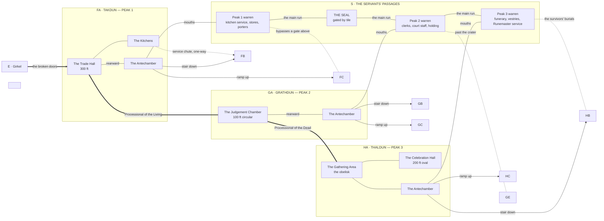

# THE FIRST LEVEL — FA, GA, HA AND THE SERVANTS' PASSAGES

*Engineer phase, step 7, worked as one block because the three main levels share a labyrinth and cannot be stubbed independently. Three passes, one output:*

1. **Major routes** — the skeleton. What connects to what, and what a party can walk without solving anything. **This pass.**
2. **Major groupings** — the themed zones of the passages and of each hall, sized against the room budget.
3. **Individual locations** — code, name and three tags per location, and the three Danger tables.

*Room budget for the block: 60 rooms per main level, 180 total. The passages are by far the bulk of that — the three halls and their immediate support account for perhaps fifty rooms between them, and everything else is warren.*

---

## PASS 1 — MAJOR ROUTES

### The four kinds of movement on this level

**The Processionals.** Two ceremonial roads, cut wide and cut straight, running FA–GA–HA. They are the front door between peaks: unlocked, undefended, and utterly exposed. Anything that wants to know where the party is watches the Processionals.

**The halls.** Each main level is a single great room with an antechamber behind it. The antechamber is the junction — stairwell down, ramp up, passage mouths — and every hall funnels into one.

**The passages.** The back of the house. They connect all three peaks laterally, they are the bulk of the block, and they were built for people who had them memorised. They are the answer to every gate on this level and the fastest way to get lost in the module.

**The vertical.** One stairwell down and one great ramp up per peak, from the antechamber. Everything else vertical on this level is a chute, a chimney or a hole.

---

### The skeleton

*The `GAG` node is a spacer and is deleted at the diagram's next revision.*

---

### The seal

The one closed door on the whole lateral run. It sits across the main passage between the Peak 1 and Peak 2 warrens, was shut during the civil war, and has never been opened. Its receptacle takes a whole carved tile.

**The tile is at C.1**, on a string around a goblin chief's neck, and he thinks it is a badge of rank.

This is the block's central structural fact and it should be felt long before it is explained. A party without the tile can still cross between peaks — the capillary runs go around, badly, at the cost of hours and a real chance of losing the way. A party with the tile moves under the hold between all three peaks freely, invisibly, and past every gate on the level. **The difference between those two campaigns is a conversation with a goblin, four regions back, that the party had no reason to think mattered.**

The seal is passable from the Peak 2 side only in the sense that the mechanism is the same on both faces. Nothing about it is one-way.

---

### What a party can walk without solving anything

From the broken doors: the Trade Hall, the kitchens, the antechamber, both Processionals, the Judgement Chamber, the gathering area and the obelisk, the Celebration Hall, all three antechambers, and the stair or ramp out of any of them. **That is the whole of the level's public face and it costs nothing but exposure.** It is deliberately generous. A party can reach the foot of all three peaks on its first day inside and never once open a door it had to think about.

Everything it cannot walk to is behind the passages.

---

### Standing facts for the block

- **FA is the only opening to the outside world.** Every route in this block that leaves the hold, leaves through FA.
- **The Processionals are exposed and the passages are not.** That trade — speed and certainty against concealment and getting lost — is the movement decision this level exists to pose, and it is posed again at every level above.
- **The passages are never described as repeated rooms.** Three warrens, three distinct services, no shared furniture.
- **The passages are mostly empty.** Pockets of real danger and real reward in a great deal of nothing. The danger is depth and disorientation, not encounters.
- **Two main runs per warren**, connecting the themed groupings; everything else is capillary. This is fixed in pass 2.
- **The survivors are on this ground.** All three warrens, thirty years of it, and they will not be found unless they choose it.

---

## PASS 2 — MAJOR GROUPINGS

*Room budget: 180 across the block. The three halls and their immediate support take 50; the three warrens take 130. Counts below are pacing targets, not quotas, and empty rooms count.*

### The halls

**`FA` Takdun — 20 rooms.** The way in, and the hold's own account of itself.

| Grouping | Rooms | What it is |
|---|---|---|
| The Trade Hall | 1 | 300 feet of it, and the tapestry fragments, which are a text rather than scenery |
| The Kitchens | 10 | Industrial, built to feed the whole hold, interrupted mid-work. Sculleries, cold stores, bakehouses, the service chute down to FB |
| The Antechamber | 1 | The junction. Stair down, ramp up, passage mouths |
| **The Processional of the Living** | 6 | A location of FA, not connective tissue. Cut wide, cut straight, running east, and it **proclaims the wealth and the greatness of the never-ending dwarven hold** — trade, craft, harvest, the founding, all of it in the present tense, all of it surrounded by its own ruin. Dangerous to anyone who navigates it wrongly, and carrying secrets cut into its walls for anyone who dares walk it properly |
| Approach and threshold | 2 | The broken doors from inside, and what thirty years of draught has done to the floor |

**`GA` Grathdun — 12 rooms.** A puzzle of seven figures.

| Grouping | Rooms | What it is |
|---|---|---|
| The Judgement Chamber | 1 | 100 feet circular, acoustically alive, the table and five of seven chairs, seven statues at the perimeter |
| **The Monument of the Driving Down** | 1 | Where both Processionals meet, outside the chamber and facing it. A location of GA. The hold's founding victory at full scale, and **mostly untouched** — which makes it the block's Rosetta stone: the longest continuous bilingual surface in the hold, complete, in a hand a party has already been taught to read on the road. The few defacings on it are not vandalism. They are specific, they are late, and each one is information about who did it and what they could not stand to leave standing |
| The Antechamber | 1 | The junction |
| Court support | 9 | The rooms close in that are not warren — the writ-rooms, the standing floor's approaches, the holding rooms' upper entries |

**`HA` Thaldun — 18 rooms.** A name-index for a setting where names open doors.

| Grouping | Rooms | What it is |
|---|---|---|
| The Celebration Hall | 1 | 200-foot oval, higher dome, built for song. Signs of the Breaking. The scrubbed floor |
| The Gathering Area | 2 | Outside the hall, around the obelisk |
| The Obelisk | 1 | Glossy black stone, the honoured dead cut in full, defaced in places. Returned to again and again |
| The Antechamber | 1 | The junction |
| **The Processional of the Dead** | 6 | A location of HA. Running west to the monument, and it **reveres the foreknowledge and the wisdom of the ancestors** — while carving, plainly and without comment, the literal wedge that was driven between them and that came down. Dangerous to anyone who navigates it wrongly, and carrying secrets cut into its walls for anyone who dares walk it properly |
| Hall support | 7 | Vestry approaches, vessel stores, the rooms where the hall was prepared |

*The two Processionals are not two accounts of one history. One is a boast made by a hold that no longer exists, cut in the present tense and standing in its own wreckage. The other is a warning that was already carved before anyone needed it. Neither is wrong. Both are hazardous to cross badly, and both reward being read rather than walked.*

---

### The passages — 130 rooms

**Three arteries. Veins between groupings. Capillaries between everything.** There is no procedure, no landmark system and no service marks to read. This is a sheer numbers game of twisting paths and trying to keep track, and the survivors' advantage is thirty years of memory that the party cannot buy.

| Artery | Run | Carried | Note |
|---|---|---|---|
| **The Long Run** | F → G → H | Everything, the full length of the hold | **The seal sits on it, between the Peak 1 and Peak 2 warrens.** Closed since the civil war. Tile-gated, and the tile is at C.1 |
| **The Ash Run** | F → G | Fuel in, ash and waste out | Lower, hotter, narrower. The going-around when the seal is shut |
| **The Cold Run** | G → H | The dead, and cold goods to the funerary zones | Cut for stretchers and handcarts, and the only artery with a stated direction of travel |

*On the seal: it is a hard lock and the tile is the only key. The network still obeys the rule that every gate has an answer that is not the gate — the answer is not a second door, it is the Ash Run and the Cold Run in series, which reaches Peak 3 from Peak 1 by way of Peak 2 at roughly three times the distance and through the worst-mapped ground in the block.*

**Peak 1 warren — 45 rooms.** Kitchen service and the feeding of the hold.

| Grouping | Rooms |
|---|---|
| Kitchen service warren — runners' ways, hatches, the chute head | 8 |
| Sculleries and cold stores | 7 |
| Dry-goods stores | 8 |
| Porters' and haulers' quarters | 8 |
| Tally rooms, where deliveries were logged | 6 |
| Bunk warrens of the kitchen staff | 8 |

**Peak 2 warren — 40 rooms.** Clerks, court staff and the machinery of judgement.

| Grouping | Rooms |
|---|---|
| Clerks' warrens | 9 |
| Writ and record stores | 7 |
| Court staff quarters | 8 |
| Holding rooms, where the accused waited | 8 |
| Armoury support and the ways down to GB | 8 |

**Peak 3 warren — 45 rooms.** Funerary service, the vestries, and those who tended both the dead and the scholars.

| Grouping | Rooms |
|---|---|
| Funerary preparation and its cold rooms | 9 |
| Vestries | 6 |
| Vestment and vessel stores | 7 |
| The Runemasters' own service warren | 9 |
| Quarters of those who tended the dead and the living scholars | 8 |
| The survivors' burials — no crypt was given, so they cut their own | 6 |

---

### The survivors

**Pockets in all three warrens, discrete, and they do not constitute a community.** Groups know of one another at best by sign and rumour, some have not met in years, and at least two actively dislike each other over something that happened in the first winter. There is no leader and no council.

| Warren | Presence |
|---|---|
| Peak 1 | The smallest. Two or three, living off the stores, the most likely to be met first and the least likely to know anything |
| Peak 2 | A middling group, the most hostile, and the one that has been hunted hardest. **They live inside the sealed segment of the Long Run**, behind the seal, and one of them carries a second tile cut to the same pattern. That copy is why they are still alive and it is the only thing they have that anyone would want. They do not open the seal for visitors and they have not opened it for anything in years |
| Peak 3 | **The largest.** This is where their dead are, and burying them properly is the only standing goal any of them still holds |

*A party that treats them as one faction will get the relations wrong. Credit earned with one pocket does not transfer, and carrying word between two of them is itself a service worth paying for.*

---

---

## PASS 3 — LOCATIONS

*Pass 3 output has been moved into the individual region files, which are now the authoritative home for location stubs and Danger tables. Nothing was discarded. This file remains the connective document for everything that spans the three regions.*

| Pass | Region | Stubs | Rooms | Now lives in |
|---|---|---|---|---|
| 3A | `FA` Takdun | 34 | 65 | `regions/FA_Takdun_Peak_1_Main_Level_Trade_Hall.md` |
| 3B | `GA` Grathdun | 27 | 52 | `regions/GA_Grathdun_Peak_2_Main_Level_Judgement_Hall.md` |
| 3C | `HA` Thaldun | 33 | 63 | `regions/HA_Thaldun_Peak_3_Main_Level_Celebration_Hall.md` |

**What stays here:** the four kinds of movement, the skeleton diagram, the seal, the three arteries, the grouping tables and room budget, and the survivor pockets across all three peaks. These are block facts and belong to no single region.

---

## PASS 4 — THE REGION DIAGRAMS (STEP 8)

*The three region relational diagrams live in the region files. What is recorded here is what the drawing settled across all three, because it belongs to no single region.*

**The arteries are now topology rather than prose.** Drawn as edges from both ends:

| Artery | Edge | Type |
|---|---|---|
| Long Run, western face | `FA.17` — `GA.10` | gated by tile |
| Long Run, eastern face | `GA.11` — `HA.14` | gated by tile |
| Ash Run | `FA.18` — `GA.12` | open |
| Cold Run | `GA.13` — `HA.13` | open |

**The sealed segment touches no warren.** `GA.10`–`GA.11` is a corridor with a tile lock at each end. The Long Run is therefore transit and nothing else: a party holding a tile crosses from Peak 1 to Peak 3 without entering a single warren, meeting nothing but the nine, and being seen by no one else. It is not a shortcut through Peak 2 — it is a road that never enters Peak 2.

**The pocket is reachable without a tile, by one hidden run they watch.** `GA.22`–`GA.18`. This is what makes `GA.19`'s standing decision playable: taking the second tile by force does not require already holding a tile. It is priced exactly as the region file says, and the drawing adds one thing — **the watchers' nest sits on the only approach, so the nine see the party coming every time.** That is graph shape, not a Referee ruling.

**Without the tile, F→H is the Ash Run and the Cold Run in series, and the price is paid in the middle.** `GA.12` and `GA.13` both hang off `GA.22`, the capillary maze — the largest and emptiest grouping in the Peak 2 warren, with no landmarks in it. A party crossing the hold the hard way comes out of one artery and must find the other across featureless ground. Three times the distance, exactly as stated above, and now it is where the cost lands rather than an assertion that there is one.

**Every hall opens into its warren twice.** `FA` by the antechamber `FA.9` and the porters' gate `FA.13`; `GA` by the antechamber `GA.6`, the holding approach `GA.8`, and the wrong mouth `GA.27`; `HA` by the antechamber `HA.10` and the wrong mouth `HA.33`. The single-throat correction made at region `A` was not needed anywhere in this block — the halls were built by people who did not want servants crossing the public floor, and the stubs already carried the second doors.

**The two mouths onto the Processionals are not the same object.** `GA.27` is unmarked from the road, so it is a way off the exposed ground and never a way onto it unseen. `HA.33` is findable from both sides. Peak 3's warren is the only one of the three that something walking a Processional can enter without being shown the way.

**The block's second seal is recorded on the skeleton.** The skeleton diagram in pass 1 draws the main run as `S1`—SEAL—`S2`—`S3`. The regions carry a second tile-gated face at `GA.11`, between the sealed segment and the Peak 3 warren, which the skeleton does not show. The regions are right and the skeleton is the older abstraction; it is left standing as a block-level sketch and this note is the reconciliation. *The `GAG` spacer node is still in it and is still due for deletion.*

**Cross-region threads opened in this block**, to be checked at every later pass:

- The tile at `C.1` opens the seal at `FA.17`. A second, copied tile is held by the Peak 2 pocket at `GA.19`, which opens both faces.
- `A.20` Brannek Kelmor is cut on the obelisk at `HA.5` and opens the niche at `FA.22`.
- The cut-down tapestry panels at `FA.12` are split between the Peak 1 survivors and a private chamber in `FE`.
- The bypasses land at `FC` (craftsmen's areas), `GC` (administration) and `HC` (chapel side cells).
- The clerk's cache at `GA.21` settles the ban dispute between `GC` and `FE`.
- `HA.29` is a loaded trigger into `HB`, fired by action or inaction.
- `HA.31` is the block's first evidence that `HE` is unfinished.
- The seventh chair at `GA.2` is held open, to be revisited once `GC` and `FE` are stubbed.
