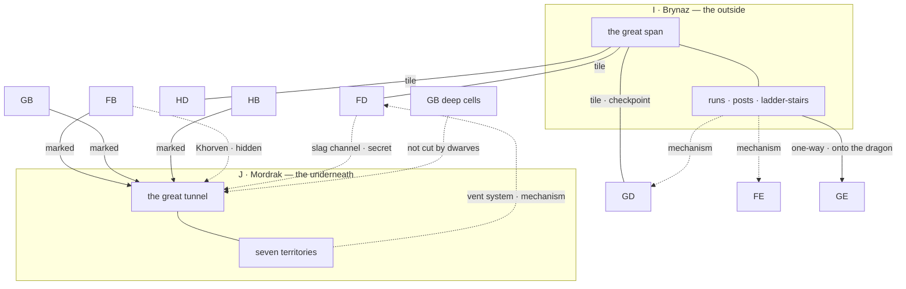

# I AND J — THE OUTSIDE AND THE UNDERNEATH

*Engineer phase, step 7, and the last block. `I` and `J` are worked together because they are the same idea inverted. `I` is the horizontal system that touches all three peaks from outside; `J` is the vertical one that touches all three from beneath. Both bypass the halls entirely. Both are movement systems rather than places. Each is the other's counterweight, and a party that learns one will reach for the other.*

1. **Landmarks and routes.** **Pass 1, below.**
2. **Individual locations** — stubs and the two region tables. *Pass 2 output lives in the region files. Both regions are WILD and both take Encounter tables.*

**Room budget for the block: 80.** `I` 30 — posts, towers, run-heads and landings rather than rooms. `J` 50, across seven territories. **40 are stubbed**; the balance is unnamed fill, and in `J` particularly the fill is the point: watches of enormous quiet with nothing in them.

---

## PASS 1 — LANDMARKS AND ROUTES

### What these two regions are for

Every gate in Drakenhold has an answer that is not the gate. **These are where most of those answers live.** The seal, the checkpoint at Valdgir, the craftsmen's lock, the crater, the Runemaster gate — each has a route around it, and the route is almost always either over the outside or under the bottom.

The price is symmetrical and opposite. **`I` costs exposure**: wind, ice, height, weather, and the fact that a party on the span is visible from two peaks. **`J` costs light**: the deep is hostile to flame, distances are measured in watches rather than rooms, and the quiet is real until it is not.

Neither region is a dungeon level. Both are ways of getting to one.

---

### `I` — the outside

**The span.** One great horizontal crossing between `FD.15`, `GD.2` and `HD.3`, tile-gated at each end, with no visible support. It is the only horizontal route in the hold and the middle of it is the dragon's counting house, which is the design. It is also the first genuinely beautiful thing in the module and should be played that way — after days of enclosed stone, the whole valley below and the sound of open air.

**The network.** Off the span, vertical runs, ladder-stairs, observation posts and attack points threading the outer faces of all three peaks. **States vary and the variation is the region.** Sound, partial, fallen outright — and several perfectly intact with no remaining approach by any normal means. Assessing which runs will bear weight is the standing problem and it is a judgement rather than a die roll.

**The two prizes.** The orphaned run into `FE.7`, reaching the one level otherwise served by a single ramp. The orphaned run into `GD.12`, arriving inside the vaults past the checkpoint. Both intact, both approachless, both restorable, and each renders a whole level's gate irrelevant.

**The one-way.** Down through the crater into `GE.3`, from the outer face. It works, it is not difficult, and it puts a party on top of a sleeping dragon.

**The eyes.** The watchtowers held the hold's outward-facing records, which means **`I` holds the only account of the Descent written from outside by people watching it happen.** Everything else in the module is a survivor's memory or a ruin's inference. This is a log.

---

### `J` — the underneath

**The great tunnel.** Running the length of the mountain beneath F, G and H, beyond the reach of any light a party carries. Travel here is measured in watches, footsteps go away and do not come back, and warm air comes from one direction and cold from another. **A party can walk it for a long time in genuine quiet**, and that is not a trick — the danger is concentrated in specific places and specific triggers, and the triggers fire when a party has decided the caverns are harmless.

**The seven territories.** Off the tunnel: the flooded galleries, the exhausted workings, the natural cavern, the vent system, the vein, the deep dark, and the middens. Each has its own character and its own rules.

**The descents.** Every peak has a marked descent and at least one hidden one. `FB.14`, `GB.19` — no, `HB.19` — and `GB`'s marked way; hidden by Khorven from `FB`, by the slag channel from `FD.16`, and by the broken floor under the deep cells at `GB.20`. **That last one was not cut by dwarves.**

---

### The light rule, resolved

*This is the resolution owed to the Truth. It is written as a procedure the Referee runs, not as a test the players call for.*

**Below the Under Levels, an open flame is a declaration and it is answered.**

- **Open flame in `J`** — the Encounter table is rolled every watch rather than on failed Difficulty rolls alone, and results arrive rather than being signs. Torches, lanterns unshuttered, a fire lit to cook or warm by.
- **Shielded light** — a hooded lantern, a shuttered beam, light kept low and pointed at the floor. Normal Difficulty procedure. This is the working compromise and most parties find it.
- **No light** — nothing is drawn, and nothing is found either. Movement is by touch and by the cut guidance where cut guidance exists, at a fraction of the pace, and the party cannot read, map or spot anything.
- **The vent system and the deep dark do not care.** In the vents, heat and light are indistinguishable to what lives there. In the deep dark, the Elder Wyrms are blind and light means nothing to them at all — which a party that has spent the whole region managing torches will find genuinely disorienting.

**The teaching site is `J.6`.** A dead party, a burnt-out torch, and everything around it legible. **The Referee lets a party learn this from the aftermath of somebody else's flame before it learns it from its own**, and if the party has already learned it the hard way, `J.6` is a party they might have warned.

---

### The skeleton

---

### Cross-region threads opened and closed in this block

- **`J.18` — artifact piece seven, the last one.** Back in the vein it came out of, carried down by the third carrier on the register at `HE.10`, who did not get out. See below.
- `J.20` the deep dark and `GB.19` are the same story from two ends, and `HE.6`'s collared Drakmorith is the third telling. **An Elder Wyrm can be bargained with, and only by somebody who knows what was done in the deep cells.**
- `J.14` the vent system is the mechanism behind every restoration in Peak 1, and behind `FD.10`, and therefore behind fire in the vents. **The whole chain from Peak 1's prize to Peak 2's crater runs through this territory**, and it is walkable.
- `I.9` the watchtower logs are the outside account of the Descent — the only one not written by a survivor or inferred from a ruin.
- `I.13` and `I.14` are the two orphaned runs. Restoring either is a mechanism problem worth more than most treasure in the module.
- `HB.6` remains open: Baldrun Azkelith's interment was prepared and never filled, and neither `GC`, `HB`, `I` nor `J` answers it. **It is now the last unanswered question in the module and that is deliberate.**
