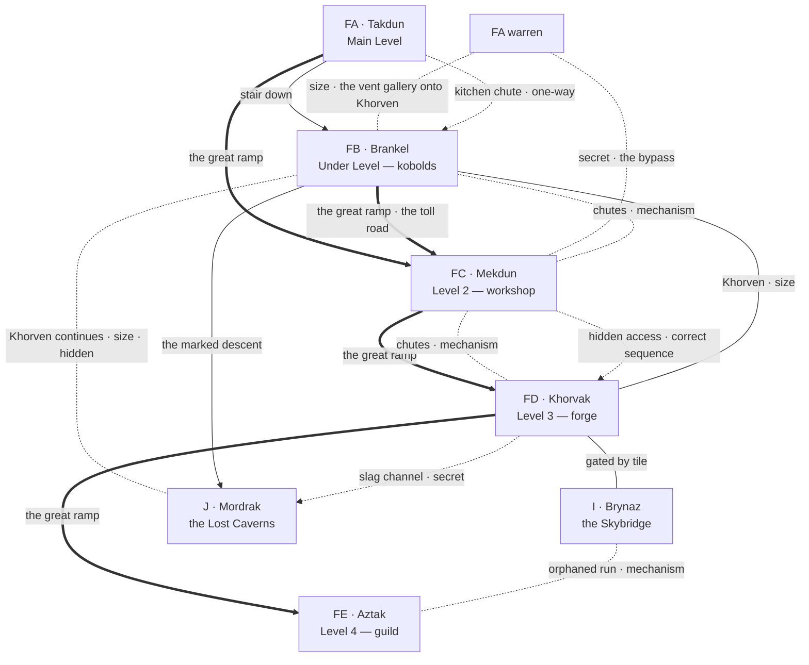

# PEAK 1 — FB, FC, FD, FE AND THE VERTICAL

*Engineer phase, step 7, worked as one block because the four levels of Peak 1 are stitched together by shared machinery — one chimney, one chute system, one dispatch floor, one ramp — and cannot be stubbed independently. Two passes, one output:*

1. **Landmarks and routes** — what ties the four levels together, and the landmark locations of each. **Pass 1, below.**
2. **Individual locations** — stubs and the four region tables. *Pass 2 output has been moved into the region files, which are the authoritative home for stubs and tables.*

*FA Takdun is not in this block. It is a first-level region and lives in `FIRST_LEVEL_BLOCK.md`; its warren, its seal and its survivor pocket are block facts of that block, not this one. What FA hands upward is listed under **Inherited threads** below.*

**Room budget for the block: 126 rooms.** FB 40, FC 40, FD 30, FE 16. **67 are stubbed as named locations**; the balance is unnamed fill inside the stated groupings — empty bins, collapsed benches, stock rooms with nothing in them, rooms that are only a corner turned.

---

## PASS 1 — LANDMARKS AND ROUTES

### The five kinds of movement in Peak 1

**The ramp.** One great ramp climbs FA → FC → FD → FE, arriving on each level in the open and leaving it the same way. It is the honest route, it is walkable without solving anything as far as FD, and it is the route the Lizardmen use. Everything that wants to know where a party is watches the ramp, exactly as everything on the first level watches the Processionals.

**The chimney.** **Khorven** — *khor* and *ven*, toward the forge — the vent shaft that carries draught up from J, through FB, to the flow gate at FD. It is a climb, it is sized for a kobold, and it is the only route in Peak 1 that skips a whole level. It is also the reason the forge can be relit.

**The chutes.** Goods moved between FB, FC and FD in stone chutes governed from the dispatch floor at `FC.2`. They are not a route until the mechanism is understood, and after that they are the fastest movement in the peak. Wrong sequencing does not kill; it *delivers*, to a level the party did not choose, without the party's rope.

**The stair and the warren.** The stairwell from FA's antechamber down to FB, and the servants' bypass that comes up out of the FA warren into the craftsmen's gated ground at `FC.14`. These are the two routes that do not touch the dispatch floor at all.

**The bridge.** The Skybridge's western terminus at `FD.15`, tile-gated, and a second intact Skybridge run that reaches `FE.7` and has lost its approach entirely. The bridge is how the Lizardmen arrive and how a party leaves Peak 1 without going back down through it.

---

### The skeleton

---

### The four landmarks of the peak

**Khorven, the chimney.** Rises out of J, passes through the great under hall at `FB.4`, and ends at the flow gate at `FD.10`. Three facts about it and all three matter: it is the tribe's warmth and their water's source, it is climbable by anyone willing to be wedged in the dark for an hour, and opening the gate at the top of it takes the draught away from FB and gives it to the forge. **Relighting the forge costs the kobolds their winter.** Nobody in the module says this out loud. The kobolds work it out the moment the air changes.

**The dispatch floor.** `FC.2`. Tiles set in a floor that turns, redirecting chute traffic between three levels. It is the module's teaching bench for tiles and rods both, it teaches by consequence, and it is entirely reversible — no sequence on it is fatal, and every wrong one costs time, position and dignity.

**The order.** Whatever the Automatons of FD were last told, thirty years ago and never rescinded. It is recoverable from three places, none complete: the dispatch records at `FC.7`, the order post at `FD.5`, and the Forge Master's own hand at `FD.13`. Satisfying its letter is the peak's central puzzle and the alternative to fighting the only thing in Peak 1 that will actually kill a party.

**The toll road.** The Lizardmen collect from FB on a schedule. They come across the Skybridge to `FD.15`, down the ramp through FD and FC without stopping, and back up loaded. **They do not enter the warren, they do not open the chutes, and they never come by the stair.** A party that learns the schedule owns the ramp on every other day; a party that does not will eventually meet them on it, in the open, carrying somebody's grain.

---

### What a party can walk without solving anything

From FA's antechamber: down the stair to FB and the whole of the kobold floor, so long as it is met as a negotiation; up the ramp to FC's dispatch floor and the four work halls; up again to FD's forge floor and its training halls; up again to FE. **The whole vertical spine of Peak 1 is open.** What is closed is everything off it — the craftsmen's gated ground behind FC, the production galleries where the order is being executed, the strongrooms of FE, the chimney, the chutes, the bridge, and the two ways down into J.

That is the peak's shape and it is deliberate: the climb is free, and the wealth is one turn off it in every direction.

---

### Inherited threads

- `FA.30` **the bypass** arrives at `FC.15`, the bypass mouth, inside the craftsmen's gate at `FC.14` and behind the level's locks. *Corrected at step 8: this line named `FC.14`, the gate itself, where `FC.15` is the stub the bypass actually surfaces in. The regions are right and the aggregate was loose.*
- `FA.8` / `FA.32` **the kitchen chute** lands at `FB.9`, one-way, and is a listening post in both directions.
- `FA.33` **the vent gallery** touches Khorven between FA and FB and is the warren's own way onto the chimney.
- `FA.12` **the second cut-down panel** hangs at `FE.8`.
- `C.9` **the surveyor's satchel** — its confident wrong half includes a chute plan for this peak. A party working from it sequences the dispatch floor incorrectly the first time and does not know why.
- Ashen's Crew's **unidentified House rod** — **ratified:** a Balvak House rod that opens the private work at `FD.14` and nothing else in the module. The crew have been carrying the key to the most important object in Peak 1 for a month and are using it to try doors in the Outer City.

---

### Cross-region threads opened in this block

- `FB.5` the chieftain's vacancy → `HC`, where he went, and `FB.18`, what he said before he left.
- `FB.17` the skimmed count → the Lizardmen, `GD`, and rumour 11. The proof exists and the kobolds cannot carry it alone.
- `FB.4` / `FD.10` — the chimney is a shared resource and relighting the forge takes it from FB. Faction consequence, not a trap.
- `FC.19` the ledger-stones name the Guild contact who fled with stolen rods; `FE.9` is what he was carrying and who sent him.
- `FC.21` the hidden access — **ratified:** it surfaces in `FD.8`, the stock rooms, behind the Automatons' line of work.
- `FD.13` Forge Master **Durnek Balvak**, kin to `FE.3`'s Dovrek Balvak. The private work at `FD.14` is what the ban was actually about, and neither wraith upstairs mentions it.
- `FE.10` the scion's name and where he was sent — the Guild thread that leaves the mountain.
- `FD.15` the Skybridge terminus is tile-gated and is the Lizardmen's road. `FE.7` is the orphaned run.
- **Artifact piece — ratified, one, at `FD.14`.** See *The count*, below.

---

### The count

**Ratified at the close of the Peak 1 stub pass. Seven pieces exist.** Two left the mountain and are placed — `E.5` and `D.3` — and the evacuation register at `E.6` proves that only two ever did. **Five remain inside**, one to each interior peak-level cluster:

| Piece | Where | State |
|---|---|---|
| 1 | `E.5` Girkel | Placed |
| 2 | `D.3` River Crossing | Placed |
| 3 | `FD.14` the Forge Master's private work | **Placed this pass** |
| 4 | Peak 2 | Open — placed when G is stubbed |
| 5 | Peak 3 | Open — placed when H is stubbed |
| 6 | Peak 3 | Open — placed when H is stubbed |
| 7 | `J` Mordrak | Open — placed when J is stubbed |

**The count is itself a clue.** The register at `E.6` establishes two out; the Sanctuary at `HE` establishes seven broken. A party that can hold both numbers at once knows exactly how many are still in the mountain and knows it long before it knows where any of them are. Nothing in the module ever states the subtraction.

*The distribution above is the working allocation and the peak-by-peak placements are decided at each block's stub pass, not now. The total of seven is fixed.*

---

## PASS 3 — THE REGION DIAGRAMS (STEP 8)

*The four region relational diagrams live in the region files. What is recorded here is what the drawing settled across the block.*

**Two edges the block always claimed and the graph never carried.** Both are reconciliations rather than new content:

| Edge | Type | Why it was owed |
|---|---|---|
| `FB.16` — `FC.1` | vertical, open | The great ramp reaches the under level. `FB.16`'s stub is named *the collectors' landing — where the ramp meets the floor*, `FB`'s Encounter table has the Lizardmen coming *down the ramp*, and the toll road above runs from `FD.15` down through FD and FC without stopping. Written into both regions and into the setting diagram. |
| `FA.33` — `FB.4` | hidden, vertical, conditional on size | *Inherited threads* has always said the FA vent gallery touches Khorven and is the warren's own way onto the chimney. It was never an edge. Written into `FA`, `FB` and the setting diagram. |

**One correction.** *Inherited threads* said the bypass arrives at `FC.14`, the craftsmen's gate. It arrives at `FC.15`, the bypass mouth, which is inside the gate. The regions were right and the aggregate was loose. Corrected in place.

**The peak is a ladder with three rungs that are not the ramp.** `FA`→`FB` by the stair, `FB`→`FC`→`FD`→`FE` by the ramp: that is the honest climb and it is open the whole way. Off it: the chutes (`FB.8`–`FC.4`, `FC.5`–`FD.8`), the chimney (`FB.15`–`FD.9`), and the hidden access (`FC.21`–`FD.8`). **Every one of the three skips something, and every one of them is bought on `FC.2`, the dispatch floor, or on the climb.** The peak's claim that the climb is free and the wealth is one turn off it in every direction is now checkable.

**`FD.8` is the peak's freight hub and that is why the order can be answered.** Three ways in: `FD.7`, the timed crossing of the line of work; `FC.5`, the chutes; `FC.21`, the hidden access. Without the two from below, the stock rooms would be a cul-de-sac behind the only thing in Peak 1 that will kill a party. With them, the gate has two answers and both are earned a level down.

**The flow gate is off every route.** `FD.9`–`FD.10`–`FD.3`. Nothing passes through it; a party reaches it only by climbing Khorven or by walking the channels on purpose. **The kobolds' winter is never taken by accident**, which is what makes the faction consequence a decision rather than a trap.

**`FE` is a legitimate single throat and the module already says so.** One ramp in, one orphaned Skybridge run at `FE.7`–`I.13` that must be solved from outside. The star shape of the level is the point: no route on `FE` is a decision, because every decision on `FE` is a sentence spoken to one of two wraiths who will not agree.

**The two wraiths' secrets are behind the wraiths.** `FE.9` off Dovrek's chamber, `FE.8` off Ismelda's. Neither is findable by a party that only talked to one of them, and `FE.10`, the scion's room, belongs to neither and opens off the antechamber. The thread that leaves the mountain is the one thing on the level in nobody's custody.
