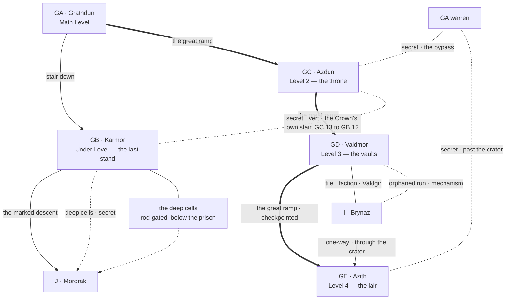

# PEAK 2 — GB, GC, GD, GE AND THE TRIBUTE CHAIN

*Engineer phase, step 7, worked as one block because the four levels of Peak 2 are stitched together by one thing moving through them — the tribute — and by the fact that everything above GC belongs to somebody who is currently using it. Two passes, one output:*

1. **Landmarks and routes** — what ties the four levels together. **Pass 1, below.**
2. **Individual locations** — stubs and the four region tables. *Pass 2 output lives in the region files.*

*GA Grathdun is not in this block. It is a first-level region and lives in `FIRST_LEVEL_BLOCK.md`. What GA hands upward is listed under **Inherited threads**.*

**Room budget for the block: 116 rooms.** GB 40, GC 30, GD 30, GE 16. **60 are stubbed as named locations**; the balance is unnamed fill — emptied cells, stripped offices, quarters, stores, the ordinary rooms of a garrison and a treasury with the people taken out of them.

---

## PASS 1 — LANDMARKS AND ROUTES

### The difference between this peak and the last

Peak 1 is a machine nobody is running. **Peak 2 is occupied.** The Lizardmen hold GD and GE, they keep GD lit, they have a schedule, a commander and somewhere to fall back to, and they will assess a party for tribute value before reaching for a weapon. GB below them is held by a formation that has not broken in thirty-two years and can be spoken to. Only GC is genuinely empty, and GC was emptied on purpose.

The consequence for movement: **on this peak the party is the traffic.** There is no crossing it unnoticed above GC, and the module should never pretend otherwise.

---

### The four kinds of movement in Peak 2

**The ramp.** One great ramp climbs GA → GC → GD → GE. Above GC it is a checkpointed road with a schedule on it, and walking it is a transaction rather than a hazard.

**The chain.** The tribute, moving upward and never stopping. Assembled at `FB.7`, collected by Lizardmen off the Skybridge, carried across to `GD.2`, weighed at `GD.13`, counted at `GD.5`, and carried up the last ramp to the crater. **It is the only thing in Drakenhold that still runs on time**, it can be tapped, diverted, poisoned or broken, and every one of those is a different campaign.

**The bridge.** `GD.2` is the Skybridge's central terminus and the only horizontal crossing in the hold, which means the direct route between peaks runs through the dragon's counting house. That is the design and it is not an accident. A second, intact run arrives inside the vaults at `GD.12` without passing the checkpoint, its approach gone, and restoring it is a mechanism problem worth more than most treasure.

**The back ways.** `GA.26` comes up into GC's administration. A separate servants' route arrives at the Queen's end of the lair corridor at `GE.9` without passing the crater. And below everything, the secret descent out of the deep cells into J at `GB.20`, which is how the Elder Wyrm came up and how it could go back down.

**The Crown's own stair.** A secret stairwell runs two levels from `GC.13`, the Steward's rooms, straight down to `GB.12`, the cell corridors — past `GA` entirely and past the rod-locked prison gate at `GB.11`. It is on no plan of either level. It was cut so that a captive whose name could not appear in the register could be brought down and questioned by people who were never recorded as having gone. **Ratified this pass**, and it does three things at once: it gives `GB.11` an answer that is not the gate, priced — the stair starts inside the empty throne level, which the party must reach and read first, and it lands them inside a locked prison with the gate now between them and the stair-foot; it puts the Steward's rooms and the prison register on the same short line; and it makes `GB.14`'s one entry without a charge a question with somewhere to go. **Which entry, and whether the stair explains it, is not decided here** — it belongs to `GB` and `GC` at their own passes, and neither may resolve it by assumption.

---

### The skeleton

---

### The four landmarks of the peak

**The formation.** `GB.3`. Skeletal Warriors holding the last stand across the arena floor in ranks that have not broken in thirty-two years, with Karn Rudgir among them. It is a battle nobody wins and a conversation anyone can have, and the module's whole thesis about names sits on this floor. **A party that charges it is not punished for being wrong. It is punished for being in a hurry.**

**The struck name.** `GC.3`. Baldrun Azkelith's name chiselled out of every surface on the level, obsessively, at eye height, by hands that came back to do it again. Recovering it is the region's prize and it is not a master key — royal names open what nothing else will, there are more than one of them, and this level exists to teach a party to collect rather than to search.

**Valdgir, the counting house — ratified.** `GD.2` — *vald* and *gir*, the hoard-gate. The toll, the checkpoint, the weighing floor and the count. It is the busiest room in Drakenhold and the only one where a party is dealt with as a supplier rather than as an intruder. Everything the Lizardmen do here is legible from the outside, including the skim.

**The crater.** `GE.3`. Vermakith asleep in a hole in the mountain, open to weather, atop what he has been given. Three things wake him and only three: **fire in the vents, theft at scale, and the sound of his own name.**

---

### The wake conditions are now cross-peak

**Fire in the vents is `FD.10`.** Relighting the forge in Peak 1 — the faction-scale prize of the last block, the thing that changes what every craft in the hold can do — is one of the three things that wakes the dragon. The vent system is one system. Nothing in the module states the connection, no character warns of it, and the trace is available: the channels at `FD.3` run off the same draught the crater breathes, and a party that reads the soot frieze at `FD.4` or the flow schedule at the gate has everything it needs to work it out beforehand.

**This is the module's largest single consequence and it must never be sprung as a gotcha.** The evidence is placed in advance, in three regions, and a careful party sees it coming. A party that relights the forge without looking has made a real decision badly, which is the game working.

Theft at scale is `GD.4` — the working hoard is *counted*, and cannot be quietly reduced. The sub-vaults are not. That distinction is the difference between a haul and a war.

---

### What a party can walk without solving anything

Down the stair to GB's barracks half and the arena benches. Up the ramp to GC entire, which is empty and open and the richest documentary ground in the hold. Up to `GD.1`, where somebody asks what they are carrying.

Everything above that is a negotiation, a mechanism or a bad idea. The deep cells, the Armory, the sub-vaults, the lair corridor and the Queen's rooms are all off the ramp in one direction or another, and none of them is opened by walking.

---

### Inherited threads

- `GA.26` **the bypass** arrives at `GC.7`, inside the administrative chambers, past the ramp and past whatever is on it.
- `GA.21` **the clerk's cache** is the third account of the ban, and it settles `GC.6` against `FE`'s guild version.
- `GA.19` **the Peak 2 pocket** live inside the sealed segment and hold the copied tile. They are not in this block and their ground is the warren, not the peak.
- `GA.2` **the seventh chair** — answered at `GC.14`, in the Steward's rooms. See below.
- `GA.25` **the older course** surfaces again in the deep cells, in the one place it should not be.
- `FB.17` **the skimmed count** is the kobolds' half of the proof. `GD.5` is the other half.
- `FD.15` **the Skybridge terminus** is the far end of Valdgir. The schedule is the same schedule.

---

### Cross-region threads opened in this block

- `GB.4` Karn Rudgir and `GC.13`/`GC.14` Vessa Rudgir — brother and sister, on opposite ends of the same night, and neither account is complete. **The seventh chair is hers, and so is the order at `GC.11`.** She left the council and then governed without one, and the erasure of the King was filed paperwork rather than a mob. Karn will not discuss her, which is now a refusal with a subject.
- `GB.7` the planning rooms hold a true interior map **of Peak 2 only**, thirty-two years out of date in exactly the ways that matter.
- `GB.18` Morgrin Thurvak, the mad Runemaster, is `HE`'s prologue and knows what the artifact was. `HC` and `HE` inherit him.
- `GB.19` the Elder Wyrm is where the yoke was learned, and `GB.20` is how it came up. `J` inherits both.
- `GC.13` the rod schedule names which rods each Royal lock at `GD` wants. `FE.6` holds two of them.
- `GD.10` the third sub-vault — **artifact piece four, ratified.** Placed under Royal authority in the season of the Breaking.
- `GE.8` the Queen knew what her husband did not, and her account is the only one written by somebody with nothing to defend.
- `FD.10` → `GE.3`. Fire in the vents. Stated above, never stated in play.
