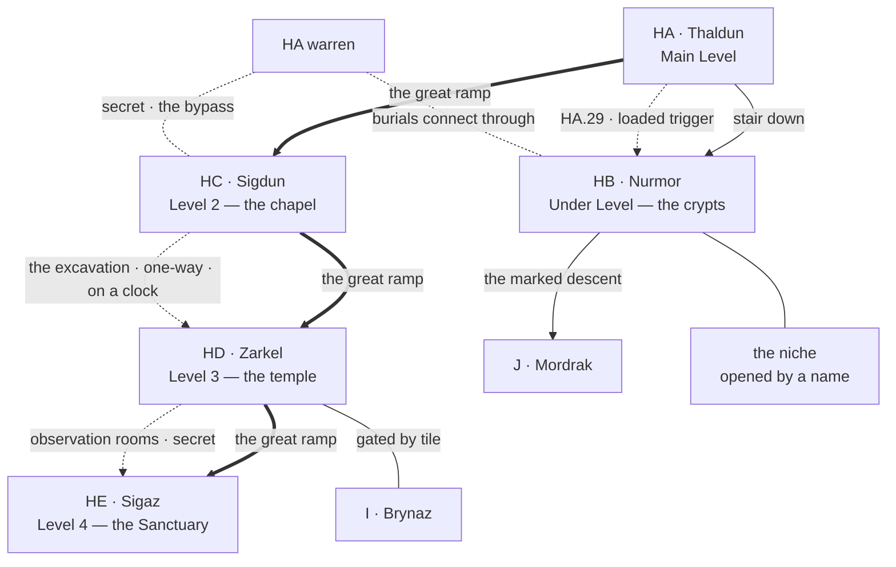

# PEAK 3 — HB, HC, HD, HE AND THE CLUE CHAIN

*Engineer phase, step 7, worked as one block because the four levels of Peak 3 are stitched together by one thing running through them — a chain of clues about what the artifact was and where its pieces went — and by a name that opens the bottom of the peak and is carved nowhere on it. Two passes, one output:*

1. **Landmarks and routes.** **Pass 1, below.**
2. **Individual locations** — stubs and the four region tables. *Pass 2 output lives in the region files.*

*HA Thaldun is not in this block; it lives in `FIRST_LEVEL_BLOCK.md`. What HA hands upward is under **Inherited threads**.*

**Room budget for the block: 126 rooms.** HB 40, HC 40, HD 30, HE 16. **66 are stubbed as named locations**; the balance is unnamed fill — gallery niches by the score, empty chapel cells, plain circuit ground, and whatever HE is doing with the rooms nobody counted twice.

---

## PASS 1 — LANDMARKS AND ROUTES

### What this peak is for

Peak 1 is a machine nobody is running. Peak 2 is occupied. **Peak 3 is the answer key**, and it is written across four levels in ascending order of cost.

`HC` says somebody is being spoken to. `HD` says what the artifact was, in scattered notes by people who were only beginning to suspect. `HE` says it plainly, and says who carried the pieces out and where they went. `HB`, below all of it, holds the one thing on the peak that is not information — a man's grave, and a weapon laid in it as honour rather than as armament.

**The chain runs upward and the price runs upward with it.** A party can stop at any level and leave with something real. The module never requires the top.

---

### The four kinds of movement in Peak 3

**The ramp.** HA → HC → HD → HE, and it is open the whole way. Peak 3 has no checkpoint and no toll. What it has instead is that each level is harder to *use* than the last, which is a different kind of gate and a better one.

**The stair.** HA down to HB, and the crypts are gated internally by station rather than at the entrance. A party walks into the royal gallery. Getting out of it is the problem.

**The excavation.** `HC` upward into `HD`'s circuit, dug by a mad kobold chieftain following a survey line somebody laid a long time ago. It is unfinished, it completes on a clock whether or not the party touches it, and it can be accelerated, redirected or collapsed. **It is the only route in the module that changes state without the party.**

**The observation route.** `HD`'s central rooms into `HE`, not using the ramp. The most heavily gated space on the peak opens onto the least safe one, which is the Runemasters telling a party exactly how much they trusted their own initiates.

---

### The skeleton

---

### The four landmarks of the peak

**The niche.** Below the guard gallery, cut into a wall that should have been blank, because the underclass were given no crypt at all. Torvin Ganthur is in it and the lance is with him. **It is opened by his name, and his name is carved nowhere on this level.** It is on the obelisk at `HA.5` — no, it is not; that is the point. `HA.5` records every honoured dead and he is not on it. A party finds his name at Thornhaven, or under the benches at `GB.9`, or from the survivors who buried him, and nowhere official.

**The parley.** `HC.4`. The kobold chieftain Vekkut, who walked up out of `FB.5` thirty days ago because something above had started answering him. He will talk eagerly and at length, he is half-mad and taking instruction he does not understand, and what he says is worth more than everything he owns. **Restoring him to FB, removing him, or leaving him to dig are three different campaigns**, and the module does not prefer one.

**The circuit.** `HD`. A trial route that still runs exactly as designed, calibrated for dwarven initiates and not calibrated down for anybody else. Run it honestly and it grants a Runemaster rod at the end — the highest-tier key a party can earn rather than steal. The observation rooms at the centre permit cheating it entirely and are the most heavily gated space on the level. **The shortcut costs more than the road**, and that is the whole argument of the level.

**Sigmor, the rift.** `HE.4` — *sig* and *mor*, the deep of the sanctuary, and the survivors' name for it is a piece of gallows humour. The break left where the artifact came apart and the yoke came off. From it outward the level stops obeying physical reality. It is not closed and was never going to be.

---

### The clue chain, in order

This is the spine of the peak and it is the reason `HE` exists. **It is now fully placeable, because the count is fixed at seven.**

| Level | What it establishes |
|---|---|
| `E.6` | Two pieces left the mountain. Established before the peak. |
| `HC.9` | The whispers are not addressed to Vekkut. Something up there is still talking to somebody. |
| `HD.11` | Scattered notes begin to name the artifact for what it was — by people who were only starting to suspect and who wrote it down carefully. |
| `HD.14` | Piece six, hidden in the observation rooms by somebody who never got back out. |
| `HE.9` | What the artifact was, stated plainly by Ulgrin Thurvak, who knew before the end. |
| `HE.10` | **Who carried the pieces out, and where each went.** The register, incomplete, and honest about being incomplete. |
| `HB.14` | Piece five, in a royal interment that is empty of its king. |

**The module never performs the subtraction.** Seven broken at `HE`, two carried out at `E.6`, five inside. A party that holds both numbers knows how many are left long before it knows where any of them are, and `HE.10` turns that arithmetic into an itinerary.

---

### What a party can walk without solving anything

The whole ramp, top to bottom, and the whole of `HB`'s four galleries. Peak 3 will let anyone in anywhere. What it will not do is let them use what they find — the trials are real, the geometry is real, the grave-goods are trapped by people who expected robbers and were right, and the niche is shut to anyone who does not already know a dead man's name.

**This is the peak where the module stops gating on locks and starts gating on knowledge**, which is the whole reason the waystones taught script on the road in.

---

### Inherited threads

- `HA.29` **the crypt access** is a loaded trigger into `HB`, fired by action or inaction. It lands at `HB.3`.
- `HA.30` **the bypass** arrives at `HC.7`, in the chapel's side cells, past the ramp and past the excavation noise.
- `HA.31` **the listening place** is the first evidence `HE` is unfinished. `HC.9` is the second and `HE` is the third.
- `HA.5` **the obelisk** does not carry Torvin Ganthur. That absence is the peak's central lock.
- `HA.28` **the older course** runs downward here more than anywhere. It surfaces again at `HB.20`.
- `A.13` **Wyla Fenn's price** is her trial assessment, at `HD.13`.
- `A.20` **Brannek Kelmor** — a party that buried him recognises him on the obelisk and can find his people's interment at `HB.7`.
- `GB.18` **Morgrin Thurvak** is `HE`'s prologue. He was imprisoned before the schism for knowing what `HE.9` states.
- `FB.5` **Vekkut** walked up here from Peak 1 and his tribe still has an empty chair.
- `GB.9` **the benches** carry Torvin Ganthur's name scratched under a seat, twice, as a young man.

---

### Cross-region threads opened in this block

- `HB.14` — **artifact piece five**, proposed, in an empty royal interment.
- `HD.14` — **artifact piece six**, proposed, in the observation rooms.
- `HB.11` the guard gallery holds dwarves who died *after* the descent, which means somebody was burying properly for years longer than anyone thinks. `HB.20` is who.
- `HC.11` the excavation follows a surveyed line. The survey is Runemaster and predates the schism, which means the Sanctuary planned a back way down and never cut it.
- `HD.16` the earned rod is the only Runemaster-tier key in the module a party can hold legitimately, and `GD.9`'s ward is Runemaster work.
- `HE.10`'s register names two carriers who reached `E.5` and `D.3`, and one who did not get out of the mountain. `J` inherits the third.
- The seventh piece, in `J`, is named on the register and its location is not.

---

## PASS 3 — THE REGION DIAGRAMS

*Engineer step 8, worked as one pass across `HB`, `HC`, `HD` and `HE`. **Nothing was invented and one thing needed asking.** One landing fixed that a closed region asked for, one open item answered from the existing bestiary, one discrepancy found in the survey line and batched rather than resolved. Per-region findings sit under each region's own diagram; what belongs to no single region is here.*

### The peak has an express route and it is four rooms long

`HA.10`→`HC.1`→`HD.1`→`HE.1`. Every ramp head is a single node carrying both directions of the great ramp, so a party that stops for nothing crosses all four levels of Peak 3 without meeting the squat, the circuit, the crypts or one rung of the clue chain, and arrives at the Sanctuary holding none of the three things that make it survivable — the script lesson confirmed at `HC.15`, a fixed point at `HE.3`, and any idea of what it is looking for. **This is the same shape `D` and `E` have on the approach, and the module performs no subtraction here either.** The block document has always said the peak has no checkpoint and no toll; the drawing says what it has instead, which is four rooms of nothing followed by a level that does not forgive arriving unprepared.

### Not one gate on this peak is answered on its own floor

The same structural signature Peak 2 produced, arrived at independently and from the opposite direction:

- `HC.18`, the sealed chamber, is answered by `HD.10` or `HD.15`, one level up.
- `HD.11`, the observation rooms, is answered by the circuit that ends at `HD.10` — which is to say by the road, not by a door — and by no rod that exists below it.
- `HB`'s royal gallery, which is a funnel rather than a lock, is answered by `HA.29` and `HA.21`, one level *down* from the main level rather than up.
- `HE` has no gate at all, and its answer is `HD.16` three levels of preparation earlier.

**Peak 1 answers its gates on the floor beneath. Peak 2 answers them from anywhere but the floor itself. Peak 3 answers them one floor above, always, in the direction the party is already climbing** — which is the block's own claim that the chain runs upward and the price runs upward with it, made structural.

### The two live edges do not touch each other

`HC.12`–`HD.4` puts the excavation into the plain circuit ground and nowhere near `HD.11`. **The clock cannot deliver the observation rooms to anybody** — not to Vekkut, not to a party that accelerates the dig, not to whatever the trials were containing. It shortcuts the explanation rather than the ordeal. The level's whole argument survives the one route in the module that changes state without the party, and that is worth knowing before step 9 writes the clock.

### The niche is two steps and only one of them is the name

`HB.14`–`HB.20`–`HB.15`. The wall the underclass were given instead of a crypt is where the founding lineage's older, plainer course surfaces, and Torvin Ganthur's niche is cut into *that*, not into the blank wall directly. A party must first notice that unworked stone is not unworked, and then know a man who is on no wall on this floor. **`HA.28`'s downward run and `HB.20` are the same thing and the niche is the reason it matters** — the survivors cut in the founders' manner without ever having been taught it.

### `HB` is a funnel and its two answers are priced in this region's own currency

The tiering is a chain: royal, Runemaster, guild, guard, blank wall, in that order, richest and worst first. Everything the peak's bottom holds — the niche, the lance, piece five, the descent into `J` — is at the far end of it. The two ways past are `HA.29`→`HB.3`→`HB.12` and `HA.21`→`HB.17`, and the second lands in the survivors' own graves one edge from the blank wall. **The shortest route to the niche runs over the dead of the faction whose good opinion is Peak 3's largest asset, and nothing about it is stealthy.** The price is not a monster. It is the pocket knowing.

### Aggregate corrections

None. `HB` 20 + `HC` 20 + `HD` 16 + `HE` 10 = 66 stubbed against 126 budgeted, exactly as stated at the head of this document.

### What this pass fixed, answered and did not answer

- **Fixed:** `HA.19`'s landing, which `HA` explicitly left to `HC`. It is `HC.15`, the instruction rooms — the servants' route comes up where the initiates were prepared rather than where they were received. **`HA` is amended to carry the edge**, the one change to an already-closed region at this pass, and it is a reconciliation the closed region asked for in writing.
- **Answered:** undead variety in `HB`, open since step 7 and marked *due at step 8*. Wraiths on the royal and Runemaster tiers, Skeletal Warriors in the guild and guard galleries, Shadows below the tiers. **No new bestiary template**, and the variety is tiered like everything else on the level. Flagged in `HB`'s Creatures field rather than written silently.
- **Not answered:** where `HC.11`'s survey line was meant to arrive. The line is a Runemaster route that *bypassed the trials*; the dig as actually cut breaks into the circuit, which bypasses nothing. Both are true, the discrepancy is in character, and **it is a question with alternatives rather than an assumption to make.** Batched.
- **Not answered:** who the whispers are addressed to. `HC.19` is drawn as a leaf in `HC` and as no edge at all in `HE`, because nothing can travel it. It carries information and nothing else, and the question at the top of it is left exactly where step 7 left it.
