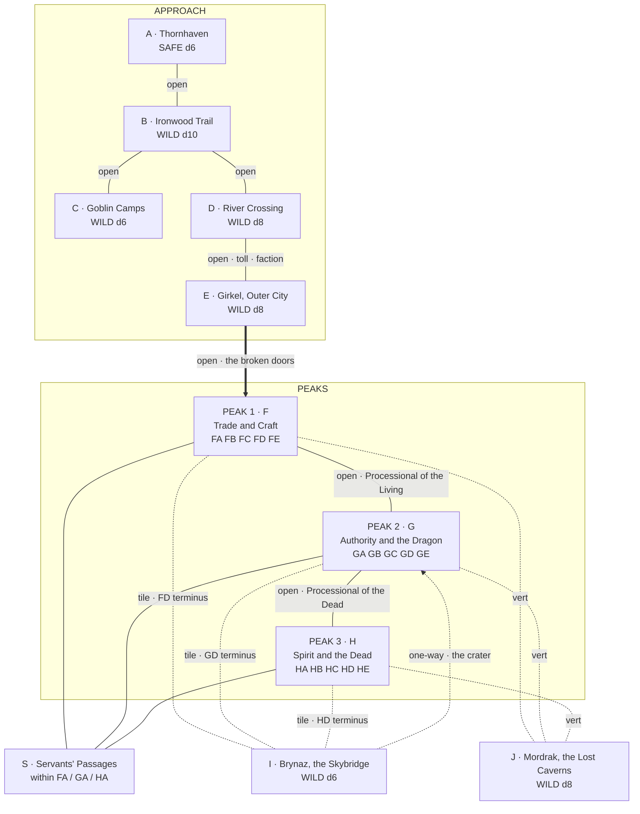
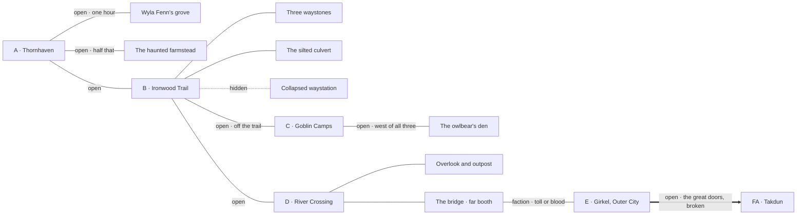
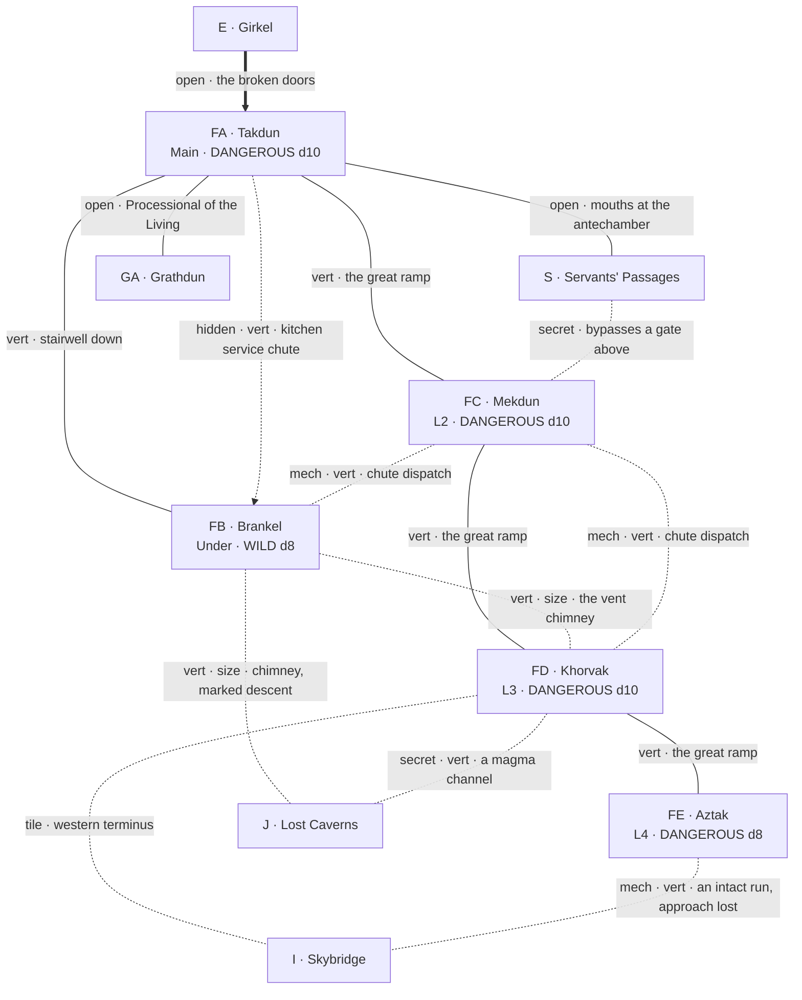
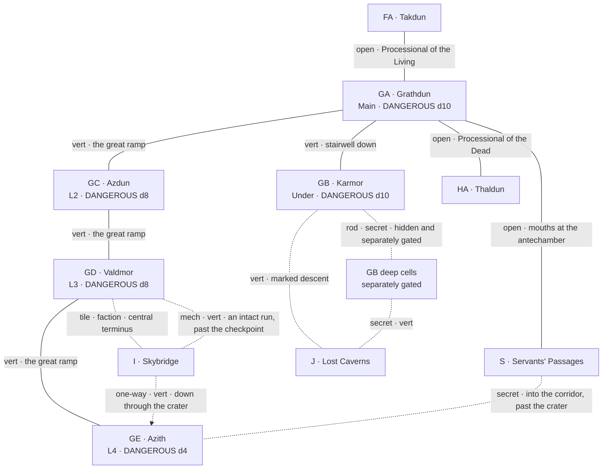
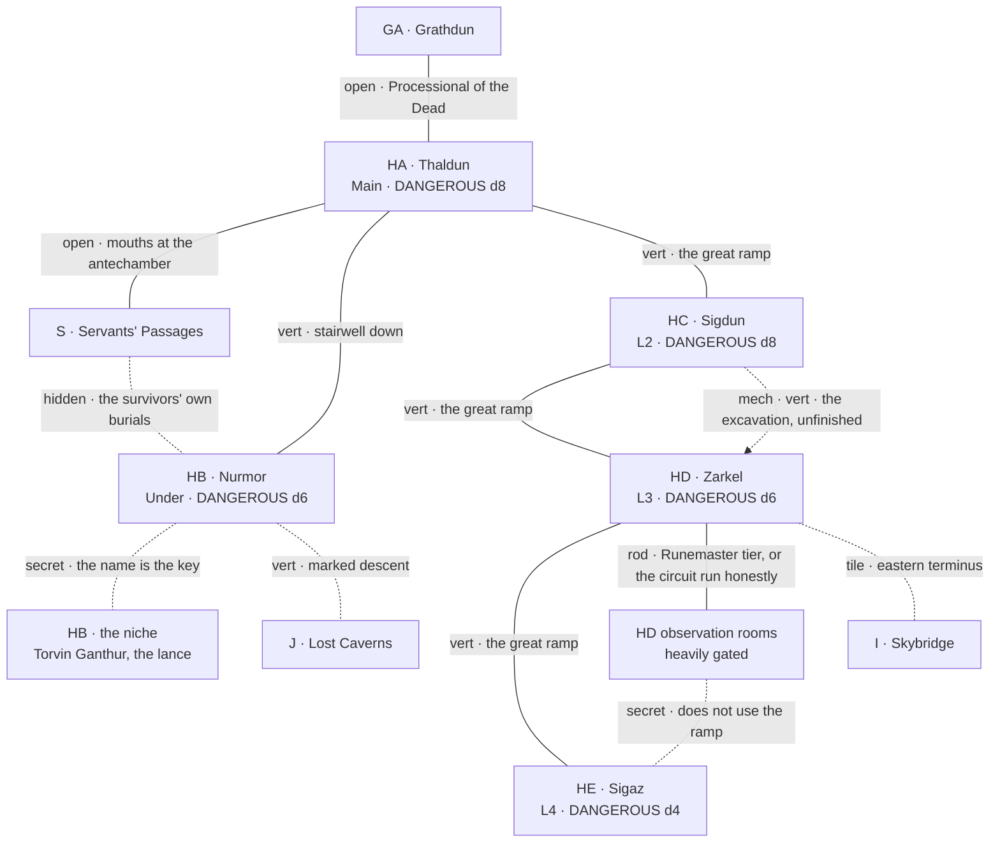
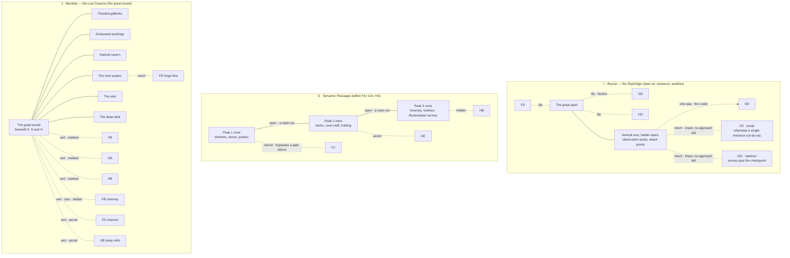

# DRAKENHOLD — SETTING RELATIONAL DIAGRAM

*Procedure step 6. Companion to the Setting Outline and the region files. One overview graph of the whole setting, then one detail graph per grouping. Diagrams are authoritative: the Connections section in each region file is checked against them.*

---

## EDGE VOCABULARY

Not a closed list. New types are proposed and added here rather than coined in passing.

| Type | Mermaid style | Meaning |
|---|---|---|
| open | solid line, plain label | Walk it. No key, no climb, no trick. |
| gated by tile | solid line, `[tile]` | A whole carved stone tile in a matching receptacle grants passage. |
| gated by rod | solid line, `[rod]` | A runed metal rod of the stated tier makes the mechanism act. |
| hidden | dashed line, `[hidden]` | Physically there and unmarked. Found by searching the right place. |
| secret | dashed line, `[secret]` | Concealed on purpose, and knowing it exists is itself a discovery. |
| vertical | any line, `[vert]` | Climb, fall, ramp or shaft. Movement costs and encumbrance bite. |
| one-way | arrow, single-headed | Passable in the stated direction only. |
| conditional — mechanism | dotted line, `[mech]` | Opens only once something is restored, relit or re-sequenced. |
| conditional — faction | dotted line, `[faction]` | Opens only at a stated relation level, or by toll, escort or bargain. |
| conditional — size | dotted line, `[size]` | Passable only by the small, the unarmoured or the desperate. |

---

## 1. OVERVIEW — THE SETTING ENTIRE

Groupings rather than every edge. The four detail graphs below resolve each box.

**Reading it.** Everything above the peaks is the road in, and it is a single chain with one branch. Everything below and around them is the answer to a locked door: the Skybridge is the horizontal cheat, the servants' passages are the lateral one, and the Lost Caverns are the vertical one. **FA is the only opening to the outside world.** Every other way in — the Skybridge termini, the crater, the hidden descents — is a way *out* first, discovered from inside, and only becomes an entrance on a second visit.

---

## 2. DETAIL — THE APPROACH

*Held for the location pass on B: the culverted dwarven drain, and the waystones' two unheard-of destinations. The drain's far end is likeliest to surface on the near bank at D rather than at E — the Outer City is a long way off and the river lies between.*

---

## 3. DETAIL — PEAK 1 (F), TRADE AND CRAFT

**Notes.** The dispatch floor on FC is the level's puzzle and also its map: correct sequencing opens a hidden access that appears on no plan, and wrong sequencing strands a party between FB and FD. The chimney is the peak's spine — it is the only thing touching the Under Level, Level 3 and the caverns at once, and it is the flow that relighting the forge depends on.

---

## 4. DETAIL — PEAK 2 (G), AUTHORITY AND THE DRAGON

**Notes.** The direct horizontal route between peaks runs through the dragon's counting house, and the counting house is held by people who assess before they reach. That is the design. GC's balcony has no Skybridge access and is drawn with none. The crater is the one place the outside gets in, and it gets in on top of the dragon — the edge is one-way for a reason.

*Ratified this pass: the deep cells descend into J. It is how the Elder Wyrm came up, it is how the Runemasters learned the yoke without hauling their subject the length of the marked descent, and it is why the mad Runemaster has had something to listen to for thirty-two years.*

---

## 5. DETAIL — PEAK 3 (H), SPIRIT AND THE DEAD

**Notes.** Peak 3 is the only peak whose internal routes are all earned rather than walked. The circuit can be run honestly for a rod or cheated from the observation rooms, and the shortcut costs more than the road. The kobold chieftain's excavation is a live edge that completes on a clock whether or not the party touches it — accelerating, redirecting or collapsing it are three different campaigns, and one of them hands HE to something that cannot read what it finds.

---

## 6. DETAIL — THE THREE ANSWERS

The Skybridge, the servants' passages and the Lost Caverns exist so that no gate is final. Each answers a different axis.

**The rule the three encode.** Every gate in Drakenhold has at least one answer that is not the gate. A party that cannot pay the Lizardmen's toll can go under the mountain or over it; a party that cannot open a Royal lock can come at the room from a direction the room was never defended against. The cost is always the same shape — the alternate route is longer, darker, or watched by something worse.

---

## AUDIT

Checked against the Gazetteer this pass:

- **FA is the sole exterior entrance.** GA and HA have none; E connects only to FA. Held.
- **GC has no Skybridge access.** The balcony is a nobles' balcony. Held, and drawn with no edge to I.
- **One ramp up, one stairwell down between peak levels.** Held. All additional vertical edges are chutes, chimneys, channels or excavations, and each is typed.
- **The servants' passages interconnect all three peaks.** Placed as edges SF–SG–SH, and as the second internal cross-connection alongside the Processionals.
- **Six previously unwritten routes placed:** FB chimney to FD and to J; FD channel to J; HD observation rooms to HE; servants' route into GE past the crater; hidden descents into J from each peak.
- **The two orphaned Skybridge runs are placed:** one into FE, which is otherwise reachable only by the FD ramp, and one into GD, which arrives inside the vaults without passing the Lizardman checkpoint. Both are intact and both have lost their approach; restoring either is a mechanism problem and each is a major prize.
- **Ratified this pass:** the deep cells descend into J; the yoke was learned in GB from the Elder Wyrm still in the building; the wyrms below and the Drakmorith above are the same story told from two ends.
- **Graph legibility.** The overview will not stay readable as routes accumulate, and sub-region nodes (S, the deep cells, the observation rooms, the niche) are carried deliberately rather than pruned. Held as-is to preserve detail; the overview collapses to a simpler shape once the per-region diagrams exist to hold the specifics.
- **HE has no edge except from HD.** The dragon never came, nothing has been carried out in thirty-two years, and the only ways in are the ramp and the observation-room route. This is deliberate and is why HE pays what it pays.
