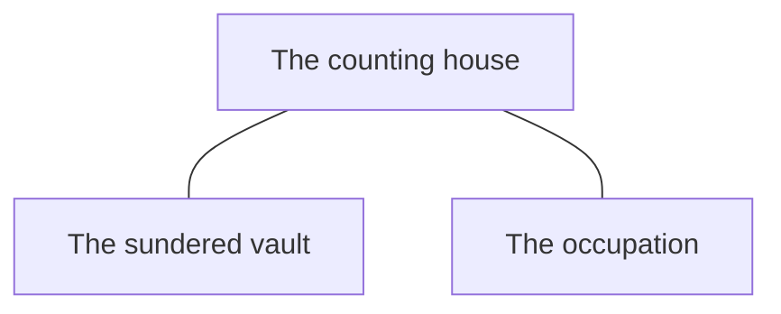

<!-- Tier 3 · region GD · the location groups and how they interconnect. Derived from the tier-4 diagrams by `scripts/diagrams.py --write`. Do not hand-edit: `check.py` M11 re-derives it and fails on drift. One untyped edge per connected pair — connection type is drawn at tier 4 only. -->

