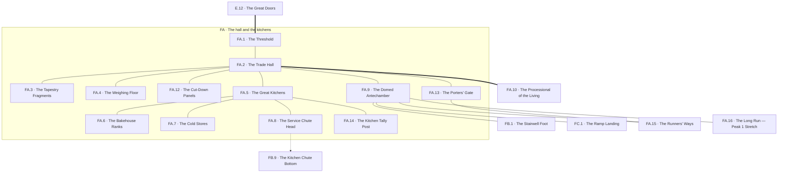

<!-- Tier 4 · FA · The hall and the kitchens · the locations in the group and how they connect. Authored, and the one place edge type is drawn. A destination outside the group is drawn outside the frame. -->

