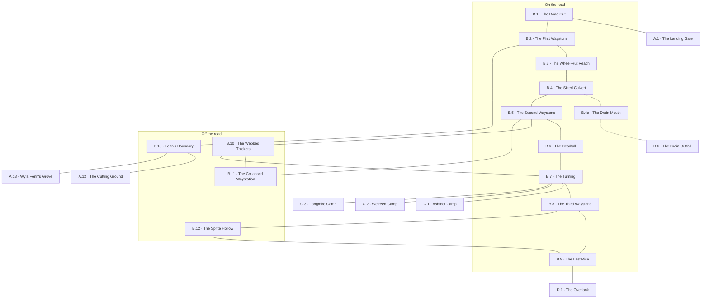

# `B Ironwood Trail`

**Classification:** WILD · **Difficulty Die:** d10 · **Tags:** Old Road, Teaching Ground, Watched Canopy

*Region file. Companion to the Drakenhold Setting Outline and the Setting Relational Diagram. Tables are authored at the location-stub pass (procedure step 7); location stubs, outlines and the region relational diagram follow in the engineer phase.*

---

**Overview:** The teaching ground and the release valve. A single winding trail runs the length of the Ironwood, and a party content to keep to it can walk end to end without real incident — the d10 is generous because the road is the safe thing and everything dangerous is found by leaving it. Its job is to coach new players through Wild procedure at low stakes, to teach the runic script before anyone needs it, and to give a party sick of stone corridors somewhere to breathe between delves. Three waystones still stand with bilingual inscription, root-cracked dwarven roadway surfaces where the soil has eroded, and the ground off the trail holds a collapsed waystation, a silted culvert and the witch's plainly marked boundary. Spiders hold the webbed thickets and sprites shadow travellers from the canopy, and both are avoidable by anyone paying attention. Run it in the key of a long road that no longer goes anywhere.

**Ambiance:** Close canopy and green half-light, the trail a corridor of it. Old dwarven roadway shows through where the soil has eroded — cut blocks, wheel-ruts worn into stone, a drainage gutter still doing its job in places. Everything is damp. Birds go quiet ahead of the party and start again behind them, which means something, though not always something dangerous.

**Layout:** One winding trail, several days end to end, running north-west from Thornhaven to the River Crossing. Landmarks are spaced along it and the ground between is conveyed procedurally. Three waystones stand at intervals, a collapsed waystation sits just off the trail, a silted culvert crosses a stream, and the witch's boundary runs along one stretch, marked plainly enough that crossing it is a choice. Everything dangerous is found by leaving the road. The goblin camps lie off it to the west.

**Features:** The waystones, bilingual in dwarven and trade tongue, which will teach the script to anyone who stops at all three. The culvert, which offers a dry crossing if cleared and a goblin chokepoint if not. The collapsed waystation, worth searching. Webbed thickets that announce themselves. The boundary, which is a negotiation rather than a barrier.

**Dangers:** Low and avoidable. Spiders drop on anything that lingers under the thickets. Sprites scatter trail markers and mimic voices, which costs time and can lose a party its way entirely. Goblin toll ambushes at the chokepoints, opportunistic and quick to break off.

**Creatures:** Giant Spiders in the thickets, with the husks of prior prey wrapped and stored nearby for anyone looking. Wood Sprites in the canopy, bound to the wood and unable to follow past its edge — more trickster than threat, and biddable with riddles and petty bargains. Goblin bandits at the chokepoints, who will run from anything organised and talk to anyone who brings them meat.

**Secrets:** The waystones name distances and destinations in a road network that has not existed for a generation, including two places nobody in Thornhaven has heard of. The waystation's ledger, if it survives, records the last legitimate traffic up the road. One stretch of the buried roadway runs over a culverted dwarven drain that goes somewhere.

**Treasure:** Little, and that is deliberate. Spider husks hold what their owners carried. The waystation holds gear, not wealth. The trail's value is knowledge and safe passage.

---

## CONNECTIONS

*Authored against the Setting Relational Diagram. Edge types: open, gated by tile, gated by rod, hidden, secret, vertical, one-way, conditional on restored mechanism, conditional on faction relation.*

- **A Thornhaven** — open. The road, south-east.
- **C Goblin Camps** — open, off the trail west. Leaving the road is the whole cost.
- **D River Crossing** — open. Several days north-west, end of the trail.
- **The collapsed waystation** — hidden, just off the trail. Within-region.
*Held for the location pass: the culverted dwarven drain under one stretch of buried roadway. Its far end is likeliest on the near bank at D — the Outer City is too far off and the river lies between.* **Settled at step 8:** the far end is `D.6`, the drain outfall below the near bank, and the edge is drawn `B.4a`–`D.6` in the region diagram below. D reciprocates at its own step 8 pass.

## LOCATION STUBS

*Procedure step 7. Code, name and three thematic tags per location. The working note under each is scaffolding for step 8 and is absorbed into the two Overviews when they are written — it is not final text. The ground between these is conveyed procedurally; we do not describe every mile of the trail.*

**On the road**

### `B.1 The Road Out` — Last Sight of the Palisade, Where the Ruts Begin, Nobody Waves
*Working note: the trailhead, a half day from Thornhaven. The dwarven roadway starts showing through here and the party's first Navigate roll is made in the safest place it will ever be made.*

**Connections:** `A.1` the landing gate, half a day south-east — the road, and the last sight of the palisade · `B.2` the first waystone, north-west up the trail.

### `B.2 The First Waystone` — Bilingual, Standing, Distances to Nowhere
*Working note: the teaching stone. Trade tongue and runic saying the same thing side by side, which is the entire method — a party that stops at all three waystones can read the script before anything depends on it.*

**Connections:** `B.1` the trailhead, south-east · `B.3` the wheel-rut reach, north-west · `B.13` Fenn's boundary, where her line runs alongside the trail for a stretch west of the stone.

### `B.3 The Wheel-Rut Reach` — Cut Blocks Underfoot, A Gutter Still Draining, Thousand-Year Work
*Working note: soil eroded off a stretch of true dwarven roadway. Wheel-ruts worn into stone by traffic that stopped a generation ago, and a drainage gutter still doing its job. The first argument for taking dwarven engineering seriously.*

**Connections:** `B.2` the first waystone, south-east · `B.4` the silted culvert, north-west where the roadway crosses the stream.

### `B.4 The Silted Culvert` — A Dry Crossing If Cleared, A Chokepoint If Not, Standing Water
*Working note: clearing it is an afternoon and gives the party a dry crossing for the rest of the module. Leaving it silted hands the goblins a chokepoint. The choice is small, cheap, and permanent.*

**Connections:** `B.3` the wheel-rut reach, south-east · `B.5` the second waystone, north-west · `B.4a` the drain mouth beneath the crossing — **hidden**, under the silt, and it shows only to a party that clears the culvert or goes into the water.

### `B.4a The Drain Mouth` — Cut Stone Under Silt, Air Moving Wrong, Goes Somewhere
*Working note: beneath the culvert, a culverted dwarven drain that is not a drain for long. Hidden. Its far end is unplaced — the working assumption is the near bank at D, and the decision is made at D's location pass.*

**Connections:** `B.4` the culvert above, **hidden** · `D.6` the drain outfall below the near bank at the river crossing — **hidden**, a crawl in the dark under the whole northern stretch of the trail.

### `B.5 The Second Waystone` — Two Names Nobody Knows, Struck Lettering, A Road Network That Ended
*Working note: this one names two destinations nobody in Thornhaven has heard of. The waystation ledger at B.11 confirms that traffic once went to both and gives distances and cargo — and nothing else. Leaning flavour: they are evidence of a road network that outlived its own memory, and the module owes no further answer.*

**Connections:** `B.4` the culvert, south-east · `B.6` the deadfall, north-west up the trail · `B.10` the webbed thickets, off the road west · `B.11` the collapsed waystation, a few hundred yards off the road on the old spur.

### `B.6 The Deadfall` — Goblin Toll, Quick to Break Off, Cheap to Pay
*Working note: the trail's one reliable chokepoint. An ambush that runs from anything organised and talks to anyone bringing meat, and the party's introduction to the goblins as a faction rather than as a fight.*

**Connections:** `B.5` the second waystone, south-east · `B.7` the turning, north-west. The trail is narrow here and there is no way past on the road.

### `B.7 The Turning` — A Path Off the Road, Smoke to the West, The Choice to Leave
*Working note: where C begins. Marked plainly enough that going is a decision. The road is the safe thing and this is the module saying so out loud.*

**Connections:** `B.6` the deadfall, south-east · `B.8` the third waystone, north-west · `B.10` the webbed thickets, off the road south — the way back onto the trail for anyone who went around the deadfall · `C.1` Ashfoot Camp, `C.2` Wetreed Camp and `C.3` Longmire Camp, west. Three traces part company here and each ends at a different camp.

### `B.8 The Third Waystone` — The Last One Standing, Drakenhold Named in Full, Kelmordun
*Working note: the payoff stone. It names the hold in the dwarven tongue, which is the first time anyone tells the party that *Drakenhold* is not what the place was called.*

**Connections:** `B.7` the turning, south-east · `B.9` the last rise, north-west · `B.12` the sprite hollow, off the road east.

### `B.9 The Last Rise` — Canopy Thinning, Open Sky Ahead, Days Behind
*Working note: the run-out to D. The wood breaks and the party has been under cover long enough to feel it.*

**Connections:** `B.8` the third waystone, south-east · `B.12` the sprite hollow, off the road south — the hollow rejoins the trail here · `D.1` the overlook, north-west where the canopy breaks.

**Off the road**

### `B.10 The Webbed Thickets` — Husks Wrapped and Stored, Announce Themselves, Something Above
*Working note: visible before they are dangerous. Spiders drop on anything that lingers, and what the husks are still carrying is worth the risk to anyone who takes the thickets deliberately rather than by accident.*

**Connections:** `B.5` the second waystone, back onto the trail south-east · `B.7` the turning, back onto the trail north-west · `B.11` the collapsed waystation, along the old spur.

### `B.11 The Collapsed Waystation` — Roof Gone, A Ledger Half Ruined, Gear Not Wealth
*Working note: worth searching and worth nothing to a looter. The ledger survives in part — dates, cargo, tonnage and destinations, and no names anywhere. It gives the outside world's account of the last year of traffic up the road, confirms that carts once went to both of B.5's unknown places, and cannot tell anyone who was driving them.*

**Connections:** `B.5` the second waystone, by the old spur out to the trail · `B.10` the webbed thickets, further along the spur — the thickets have grown over the far end of it.

### `B.12 The Sprite Hollow` — Moved Markers, Borrowed Voices, Riddles and Petty Bargains
*Working note: costs time and can lose a party its way entirely. Bound to the wood and unable to follow past its edge, which a party can learn and use.*

**Connections:** `B.8` the third waystone, out to the trail south-east · `B.9` the last rise, out to the trail north-west.

### `B.13 Fenn's Boundary` — Marked Plainly, A Negotiation Not a Barrier, Fresh Stumps Beyond
*Working note: her line runs along one stretch of trail, and the town's cutting crews cross it. Crossing is a choice and she treats it as one.*

**Connections:** `B.2` the first waystone, where her line runs alongside the trail · `A.12` the cutting ground, the same boundary approached from the town side · `A.13` Wyla Fenn's grove, within her line. The grove has two approaches and she watches both.

### THE WAYSTONE INSCRIPTIONS

*Every waystone carries the same text twice — runic above, trade tongue below, cut by the same hand at the same time. The Referee reads both lines aloud, or hands them over on paper. Nothing is translated for the players. The roots repeat from stone to stone, and three stops is enough for a table paying attention to build its own glossary. This is the module's entire teaching method for the script, and it is spent here so that nothing later has to stop and explain itself.*

*Numbers are tally strokes cut in groups of five, in both scripts. No vocabulary is needed to read them.*

**Roots in use.** Established: *rud* iron, *kel* stone, *mor* deep, *bryn* span, *az* high, *thur* oath, *gan* hammer, *gir* gate, *dun* hall, *drak* wyrm. Proposed and added to the record this pass: ***rok*** road or way, ***lath*** league, ***ven*** toward, ***ost*** water or river, ***vir*** wood or standing timber.

---

**B.2 — The First Waystone**

| Runic | Spoken | Trade tongue |
|---|---|---|
| RUDROK | *rud-rok* | THE IRON ROAD |
| VEN OSTGIR ‖‖ LATH | *ven ost-gir, two lath* | TO THE WATER GATE — TWO LEAGUES |
| VEN OSTBRYN ‖‖‖‖‖‖‖‖‖ LATH | *ven ost-bryn, nine lath* | TO THE RIVER SPAN — NINE LEAGUES |

*The Water Gate is Thornhaven. The town has a dwarven name it has never used and is built on a dwarven landing, which is where the palisade stone came from and why there is so much of it.*

---

**B.5 — The Second Waystone**

| Runic | Spoken | Trade tongue |
|---|---|---|
| RUDROK VEN RUDVIR | *rud-rok ven rud-vir* | THE IRON ROAD THROUGH THE IRONWOOD |
| VEN THURGAN ‖‖‖‖‖‖‖‖‖‖‖‖‖‖‖‖‖‖‖‖‖‖‖‖‖‖ LATH | *ven thur-gan, twenty-six lath* | TO THURGAN — TWENTY-SIX LEAGUES |
| VEN AZOST ‖‖‖‖‖‖‖‖‖‖‖‖‖‖‖‖‖‖‖‖‖‖‖‖‖‖‖‖‖‖‖‖‖‖‖‖‖‖‖‖ LATH | *ven az-ost, forty lath* | TO AZOST — FORTY LEAGUES |

*Two places, both far north, neither known to anyone alive in Thornhaven. The waystation ledger confirms carts went to both. Nothing else does.*

---

**B.8 — The Third Waystone**

| Runic | Spoken | Trade tongue |
|---|---|---|
| VEN KELMORDUN ‖‖‖‖ LATH | *ven kel-mor-dun, four lath* | TO KELMORDUN — FOUR LEAGUES |
| DRAKGIR · GANGIR · MORGIR | *drak-gir · gan-gir · mor-gir* | THE WYRM GATE · THE HAMMER GATE · THE DEEP GATE |
| AZDUN THURITH | *az-dun thur-ith* | THE HIGH HALL KEEPS ITS OATH |

*The payoff stone. It is the first time anything in the module tells the party that the place is not called Drakenhold. It also names three gates where the party will only ever find one standing open, which is a question the hold answers much later.*

## TABLES

**Encounter** — d6, rolled on each failed Difficulty roll, resolving in the next watch. Not forced; may be signs, tracks or a meeting at distance. Ascending.

| d6 | Encounter |
|---|---|
| 1 | **Spiders, Already Above.** The thickets closed over the trail somewhere behind and the party is under them now. The one encounter here that can kill outright, and it opens at surprise distance. |
| 2 | **A Goblin Toll Party.** Six of them at a chokepoint, loud, nervous, and quick to break off. They want food and will take it in trade. They know the safe passage past the far booth at the crossing and will sell it. |
| 3 | **Sprites in the Canopy.** Trail markers moved, a voice from off the road using a party member's name. Time lost, direction lost, nobody hurt. |
| 4 | **The Wood Goes Quiet.** Birds stop ahead and start again behind. Something crossed the trail recently and the sign is readable — owlbear, wolves, or a shod boot going the wrong way. |
| 5 | **Someone Coming Down.** A survivor, a deserter from a crew, or a goblin scout running from the west. They have news, they are frightened, and their news is true and incomplete. |
| 6 | **Hobgoblin Scouts, at Distance.** Two of them, off the road, counting the party and not approaching. They are pricing the toll at D before the party gets there, and they will be waiting with a number. |

## REGION RELATIONAL DIAGRAM

*Procedure step 8. Drawn from the stubs, before the location outlines. Reconciled against the finished outlines before the region closes. The diagram is authoritative: the **Connections:** field under each stub is checked against it, never the reverse.*

**Reading the diagram.** Solid edges are open passage on foot. The two dotted edges are hidden: the drain mouth under the culvert (`B.4`–`B.4a`) shows only to a party that clears the silt or goes into the water, and the culverted run north (`B.4a`–`D.6`) is a crawl in the dark under the whole last stretch of the trail. Everything else is walked, in daylight, without a roll — that is the region's job.

**What the drawing found.**

- **The road is a corridor and that is correct.** `B.1` through `B.9` is one chain with no shortcuts, and unlike the farmstead cellar at A this needs no second throat. A road is a corridor by construction. The safety is the point: a party that keeps to the chain walks the region end to end and is coached through Wild procedure at no cost.
- **The deadfall has an answer that is not the deadfall.** `B.6` is the trail's one reliable gate — a goblin toll at a chokepoint — and the drawing gave it a bypass without one being invented: `B.5`→`B.10`→`B.7` runs off-road around it through the webbed thickets. It is priced exactly as the rule requires. The toll is cheap, quick to break off, and buys a fact the party wants at `D.8`; the bypass is free of goblins and costs the thickets, which are the one thing in the region that can kill outright. The module never says which is the mistake.
- **The off-road locations are a string, not four leaves.** `B.10` and `B.11` share the old spur that once served the waystation, which is why the waystation is findable at all — a party pushing into the thickets from `B.5` arrives at the ledger from behind. `B.12` sits between `B.8` and `B.9` and gives the same shape at the north end without a second bypass: the hollow is a loop off the trail that rejoins it.
- **The sprites are placed where losing the way costs most.** `B.12` sits on the run-out to `D`, one stop past the turning to `C` and the payoff waystone. Time and direction lost there are lost with the whole wood behind the party and no landmark left to recover from.
- **`B.13` is one node on two diagrams.** Fenn's boundary carries `A.12` and `A.13` on the town side and `B.2` on the trail side. This is the thread the handoff held open at A's pass and it is now written from both ends: the edges here are the same edges A drew, unchanged. A party that crossed her line on the trail arrives at the cutting ground with a history, and the reverse is equally true.
- **`B.7` braids three ways west, not one.** C's `## CONNECTIONS` states three separate ways in for three camps; the turning is where they part company, not a single path. Which camp a party reaches first is a matter of which trace it follows out of `B.7`, and that is C's to detail.

**Route ends recorded.** Five edges leave region B: `B.1`–`A.1` and the `B.13`–`A.12`/`A.13` pair, all three already drawn at A and reciprocated here; `B.7`–`C.1`/`C.2`/`C.3`; `B.9`–`D.1`; and `B.4a`–`D.6`, the drain, whose far end the handoff records as settled at `D.6`. C and D have not been worked at step 8. All are recorded in the handoff for reconciliation at their passes rather than written into those files here.
