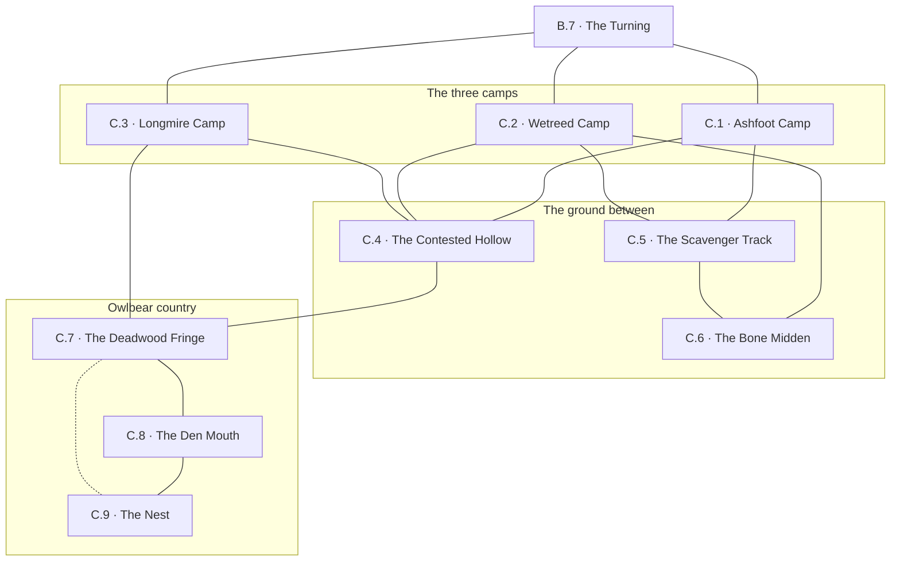

# `C Goblin Camps`

**Classification:** WILD · **Difficulty Die:** d6 · **Tags:** Three Warrens, Divided Tribe, Owlbear Country

*Region file. Companion to the Drakenhold Setting Outline and the Setting Relational Diagram. Tables are authored at the location-stub pass (procedure step 7); location stubs, outlines and the region relational diagram follow in the engineer phase.*

---

**Overview:** A faction region wearing a monster problem. Three ragged goblin camps sit in tangled wood off the trail, mutually hostile, and the party can play them apart or push for a single clear winner — divided they stay weak and useless, united under one chief they can hold the trail, keep the hobgoblins honest and make B genuinely safe passage. The price of alliance is the owlbear nesting nearby and the payment is safe passage past the far guard booth plus a carved stone tile they scavenged out of the Outer City without any idea what it opens. The d6 is dense wood and heavy goblin traffic rather than lethality; the owlbear's den is where the real teeth are, and it is worth entering on its own account for the accumulated goods of everything it has killed. At least one of those goods points squarely at the River Crossing or the Outer City.

**Ambiance:** Tangled second-growth off the trail, dense enough that sightlines close to a few yards. Smoke you smell before you see. The camps are foul — hide lean-tos, bone middens, stolen dwarven ironwork put to uses it was never cut for. There are far fewer goblins than the noise suggests, and they are all watching the tree line to the west, where the owlbear is.

**Layout:** Three camps at some distance from one another, mutually hostile, with contested ground between them and no single approach. The owlbear's den lies west of all three, near enough that all three have lost scouts to it. Reaching any camp means leaving the trail; reaching all three means crossing the ground between them more than once.

**Features:** The negotiation, which is the region. Three chiefs with three positions, playable apart or unified. The owlbear's den, worth entering on its own account — the accumulated goods of everything it has killed are in there, among them at least one item that points squarely at the River Crossing or the Outer City. The stone tile the goblins scavenged and cannot read, which is the price of alliance and opens something they have never seen.

**Dangers:** Goblin ambush in the contested ground. The owlbear, which is an order of magnitude above everything else here and hunts by sound in cover — meeting it unprepared in the tangle is the region's one real killing.

**Creatures:** Goblins in numbers, Goblin Chieftains three of them, and the Owlbear. Divided, the goblins are weak, biddable and useless. United under one chief they can hold the trail, keep the hobgoblins honest and make B genuinely safe passage — which is a standing change to how the module runs, earned by faction play rather than granted.

**Secrets:** Which of the three chiefs the other two would actually follow, and why. That the goblins know the safe passage past the far guard booth at the crossing and will trade it. What the owlbear has been dragging back, and where it got it.

**Treasure:** The den, which is the region's real haul — scavenged dwarven goods, coin from the dead, and the pointer item. A carved stone tile, whole, held by whichever chief the party favours.

---

## CONNECTIONS

*Authored against the Setting Relational Diagram. Edge types: open, gated by tile, gated by rod, hidden, secret, vertical, one-way, conditional on restored mechanism, conditional on faction relation.*

- **B Ironwood Trail** — open. Off-trail approach, three separate ways in for three camps.
- **The owlbear's den** — open, west of all three camps. Within-region.

## LOCATION STUBS

*Procedure step 7. Code, name and three thematic tags per location. The working note under each is scaffolding for step 8. The wood between these is conveyed procedurally — sightlines close to a few yards and there is no single approach to anything.*

**The three camps**

### `C.1 Ashfoot Camp` — The Strongest Chief, Fewest Goblins, Holds the Tile
*Working note: Chief Grask Ashfoot. Fewer bodies than the others and better discipline, which he knows and they do not. He is the one the other two would actually follow, and he is the only one who will not ask for the alliance.*

*The tile: scavenged out of the Outer City, whole, unreadable to him, worn as a badge of rank. It opens a gate deep inside the servants' passages — the seal set across the main run between the Peak 1 and Peak 2 warrens, closed during the civil war and never reopened, which is the single obstruction forcing every lateral crossing onto the capillary detours. A party carrying it can move between peaks underneath the hold. The goblins have been wearing the hold's back door on a thong for thirty years. Cross-referenced into FA and GA at their location passes.*

**Connections:** `B.7` the turning on the Ironwood Trail, east — one of the three traces off the road · `C.4` the contested hollow, the only way to either other camp · `C.5` the scavenger track, west out of camp.

### `C.2 Wetreed Camp` — The Most Goblins, The Worst Chief, Loudest Grievance
*Working note: Chief Nub. Numbers and nothing else. He wants the owlbear dealt with and will promise anything to whoever does it, including things that are not his to promise. Backing him is the obvious play and the wrong one.*

**Connections:** `B.7` the turning, east · `C.4` the contested hollow · `C.5` the scavenger track, which the camp's salvage files come down · `C.6` the bone midden, downwind at the camp's edge.

### `C.3 Longmire Camp` — Nearest the Den, Bleeding Scouts, Ready to Break
*Working note: Chief Hessa, the only one of the three who is frightened rather than proud. Closest to the owlbear and losing somebody every week. She will fold into an alliance for safety alone and is the cheapest of the three to buy.*

**Connections:** `B.7` the turning, east · `C.4` the contested hollow · `C.7` the deadwood fringe, west and far too close. Longmire is the only camp with an edge onto owlbear country and Hessa knows it.

**The ground between**

### `C.4 The Contested Hollow` — No Man's Wood, Old Ambush Sign, Crossed More Than Once
*Working note: the ground all three camps claim and none holds. Reaching all three chiefs means crossing it more than once, and the goblins ambush here out of habit rather than plan.*

**Connections:** `C.1` Ashfoot Camp · `C.2` Wetreed Camp · `C.3` Longmire Camp — every crossing between chiefs comes through here · `C.7` the deadwood fringe, the open way west.

### `C.5 The Scavenger Track` — Worn Path to the Outer City, Two Days West, Where the Tile Came From
*Working note: how the goblins reach E and come back with dwarven ironwork put to uses it was never cut for. Also a route the party can take, and it does not pass the crossing at D.*

**Connections:** `C.1` Ashfoot Camp · `C.2` Wetreed Camp · `C.6` the bone midden, where the track passes the camp's edge. West, the track runs two days to the Outer City and does not pass the crossing at `D`. **That far end is not drawn.** The Setting Relational Diagram carries no `C`–`E` edge; the question is batched, not answered here.

### `C.6 The Bone Midden` — Everything They Have Eaten, Scouts Not Buried, What Else Is In It
*Working note: foul and worth searching. Among the goblin dead are bodies the owlbear did not make — killed cleanly, at range or in rank, and stripped of anything worth carrying. Hobgoblins have been quietly culling goblins who use their road, and the goblins have not worked it out. A second reading is left open and neither confirms the other: some of the dead came home down the scavenger track and something followed them.*

**Connections:** `C.2` Wetreed Camp, upwind · `C.5` the scavenger track, which passes its western edge.

**Owlbear country**

### `C.7 The Deadwood Fringe` — Trees Raked to the Heartwood, Silence, Turn Back Here
*Working note: the warning apron around the den, and the module honouring its own rule that the path is not clear. Everything here says stop, in a language anyone can read.*

**Connections:** `C.3` Longmire Camp, east · `C.4` the contested hollow, east · `C.8` the den mouth, west through the raked ground · `C.9` the nest — **hidden**. Where the raked trees have died and gone over, roots have pulled the roof off the chamber below and left a sink a body can crawl down.

### `C.8 The Den Mouth` — A Fallen Trunk Over a Hole, Fouled Ground, One Way In
*Working note: the approach and the decision. It hunts by sound in cover and meeting it in the tangle is the region's one real killing. Meeting it at the mouth, on a plan, is a fight a prepared party wins.*

**Connections:** `C.7` the deadwood fringe, back east · `C.9` the nest, down through the hole under the fallen trunk. One way in, and the only one the owlbear uses.

### `C.9 The Nest` — Thirty Years of Kills, Coin Among the Bones, The Pointer
*Working note: the region's real haul. Scavenged dwarven goods, coin off the dead, and the satchel of a Grellick surveyor who did not come back — sketch maps of the Outer City's three hills, a partial elevation of the great doors, and marginal notes on what lies past them. Roughly half of it is right. The wrong half is confident, specific, and written in the same hand as the right half, and there is no internal way to tell them apart. The Charter will pay well to have it back and will not mention that the man is missing.*

**Connections:** `C.8` the den mouth, up and out the way the owlbear comes and goes · `C.7` the root sink at the back of the fringe — **hidden**, a crawl down through soil and root-mass, narrow enough that armour comes off and no way back up in a hurry.

## TABLES

**Encounter** — d6, rolled on each failed Difficulty roll, resolving in the next watch. Not forced; may be signs, tracks or a meeting at distance. Ascending.

| d6 | Encounter |
|---|---|
| 1 | **The Owlbear, Hunting.** Not at the den — out, and already inside the party's sightline, which in this wood is a few yards. It hunts by sound and it does not disengage. |
| 2 | **A Camp's War Party.** Fifteen or more, out to settle something with one of the other two, and the party is standing in the contested hollow between them. Fighting is a choice; being seen is not. |
| 3 | **A Kill in Progress.** Goblin screaming from off to the west, then nothing. Reaching it fast finds a survivor and a fresh trail; reaching it slow finds neither. |
| 4 | **Scavengers Coming Home.** A file of goblins on the scavenger track, loaded with Outer City salvage, nervous and outnumbered. They will trade rather than fight and they know the west road. |
| 5 | **A Chief's Envoy.** Two goblins sent by whichever camp the party has not yet visited, with an offer, a grievance about the other two, and instructions to lie about the third. |
| 6 | **Sign Only.** Raked bark at head height, a scoured hollow, feathers. The wood telling the party where not to be, in time for them to listen. |

## REGION RELATIONAL DIAGRAM

*Procedure step 8. Drawn from the stubs, before the location outlines. Reconciled against the finished outlines before the region closes. The diagram is authoritative: the **Connections:** field under each stub is checked against it, never the reverse.*

**Reading the diagram.** Solid edges are open ground, walked, in cover that closes sightlines to a few yards — there is no single approach to anything here and no path is clear in the sense that a corridor is clear. The dotted edge `C.7`–`C.9` is hidden: the root sink at the back of the nest, described below.

**What the drawing found.**

- **The den mouth had one way in and now has two.** `C.8` is a fallen trunk over a hole and the stub says *One Way In*, which would make the region's real haul sit behind a single fight in a single throat. The answer that is not the gate was found in the ground the stubs already describe: at the back of the deadwood fringe, where the raked trees have died and gone over, roots have pulled the roof off the nest chamber and left a **root sink** — a crawl down through soil and root-mass into `C.9` directly. It is not a better route. It is narrow enough that armour comes off, it is one-way in practice because nothing climbs back up it in a hurry, and it drops a party into the chamber with the haul and no line of retreat. If the owlbear is home, they are in the room with it and the trunk is on the far side. The mouth remains the route a prepared party takes on a plan; the sink is the route a party takes when it wants the nest and not the fight, and it is priced worse than the fight.
- **The contested hollow is the region's hub and the owlbear's front door.** `C.4` carries all three camps and `C.7`. That single edge is why the ground is contested at all — the hollow is where the camps' claims meet *and* the open way west into owlbear country, so every crossing between chiefs is made along the same margin the thing hunts. Three visits to three chiefs means crossing it more than once, as the stubs require, and the war-party and kill-in-progress results on the Encounter table land there by construction.
- **`C.3` is the only camp touching the fringe.** Longmire's edge to `C.7` is the whole of Hessa's problem drawn as one line: she is nearest, she is bleeding scouts, and she is the cheapest of the three to buy. No other camp shares that edge and no other chief has that reason.
- **The scavenger track serves two camps, not three.** `C.1` and `C.2` reach `C.5`; Longmire does not, because the fringe sits between Longmire and the west. Ashfoot's tile came up that track and Wetreed's numbers come down it, and Hessa's camp has neither salvage nor a road — which is the drawn reason the two proud chiefs are proud and the frightened one is frightened.
- **The midden sits on the track, not just behind the camp.** `C.6` touches `C.2` and `C.5`. Both readings the stub holds open are reachable without either confirming the other: the bodies killed cleanly at range came home from the road, and whatever followed the scavengers back came the same way.
- **No camp connects directly to another.** Every chief-to-chief movement routes through `C.4`. The tribe's division is a fact of the map before it is a fact of the fiction, and a party playing them apart is walking the reason they are apart.

**Route ends recorded.** Three edges leave region C, all to `B.7`: the three traces that part company at the turning, drawn at B's step 8 pass and reciprocated here unchanged. Which trace leads to which camp is now written — `C.1`, `C.2` and `C.3` each take one, and the drawing offers no reason to rank them, so the party's first camp is whichever trace it follows.

**`C.5` stops at the region edge, deliberately.** The scavenger track runs two days west to the Outer City and the stub states the party can take it and that it does not pass the crossing at `D`. **The Setting Relational Diagram carries no `C`–`E` edge, and `E`'s `## CONNECTIONS` lists only `D` and `FA`.** The route is therefore drawn as a terminus inside `C` and no node in `E` is written. This needs direction and is in the question batch; it is not decided here.
