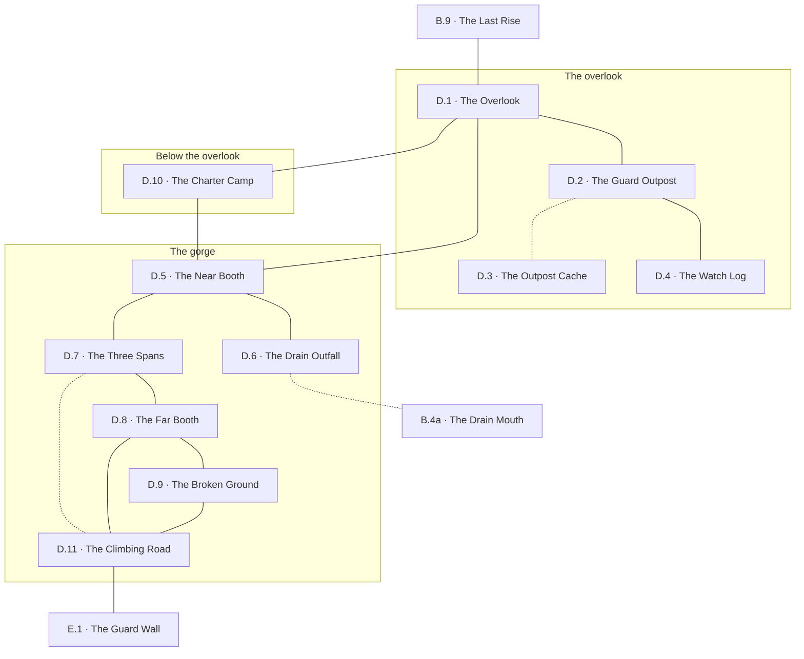

# `D River Crossing`

**Classification:** WILD · **Difficulty Die:** d8 · **Tags:** First Sight of the Peaks, Toll Bridge, Watched Overlook

*Region file. Companion to the Drakenhold Setting Outline and the Setting Relational Diagram. Tables authored at the location-stub pass (procedure step 7); location outlines written at step 9, with the region diagram reconciled against them.*

---

**Overview:** A checkpoint that rewards stopping. The region works equally as five minutes for a party in a hurry and half a session of information for one that searches, and the difference is entirely player choice. An overlook holds an old dwarven outpost with a hidden cache, its dead and its logbook; below it an ancient stone bridge crosses the river with a guard booth at each end, the far one manned by hobgoblins who prefer coin to blood. The first view of the three peaks with the crater in the second is a set piece and should be given room to land. The toll is negotiable; a party that decides to take the bridge outright is picking a fight they can plausibly win and a feud they will carry all module. The Grellick Charter is camped in good order below the overlook, watching whoever comes up the road.

**Ambiance:** Open sky for the first time in days, and wind with nothing standing in the way of it. Below, the river runs fast and brown through a gorge, loud enough on the bank that people raise their voices to be heard over it. North across the valley stand the three peaks, in sight from every part of this region and from nowhere else on the road in.

**Layout:** An elevated overlook with an old dwarven guard outpost on it, the bridge and its two guard booths in the gorge below, and a rough stone road climbing north from the far bank toward the gates of the Outer City. The Grellick Charter's camp sits below the overlook. The near booth is empty; the far one is manned.

**Features:** A crossing that works as five minutes for a party in a hurry and as half a session for one that searches, and nothing in it ever asks anyone to stop. Everything that rewards stopping hangs off the through-line by a single edge and is on the way to nothing — which is the region's whole construction and is stated here because no location can state it from inside. Two of its features are views rather than places, and both are given the room a set piece needs at the locations that hold them.

**Dangers:** One, and it is a decision rather than a hazard: the crossing is held, and it is held by people who would rather be paid than fight. What follows from refusing is written at the booth that sets the price and at the camp that backs it. The terrain is not a threat — the bridge is sound in any weather short of ice and the river is not fordable anywhere in the region, so the gorge is a wall rather than a danger. What is true region-wide is exposure: this is open ground for the first time since Thornhaven, and from the moment a party crosses the overlook it is being counted by somebody.

**Creatures:** `Hobgoblin`, one band, holding two of this region's locations. The Grellick Charter at a third — `Sellsword` and `Camp Hand` under a factor. Nothing else lives here: no beast, no wild thing, nothing dead. **Every creature in this region can be talked to and every one of them wants something a party can name**, which is the region's whole character and does not survive the Outer City.

**Secrets:** Nothing here is locked and nothing here is guarded. Everything hidden in this region is hidden by not having been looked at — a slab under fallen rubble, a book on a shelf nobody in thirty years could read, a worn place on the lip of a gorge, a mouth in a river bank below the only ground the toll cannot see. Each is held at the location that holds it, and the region's honest difficulty is that a party in a hurry walks past all four without a roll ever being called for.

**Treasure:** Two concentrations and nothing loose between them. One is bought with an afternoon's searching and the other with a battle, and the module recommends neither. Both are held at the locations that carry them. Nothing in this region is worth a slot that is not also worth carrying into the mountain — the last place on the road where that sentence is still cheap to learn.

---

## CONNECTIONS

*Authored against the Setting Relational Diagram. Edge types: open, gated by tile, gated by rod, hidden, secret, vertical, one-way, conditional on restored mechanism, conditional on faction relation.*

- **B Ironwood Trail** — open. South-east.
- **E Girkel, the Outer City** — conditional on faction, then open. The far booth is manned and the toll is negotiable; the road climbs north from the far bank. *Amended at step 8: the toll is the price of the bridge, not of the region. The old course of the ruined highway (`D.7`–`D.11`, hidden) comes up past the booth for anyone the goblins have told about it, and it is priced — see the region diagram.*
- **The overlook and its outpost** — open, elevated. Within-region.
- **The bridge and its two booths** — open, in the gorge below. Within-region.

## LOCATION STUBS

*Procedure step 7 for the code, name and three thematic tags; **procedure step 9 for the outlines below them.** Each location carries a Player's Overview in the player register, a Referee Overview in the referee register, and the features the location contains. Feature detail is written at step 10. The step-7 working notes have been absorbed into the two Overviews and struck. The region works as five minutes for a party in a hurry and half a session for one that searches, and the stub list is built so that both are true.*

**The overlook**

### `D.1 The Overlook` — First Sight of the Peaks, Wind and Cut Stone, Give It Room
*Player's Overview: The wood lets go of you at the top of a bare shoulder of ground and the wind arrives all at once. Ahead the land falls away into a gorge with brown water in it, and a bridge across the water in three long arches, and a thread of smoke standing off a roof at the bridge's far end. Beyond all of that, across miles of open country, three mountains stand out of the plain with snow on them. The middle one is broken. Its summit is opened out like a cracked cup and there is no snow at all on the rim of the break. Between the peaks, no thicker from here than a hair laid across the sky, there is a line that does not follow the shape of the mountain. It is straight. It does not bend where the rock bends, and it goes from the first peak to the second and on to the third without once giving way to anything. Somebody left a great deal of cut stone lying about the ground you are standing on, and the wind has been going through it for a long time.*

**Referee Overview:** A bare shoulder of ground where the road comes out of the wood — wind-scoured, grown over in low scrub, littered with cut stone — 260 feet above the river and a mile south-east of the bridge. The wood's edge is a short climb back south-east; the road crosses the top west and then drops into the gorge in four switchbacks. The peaks stand nine miles north across open broken country. The outpost is on the height itself, forty paces north of the road; the Charter camp is a quarter mile down the road in the first fold out of the wind. There is no cover on the top and the wind is constant. **A party on this ground is visible from the far booth from the moment it arrives**, and the hobgoblins count everyone who comes over it. Give the view an hour of table time. It is the campaign's establishing shot, there is nothing here to roll for, and the module should not hurry it.

**Features:**

* **The Three Peaks:** three summits nine miles north, snow on the first and the third, the second opened into a notch — **the crater, visible from this ground in any clear weather** — and the rim of it bare where snow lies on everything around it. Nothing rises from any of them. Thornhaven has said *no smoke from the peaks* for ten winters and this is the closest look a party gets at the sentence before it walks into it.
* **The Line Between Them:** in low light — the hour after dawn and the hour before dusk, when the sun rakes the south faces — the faces themselves show a stitching of finer lines threaded up the rock, and several of those lines stop in the middle of nothing at all. **This is the state of the Skybridge, readable from nine miles away**: the great span still stands and the ways up to it do not all arrive. A party that spends the hour with the light has the whole of that region's problem months before it meets it. Nothing here names it and nothing should.
* **The Cut Stone:** dressed blocks scattered across the top and down the north slope — the outpost's upper watch floor, which came down and was never cleared. Among it, stacked rather than scattered, kerb and gutter stones prised out of the highway by somebody building something small up here a very long time ago.
* **Watching the Crossing:** a watch spent on this ground buys the far booth's relief change, its numbers, the fact that the Charter pays without argument, and the shape of the ground behind the bridge. It costs daylight and nothing else, and it is the cheapest purchase in the region. **The far booth is doing exactly the same thing in the other direction.**
* **Exits:** the last rise, south-east where the canopy breaks -> `B.9` · the guard outpost, forty paces north on the height -> `D.2` · the switchbacks down into the gorge, west -> `D.5` · the Charter camp, a quarter mile down the road -> `D.10`

**Connections:** `B.9` the last rise, south-east where the canopy breaks · `D.2` the guard outpost, on the height itself · `D.5` the near booth, down the switchbacks into the gorge · `D.10` the Charter camp, below the overlook on the road.

### `D.2 The Guard Outpost` — Dwarven Work, Held Too Long, Facing the Wrong Way
*Player's Overview: A squat house of grey blocks stands on the height with its roof fallen in and both its door frames empty. Inside, in the long room, there are dwarves on the floor — mail gone to rust in the shape of what was in it, helms, axes, one shield still strapped to an arm. They are lying in a line and the line is drawn across the room facing the doorway on the mountain side, and every one of them has fallen toward it. Tables, a bench and a stone bin were dragged across that doorway and it was not enough. Behind them the other door, the one that looks down at the bridge, stands wide open. Nothing is piled against it. Nothing died in it. Out on the ground beyond the mountain door there are more bones, weathered white and pulled about by animals, and there is no mail among them.*

**Referee Overview:** A dwarven blockhouse on the crown of the overlook: one room, forty feet by twenty, walls three feet thick, two doors — north onto the road out of the hold, south onto the road down to the bridge. The upper watch floor is down and its stone lies outside on the north slope. **Fourteen dwarven guard dead inside, all facing the north door**, behind a barricade of their own furniture. The wounds are dwarven work — mail split by axe and pick at arm's length — and there is no goblin, hobgoblin or animal bone in the room. Outside the north door lie four more, weathered two years harder than the ones inside: three in travelling kit and one in a courier's harness with the straps cut off it. Nothing has been looted. The guardroom is the partitioned corner at the south-west; the watch log is on its shelf and the strongroom is under its floor. **The party can read the question in ninety seconds and cannot answer it from this room.** The log dates it and the strongroom explains it, and the module never states it in the open.

**Features:**

* **Facing the Wrong Way:** a line of dead across the room, a barricade on the mountain door, and the river door standing open at their backs. Whatever they died fighting came down the road out of the hold. This is free, it needs no roll, and it is the first time the module says out loud what it has been arranging since Thornhaven — **the hold did not fall to the dragon.**
* **Dwarven Wounds:** axe and pick, close, no arrow-holes and no bites. A party that has been on the road three weeks can tell dwarven arms from goblin work by now, and if it cannot, the axes are lying next to the men they were used on.
* **The Older Dead Outside:** four of them, on the hold side of the barricade, bone where the men inside are still mail and rot. **They died two years before the garrison did** and nobody buried them, and the difference in weathering is legible to anybody who looks at both. One wears a courier's harness with the straps cut. What he was carrying is under the guardroom floor.
* **Picked Over and Missed:** the Grellick Charter has been through the shell — boot-scuff in the dust, the loose ironwork gone off the door pintles, the dead left where they lie. They will tell a party the outpost is empty and they are right about everything they checked. Nobody in their camp reads runic and nobody moved the rubble in the corner.
* **The Slab in the Guardroom Floor:** under the fallen watch-floor stone, the guardroom is paved in six dressed slabs and one of them has a lifting socket cut in it, plugged with a stone bung and pointed over with lime. Clearing the rubble takes an afternoon. **Hidden**, and it costs a search rather than a fight -> `D.3`
* **Exits:** the overlook -> `D.1` · the guardroom shelf and the watch log -> `D.4` · the strongroom under the guardroom floor — **hidden** -> `D.3`

**Connections:** `D.1` the overlook · `D.4` the watch log, in the guardroom where it was kept · `D.3` the outpost cache — **hidden**, sealed, and it is what explains the dead.

### `D.3 The Outpost Cache` — Sealed, Preserved, Nobody Came Back For It
*Player's Overview: Under the slab there is a dry room the size of a large cupboard, cut square, with a stone shelf on three sides, and the air that comes up out of it is thirty years old and smells of grease and cold iron. Everything in it was put away properly. Mail rolled in oiled cloth and laid straight. Hafts stacked by length. A bundle of lamp-hooks wired together. A stone jar sealed with wax, and a small iron chest. And on the middle shelf, by itself, a courier's satchel with the straps cut off it, folded shut, weighted down with a stone — and across the cloth somebody has chalked three words, and the chalk is still there.*

**Referee Overview:** The post's strongroom, six feet by eight and six deep, under the guardroom floor, dry and dark and sealed with a stone plug in the war years. Never opened since. It holds the reserve stores in condition — **dwarven guard gear, preserved, and this is the region's honest treasure** — and it holds one confiscation, set aside under the Guard's own seal and never sent on, because every man who could have sent it on died at the north door two years later.

**Features:**

* **What Is Worth Carrying:** a mail coat and two helms in grease-cloth, four axe-hafts and two picks, a bundle of lamp-hooks, a sealed stone jar of lamp oil that is still oil, and the post's iron chest with a modest pay in it. Four men's loads all told, of which one load is worth more than the coin: **the oil and the hooks are light, they are the last free light on the road, and they are the only lamp oil in the module a party does not have to have carried up from Thornhaven.**
* **The Chalk:** three words in the square hand across the folded cloth — *held under seal* — with no name and no date, which is the whole of what the men who wrote it were still able to do. A party that learned the script at the waystones reads it unaided, and the same three words close the one entry in the log upstairs that says where this satchel came from.
* **The Courier's Satchel:** inside it, wrapped in sacking, a fitted piece of dark metal about the size of a hand, heavy for its size, cold to hold, with one broken edge and part of a cut pattern running off that edge and stopping. Nothing here names it and nothing in this region will. **It is one of the seven pieces of the artifact and one of only two that ever left the mountain.** A party takes it for a curio and carries it four regions before anything tells them otherwise; the register at `E.6` is where it stops being a curio and the count at `HE.10` is where it becomes a question.
* **What the Room Explains:** the post was holding the road under a confiscation order that no government was left to lift, it stopped a man coming down out of the hold who would not declare what he carried, and it put what he carried under the floor. Two years later the last of the people it was stopping came down that road and went through it. **The dead upstairs are the answer to the strongroom and the strongroom is the answer to the dead**, and neither is stated to the players by anything except the two of them together.
* **Exits:** up through the floor into the guardroom -> `D.2`

**Connections:** `D.2` the guard outpost above — **hidden**. Sealed thirty years and opened by a search, not a fight.

### `D.4 The Watch Log` — The Last Weeks, From Outside Looking In, Names and Dates
*Player's Overview: The guardroom has a stone shelf and on the shelf there is a book — leaves of thin scraped hide sewn between wooden boards, and the boards have kept it. The writing is the square lettering off the road stones, small and quick, and down the left margin the same shapes come round and round: the tally strokes you have been reading since the Ironwood. The same short lines run down page after page after page, in one hand, and then in another hand, and then in the first hand again. The last written page stops two-thirds of the way down, in the middle of a row of tally strokes. Every leaf after it is blank.*

**Referee Overview:** The post's watch log, where it was kept and where nothing is hiding it, intact and legible, in runic script throughout and **not bilingual** — a military document, written for the Guard and not for travellers, and the first thing in the module that pays a party back for learning the script instead of being taught it. One or two lines a day: traffic up and down the road by head and by cart, weather, toll taken, declarations made and refused. Reading the whole book is an hour's work; the last three years are worth all the rest of it. **It is the outside world's account of the hold's end, kept by people who could see the mountain and not the inside of it**, and its value is exactly that limitation.

**Features:**

* **The Outside Chronology:** counts, dates and weather from a post that watched the only road, kept in three hands across the years the book runs. Against the evacuation register at `E.6`, which counts who left the hold, and the wharf manifests at `A.9`, which count who came up the river, it is the third leg of the module's outside record — three vantage points, none of them inside, and the party is the first thing in thirty years to hold all three.
* **The Traffic Reverses:** for one year the counts run the wrong way. Parties going *up* the road, in numbers, with families and carts, and the clerk keeping the book grows terse about it and then, once, stops keeping a count and writes four words that are not a count: *they are going back*. **That is the Knight's Peace, seen from nine miles away by somebody who did not believe in it**, and the name in the margin of that entry — **Torvin Ganthur** — is not carved on any official surface in the hold and is here because a duty ledger is exactly the kind of document his name survives in.
* **The Standing Order:** the confiscation order arrives, is entered, and is never lifted. Everything coming down the road is to be stopped and searched and nothing undeclared is to pass. It outlives the authority that issued it by two years, which is the whole of what this outpost was.
* **The Entry That Points Down:** two years before the book ends, one line records a courier stopped at the north door who would not say what he carried, and closes with the same three words that are chalked on the cloth in the strongroom. **This is the clue to `D.3` and it lives outside the room it opens** — the log is on a shelf in plain sight and the slab is under rubble in the corner, and the book tells a party which corner.
* **Where It Stops:** the last week. Numbers coming down at night and refusing to stop, then a line about light on the second peak in the dark and the noise of it afterward, then two more days of counts, then nothing. **The dead in the long room were made within days of the last entry**, and this book is what dates them.
* **What It Cannot Tell Anyone:** it never saw inside. Nothing in it explains why any of those people were leaving, and a party reading it for the reason will be disappointed on purpose. Read for dates and numbers, it is the frame the whole module hangs in.
* **Exits:** the long room and its two doors -> `D.2`

**Connections:** `D.2` the guard outpost. The log is where it was left and nothing is hiding it.

**The gorge**

### `D.5 The Near Booth` — Empty Thirty Years, Doors Off Their Hinges, Nobody's Ground
*Player's Overview: At the foot of the switchbacks, where the road runs out onto the bridge, there is a small square house of the same grey stone with both its doors leaning against the inside wall. It is dry. The roof is one slab and the slab is sound, and the wind that has been shoving you around all afternoon stops at the doorway. A stone counter runs across one end, worn into a shallow dish where a thousand years of hands went over the same place. Beside the door, cut into the jamb, there are two blocks of writing — the square lettering, and under it, worn but readable, the same thing said in a tongue you were raised in. And in the last few feet of the doorway, where the stone is softer, people have scratched their names — layers of them, the oldest gone furry with lichen and the newest cut white. A few of the names have a stroke cut through them. Most do not.*

**Referee Overview:** The hold's own toll-house at the near end of the bridge: twelve feet square, single-slab roof, two doors, both off their hinges thirty years. Dry, out of the wind, and the only shelter on this bank. It has a clear line west along all three spans to the far booth **and the far booth has the same line back**. This is nobody's ground — the hobgoblins hold the far bank, do not garrison this one and do not cross at night — so camping here is legitimate, comfortable and entirely observed. A fire in this doorway is a fire the far booth can see, and it turns the morning from an ambush into an appointment: two come down at first light to price whoever slept here.

**Features:**

* **The Ordinance:** the crossing's charges cut into the jamb in the square hand and repeated beneath in trade tongue — per head, per beast, per cart-axle, amounts in tally strokes. Two things fall out of it for nothing. The crossing is named in both: **Brynost** — *bryn* and *ost*, span and water — above, and *the river crossing* below, so a party learns it has been using a translation, exactly as it did with Kelmordun at `B.8`. And the toll being charged at the other end of the bridge today is a thousand years old. **The hobgoblins did not invent it. They are the current collectors of it.**
* **The Root Worth Keeping:** *bryn* is the span, and a party that files it here reads Brynaz off a stone in the sky much later without help. This region is where that root is cheap.
* **The Scratched Names:** thirty years of crews on the door reveal — names, companies, dates, a few marks that are not letters. A crew that comes back down cuts a stroke through its own name. **Most of the names have no stroke.** Anyone who read Skeed's manifests at `A.9` is looking at the second half of that list, kept by the people it is about, in the doorway they walked through.
* **A Dry Bed in Sight of the Toll:** the best Rest available in the region, taken in full view of the people who will be setting the price. Making camp here is not a mistake — being surprised by the consequence is. Both are available and the module says nothing.
* **The Counter:** worn into a dish on the traveller's side, and the rack behind it where the weigh-chains hung is empty. What was tallied on that counter was written up in a book, and the book is on the height at `D.4`, which is a thing a party works out here and acts on somewhere else.
* **Exits:** the switchbacks up to the overlook, east -> `D.1` · the Charter camp, back up the road -> `D.10` · the three spans, west onto the bridge -> `D.7` · the outfall on the silt shelf, down the broken bank north of the booth -> `D.6`

**Connections:** `D.1` the overlook, up the switchbacks · `D.7` the three spans, west along the bank · `D.6` the drain outfall, below the near bank · `D.10` the Charter camp, back up the road.

### `D.6 The Drain Outfall` — Below the Near Bank, Silt and Cut Stone, Under the Toll
*Player's Overview: Below the booth the bank drops twenty feet to a shelf of silt and cut stone at the water's edge, out of sight of everything but the river. There is a mouth in the bank here — square, dressed, lipped like a doorway laid on its side, half-choked with grey silt — and the air coming out of it is cold and steady and does not smell of the river at all. Forty feet further down the shelf the water keeps lifting in one place: a slow boil in the shallows that never moves and never stops, though nothing is falling into it and there has been no rain in a week.*

**Referee Overview:** A silt shelf at the foot of the near bank, twenty feet below the booth and forty paces downstream of it, screened from the far booth by the shoulder of rock the bridge's near abutment stands on. **This is the one piece of ground on this bank that the hobgoblins cannot see.** It is what the culvert two regions back is worth: a party that cleared `B.4` and walked the service run comes out here after two watches in the dark, unobserved, on the side of the river it was already on. The drain does not cross the water. The crossing still has to be made, and all this changes is who has counted them.

**Features:**

* **The Service Run:** the dressed mouth, three feet square, floored a foot under the silt, holding its cut section and its slight fall the whole way back south-east under the trail. Cold air moves out of it steadily and it is the same cue that gave the far end away — **hidden**, two watches end to end, no branch and no way up -> `B.4a`
* **Arriving Uncounted:** the whole of what the drain buys. The near booth, the bridge and the Charter camp are all reachable from here without being seen from the overlook or from the far booth, and a party that came this way is the only party in the module the hobgoblins have not already priced. It buys one surprise, once, and it does not buy a crossing.
* **The Missing Grating:** the rebate at the culvert end is empty and its fixings were sheared from inside the tunnel. **Whatever came out of it did not come out here** — the grating is not on this shelf, not in the silt, and not in the shallows.
* **The Other Mouth:** forty feet downstream, three or four feet under the surface, a second opening that is not the drain and is not dressed like it — older, rougher, running hard cold water in weather that is giving the river nothing. It cannot be entered from this side against that flow. **Nothing in this region explains it and nothing in this region should.** It is a local thing, it is not evidence of anything larger, and a Referee is free to answer it, to use it once, or to leave it standing as a cold spring in a river bank.
* **Exits:** the near booth, up the broken bank south -> `D.5` · the service run under the Ironwood Trail — **hidden**, two watches in the dark -> `B.4a`

**Connections:** `D.5` the near booth, up the bank · `B.4a` the drain mouth under the culvert on the Ironwood Trail — **hidden**, and it comes out on the near bank. It does not cross the river.

### `D.7 The Three Spans` — No Mortar, Still True, A Thousand Years
*Player's Overview: The bridge is the best-made thing any of you has ever stood on. Three arches take it over the gorge in three long easy leaps, resting on two cutwaters that stand in fast brown water and split it clean, and there is no mortar in it anywhere. Every block is shaped to the blocks either side of it and the whole of it is held up by its own weight and by whoever cut it. The road that brought you here is a wreck — heaved, robbed, grass to the ankle, the kerb gone for somebody's wall. The bridge has not moved. In the parapet at the near end, cut deep and filled with a thousand years of black lichen, there is one word, and by now you can read it.*

**Referee Overview:** Three arches over a gorge 130 feet across at the narrows, deck 18 feet wide and 35 feet above the water, two cutwaters standing in the stream. Dry-laid dwarven work, sound throughout, and not a hazard in any weather short of ice. The far booth stands at the far end and has the deck under observation by day; at night the booth is lit and its watch is night-blind past forty feet, which is the entire reason the old course is passable at all. The paved highway on both approaches is ruined — frost-heaved, robbed, grassed over — and the contrast between the two is the region's plainest argument.

**Features:**

* **The Argument:** thirty years took the road and a thousand did not take the bridge. It is the module's first uncontested statement of what dwarven work is worth, made without a word of narration, and it is why a party will believe the rest of the hold is still standing when somebody tells them it is not.
* **Brynost:** one word cut in the parapet at the near end, the same name the ordinance at the booth carries in two scripts. Nothing translates it and nothing needs to.
* **The Stile Through the Parapet:** forty feet short of the far end, above the far cutwater, one parapet block is not a parapet block. It is a stile — two steps cut down through the parapet onto a shelf under the deck, made so the old garrison could reach the lower road without leaving the bridge at the guarded end. The lip is polished and there are unshod scuffs on it that are not thirty years old. **Hidden**, and it is the head of the old course -> `D.11`
* **The Old Course:** the original approach the three spans were built to serve, a ledge cut into the far gorge wall below the modern line, running north and climbing out onto the road a quarter mile past the booth. Its outer half has gone into the river in three places. Single file, hands needed, worse in the wet, impossible to carry a load along in a hurry.
* **What It Costs:** reaching the stile means being on the bridge, which at night means walking past a lit booth in the dark, and coming off it means arriving on the far road **north of the booth with the hobgoblins between the party and the way back**. Free in is paid out, fought out, or climbed back down in the dark. The goblins know it because they use it, they will sell it at `B.6` or in any of the three camps, and a party that bought it is looking for exactly this stone.
* **Exits:** the near booth, at the near end -> `D.5` · the far booth, at the far end -> `D.8` · the stile above the far cutwater, onto the old course — **hidden** -> `D.11`

**Connections:** `D.5` the near booth, at the near end · `D.8` the far booth, at the far end · `D.11` the climbing road — **hidden**. The old course of the ruined highway runs below the modern road on broken rock above fast water and comes up past the booth. Single file, hands needed, worse in the wet. The goblins at `C` know it and will trade it.

### `D.8 The Far Booth` — Manned Again, Sentries Awake, A Price Not a Fight
*Player's Overview: The far booth is the near booth's twin and somebody lives in it. There is new thatch laid over the old roof slab, a door that shuts, a fire, and a line of washing. Two of them stand out on the road in front of it in mail that has been kept oiled, and they do not shout and they do not come at you; they wait until you are close enough to be spoken to without raising a voice. Then one of them says a number. Through the doorway behind him there is a slate on the wall with three columns of marks cut into it, thousands of them, in the same square shapes as the word on the bridge — and whoever has been cutting them has never once got a whole word right.*

**Referee Overview:** The hold's far toll-house, twelve feet square, roofed, kept and manned. Four `Hobgoblin` at any hour in two reliefs changing at dawn and dusk. **Vashek**, their captain, is at the booth about half the time and reachable within a quarter hour from the camp at `D.9`, half a mile north-east behind broken ground. The booth commands the bridge deck by day. They are disciplined and commercial, they give terms once and plainly, and they will take payment over a fight whenever the arithmetic favours it. **They are also counting.** Every crossing for three years is on that slate, and Vashek knows exactly who went up the road and who has come back down it.

**Features:**

* **The Terms:** so much a head, so much a beast, so much an axle — and the number for going up the road is small enough that nobody argues with it. **The number for coming back down is a share of what is being carried, assessed by eye at the booth.** That is the whole of the toll and only half of it is ever quoted, because the half that matters is quoted to people walking the other way. The Charter has paid the small number four times and has never yet paid the large one. **The module performs no subtraction here and neither does anybody at this booth.** Refusing the terms is not a fight either: they give them once, they do not open the road, and they are content to wait on a party that is standing on the wrong side of the only bridge in forty miles.
* **Vashek:** unhurried, literal and entirely uninterested in being liked. He keeps the letter of what was actually said, including the parts a party wishes it had said differently, and he does not forget an agreement or a face. He is not cruel; he is running the only revenue point in a lean country. He can be paid in coin, metal, weapons or news, and news is the cheapest currency the party is carrying.
* **What Moves the Number:** four things, and every one of them can be gone and got. What the Charter pays, which they will tell anyone who asks at `D.10`, and which sets the ceiling before the party is ever quoted a price. How the party stands — they respect force first and price second, in that order and never the reverse. Whether the party has scouted `D.9`, because the negotiation is with the camp and not with four men at a booth. And news out of the Ironwood: what is on the road behind them, and above all **whether the three goblin camps have started talking to each other**, which is worth more to Vashek than anything else a party owns and which is dangerous to sell.
* **The Slate:** three columns in imitation of the square hand, kept three years — crossed up, crossed down, paid. **Seven went up three weeks ago and none of the seven has come back**, and Vashek will hand that over for nothing because it costs him nothing. It is Ashen's Crew, and the strokes cut through the names in the near booth's doorway are the same tally kept by the people it is about.
* **Taking the Bridge:** four at the booth is a fight a competent party wins in an afternoon. `D.9` is why it should not. The camp is thirty-one, within horn-call, and it does not forget: the feud is carried up the road, back down it under load, and into Thornhaven when the lean season comes. **Every part of that is findable before the decision is made** — from a watch on the overlook, from an hour in the broken ground, from a question to the Charter — and the module warns nobody who does not ask.
* **Exits:** the three spans, back east across the bridge -> `D.7` · the broken ground and the camp, north-east -> `D.9` · the climbing road, north -> `D.11`

**Connections:** `D.7` the three spans, back across · `D.9` the broken ground, their camp behind them · `D.11` the climbing road, north.

### `D.9 The Broken Ground` — Hobgoblin Camp, Fallback, Arithmetic of Force
*Player's Overview: North-east of the booth the country breaks up into low rock and thorn and dead ground, and there is no sightline in it longer than a bowshot. Half a mile in, in a fold with rock on three sides, there is a camp. A dry-stone wall to chest height with thorn laid along the top of it. One gap. A beaten yard behind. There are more of them in there than there are at the bridge, and then you keep watching and there are a great many more of them than there are at the bridge. Hides pegged out to dry. Cook fires. A picket of goats. Young ones. And at the north end of the wall a row of stones set upright, each one with something cut into it, and you count them twice. Somebody is on the rock above the gap. They are looking outward, and they are not bored.*

**Referee Overview:** The hobgoblin camp, half a mile north-east of the far booth in ground that closes sightlines to a hundred yards. A dry-stone stockade in a fold, one entrance, a sentry post on the rock above it manned day and night. **Thirty-one hobgoblins: about twenty of fighting strength, the rest old, young or not fighters.** This is where the booth falls back to and where its numbers actually are, and it is within horn-call of the bridge. Scouting it is `Track or Evade` and `Explore` work in ground built for both, it costs a watch, and it is the most valuable thing a party can do in this region before it opens its mouth at `D.8`.

**Features:**

* **The Arithmetic Made Visible:** twenty fighters, a wall, one gap, high ground and a horn. A party that has seen this prices the crossing honestly. A party that has not prices four hobgoblins at a booth. **Both are allowed to walk up and start talking and neither is warned**, and the difference between them is one watch spent in the thorn.
* **The Grave Row:** upright stones at the north end, each cut with a mark, and more of them than three years of collecting a toll ought to have cost anybody. They took this crossing from somebody and they have kept it since, and not every crew that refused the terms went quietly. **They are people who bury their dead in rows and price a bridge**, and a party that means to clear them out should have to have stood here and counted first.
* **Three Years of Tolls:** kept in the camp rather than at the booth — coin in a chest under the captain's hides, dwarven metal by weight, and the gear of crews who did not agree to the terms. It is the region's second concentration of treasure and it is behind twenty fighters and a wall, and the module offers no cheap way at it and no clever one.
* **Goblin Kit, Stripped and Stacked:** among the salvage, goblin gear in quantity — hide, spears, a bundle of small crooked knives — all of it taken off bodies rather than traded for. `Hobgoblin` have been culling goblins who use their road for years. **The clue is two regions away on purpose:** the clean kills in the midden at `C.6` are the question and this pile is the answer, and a party holding both is holding the price of a goblin alliance. Selling it points a united tribe at this wall.
* **Not a Dungeon:** the camp is a fact to be assessed, not a location to be cleared. There is nothing inside it the module needs a party to have.
* **Exits:** the far booth, south-west -> `D.8` · the climbing road, a quarter mile west across the broken ground -> `D.11`

**Connections:** `D.8` the far booth · `D.11` the climbing road, which passes within sight of the camp.

**Below the overlook**

### `D.10 The Charter Camp` — Twelve Strong, Good Order, Watching the Road
*Player's Overview: There is a camp on the road below the overlook, in the first fold out of the wind, and it is the tidiest thing you have seen since Thornhaven. Four tents in a line. A picket rope with eight mules on it and the panniers stacked under oiled canvas. A fire ringed with stones, a pot on it, a latrine dug well downhill. Two of them wear mail and are paid to. The rest are hands, and they are busy. A big man in a good coat comes out to meet you on the road before you reach the first tent, and stops there, so that whatever is going to be said is said on the road. He does not ask who you are. He says he has been sitting up here eleven days watching the road you have just come down, and that you are the first thing on it worth putting his boots on for.*

**Referee Overview:** The Grellick Charter's forward camp, on the road a quarter mile below the overlook and half a mile above the near booth — **a party coming off `D.1` for the bridge passes it whether it wants to or not.** Twelve on the charter: **Halvard Grellick**, the charter-holder's factor; two `Sellsword` on retainer; a surveyor; and eight `Camp Hand` with the mules. **Eleven are in camp.** Chartered, methodical, patient and correct, and entirely willing to hire the party as guides and renegotiate the split once the party has done the dangerous part. They have paid the toll four times and know exactly what it costs going up. **They are a surveyor short and they will not raise it.**

**Features:**

* **Halvard Grellick:** unhurried, fair-seeming, professional. He keeps a ledger, he is scrupulous about the letter of an agreement, and he does not lie outright — he simply does not volunteer. Everything he offers is real and everything he offers is renegotiable later, which he does not consider dishonest and the party will. He buys information at a fair price and sells it at one.
* **What They Will Tell You for Nothing:** the toll, the number at the far booth, that the hobgoblins keep their word, and that the old outpost on the height is an empty shell. All four are honest, and the fourth is wrong in the way that matters: nobody in this camp reads runic and nobody moved the rubble in the corner of the guardroom at `D.2`. **The Charter's confidence is the region's best clue and they hand it over free.**
* **What They Have Not Worked Out:** they have paid the small toll four times and have never once come back down this road loaded. The share Vashek takes on the way out is not in their arithmetic and it is not in their charter, and a party that has been up to `D.8` and listened properly knows something about the Grellick Charter's season that the Grellick Charter does not.
* **The Missing Man:** **Emmet Tarr**, their surveyor, went south-east into the Ironwood eleven days ago to find out whether the goblins' west track joins the city road — a line that would put the Charter's mules into Girkel without paying anybody. He carried the purchased Outer City survey in a satchel with the Charter's mark burned into the flap. He is in the owlbear's nest at `C.9`, in pieces, and the satchel is against the wall where it was thrown. Halvard will not raise it. Asked directly he answers plainly, because he is careful rather than ashamed, and he will pay well for the satchel, better for what is in it, and nothing at all for the news that the man is dead.
* **The Twelfth Man:** the replacement is being hired in Thornhaven while the party is standing here — four days down and four back, and the request went out the day Halvard stopped expecting Tarr. **This is what makes the surveyor at the Kingfisher in `A.6` two different men depending on when a party was there**, and either of them will talk to anyone who buys the second round. The one coming up the road now asks questions about the Ironwood that are really questions about the man he is replacing, and nobody in the camp has told him a straight answer yet.
* **The Offer:** guides, at a good day-rate, up the road and into the Outer City. `Sellsword` hold while the terms hold and will not go inside the mountain at the agreed price; the `Camp Hand` did not agree to go inside at all. **The Charter does not intend to enter the hold** — they mean to work Girkel and be gone before winter, which is the whole difference between them and Ashen's Crew and is worth a party knowing before it sells anybody a map.
* **Exits:** the overlook, up the road east -> `D.1` · the near booth, down the road west -> `D.5`

**Connections:** `D.1` the overlook above · `D.5` the near booth, down the road. The camp sits on the road and a party coming off the overlook passes it.

### `D.11 The Climbing Road` — North From the Far Bank, Rough Stone, The Gates Visible
*Player's Overview: North of the bridge the road climbs for two hours and it is two roads, one lying on the other. Underfoot there is paving — wide, level, cut to fit, still holding its line. On top of it there is thirty years of rough stone thrown into the frost-breaks by people who needed to get a mule up here and did not know how a road is made. As you climb, the grey smudge under the peaks resolves. It is a city. Not a village with a wall around it: streets, and squares, and three low hills covered edge to edge in roofless houses, and a wall around the whole of it with four gaps knocked through. Nothing stands above two storeys. Nothing moves anywhere in it. And at the head of the valley, where the road runs straight at the mountain and does not stop, there is a black slot in the rock face with something enormous lying broken across its own threshold.*

**Referee Overview:** The run-out to the Outer City: two hours' climb north from the far booth, four miles and 600 feet of rise on dwarven highway under thirty years of rough patching. The first half mile is under the sentry rock at `D.9` and the camp watches every party that uses it. The old course climbs out of the gorge and rejoins the road a quarter mile north of the booth where the modern line runs along the lip. **What this stretch is for is the reveal** — Girkel's scale becomes legible on the walk, before the party is inside it, and the great doors are visible from the last mile. Give it the same room as the overlook and roll for nothing.

**Features:**

* **Two Roads, One on Top of the Other:** dwarven paving that needed none of it, and thirty years of small bad repairs by five different sets of hands lying on top. The road has been in continuous use by people who cannot maintain it, and that sentence is the Outer City in one line, delivered before the party can see a single building.
* **The City, Becoming Legible:** in order, as they climb — the smudge, the wall line, the four breaches, the roofless streets, three hills. **Everything about `E` that matters at the scale of a region is visible from this road and none of it costs a roll.** What is *not* readable from here is which hill served which peak: the three are countable and nothing distinguishes them, and that answer is kept for the square inside.
* **The Doors:** from the last mile, a black slot at the head of the valley with the leaves of the gate lying broken around their own threshold. Rumour 2 says the great doors of the hold stand open and that nothing has come out of them in ten years. This is where a party stops taking that on trust.
* **Where the Old Course Comes Up:** a quarter mile north of the booth, the lip of the gorge has a worn place — boots and hands and unshod goblin feet on the rock, and a scatter of dropped ironwork of the kind that gets dropped when it gets heavy. Searchable from this side by anyone who thinks to look down, and a party that bought the route in the camps at `C` is looking for exactly this. **Hidden** -> `D.7`
* **Watched the Whole First Mile:** paid at the booth, hidden up the old course, or straight through the broken ground, all three ways onto this road finish it in sight of hobgoblins who have or have not been paid. That is the region's pressure and it is built into the ground rather than written into an encounter.
* **Exits:** the far booth, south -> `D.8` · the broken ground and the camp, east across the rough -> `D.9` · the stile onto the old course, back down into the gorge — **hidden** -> `D.7` · the guard wall at Girkel, north up the rough stone -> `E.1`

**Connections:** `D.8` the far booth, south · `D.9` the broken ground, east and watching · `D.7` the three spans by the old course — **hidden** · `E.1` the guard wall at Girkel, north up the rough stone.

## TABLES

**Encounter** — d6, rolled on each failed Difficulty roll, resolving in the next watch. Not forced; may be signs, tracks or a meeting at distance. Ascending.

| d6 | Encounter |
|---|---|
| 1 | **The Toll Enforced.** A hobgoblin file comes off the far booth in ranks, having decided the party is a debt rather than a customer. They give terms once. |
| 2 | **A Raid Forming.** The broken-ground camp is mustering for Thornhaven, and the party is between it and the road. Warning the town is a four-day walk and a real cost. |
| 3 | **Charter Business.** Grellick men on the road with mules, or the surveyor's replacement asking the party questions about the Ironwood that are really questions about the missing man. |
| 4 | **Something Coming Down the Road.** A crew going the other way — fewer than went up, carrying less than they hoped, and unwilling to say which peak. |
| 5 | **Weather Off the Peaks.** Wind down the valley, then rain. The overlook becomes useless and the bridge becomes slick, and the hobgoblins go indoors. |
| 6 | **The Mountain Shows Itself.** Cloud lifts off the second peak. The crater, the Skybridge, and for a moment something moving on the span. Sign only, and it is worth more than any of the above. |

## REGION RELATIONAL DIAGRAM

*Procedure step 8. Drawn from the stubs, before the location outlines. **Reconciled against the finished outlines at step 9; this is the reconciled diagram and it is the deliverable.** The diagram is authoritative: the **Connections:** field under each stub is checked against it, never the reverse.*

**Reading the diagram.** Solid edges are open — walked, in daylight, in the open, watched from at least one direction. Three edges are dotted and hidden: the sealed cache inside the outpost (`D.2`–`D.3`), the drain onto the near bank (`D.6`–`B.4a`), and the old course under the far booth (`D.7`–`D.11`), which is described below.

**What the drawing found.**

- **The express route is one chain and it is five nodes long.** `D.1`→`D.5`→`D.7`→`D.8`→`D.11`. A party in a hurry crosses the region in five minutes and every one of those five is on the direct line, which is what makes the five-minute reading honest rather than a claim. Everything that rewards stopping — `D.2`, `D.3`, `D.4`, `D.6`, `D.9`, `D.10` — hangs off that chain by one edge and none of it is on the way to anything. The half-session reading is bought entirely by leaving the line, and the region never asks anyone to.
- **The toll's answer that is not the toll was already sold, and now it is drawn.** `C`'s Secrets and the goblin toll party on `B`'s Encounter table both promise that *the goblins know the safe passage past the far booth and will trade it*. That promise had no route behind it. It does now: the ruined highway's **old course**, the original approach the three spans were built to serve, which runs below the modern road on broken rock above fast water and comes up onto `D.11` past the booth. Single file, hands needed, worse in the wet. It is priced the way the rule requires — it lands a party on the far bank with the hobgoblins between them and the bridge, so getting *in* free means getting *out* by paying anyway, by fighting, or by going back down it in the dark. The goblins know it because they use it, and the hobgoblins cannot watch it from a lit booth at night. This is the fourth thing the camps at `C` are worth and the first one the party can verify.
- **The drain lands short, deliberately.** `B.4a`→`D.6` puts a party on the near bank where nobody is looking, and the near bank is the side they were already on. The culvert cleared two regions ago pays off as position, not as passage — the river still has to be crossed. That is the whole of its value and it is enough: `D.6` touches only `D.5`, so what it buys is arriving at the near booth unobserved.
- **`D.11` has three ways onto it and that is the region's pressure.** The booth (`D.8`, paid), the old course (`D.7`, hidden and priced), and the broken ground (`D.9`, which is the hobgoblin camp). Every route to the Outer City passes within sight of hobgoblins who have or have not been paid, which is why scouting `D.9` before negotiating changes the negotiation — the party is pricing the fallback, not the booth.
- **`D.2` is the only way to the outpost's two answers.** `D.3` and `D.4` are both leaves on it. The dead facing inland are the question, the log is the outside account that stops mid-week, and the cache is the thing that explains the dead — and a party that walks past the shell gets none of the three. The cache is hidden and the log is not, so the outpost gives up its question before its answer to anyone who does stop.
- **`D.10` sits on the road, not off it.** The Charter camp touches `D.1` and `D.5`, which means the party passes it coming down off the overlook whether or not they want to. The Charter is unavoidable and the surveyor they are missing is not raised by them, which only works if the meeting happens by default.

**What the outlines found, and what the reconciliation changed.**

- **No edge was added, moved or retyped, for the fourth region running.** The approach regions were each fully shaped before the prose began — a town, a road, a triangle of camps, and a crossing that is one chain with six things hanging off it. The one place the outlines pushed at the drawing was the old course, which needed a physical head rather than a described one: the **stile through the parapet** above the far cutwater, forty feet short of the far end, cut so the old garrison could reach the lower road without leaving the bridge at the guarded end. **The edge `D.7`–`D.11` is unchanged**; what changed is that it now begins at an object a party can find, put its hands on, and be seen using.
- **The dead at `D.2` are dated, and the region's two secrets turned out to be one.** The stubs held the shell, the cache and the log as three separate rewards. Written, they are one account in three places: a confiscation order that outlived its government, a courier stopped under it two years before the end, and a garrison that died at the inland door holding a road against its own people. **The log dates the tableau, the strongroom explains it, and neither states it.** The outside dead weather two years harder than the inside dead, which is the only part of the chronology that is visible without reading anything.
- **J3 is satisfied inside the region and it was not before.** The cache at `D.3` is hidden under rubble in a corner and everything describing it was also in that corner. It is now pointed at from `D.4` — one entry in the watch log, two years before the book stops, closing with the same three words that are chalked on the cloth downstairs — and pointed at again from `D.10`, where the Charter's honest report that the outpost is empty is the clue, because they checked everything they could read. **Two clues, both outside the room, and one of them is a rival being truthful.**
- **The toll grew a second number and it is the one nobody is quoted.** A cheap price a head going up and a share of the load coming back down: the arithmetic every faction at this crossing is running except the two that will pay it. The Charter has paid the small number four times and has never come back down loaded; a party in a hurry pays it once and finds out months later. **This is the module's spine priced at a booth in the second week**, and neither the Charter, the party nor the region says a word about it.
- **The hobgoblins' road is the goblins' road too, and `D.9` is where the culling stops being a rumour.** `C.6` holds the clean kills and holds both readings open. The stripped goblin gear stacked in the camp answers one of them, two regions away from the question, and turns an alliance in the Ironwood into something a party can actually pay for.
- **`Brynost` is where the waystone method spends what it earned.** The ordinance jamb at `D.5` carries the crossing's name in both scripts and the parapet at `D.7` carries it in one, compounded from roots already on the record — *bryn* and *ost*, span and water. A party that worked the three waystones reads a bridge and a toll schedule here without being taught anything new, and files the root it will need at Brynaz. The watch log at `D.4` is the harder half of the same reward: runic throughout, not bilingual, and the first document in the module that is not translated for anybody.

**Route ends recorded.** Three edges leave region D. `B.9`–`D.1` and `B.4a`–`D.6` were drawn at B's step 8 pass and are reciprocated here unchanged. `D.11`–`E.1` is the climbing road onto the Outer City's guard wall; `E` has not been worked at step 8 and the edge is recorded in the handoff for reconciliation at its pass. **`E.1` now carries two roads** — this one and the goblin scavenger track ratified out of `C.5` — which is E's to reconcile, not D's.

**Amended at step 9:** `E` has since been drawn and `E.1` reciprocates `D.11`–`E.1` unchanged, so every edge leaving this region is now written at both ends. The one edge that arrives here from outside and is not written here at all is `J.9`⇢`D.6`, **one-way outward, drawn from `J`'s side only**, and this pass deliberately left it that way: `D.6` carries the phenomenon and no code, no bullet and no diagram node. See the other mouth, above.

**What `E` inherits from this region, beyond the edge.** The artifact piece at `D.3` is written as a curio and is meant to stay one until the register at `E.6` recognises it; `E` owns that recognition and should not soften it. The watch log at `D.4` is the third leg of the outside chronology alongside `E.6` and Skeed's manifests at `A.9`, and it stops mid-week within days of the Descent. The Grellick Charter at `D.10` are a surveyor short, do not intend to go inside the hold, and will follow anybody into Girkel who looks like they know where they are going. And a party that came west by `C.5` arrives at the guard wall carrying none of it, which `E.1` already records and which nothing in `D` will ever tell them they missed.
