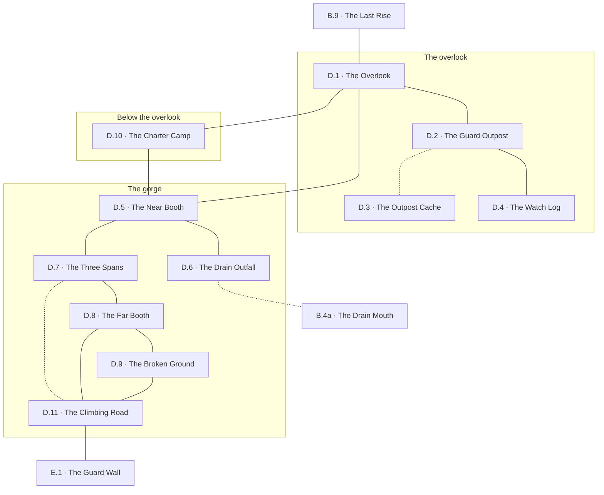

# `D River Crossing`

**Classification:** WILD · **Difficulty Die:** d8 · **Tags:** First Sight of the Peaks, Toll Bridge, Watched Overlook

*Region file. Companion to the Drakenhold Setting Outline and the Setting Relational Diagram. Tables are authored at the location-stub pass (procedure step 7); location stubs, outlines and the region relational diagram follow in the engineer phase.*

---

**Overview:** A checkpoint that rewards stopping. The region works equally as five minutes for a party in a hurry and half a session of information for one that searches, and the difference is entirely player choice. An overlook holds an old dwarven outpost with a hidden cache, its dead and its logbook; below it an ancient stone bridge crosses the river with a guard booth at each end, the far one manned by hobgoblins who prefer coin to blood. The first view of the three peaks with the crater in the second is a set piece and should be given room to land. The toll is negotiable; a party that decides to take the bridge outright is picking a fight they can plausibly win and a feud they will carry all module. The Grellick Charter is camped in good order below the overlook, watching whoever comes up the road.

**Ambiance:** Open sky for the first time in days. The overlook is windy, scrub-grown, littered with cut stone. Below, the river runs fast and brown through a gorge, and the bridge over it is dwarven work — three spans, no mortar, still true after a thousand years while the paved highway leading to it has gone entirely to ruin. North across the valley stand the three peaks, and the crater in the second is visible from here.

**Layout:** An elevated overlook with an old dwarven guard outpost on it, the bridge and its two guard booths in the gorge below, and a rough stone road climbing north from the far bank toward the gates of the Outer City. The Grellick Charter's camp sits below the overlook. The near booth is empty; the far one is manned.

**Features:** The overlook itself and its sightlines, which are worth an hour of anyone's time. The outpost — its cache, its dead and its logbook. The bridge and the toll, which is negotiable, and the hobgoblins prefer coin to blood. The first full view of Drakenhold, which is a set piece and should be given room to land.

**Dangers:** The toll, and what happens if it is refused. Hobgoblins hold the far booth in discipline, with sentries who stay awake and a camp to fall back on. A party that takes the bridge outright is picking a fight it can plausibly win and a feud it will carry all module.

**Creatures:** Hobgoblins at the far booth and in the broken ground beyond it, disciplined and commercial. The Grellick Charter below the overlook, twelve strong and in good order, watching whoever comes up the road and entirely willing to hire the party as guides and then renegotiate the split.

**Secrets:** The outpost's cache, still where it was left. Its logbook, which records the last weeks before the descent from the outside looking in. Its dead, who died facing the wrong direction. From the overlook, in the right light, the state of the Skybridge is readable across the valley.

**Treasure:** The outpost cache — dwarven gear, preserved. Whatever the hobgoblins have accumulated in tolls, if a party goes that way.

---

## CONNECTIONS

*Authored against the Setting Relational Diagram. Edge types: open, gated by tile, gated by rod, hidden, secret, vertical, one-way, conditional on restored mechanism, conditional on faction relation.*

- **B Ironwood Trail** — open. South-east.
- **E Girkel, the Outer City** — conditional on faction, then open. The far booth is manned and the toll is negotiable; the road climbs north from the far bank. *Amended at step 8: the toll is the price of the bridge, not of the region. The old course of the ruined highway (`D.7`–`D.11`, hidden) comes up past the booth for anyone the goblins have told about it, and it is priced — see the region diagram.*
- **The overlook and its outpost** — open, elevated. Within-region.
- **The bridge and its two booths** — open, in the gorge below. Within-region.

## LOCATION STUBS

*Procedure step 7. Code, name and three thematic tags per location. The working note under each is scaffolding for step 8. The region works as five minutes for a party in a hurry and half a session for one that searches, and the stub list is built so that both are true.*

**The overlook**

### `D.1 The Overlook` — First Sight of the Peaks, Wind and Cut Stone, Give It Room
*Working note: the set piece. Three peaks across the valley with the crater open in the second, and in the right light the state of the Skybridge is readable from here. Worth an hour of anyone's time and the module should not hurry it.*

**Connections:** `B.9` the last rise, south-east where the canopy breaks · `D.2` the guard outpost, on the height itself · `D.5` the near booth, down the switchbacks into the gorge · `D.10` the Charter camp, below the overlook on the road.

### `D.2 The Guard Outpost` — Dwarven Work, Held Too Long, Facing the Wrong Way
*Working note: the shell. Its dead died facing inland rather than at the bridge — killed by something coming down the road out of the hold, not by anything crossing the river. The party can see this long before it can explain it, and the explanation is in the cache below.*

**Connections:** `D.1` the overlook · `D.4` the watch log, in the guardroom where it was kept · `D.3` the outpost cache — **hidden**, sealed, and it is what explains the dead.

### `D.3 The Outpost Cache` — Sealed, Preserved, Nobody Came Back For It
*Working note: dwarven gear in condition, the region's honest treasure, and it costs a search rather than a fight.*

***One piece of the artifact is here**, carried out by a runner who got this far and was cut down by his own people at the door. It is the second of only two pieces outside the mountain and it is unremarkable to look at — a party will take it for a curio and carry it four regions before anything tells them otherwise. The corpse it came off is one of the dead facing inland.*

**Connections:** `D.2` the guard outpost above — **hidden**. Sealed thirty years and opened by a search, not a fight.

### `D.4 The Watch Log` — The Last Weeks, From Outside Looking In, Names and Dates
*Working note: the descent recorded by people who could see the mountain and not the inside of it. The outside world's account, and it stops mid-week.*

**Connections:** `D.2` the guard outpost. The log is where it was left and nothing is hiding it.

**The gorge**

### `D.5 The Near Booth` — Empty Thirty Years, Doors Off Their Hinges, Nobody's Ground
*Working note: unmanned and useful. A dry place to camp within sight of the toll, which is a decision with consequences.*

**Connections:** `D.1` the overlook, up the switchbacks · `D.7` the three spans, west along the bank · `D.6` the drain outfall, below the near bank · `D.10` the Charter camp, back up the road.

### `D.6 The Drain Outfall` — Below the Near Bank, Silt and Cut Stone, Under the Toll
*Working note: where B.4a comes out. Clearing the culvert at B.4 opens a route onto the near bank that bypasses the bridge entirely — a small, cheap, permanent choice made two regions ago paying off here. It does not cross the river; it lands a party where the hobgoblins are not looking, and the crossing still has to be made.*

**Connections:** `D.5` the near booth, up the bank · `B.4a` the drain mouth under the culvert on the Ironwood Trail — **hidden**, and it comes out on the near bank. It does not cross the river.

### `D.7 The Three Spans` — No Mortar, Still True, A Thousand Years
*Working note: dwarven engineering as plain argument. The paved highway leading to it has gone entirely to ruin and the bridge has not moved.*

**Connections:** `D.5` the near booth, at the near end · `D.8` the far booth, at the far end · `D.11` the climbing road — **hidden**. The old course of the ruined highway runs below the modern road on broken rock above fast water and comes up past the booth. Single file, hands needed, worse in the wet. The goblins at `C` know it and will trade it.

### `D.8 The Far Booth` — Manned Again, Sentries Awake, A Price Not a Fight
*Working note: hobgoblins in discipline. The toll is negotiable and they prefer coin to blood, and taking the bridge outright is a fight the party can plausibly win and a feud it carries all module.*

**Connections:** `D.7` the three spans, back across · `D.9` the broken ground, their camp behind them · `D.11` the climbing road, north.

### `D.9 The Broken Ground` — Hobgoblin Camp, Fallback, Arithmetic of Force
*Working note: where the far booth retreats to and where its numbers actually are. Scouting it before negotiating changes the negotiation.*

**Connections:** `D.8` the far booth · `D.11` the climbing road, which passes within sight of the camp.

**Below the overlook**

### `D.10 The Charter Camp` — Twelve Strong, Good Order, Watching the Road
*Working note: the Grellick Charter. Mules, tackle, two mercenary swords and a surveyor, entirely willing to hire the party as guides and then renegotiate the split. They are missing a surveyor and will not raise it first.*

**Connections:** `D.1` the overlook above · `D.5` the near booth, down the road. The camp sits on the road and a party coming off the overlook passes it.

### `D.11 The Climbing Road` — North From the Far Bank, Rough Stone, The Gates Visible
*Working note: the run-out to E. The Outer City's ruin becomes legible on the walk up, before the party is inside it.*

**Connections:** `D.8` the far booth, south · `D.9` the broken ground, east and watching · `D.7` the three spans by the old course — **hidden** · `E.1` the guard wall at Girkel, north up the rough stone.

## TABLES

**Encounter** — d6, rolled on each failed Difficulty roll, resolving in the next watch. Not forced; may be signs, tracks or a meeting at distance. Ascending.

| d6 | Encounter |
|---|---|
| 1 | **The Toll Enforced.** A hobgoblin file comes off the far booth in ranks, having decided the party is a debt rather than a customer. They give terms once. |
| 2 | **A Raid Forming.** The broken-ground camp is mustering for Thornhaven, and the party is between it and the road. Warning the town is a four-day walk and a real cost. |
| 3 | **Charter Business.** Grellick men on the road with mules, or the surveyor's replacement asking the party questions about the Ironwood that are really questions about the missing man. |
| 4 | **Something Coming Down the Road.** A crew going the other way — fewer than went up, carrying less than they hoped, and unwilling to say which peak. |
| 5 | **Weather Off the Peaks.** Wind down the valley, then rain. The overlook becomes useless and the bridge becomes slick, and the hobgoblins go indoors. |
| 6 | **The Mountain Shows Itself.** Cloud lifts off the second peak. The crater, the Skybridge, and for a moment something moving on the span. Sign only, and it is worth more than any of the above. |

## REGION RELATIONAL DIAGRAM

*Procedure step 8. Drawn from the stubs, before the location outlines. Reconciled against the finished outlines before the region closes. The diagram is authoritative: the **Connections:** field under each stub is checked against it, never the reverse.*

**Reading the diagram.** Solid edges are open — walked, in daylight, in the open, watched from at least one direction. Three edges are dotted and hidden: the sealed cache inside the outpost (`D.2`–`D.3`), the drain onto the near bank (`D.6`–`B.4a`), and the old course under the far booth (`D.7`–`D.11`), which is described below.

**What the drawing found.**

- **The express route is one chain and it is five nodes long.** `D.1`→`D.5`→`D.7`→`D.8`→`D.11`. A party in a hurry crosses the region in five minutes and every one of those five is on the direct line, which is what makes the five-minute reading honest rather than a claim. Everything that rewards stopping — `D.2`, `D.3`, `D.4`, `D.6`, `D.9`, `D.10` — hangs off that chain by one edge and none of it is on the way to anything. The half-session reading is bought entirely by leaving the line, and the region never asks anyone to.
- **The toll's answer that is not the toll was already sold, and now it is drawn.** `C`'s Secrets and the goblin toll party on `B`'s Encounter table both promise that *the goblins know the safe passage past the far booth and will trade it*. That promise had no route behind it. It does now: the ruined highway's **old course**, the original approach the three spans were built to serve, which runs below the modern road on broken rock above fast water and comes up onto `D.11` past the booth. Single file, hands needed, worse in the wet. It is priced the way the rule requires — it lands a party on the far bank with the hobgoblins between them and the bridge, so getting *in* free means getting *out* by paying anyway, by fighting, or by going back down it in the dark. The goblins know it because they use it, and the hobgoblins cannot watch it from a lit booth at night. This is the fourth thing the camps at `C` are worth and the first one the party can verify.
- **The drain lands short, deliberately.** `B.4a`→`D.6` puts a party on the near bank where nobody is looking, and the near bank is the side they were already on. The culvert cleared two regions ago pays off as position, not as passage — the river still has to be crossed. That is the whole of its value and it is enough: `D.6` touches only `D.5`, so what it buys is arriving at the near booth unobserved.
- **`D.11` has three ways onto it and that is the region's pressure.** The booth (`D.8`, paid), the old course (`D.7`, hidden and priced), and the broken ground (`D.9`, which is the hobgoblin camp). Every route to the Outer City passes within sight of hobgoblins who have or have not been paid, which is why scouting `D.9` before negotiating changes the negotiation — the party is pricing the fallback, not the booth.
- **`D.2` is the only way to the outpost's two answers.** `D.3` and `D.4` are both leaves on it. The dead facing inland are the question, the log is the outside account that stops mid-week, and the cache is the thing that explains the dead — and a party that walks past the shell gets none of the three. The cache is hidden and the log is not, so the outpost gives up its question before its answer to anyone who does stop.
- **`D.10` sits on the road, not off it.** The Charter camp touches `D.1` and `D.5`, which means the party passes it coming down off the overlook whether or not they want to. The Charter is unavoidable and the surveyor they are missing is not raised by them, which only works if the meeting happens by default.

**Route ends recorded.** Three edges leave region D. `B.9`–`D.1` and `B.4a`–`D.6` were drawn at B's step 8 pass and are reciprocated here unchanged. `D.11`–`E.1` is the climbing road onto the Outer City's guard wall; `E` has not been worked at step 8 and the edge is recorded in the handoff for reconciliation at its pass. **`E.1` now carries two roads** — this one and the goblin scavenger track ratified out of `C.5` — which is E's to reconcile, not D's.
