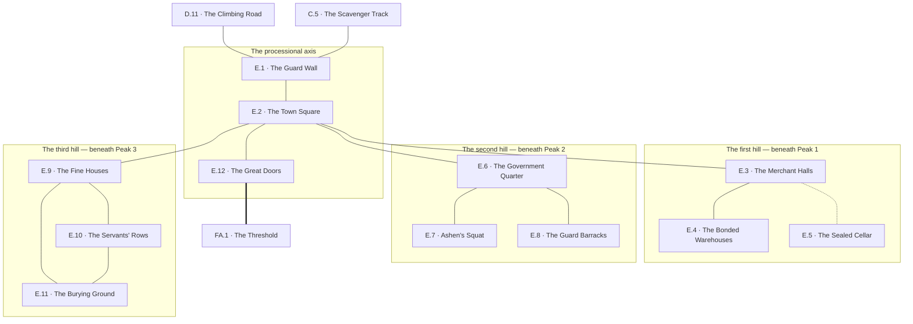

# `E Girkel, the Outer City`

**Classification:** WILD · **Difficulty Die:** d8 · **Tags:** Ruined Sprawl, Three Quarters, Scavenger Ground

*Region file. Companion to the Drakenhold Setting Outline and the Setting Relational Diagram. Tables authored at the location-stub pass (procedure step 7); location outlines written at step 9, with the region diagram reconciled against them.*

---

**Overview:** Ruined sprawl on three wide hills, and the module's first taste of scale. The three hills answer to the three peaks above them — trade houses and merchant halls beneath Peak 1, the government quarter and the guard beneath Peak 2, and beneath Peak 3 the sprawl of the wealthy middle class and of those who served the hold without being counted among its citizens. The destruction is total and deliberate on the module's part: it hand-waves the tedious apparatus a real city needs while leaving the information and the riches intact, scattered and genuinely hard to navigate. Only interesting buildings are described; the rest is conveyed procedurally, and finding the interesting ones is the region's actual work. Three hazard channels run at all times — wolves after dark, kobold scavenging parties by day, structural collapse whenever. Ashen's Crew squat in the government quarter. The great stone doors of the hold stand broken open at the far end, lying in ruins around their own threshold.

**Ambiance:** Wide streets choked with fallen masonry, three hills of it. Dwarven stonework on a human scale, built for a population that traded with the hold rather than lived in it, and burned. Rain has done thirty years of work on everything the fire left, and grass has come up in every joint of every paved surface in the city. At night the wolves start, and the sound carries across all three hills.

**Layout:** Three wide hills, slightly elevated against the Ironwood to the west and south, each answering to a peak above it — trade houses and merchant halls beneath Peak 1, the government quarter and the guard beneath Peak 2, the sprawl of the wealthy middle class and of those who served the hold without being counted among its citizens beneath Peak 3. A guard wall, barracks and a town square. Only interesting buildings are described; the rest is conveyed procedurally, and finding the interesting ones is the region's work. The great stone doors of the hold stand broken open at the far end.

**Features:** Navigation, which is the honest challenge — the destruction is total and deliberate, hand-waving the apparatus a real city needs while leaving the information and the riches intact, scattered and genuinely hard to find. **The city is signed throughout in two scripts and most of the signs are still standing**, so the difference between searching Girkel and wandering it is a thing the party earned three regions ago and is not told it needs. Only landmarks are written; everything between them is conveyed procedurally, and three standing hazard channels run under all of it rather than a room-by-room threat.

**Dangers:** Three channels, running at all times and belonging to no single location. Wolves after dark, in packs, across all three hills — their den and the hour they keep it are at the location that holds them. Kobold scavenging parties by day, who will run rather than fight. Structural collapse at any hour, and **the buildings worth entering are the ones least likely to hold**, which is worst where the salvage is heaviest and is priced there.

**Creatures:** `Wolf` in packs after dark, `Kobold` foraging by day in numbers and going home through the doors, and `Delver` — Ashen's seven, in the government quarter, written at the squat they hold. Nothing native to this city is left alive in it. Everything a party meets in Girkel either came out of the mountain or came up the road behind them.

**Secrets:** Nothing in this city is locked and nothing in it is guarded; what hides things here is scale, and the fact that nobody has looked properly in thirty years. Three things are worth finding and each is one turn off the axis — the correspondence between the hills and the peaks, which is public and cut on a post; the records of who left the hold and what they were carrying; and an intact cellar under a burned house that nothing marks from the street. All three are held at the locations that hold them.

**Treasure:** Scattered and real — household goods, merchant stock, coin in the places people hid coin. **Nothing concentrated except by weight**: the two finds worth carrying out of this region are a shed full of metal that needs mules and a cellar full of plate that does not, and both are on the same hill so that the party has to choose. The city rewards method over luck and never says so.

---

## CONNECTIONS

*Authored against the Setting Relational Diagram. Edge types: open, gated by tile, gated by rod, hidden, secret, vertical, one-way, conditional on restored mechanism, conditional on faction relation.*

- **C Goblin Camps** — open. The scavenger track, two days east through the wood, entering by one of the four breaches in the guard wall. It does not pass the crossing at D.
- **D River Crossing** — open, back down the road south.
- **FA Takdun** — open. The great stone doors of the hold, broken and lying around their own threshold, at the far end. **This is the only opening to the outside world in the entire hold.**

## LOCATION STUBS

*Procedure step 7 for the code, name and three thematic tags; **procedure step 9 for the outlines below them.** Each location carries a Player's Overview in the player register, a Referee Overview in the referee register, and the features the location contains. Feature detail is written at step 10. The step-7 working notes have been absorbed into the two Overviews and struck. **Only landmark buildings are stubbed.** The rest of Girkel is conveyed procedurally — the destruction is total and deliberate, and finding the interesting places among it is the region's actual work.*

**The approach**

### `E.1 The Guard Wall` — Breached in Four Places, Human Scale, Nothing Held Here
*Player's Overview: The wall is not much of a wall. Twelve feet of grey block, well cut and well laid, running away east and west further than you can follow it, and it has been broken through in four places. The stone out of the breaks is lying outside the line of it, spread in fans across the ground, as though each gap had been pushed rather than beaten. The gate stands open. The bar is still in its brackets, drawn back, where somebody left it on an ordinary evening. And through the gaps and over the top there is a city — streets going up three low hills, the roofs gone off all of it, and it goes on, and on, and it is larger than anywhere any of you has ever stood.*

**Referee Overview:** The city wall: twelve feet, two miles of circuit, dwarven-cut stone laid at human scale for a population that traded with the hold rather than lived in it. Four breaches — the south gate, where the climbing road from `D.11` arrives, and three collapses, of which the eastern one is where the goblin scavenger track from `C.5` comes in. **In all four the fallen stone lies outside the line of the wall.** Entry is trivial from any direction and the wall's whole job is to hand the party the scale of what is in front of them before they are inside it.

**Features:**

* **Nothing Held Here:** no arrowheads in the ground, no dead in the gaps, nothing piled to block them, and the gate bar drawn back in its brackets. Girkel was not besieged and nobody defended it. **Why nobody defended it is on a sheet of paper at `E.8`**, and a party that walks in through an undefended breach has the question two hours before it has the answer.
* **The Stone Fell Outward:** all four fans lie outside the wall. Whatever went through this line went through it from the inside, and nothing came the other way. **The module never says what did it.** Every piece of evidence a party can reach in this region points the same direction and every one of them stops short of a name.
* **Girkel:** the gate-stone, cut in the square hand and repeated in trade tongue below — *gir* and *kel*, the gate-stone, and the distances to the hold and to the crossing in tally strokes. **This is where the script the waystones taught stops being lore and becomes a map**: this city is signed at every corner, most of the signs are still standing, and the party can read them.
* **Which Breach a Party Comes In By:** decided by the road it took. The gate for anyone off the crossing; the eastern collapse for anyone who came west through the wood, which is the one the goblin salvage files use and the reason they get in and out of a walled city unseen.
* **Exits:** the climbing road down to the crossing, south -> `D.11` · the scavenger track east into the wood, two days -> `C.5` · the gate road up to the square, north -> `E.2`

**Connections:** `D.11` the climbing road up from the river crossing, south · `C.5` the scavenger track in from the wood, two days east — the goblins use the same breach · `E.2` the town square, up the gate road.

### `E.2 The Town Square` — Three Roads Meet, A Dry Fountain, Where the Hills Divide
*Player's Overview: The gate road opens into a square big enough for a market and the crowd that came to it, paved edge to edge in fitted stone with grass in every joint. In the middle stands a fountain — a wide basin, a carved column, four spouts — and it is dry, and it has been dry long enough that a birch has come up out of the basin and is taller than a man. Four ways leave the square besides the one you came in by. Three of them climb, one to each of the three hills. The fourth runs straight on and does not climb at all, and at the end of it, framed by the street the way a picture is framed, is the black slot in the mountain. At the head of each of the three climbing roads there is a stone post with square letters cut into it.*

**Referee Overview:** Two hundred feet across, at the crossing of the gate road and the processional. **The city's only hub and the only place in Girkel where all three hills are legible at once.** The first hill's road climbs west, the second hill's north, the third hill's east, and the processional runs north-west to the doors. Everything else in the city is reached from here or is found by accident. The three posts at the road-heads are the region's key and they are standing in the open.

**Features:**

* **The Three Posts:** each carries the word for *toward* — the root the waystones taught at `B.2` — and the name of the hall it points at. **Takdun. Grathdun. Thaldun.** Trade, judgement, gathering; the first, second and third peaks; the first, second and third hills. **This is the secret the region turns on and it is cut on a post at a crossroads.** A party that reads it searches Girkel on purpose for the rest of the module and knows which quarter to walk into when it wants records, or metal, or names. A party that cannot read it searches at random, and the module never once tells them there was a difference.
* **The Dry Fountain:** four spouts, a conduit, and no water in thirty years. The city's water came down out of the mountain, and when the hold stopped, this stopped. **Girkel did not only burn. It was cut off from the thing it was for**, and the birch in the basin is how long ago.
* **How the City Is Run From Here:** *(Referee)* work outward from the square, quarter by quarter, and convey the ground between procedurally — roofless shells, streets choked to the knee, the three hazard channels. Only the landmarks are written. Finding them is the region's actual work and the posts are what turns it from wandering into searching.
* **Sightlines:** the one open ground in the city. Wolves cross it and do not linger in it; anything watching a party here has to do it from the edge, and a party that wants to be seen or wants to see is standing in the right place.
* **Exits:** the gate road, south -> `E.1` · the first hill's road, west -> `E.3` · the second hill's road, north -> `E.6` · the third hill's road, east -> `E.9` · the processional, straight on north-west to the doors -> `E.12`

**Connections:** `E.1` the guard wall, back down the gate road · `E.3` the merchant halls, the first hill's road · `E.6` the government quarter, the second hill's road · `E.9` the fine houses, the third hill's road · `E.12` the great doors, straight on up the processional. Three roads meet the axis here and each climbs a hill that served a peak.

**The first hill — beneath Peak 1**

### `E.3 The Merchant Halls` — Trade Floors, Burned Stock, Weights Still Set
*Player's Overview: Three long halls stand open to the sky in a row, their columns still up and their roofs entirely gone, and the floors inside are ash a foot deep with shapes slumped in it that used to be bales and barrels and stacked cloth. Everything soft here burned and everything hard here ran. At the end of the nearest floor there is a stone bench, and on the bench a set of scales — the beam level, the chains sound, and the little squared weights still sitting in the near pan where somebody left them.*

**Referee Overview:** The commercial heart of the first hill and the place the city's coin was counted rather than kept: money went downriver or up the road the same week it was taken. Three trade floors, open and burned out, with the counting rooms behind them under a lower roof that partly survived. House-marks are cut over every door on this hill and most are still legible. Nothing on the floors is worth carrying. Everything this hill is worth is in the rooms behind them, in the sheds above them, and under a house in the streets at their back.

**Features:**

* **The Weights Still Set:** the standard weights fixed by the Guild Compact, in a merchant's own pan, and they are true ones. Light, portable, and worth carrying for the rest of the campaign: a party holding the hold's own standard can weigh dwarven metal against it every time somebody quotes a price, in Thornhaven, at a booth, or in front of something in the dark that wants to trade.
* **The Counting Rooms:** ledgers charred at the edges and legible in the middle, kept house by house and street by street. Read as accounts they are dull. Read as a map they are the difference between searching this city and ransacking it — they say who was rich, what they dealt in, and which street they lived on. **They name the house at `E.5` without knowing there is anything under it.**
* **The Thornhaven Marks:** the partners' marks in the margins are the same marks cut into the door-frames of the shuttered trade houses at `A.7`. Six generations of it, in a ledger, in a burned room. A party that stood in that row and looked at the frontages recognises them without being told.
* **What the Fire Took:** cloth, grain, oil, hide, paper — the whole value of a trade floor. The metal survived and it is stacked up the hill in the bonded sheds, which is why nobody has ever robbed this building twice.
* **Exits:** the square, downhill east -> `E.2` · the bonded warehouses, further up the hill -> `E.4` · the streets behind the trade floors, and one burned house in them — **hidden** -> `E.5`

**Connections:** `E.2` the square · `E.4` the bonded warehouses, further up the hill · `E.5` the sealed cellar — **hidden**, under a burned house in the streets behind the trade floors.

### `E.4 The Bonded Warehouses` — Roof Beams Like Ribs, Stock Nobody Claimed, Collapse Risk
*Player's Overview: Four great sheds stand above the trade floors and the roof beams are still on three of them, bare, curved, evenly spaced, so that walking in under them is walking into a ribcage. The fourth shed is down: a heap of beam and slate with the shape of what it was still readable in it. Inside the standing three the bays are stacked to head height with crates and barrels and bar iron, and on a good many of the crates there is a lead seal on a wire, and the wires are not broken. The floor gives underfoot. Somewhere above you, unhurried, something in the roof moves and settles and stops.*

**Referee Overview:** The bonded warehouses: goods held under customs seal against duty, never released, never claimed. **This is real salvage in quantity and it is in the buildings least likely to hold.** Three sheds standing and one already down, with the standing three working on it. The region's third hazard channel is concentrated here and it is at its worst during exactly the activity the treasure requires — levering, stacking, hauling and shifting weight around inside a building that has been holding its breath for thirty years.

**Features:**

* **What Is Actually In Them:** bar iron, nails and fittings by the barrel, tools in grease, unworked dwarven metal by weight. Unglamorous, worth a great deal downriver, and priced in mules rather than in slots. **It is the largest quantity of value in the approach and the party cannot carry it**, which is the honest form of the argument the whole module is about.
* **The Unbroken Seals:** the crates nobody opened. Girkel was robbed once, by people on foot who were frightened, and what they left is what they could not lift. That reading is available in one glance here and it is true of every quarter in the city.
* **The Fourth Shed:** the one that is down shows what the other three are doing. *(Referee)* the collapse result on the Encounter table lands here by preference, and a party that props, spreads its weight and works one bay at a time has genuinely bought its way out of it.
* **The Charter's Whole Season:** this is exactly what the Grellick Charter came up the road for, they have the mules and the tackle for it, and they do not yet know which sheds. A party that met Halvard Grellick at `D.10` is holding something worth selling, and selling it puts twelve organised people and eight mules in this quarter for the rest of the campaign.
* **Exits:** the merchant halls, downhill -> `E.3`

**Connections:** `E.3` the merchant halls, downhill.

### `E.5 The Sealed Cellar` — Under a Burned House, Unlooted, Somebody Meant to Come Back
*Player's Overview: The house is one burned house in a street of burned houses and there is nothing about the front of it worth stopping for. In the back room the fire took the floor, and under the boards, under three feet of fallen slate, there is a slab with an iron ring in it. What is underneath is a barrel-vaulted cellar the width of the house, and it is dry, and it is full — chests and crates stacked in two rows with a clear aisle left down the middle of them so that everything could be carried straight back out again. There is a lamp on a bracket by the stair with oil still in it. Everything down here has been waiting thirty years for somebody to come back and fetch it.*

**Referee Overview:** An intact cellar under a burned house in the streets behind the trade floors, sealed by its own fallen roof rather than by anybody's care. **Hidden because nobody has looked, not because it was well hidden** — no mark on the house, no reason to pick this ruin out of a street of them, and thirty years of scavengers walking past the front door. Household wealth put away by people who expected to return, and the best single find on this hill. **One piece of the artifact is here.**

**Features:**

* **Packed For a Return:** plate, linen, coin in a stocking under a chest lid, a wedding chest, a child's shoes kept because they were the good ones. Portable, valuable, and packed by somebody methodical with an aisle left for the carrying out. Nobody came back, and the register at `E.6` says in one line why not.
* **The Piece:** among the goods, wrapped in a linen cloth that matches nothing else down here, a fitted piece of dark metal about the size of a hand — cold, heavy for its size, one edge broken, part of a cut pattern running off the break and stopping. Nothing here names it. **A party that also opened the strongroom at `D.3` is now carrying two of them, they are obviously the same kind of object, and that is the largest free clue in the module.** It is one of only two pieces that ever left the mountain.
* **Who Put It There:** the cloth is dwarven weave and the piece sits on top of a packed chest rather than inside one — added after the packing, by somebody who was not the family. A dwarf came down out of the hold, put it where nobody would look, and did not survive the year.
* **Finding It, and the Two Ways In:** the ledgers at `E.3` name the merchant houses street by street, and the register at `E.6` names who declared, left, and never came back — either one narrows a street of ruins to a house. For a party that reads ground rather than paper there is a physical cue and it costs nothing: after rain, the fallen floor at the back of this one ruin drains and the others stand in water.
* **Exits:** the streets behind the trade floors, up through the fallen floor — **hidden** -> `E.3`

**Connections:** `E.3` the merchant halls above — **hidden**. Sealed, never opened, and nothing marks the house from the street.

**The second hill — beneath Peak 2**

### `E.6 The Government Quarter` — Registry and Writ, Who Left and When, Squatted
*Player's Overview: The building is long and plain and built for queues, with a stone counter running the whole width of it and pigeonholes floor to ceiling behind, most of them empty and spilled. The floor is ankle-deep in leaves of scraped hide, and where the roof let go they have gone to grey pulp and mean nothing any more. At the north end, under a slab of fallen slate that came down whole, there is a block of them dry, stacked, and as sharp as the day they were written. Somebody has been in here since the last rain. There are boot-prints in the wet leaves, a lamp burned dry standing on the counter, and a sheaf of pages squared up neatly and left where anybody could take them.*

**Referee Overview:** The registry of the government quarter, and **the module's first big-picture account of what happened.** Clerks sat at this counter for three years writing down what people coming down the road out of the hold told them, and confiscating and itemising what those people were carrying, and none of them had any idea what they were writing. The dry block under the slate is the surviving third and it is the third that matters. **Ashen's seven are two streets away, they have already read it, and what they took out of it is visible in what is left.** Reading the block properly is a day's work and a party can carry the useful part.

**Features:**

* **The Register of Departures:** name, house, date, and what was carried, kept daily. Read whole it is the shape of a hold emptying — a trickle in the years after the Ban, a flood in the season of the Breaking, and a last surge thirty years ago that runs for six days and then stops. The names of families that never arrived at the counter are as informative as the ones that did.
* **The Statements:** frightened people describing the inside of the mountain to a clerk who wrote it all down without ranking any of it. Contradictory, partial, first-hand, and **the only account of the inside that exists outside it.** This is where the rumours a party bought in Thornhaven get tested: some of them are here in the mouths of people it happened to, and some of them are flatly contradicted by three separate statements taken in different months.
* **The Confiscation Ledger, and the Empty Racks:** everything taken at the gate, itemised and shelved and never sent up — including **carved stone tiles**, counted by the dozen, racked in the back room and left there. The racks are still in the back room and they are empty. **Nothing here says what a tile does.** The ledger only proves that they were ordinary enough to be counted, and that everything on those shelves walked out of this building at some point in thirty years. A party that has seen the attics at `A.7`, or the flat grey stone on a goblin chief's throat, now knows where such things come from.
* **Two Objects Nobody Could Name:** among the confiscations, two entries and no more, taken in different months off dwarves who would not explain them, and described the only way a clerk could describe them — by weight, by size, by colour, and by the broken edge. **Two came out of the mountain and no more, and this ledger is the proof of it.** A party carrying one from `D.3` or `E.5` has just learned it is carrying something; a party carrying both is holding the count. The module never performs the subtraction and neither does the clerk.
* **What Ashen Took:** the dry block is in order except for one gap — the statements taken from the third peak's people, pulled out and gone, with everything either side of them still stacked square. Seven people are two streets from here and two of them read the script.
* **Exits:** the square, downhill -> `E.2` · Ashen's squat, two streets in -> `E.7` · the guard barracks, the next building up the same road -> `E.8`

**Connections:** `E.2` the square · `E.7` Ashen's squat, fortified inside the quarter itself · `E.8` the guard barracks, the next building up the same road.

### `E.7 Ashen's Squat` — Seven of Them, Two Who Read Runic, One Rod
*Player's Overview: One building on this street has a roof, and the roof is other people's slate, laid on properly. Its ground-floor windows are filled with rubble stacked rather than thrown. There is a barricade of cart timber across the door with a gap in it the width of one person. A cord runs across the street at ankle height with tins hung on it. Something is cooking. On the upper floor a shutter is open and somebody is sitting in it watching you come up the road, and they do not move when you look at them, and they do not go and fetch anybody either.*

**Referee Overview:** Seven `Delver` holding a fortified house two streets inside the government quarter. **Ashen** leads them: no charter, no patience, and one score in mind large enough that she never has to come back. Two of the seven read runic script and have spent a month on the registry at `E.6`. One of those two carries a House rod nobody has identified and he will not part with it. They are Neutral toward the party — rivals are competitors, and information is worth trading — **and they turn to open hostility without warning the moment they believe the party is ahead of them**, which is a belief a party controls more than it realises.

**Features:**

* **Ashen:** quick, direct, and entirely without margin. Everything she has is spent and the only way out of that is through the doors and up. She will talk, trade, drink and walk beside a party for as long as she believes she is in front. She does not threaten, she does not posture, and nothing about the way she behaves before she turns is different from the way she behaves after.
* **The Rod:** House tier, precious metal, cut with runes, and they have tried it on every door and fitting in this quarter for a month. **It has never answered anything, because House rods open House things and there are none in Girkel.** They do not know that. A party that works it out has learned what rods are and how they are graded before the mountain teaches it, and it has learned it by watching somebody else fail.
* **The Clock, Which Does Not Stop:** *(ratified)* they are here when the party arrives — **rumour 14 runs ahead of the fact** and they have not been up there a month. **But they go, on a schedule the Referee advances whether or not the party engages.** They are going for the third peak. Where they have got to when they are met is a function of how long the party took in Girkel and on the road, and they can be raced, beaten, followed or caused. **They are the ones who will open the wrong vault.**
* **What They Will Trade:** information, for information, and nothing else. They want the way in, what the doors open onto, and anything the party learned on the road. They will read aloud from the third peak's statements rather than hand the pages over.
* **Letting Somebody Else Open the Door:** their standing tactic is to follow competence at a distance and take the room after. **A party that is visibly effective in this city has acquired an escort it did not hire**, and the first place it will notice is somewhere it cannot afford the distraction.
* **Exits:** the government quarter and the registry, out to the road -> `E.6`

**Connections:** `E.6` the government quarter, which they hold.

### `E.8 The Guard Barracks` — Armoury Stripped, Muster Rolls, Where the Wolves Den
*Player's Overview: A long hall with sleeping niches cut down both walls and an armoury at the far end, and the racks in the armoury are standing empty and straight, every peg still in place. The far third of the floor is a foot deep in dry grass and hide and bone. You smell it from the doorway. The stone of the threshold has been worn shiny down the middle in a way that stone does not wear on its own, and there are scores on both door jambs at about the height of your knee. There is one door. You can see the whole hall from it, and everything in the hall can see the door.*

**Referee Overview:** The city guard's barracks, uphill of the registry on the same road. One door and no second way in or out. **A pack of nine `Wolf` dens at the far end of the hall.** By day the pack is out across the three hills and the building is empty; from dusk it is theirs, and so is the road outside it. The orderly room is immediately inside the door and holds the muster rolls, which is the only thing in this building worth the walk.

**Features:**

* **The Muster Rolls:** the guard's strength by name, taken monthly, in a fair hand. The last roll is dated the week of the descent and it is two-thirds short — the strength had already gone up the road ahead of it, as escort and as labour for people carrying their households out of a mountain. **This is why nothing held at the wall**, and a party that came in through an undefended breach at `E.1` and wondered about it is holding the answer.
* **The Armoury, Stripped In Order:** racks emptied by number, pegs labelled, nothing thrown down and nothing left broken. Men took their own gear off their own pegs and walked out. Looters do not leave a room like this and the difference is visible from the doorway.
* **The Den and the Hour:** nine of them, out by day, in by dark. Walking in at noon costs nothing. Being anywhere in this quarter at dusk is the most reliable way in the region to be killed by something that has no opinion about you at all. **One door**, and the pack comes in through the one there is.
* **Almost Nothing Worth Taking:** the rolls are paper, and they are the best single fact in Girkel. That is the whole yield of the building and the module is content with it.
* **Exits:** the government quarter and the registry, downhill -> `E.6`

**Connections:** `E.6` the government quarter, downhill. The wolves have it after dark and there is no second way in.

**The third hill — beneath Peak 3**

### `E.9 The Fine Houses` — Wealthy Middle Class, Small Reminders, Picked Over Once
*Player's Overview: The third hill is streets of good houses, tall and narrow and close together, and the roofs are gone off all of them so that you look down into the rooms from the stairs as you climb. In the first one there is a table with plates still on it and the chairs pushed back and away. In another there is a child's wooden cart standing in the middle of the floor with nothing else in the room at all. In a third the front door is barred on the inside, and the window at the back of the house is broken outward, with the glass lying in the yard.*

**Referee Overview:** The quarter of the wealthy middle class, human, and the closest thing in the region to a portrait of the people who lived here. Roofless, wet, and structurally poor. **Picked over once, thirty years ago, in a hurry, by people on foot**: coin and small silver are gone, plate was left standing where it stood, and nothing in a floor, a wall or a chimney has been touched since. Rooms are described by the party's searching rather than by the module — only the hill is written, and the houses on it are conveyed procedurally.

**Features:**

* **The Interruptions:** a table laid, a cart in an empty room, a door barred from the inside and a window forced outward from the inside. Every house on this hill left in a different way and none of them left in an orderly one, and the module does not join them up for anybody.
* **Picked Over Once, In a Hurry:** what is gone and what is not is a readable list, and the list says the looters were on foot, frightened, and never came back. **Girkel has not been methodically robbed in thirty years**, which is the whole reason it is still worth robbing and is the region's best argument for method.
* **Where People Actually Put Things:** under a hearthstone, in the wall void beside a chimney, in the joist space over a door, in the well. Three houses searched properly out-earn thirty walked through, and this is the hill where a party learns which of the two it is doing.
* **The Third Hill's Stones:** the boundary posts on this hill name **Thaldun**, and a party that read the posts at the square already knows which peak these families' living came from before it opens a single door. Later, when it matters which peak a name belongs to, this is where the party learned to ask.
* **Exits:** the square, downhill west -> `E.2` · the servants' rows, behind and below the houses -> `E.10` · the burying ground, out past the houses east -> `E.11`

**Connections:** `E.2` the square · `E.10` the servants' rows, behind and below the fine houses · `E.11` the burying ground, out past the houses.

### `E.10 The Servants' Rows` — Those Who Were Never Counted, Plain and Dense, Nothing Taken
*Player's Overview: Behind the fine houses and below them the streets change. The houses get small, and identical, and there are a great many of them — one room down and one up, doors straight onto the street, not a scrap of carving on anything. And nothing in them has been taken. There are cups on the shelves. There are beds in the corners. There is a pair of shoes by a door, set together and pointing the way shoes are set by somebody who means to put them on in the morning. On every doorpost, cut small and neat at the height of a hand, there are names. A few are in the square letters. Most are in a plainer scratched hand. Some posts carry four or five, one under the other, going down.*

**Referee Overview:** Where the underclass lived outside the hold — the servants, staff and slaves who kept it running and were never counted among its citizens. Denser than the rest of Girkel several times over and physically the poorest ground in the region. **Nothing has been taken because nobody thought there was anything in it, and there is not — except the names.** No wealth, no hazard, no faction, and the quietest and most valuable single thing in the approach.

**Features:**

* **The Doorposts:** every household cut its own name at its own door, because nothing else recorded it. Read along a street they are a census of exactly the people the registry two hills over does not contain, and the names underneath are the generations that lived in the same room. **It is the only list of the hold's underclass that exists anywhere**, and it is written on doorframes because it was never allowed to be written anywhere else.
* **Why It Is Worth Carrying:** a handful of dwarves who served the hold are still alive in the servants' passages of all three peaks. They have been hunted for thirty years, they will not treat with anybody twice until they have watched them once, and they were given no crypt, so they bury their own where they can. **A party that can name a survivor's family, and say where those families lie, is offering the only thing anybody has offered them in thirty years that was not a demand.** Nothing in the module states this connection and nothing should; it is available to anyone who copies the doorposts and later meets somebody who has been hiding for a very long time.
* **Nothing Taken:** cups, beds, shoes. The looters walked these streets, judged them, and did not stop. That judgement is thirty years old and it is still legible in the fact that a shelf of crockery survived a sacked city.
* **Plain and Dense:** several thousand people lived on this ground, in a city whose registry counted the other kind. *(Referee)* the arithmetic is the point, and a party that does it has a different idea of what Drakenhold was before it ever goes inside.
* **Exits:** the fine houses, uphill -> `E.9` · the burying ground, at the end of the rows -> `E.11`

**Connections:** `E.9` the fine houses, uphill · `E.11` the burying ground, at the end of the rows.

### `E.11 The Burying Ground` — Human Rites, Dwarven Stones Reused, Thirty Years Untended
*Player's Overview: The rows run out and the ground opens into a field of stones standing in grass up to your waist, and the field goes on for acres. The stones are grey dwarven block, squared and re-cut, and the names on them are human names, and the grass has laid itself over most of them. Go round behind one and there are older letters on the back of it, running the wrong way up, cut deeper and better than the name on the front.*

**Referee Overview:** The city's burying ground: human rites, in ground, marked with dwarven stone salvaged from wherever it could be got. Untended thirty years and heavily overgrown; walking it takes a day and reading it takes two. **There is nothing here.** No dead that rise, no guardian, no lock — and the region has put its least defended ground around the thing nobody thought was worth taking, one region after a farmstead where the dead came up out of the floor when they were robbed. **The contrast is deliberate.** A party will approach this field carefully and the module will let it, and then nothing will happen.

**Features:**

* **Reused Stones:** dwarven blocks turned and re-cut, and both faces readable. The older face is never a grave inscription — it is building text, a lintel, a door head, a course out of a wall — so the stones say what they used to be before they say who is under them. The whole city was built out of the mountain's offcuts and this is where that stops being architecture and starts being a habit.
* **The Last Rows:** dated, and they stop inside a week of one another thirty years ago. After that there is one short row, cut hurriedly and much worse, and then nothing at all. Nobody was left to bury anybody, and the field records the exact week the city stopped.
* **Where Thornhaven's Refugees Came From:** the family names here are the family names on the name-stones in the gallery under the Ketter farmstead at `A.18`. **The people who kept walking are buried four days south and the ones who did not get out of this valley are here**, and a party that dug at the farmstead recognises this ground without being told. It is the only confirmation the module offers and it costs nothing but having paid attention two regions ago.
* **Past the Last Stone:** where the cut stones run out the graves do not. Mounds, a peg with a scratch on it, or nothing — the rows at `E.10` buried their people here too, in the part of the field that got no salvage. Being able to tell somebody, later and underground, where their family lies begins here.
* **Exits:** the fine houses, uphill -> `E.9` · the servants' rows, back along the end of them -> `E.10`

**Connections:** `E.9` the fine houses · `E.10` the servants' rows. The hill can be walked in any order and nothing on it is guarding anything.

**The threshold**

### `E.12 The Great Doors` — Broken Open, Lying Around Their Own Threshold, Ten Years Silent
*Player's Overview: The processional runs a mile straight at the mountain without climbing and without bending, and it ends in a cut in the rock face wide enough for eight carts abreast. Where the cut becomes a doorway there are two doors lying on the ground. They are twenty feet high. They are lying outward, on the road, in three pieces each, and the pins are still in their edges with the sockets torn out of the stone around them. Past them the doorway is open, and black, and taller than any tree you have stood under, and out of it comes cold air, steadily, smelling of stone and old burning. In the dust across the threshold there are tracks. Every one of them is small and three-toed. Some go in and some come out and there are a great many of them, and there is nothing else in the dust at all.*

**Referee Overview:** The great doors of Drakenhold, broken open and lying around their own threshold, and **the only opening to the outside world in the entire hold.** Thirty feet of frame, twenty feet of leaf, and the hinge sockets torn out of the jamb stone. Cold air moves outward at all hours and does not vary with the weather, because it is not weather — the hold breathes, and `FA.1` is where a party feels the same draught from the other side of it. The tracks are `Kobold` scavenging parties in both directions, daily. Nothing else uses this door, and nothing has come out of it in ten years.

**Features:**

* **Which Way They Fell:** outward, onto the road, sockets torn out of the stone. These doors were not battered in. They went out. **The module does not say what did it** — and the fans of rubble outside the wall at `E.1`, the short muster roll at `E.8` and this all point the same direction and every one of them stops short of a name.
* **Kelmordun, and the Hammer Gate:** the frame carries the hold's name and the door's own name, cut deep and repeated in trade tongue below. **This is the Hammer Gate**, one of the three the last waystone at `B.8` names as though a traveller would need to know which to use, and it is the one standing open. Nothing here says where the other two are and the stone does not point at them.
* **The Draught:** cold, steady, outward, and old. A party that holds a flame at the threshold has the direction for nothing, and a party that thinks about what a draught that size means has the first hint of how much mountain is on the other side of this hole.
* **The Threshold Traffic:** kobold prints, in and out, fresh daily, and no other kind. **They are the first evidence a party has that something inside is alive, organised, and entirely unafraid of the door** — and they are also an argument: something small walks out of that mountain every morning and walks back in, and it does not have to fight its way past anything to do it.
* **Ten Years of Nothing:** rumour 2 is right and the reason it frightens people is correct. Nothing has come out. *(Referee)* the *Something Came Out* result on this region's table is the one exception and it should be used once, at the threshold, as sign only.
* **The Last Line:** everything past this point is DANGEROUS and nothing in the module announces it. What announces it is the size of the doorway, the cold coming out of it, and the fact that the doors are lying on the outside.
* **Exits:** the processional back to the square, south-east -> `E.2` · the threshold, through twenty feet of broken door -> `FA.1`

**Connections:** `E.2` the square, straight back down the processional · `FA.1` the threshold, through twenty feet of broken door. **This is the only opening to the outside world in the entire hold.**

## TABLES

**Encounter** — d6, rolled on each failed Difficulty roll, resolving in the next watch. Not forced; may be signs, tracks or a meeting at distance. Ascending.

| d6 | Encounter |
|---|---|
| 1 | **The Pack, After Dark.** Wolves in numbers across open ground, testing footing and count before committing. The city has no doors left that close. |
| 2 | **Collapse.** The floor, the roof, or the street. Whatever the party was standing on was the interesting building for a reason. |
| 3 | **Ashen's Crew, Following.** Seen or unseen, at the Referee's option. They let someone competent open the door and then take the room. |
| 4 | **A Kobold Scavenging Party.** A dozen, loaded, heading for the doors. They will run rather than fight and they will trade, and they are the party's first sight of anything living from inside the hold. |
| 5 | **Something Came Out.** Fresh sign at the threshold going outward, and not kobold. Nothing to fight. A great deal to think about. |
| 6 | **The City Gives Something Up.** A street sign, a house mark, a quarter boundary — the key to which hill served which peak, handed over by attention rather than by luck. |

## REGION RELATIONAL DIAGRAM

*Procedure step 8. Drawn from the stubs, before the location outlines. **Reconciled against the finished outlines at step 9; this is the reconciled diagram and it is the deliverable.** The diagram is authoritative: the **Connections:** field under each stub is checked against it, never the reverse.*

**Reading the diagram.** Solid edges are open street — the destruction is total and nothing in Girkel is locked, which is why the region's difficulty is search and not passage. The one dotted edge is `E.3`–`E.5`, the sealed cellar, which is hidden because nobody has found it in thirty years and not because anyone hid the entrance well. The heavy edge `E.12`═`FA.1` is the great doors, broken open, and it is the only opening to the outside world in the entire hold. **It is drawn undirected**, because the doors are broken open and pass both ways, and this is the one edge in the module where a reader mistaking emphasis for direction would conclude that a party can get in and not out.

**What the drawing found.**

- **The region is an axis with three hills hung off its middle.** `E.1`–`E.2`–`E.12` is one straight line: the gate road, the square, the processional way to the doors. A party that stops for nothing walks Girkel in three nodes and learns nothing, and the module lets them. Everything the city knows — the registry, the cellar, the rows, the burying ground — is off the axis by at least one turn. This is the same shape as `D` and it is doing the same job one scale larger: the region rewards stopping and never requires it.
- **`E.2` is the only hub and it is the only place the map is legible.** Five edges: the gate road, the three hill roads, the way on to the doors. The stub's claim that a party working out here which quarter served which peak searches efficiently for the rest of the module is now structural rather than asserted — three roads leave the square, one per hill, one per peak, and the correspondence is visible from the fountain in a way it is visible from nowhere else in the city.
- **The hill holding the module's big-picture account is the hill held by its most hostile faction.** `E.6` carries both `E.7` and `E.8`. Ashen's seven squat the government quarter itself, and the barracks the wolves den in are the next building on the same road. There is no route to the registry that does not pass one or the other, and the obvious answer — go at night, when Ashen sleeps — hands the party `E.8` at the worst hour. The gate is not a door and its answer is not a second door; it is the choice of which of two hostile things to accept, and both are priced.
- **The third hill is a loop with nothing guarding it.** `E.9`–`E.10`–`E.11` close on each other and can be walked in any order, and it is the only cluster in the region with no faction, no monster and no lock. It is also where the quietest evidence in the region sits — the names and routes of people the official record does not contain, and the confirmation of where the refugees came from. The module puts its least defended ground around the thing nobody thought was worth taking. That is the point and it is not stated anywhere a player can read it.
- **`E.5` is hidden off `E.3`, not off `E.4`.** The sealed cellar is under a merchant's own house behind the trade floors, not among the bonded stock — household wealth put away by somebody who counted coin for a living and expected to come back for it. The warehouses are the loud treasure that argues with encumbrance; the cellar is the quiet one, and they are on the same hill so the party must choose what to carry.
- **`E.1` carries two roads.** `D.11` up from the crossing, and `C.5` in from the east by the scavenger track. Both land at the same breached wall and both give the same first impression of scale. What differs is what the party is carrying when they arrive: the road from `D` comes with the watch log, the outpost cache and an outside account of the descent, and the goblin track comes with none of it. The registry at `E.6` is the first place that gap becomes visible, and the module never points at it.

**What the outlines found, and what the reconciliation changed.**

- **No edge was added, moved or retyped, and in this region that is a statement about what the diagram is for.** Girkel is open street: physically a party can walk from any ruin to any other and the graph could be drawn as a mesh in which everything touches everything. **Drawing it that way would be a lie about the region**, because passage here costs nothing and finding costs everything. The diagram is a graph of the twelve places worth arriving at and of the roads that lead to them, and the honest reading of a solid edge in `E` is *this is a route a party can be told about or can work out*, not *this is the only way through*. The step-8 drawing already said the difficulty is search and not passage; the outlines are what made that a rule for reading the picture.
- **The key came out of the ground and onto a post.** The stubs asserted that a party working out which quarter served which peak searches efficiently for the rest of the module, and nothing carried the assertion. It is now three stone posts at the three road-heads in `E.2`, each cut with *toward* and a hall-name — Takdun, Grathdun, Thaldun — using only roots the waystones taught at `B.2`, `B.5` and `B.8`. **The city's secret is public, standing at its hub, and legible to anybody who did the reading on the road in.** The boundary stones on the hills repeat it, so a party that missed the square can still arrive at it sideways.
- **`E.1` and `E.8` are one question and one answer two streets apart.** The wall is breached in four places with the stone lying outside the line and nothing was ever piled in the gaps; the last muster roll in the barracks is two-thirds short because the guard went up the road ahead of the evacuation. Neither location states the other's half. **J3 is satisfied by construction rather than by adding a clue**, and the same is true of the sealed cellar, whose two clues are the ledgers at `E.3` and the register at `E.6` and whose third is a wet floor that drains.
- **What Ashen took is worth more than what she left.** `E.7` is a location a party may never enter and `E.6` is one they almost certainly will, so the crew's month in the registry is written as a gap in the stacked pages — the third peak's statements pulled and gone, everything either side of them square. **The rival is legible from inside the room they robbed**, which means the clock is visible to a party that never knocks on their door.
- **The two pieces are now a pair.** `D.3` and `E.5` hold the only two that left the mountain and each is written to be unremarkable on its own. Held together they are obviously the same kind of object, and the confiscation ledger at `E.6` names two and no more. **Three things a party can be carrying at the same time, in one region, and the module still never performs the subtraction.**
- **The quietest ground in the region is the only ground that pays inside the mountain.** `E.10`'s doorposts are the only list of the hold's underclass in existence, and the survivors in the servants' passages of all three peaks are the people it names. Nothing in `E` states the connection and nothing in the peaks may state it either: it belongs to a party that copied doorposts in a slum out of curiosity and met somebody underground who had been hiding for thirty years.

**Route ends recorded.** Three edges leave region E. `D.11`–`E.1` was drawn at D's step 8 pass and is reciprocated here unchanged. `C.5`–`E.1` is the scavenger track, ratified after C's pass and written here at both ends. `E.12`═`FA.1` is the great doors; **`FA` has not been worked at step 8 and the edge is not written into `FA`.** Recorded in the handoff for the first-level block's pass. `FA.1` is named here because the setting diagram fixes the doors as the hold's only outside opening and `FA` is where they land.

**The approach closes here.** `A` through `E` are now drawn end to end, and the whole road in is one connected graph with two branches off it — the camps at `C`, which rejoin at `E.1`, and the drain from `B.4a`, which rejoins at `D.6`. Every region beyond this point is inside the mountain.

**Amended at step 9:** `FA` has since been drawn and `E.12`═`FA.1` is written at both ends, undirected in both diagrams, so the thread the handoff carried open since the approach closed is shut. **Step 9 now closes the approach a second time**, in prose rather than in edges: `A` through `E` all carry finished outlines, and the next pass at this step is the first-level block. What that block inherits from `E` is written below.

**What the mountain inherits from this region.** Four things, all of them carried in a party's hands or head rather than in an edge. **The count** — two objects out and no more, proved at `E.6`, against seven broken at `HE`. **The clock** — Ashen's seven leave for the third peak on the Referee's schedule from the moment the party reaches Girkel, and `PEAK_3_BLOCK` owns where they have got to. **The names** — the doorposts at `E.10` and the ground past the last stone at `E.11`, which are what the survivor pockets in the servants' passages of all three peaks will actually answer to. **And the draught** — cold air moving outward at `E.12`, which `FA.1` already describes from the inside and which is the same air.
