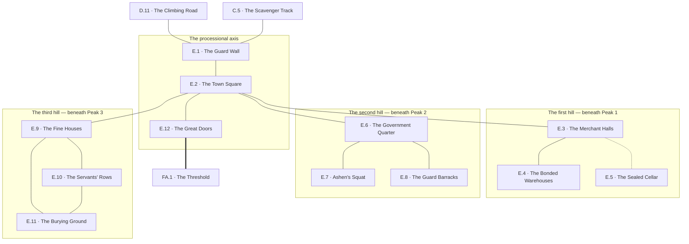

# `E Girkel, the Outer City`

**Classification:** WILD · **Difficulty Die:** d8 · **Tags:** Ruined Sprawl, Three Quarters, Scavenger Ground

*Region file. Companion to the Drakenhold Setting Outline and the Setting Relational Diagram. Tables are authored at the location-stub pass (procedure step 7); location stubs, outlines and the region relational diagram follow in the engineer phase.*

---

**Overview:** Ruined sprawl on three wide hills, and the module's first taste of scale. The three hills answer to the three peaks above them — trade houses and merchant halls beneath Peak 1, the government quarter and the guard beneath Peak 2, and beneath Peak 3 the sprawl of the wealthy middle class and of those who served the hold without being counted among its citizens. The destruction is total and deliberate on the module's part: it hand-waves the tedious apparatus a real city needs while leaving the information and the riches intact, scattered and genuinely hard to navigate. Only interesting buildings are described; the rest is conveyed procedurally, and finding the interesting ones is the region's actual work. Three hazard channels run at all times — wolves after dark, kobold scavenging parties by day, structural collapse whenever. Ashen's Crew squat in the government quarter. The great stone doors of the hold stand broken open at the far end, lying in ruins around their own threshold.

**Ambiance:** Wide streets choked with fallen masonry, three hills of it. Dwarven stonework on a human scale, built for a population that traded with the hold rather than lived in it, and burned. Roof beams stand like ribs. Rain has done thirty years of work on everything the fire left. At night the wolves start, and the sound carries across all three hills.

**Layout:** Three wide hills, slightly elevated against the Ironwood to the west and south, each answering to a peak above it — trade houses and merchant halls beneath Peak 1, the government quarter and the guard beneath Peak 2, the sprawl of the wealthy middle class and of those who served the hold without being counted among its citizens beneath Peak 3. A guard wall, barracks and a town square. Only interesting buildings are described; the rest is conveyed procedurally, and finding the interesting ones is the region's work. The great stone doors of the hold stand broken open at the far end.

**Features:** Navigation, which is the honest challenge — the destruction is total and deliberate, hand-waving the apparatus a real city needs while leaving the information and the riches intact, scattered and genuinely hard to find. Abandoned residences with small reminders of daily life. The square. The barracks. Three standing hazard channels rather than a room-by-room threat.

**Dangers:** Wolves after dark, in packs, across all three hills. Kobold scavenging parties by day, who will run rather than fight. Structural collapse at all hours, and the buildings worth entering are the ones least likely to hold.

**Creatures:** Wolves, Kobolds foraging in numbers, and Ashen's Crew squatting in the government quarter — seven of them, two who can read runic script, one carrying a House rod he cannot identify, all of them hostile the moment they believe the party is ahead of them.

**Secrets:** Which quarter served which peak, which is the key to searching the city efficiently rather than at random. Records in the government quarter naming who left, when, and carrying what. At least one intact cellar under a burned house, sealed and unlooted.

**Treasure:** Scattered and real — household goods, merchant stock, coin in the places people hid coin. Nothing concentrated. The city rewards method over luck.

---

## CONNECTIONS

*Authored against the Setting Relational Diagram. Edge types: open, gated by tile, gated by rod, hidden, secret, vertical, one-way, conditional on restored mechanism, conditional on faction relation.*

- **C Goblin Camps** — open. The scavenger track, two days east through the wood, entering by one of the four breaches in the guard wall. It does not pass the crossing at D.
- **D River Crossing** — open, back down the road south.
- **FA Takdun** — open. The great stone doors of the hold, broken and lying around their own threshold, at the far end. **This is the only opening to the outside world in the entire hold.**

## LOCATION STUBS

*Procedure step 7. Code, name and three thematic tags per location. The working note under each is scaffolding for step 8. **Only landmark buildings are stubbed.** The rest of Girkel is conveyed procedurally — the destruction is total and deliberate, and finding the interesting places among it is the region's actual work.*

**The approach**

### `E.1 The Guard Wall` — Breached in Four Places, Human Scale, Nothing Held Here
*Working note: the city wall, thrown down rather than stormed. Entry is trivial and the wall's job is to tell the party the scale of what is in front of them.*

**Connections:** `D.11` the climbing road up from the river crossing, south · `C.5` the scavenger track in from the wood, two days east — the goblins use the same breach · `E.2` the town square, up the gate road.

### `E.2 The Town Square` — Three Roads Meet, A Dry Fountain, Where the Hills Divide
*Working note: the orientation point and the only place in the city where all three hills are legible at once. A party that works out here which quarter served which peak searches efficiently for the rest of the module; a party that does not searches at random.*

**Connections:** `E.1` the guard wall, back down the gate road · `E.3` the merchant halls, the first hill's road · `E.6` the government quarter, the second hill's road · `E.9` the fine houses, the third hill's road · `E.12` the great doors, straight on up the processional. Three roads meet the axis here and each climbs a hill that served a peak.

**The first hill — beneath Peak 1**

### `E.3 The Merchant Halls` — Trade Floors, Burned Stock, Weights Still Set
*Working note: the commercial heart, and where the city's coin was counted rather than kept.*

**Connections:** `E.2` the square · `E.4` the bonded warehouses, further up the hill · `E.5` the sealed cellar — **hidden**, under a burned house in the streets behind the trade floors.

### `E.4 The Bonded Warehouses` — Roof Beams Like Ribs, Stock Nobody Claimed, Collapse Risk
*Working note: real salvage, badly stored, in the buildings least likely to hold. Volume treasure that argues with encumbrance.*

**Connections:** `E.3` the merchant halls, downhill.

### `E.5 The Sealed Cellar` — Under a Burned House, Unlooted, Somebody Meant to Come Back
*Working note: intact, sealed and never opened. Household wealth hidden by people who expected to return, and the best single find on this hill.*

***One piece of the artifact is here**, hidden among the household goods by a dwarf who came down out of the hold, put it where nobody would look, and did not survive the year. One of only two pieces that ever left the mountain.*

**Connections:** `E.3` the merchant halls above — **hidden**. Sealed, never opened, and nothing marks the house from the street.

**The second hill — beneath Peak 2**

### `E.6 The Government Quarter` — Registry and Writ, Who Left and When, Squatted
*Working note: the records name who left the hold, in what year, and carrying what. This is the module's first big-picture account of what happened — the Breaking, the flight and the descent, set down by clerks who took statements from people coming down the road and had no idea what they were writing.*

*It is also where the artifact stops being a rumour. The register records confiscations and declarations at the gate, and among them are entries for objects nobody could name, taken off dwarves who would not explain them. Two such objects came out of the mountain and no more. One is in the cellar at E.5, the other went down the road toward the crossing with a runner who did not get past D.2. **Everything else the artifact was broken into is still inside the hold.***

**Connections:** `E.2` the square · `E.7` Ashen's squat, fortified inside the quarter itself · `E.8` the guard barracks, the next building up the same road.

### `E.7 Ashen's Squat` — Seven of Them, Two Who Read Runic, One Rod
*Working note: fortified, watched, and hostile the moment they believe the party is ahead. The House rod they carry is unidentified and they will not part with it.*

**Connections:** `E.6` the government quarter, which they hold.

### `E.8 The Guard Barracks` — Armoury Stripped, Muster Rolls, Where the Wolves Den
*Working note: the wolves hold it after dark, which makes the muster rolls a night-or-day decision.*

**Connections:** `E.6` the government quarter, downhill. The wolves have it after dark and there is no second way in.

**The third hill — beneath Peak 3**

### `E.9 The Fine Houses` — Wealthy Middle Class, Small Reminders, Picked Over Once
*Working note: domestic detail, human and specific. Interrupted meals, a child's toy, a door barred from inside. Picked over once, thirty years ago, in a hurry.*

**Connections:** `E.2` the square · `E.10` the servants' rows, behind and below the fine houses · `E.11` the burying ground, out past the houses.

### `E.10 The Servants' Rows` — Those Who Were Never Counted, Plain and Dense, Nothing Taken
*Working note: where the underclass lived outside the hold. Nobody looted it because nobody thought there was anything in it, and there is — not wealth, but the names and the routes of people the official record does not contain.*

**Connections:** `E.9` the fine houses, uphill · `E.11` the burying ground, at the end of the rows.

### `E.11 The Burying Ground` — Human Rites, Dwarven Stones Reused, Thirty Years Untended
*Working note: the counterpart to the farmstead at A, and confirmation of where the refugees at A.18 came from.*

**Connections:** `E.9` the fine houses · `E.10` the servants' rows. The hill can be walked in any order and nothing on it is guarding anything.

**The threshold**

### `E.12 The Great Doors` — Broken Open, Lying Around Their Own Threshold, Ten Years Silent
*Working note: the only opening into the hold. Twenty feet of dwarven door lying in pieces where they fell, and nothing has come out of them in ten years, which ought to frighten a party more than if something had.*

**Connections:** `E.2` the square, straight back down the processional · `FA.1` the threshold, through twenty feet of broken door. **This is the only opening to the outside world in the entire hold.**

## TABLES

**Encounter** — d6, rolled on each failed Difficulty roll, resolving in the next watch. Not forced; may be signs, tracks or a meeting at distance. Ascending.

| d6 | Encounter |
|---|---|
| 1 | **The Pack, After Dark.** Wolves in numbers across open ground, testing footing and count before committing. The city has no doors left that close. |
| 2 | **Collapse.** The floor, the roof, or the street. Whatever the party was standing on was the interesting building for a reason. |
| 3 | **Ashen's Crew, Following.** Seen or unseen, at the Referee's option. They let someone competent open the door and then take the room. |
| 4 | **A Kobold Scavenging Party.** A dozen, loaded, heading for the doors. They will run rather than fight and they will trade, and they are the party's first sight of anything living from inside the hold. |
| 5 | **Something Came Out.** Fresh sign at the threshold going outward, and not kobold. Nothing to fight. A great deal to think about. |
| 6 | **The City Gives Something Up.** A street sign, a house mark, a quarter boundary — the key to which hill served which peak, handed over by attention rather than by luck. |

## REGION RELATIONAL DIAGRAM

*Procedure step 8. Drawn from the stubs, before the location outlines. Reconciled against the finished outlines before the region closes. The diagram is authoritative: the **Connections:** field under each stub is checked against it, never the reverse.*

**Reading the diagram.** Solid edges are open street — the destruction is total and nothing in Girkel is locked, which is why the region's difficulty is search and not passage. The one dotted edge is `E.3`–`E.5`, the sealed cellar, which is hidden because nobody has found it in thirty years and not because anyone hid the entrance well. The heavy edge `E.12`═`FA.1` is the great doors, broken open, and it is the only opening to the outside world in the entire hold. **It is drawn undirected**, because the doors are broken open and pass both ways, and this is the one edge in the module where a reader mistaking emphasis for direction would conclude that a party can get in and not out.

**What the drawing found.**

- **The region is an axis with three hills hung off its middle.** `E.1`–`E.2`–`E.12` is one straight line: the gate road, the square, the processional way to the doors. A party that stops for nothing walks Girkel in three nodes and learns nothing, and the module lets them. Everything the city knows — the registry, the cellar, the rows, the burying ground — is off the axis by at least one turn. This is the same shape as `D` and it is doing the same job one scale larger: the region rewards stopping and never requires it.
- **`E.2` is the only hub and it is the only place the map is legible.** Five edges: the gate road, the three hill roads, the way on to the doors. The stub's claim that a party working out here which quarter served which peak searches efficiently for the rest of the module is now structural rather than asserted — three roads leave the square, one per hill, one per peak, and the correspondence is visible from the fountain in a way it is visible from nowhere else in the city.
- **The hill holding the module's big-picture account is the hill held by its most hostile faction.** `E.6` carries both `E.7` and `E.8`. Ashen's seven squat the government quarter itself, and the barracks the wolves den in are the next building on the same road. There is no route to the registry that does not pass one or the other, and the obvious answer — go at night, when Ashen sleeps — hands the party `E.8` at the worst hour. The gate is not a door and its answer is not a second door; it is the choice of which of two hostile things to accept, and both are priced.
- **The third hill is a loop with nothing guarding it.** `E.9`–`E.10`–`E.11` close on each other and can be walked in any order, and it is the only cluster in the region with no faction, no monster and no lock. It is also where the quietest evidence in the region sits — the names and routes of people the official record does not contain, and the confirmation of where the refugees came from. The module puts its least defended ground around the thing nobody thought was worth taking. That is the point and it is not stated anywhere a player can read it.
- **`E.5` is hidden off `E.3`, not off `E.4`.** The sealed cellar is under a merchant's own house behind the trade floors, not among the bonded stock — household wealth put away by somebody who counted coin for a living and expected to come back for it. The warehouses are the loud treasure that argues with encumbrance; the cellar is the quiet one, and they are on the same hill so the party must choose what to carry.
- **`E.1` carries two roads.** `D.11` up from the crossing, and `C.5` in from the east by the scavenger track. Both land at the same breached wall and both give the same first impression of scale. What differs is what the party is carrying when they arrive: the road from `D` comes with the watch log, the outpost cache and an outside account of the descent, and the goblin track comes with none of it. The registry at `E.6` is the first place that gap becomes visible, and the module never points at it.

**Route ends recorded.** Three edges leave region E. `D.11`–`E.1` was drawn at D's step 8 pass and is reciprocated here unchanged. `C.5`–`E.1` is the scavenger track, ratified after C's pass and written here at both ends. `E.12`═`FA.1` is the great doors; **`FA` has not been worked at step 8 and the edge is not written into `FA`.** Recorded in the handoff for the first-level block's pass. `FA.1` is named here because the setting diagram fixes the doors as the hold's only outside opening and `FA` is where they land.

**The approach closes here.** `A` through `E` are now drawn end to end, and the whole road in is one connected graph with two branches off it — the camps at `C`, which rejoin at `E.1`, and the drain from `B.4a`, which rejoins at `D.6`. Every region beyond this point is inside the mountain.
