# `FA Takdun, Peak 1 Main Level Trade Hall`

**Classification:** DANGEROUS · **Difficulty Die:** d10 · **Tags:** Burnt Tapestries, Eerie Quiet, The Hold's Own History

*Region file. Companion to the Drakenhold Setting Outline and the Setting Relational Diagram. Tables are authored at the location-stub pass (procedure step 7); location stubs, outlines and the region relational diagram follow in the engineer phase.*

---

**Overview:** The way in, and the hold's own account of itself. A 300-foot hall that once carried brightly coloured tapestries proclaiming the greatness of Drakenhold, now legible only in fragments where the fire did not reach — those fragments are the module's primary delivery of its own history and should be read as a text rather than described as scenery. Kitchens and support rooms run off it, built to feed the entire hold. The hall opens rearward into a domed antechamber holding the stairwell down to FB and the great ramp up to FC, and off that antechamber run the mouths of the Peak 1 servants' passages — a mess of veins and arteries with no single route through them. The Processional of the Living runs east from here to GA. Its job is orientation: it is large, quiet, mostly safe, and it teaches a party to read walls.

**Ambiance:** Cold air moving outward past the party — the hold breathes. A 300-foot hall under a vaulted ceiling, floor swept clean by three decades of that draught. Tapestry fragments hang in charred strips where the fire did not reach the high corners, still bright in places. Everything is quiet in the specific way of a room built for thousands of voices.

**Layout:** The great hall runs 300 feet from the broken doors to a domed antechamber at its rear, with the kitchens and their support rooms opening off the north side, built to feed the whole hold. The antechamber holds the stairwell down to FB and the great ramp up to FC, and the mouths of the Peak 1 servants' passages. The Processional of the Living runs east from the hall toward GA. A large region — the hall and kitchens are a fraction of it, and the passages are most of it.

**Features:** The tapestry fragments, which are the module's primary delivery of its own history and should be read as a text. The kitchens, industrial in scale and full of the interrupted work of a hundred people. The servants' passages, which are the region's true body: a labyrinth of narrow ways with a few major runs connecting themed zones — the kitchen service warren, sculleries and cold stores, the bunk warrens of the kitchen staff, the porters' and haulers' quarters, the dry-goods stores, and the tally rooms where deliveries were logged. Two or three main highways connect the zones; everything else is capillary. It was built for people who had it memorised and it does not help anyone else.

**Dangers:** The hall itself is quiet. The passages are not — they are largely empty space with pockets of real danger and real reward, and the danger is that a party gets deep into them and cannot find its way back out the way it came.

**Creatures:** Little standing in the hall. Kobold foragers pass through. Dwarven Survivors are in the passages and will not be found unless they choose it; this is their ground and they have been on it for thirty years.

**Secrets:** What the tapestries say once assembled, including two panels that were cut down rather than burned. The passages hold the survivors' caches, their buried dead, and at least one route that bypasses a gate above. A kitchen service chute runs down to FB.

**Treasure:** Modest in the hall. Real in the passages, in pockets — thirty years of things carried in and never carried out.

---

## CONNECTIONS

*Authored against the Setting Relational Diagram. Edge types: open, gated by tile, gated by rod, hidden, secret, vertical, one-way, conditional on restored mechanism, conditional on faction relation.*

- **E Girkel** — open. The broken doors, west.
- **GA Grathdun** — open. The Processional of the Living, east.
- **Servants' passages** — open. Mouths at the domed antechamber, and they run to Peaks 2 and 3.
- **FB Brankel** — vertical, the stairwell down from the antechamber.
- **FC Mekdun** — vertical, the great ramp up from the antechamber.
- **FB Brankel** — hidden, vertical, one-way. A kitchen service chute.
- **FC Mekdun** — secret, from within the passages. A route that bypasses a gate above.
- **FB Brankel** — hidden, vertical, conditional on size. The vent gallery at FA.33 touches Khorven between the two levels. Reconciled at the Peak 1 block's step 8 pass; the block document always stated it and it was never an edge.
- **GA Grathdun** — gated by tile. The Long Run, at the seal. A whole carved tile, and it is four regions back on a goblin chief's neck.
- **GA Grathdun** — open. The Ash Run, lower and hotter, which is the way around the seal and arrives in the Peak 2 warren rather than at Peak 3.

## TABLES

**Danger** — d6, presented at 6 on entry, counting down one face with each failed Difficulty roll. Resets to 6 on leaving the region.

| d6 | Danger |
|---|---|
| 6 | **The hold breathes.** Cold air moving outward past the party, steady, from somewhere deeper than this level. Torches lean. Nothing else. |
| 5 | **Sign of the living.** A cache moved, a mark scraped off a wall, boot-dust that is not the party's. Somebody is on this ground and has been for a long time. |
| 4 | **The warren turns.** The run the party came in by does not answer the way it did. Time lost, direction lost, and the map is now wrong in a way nobody has noticed yet. |
| 3 | **Kobold foragers.** A file of them through the hall or up the chute, loaded, unwilling, and quick to bargain if they are met rather than cornered. |
| 2 | **Alone.** Whoever is furthest from a light finds the run behind them closed, or thinks it is. Separation, and the passages are built to make it stick. |
| 1 | **The way back is gone.** A collapse, a shut gate, or simply the wrong three turnings. The party is deep in the warren with no known route out and must solve movement before it solves anything else. |

## LOCATION STUBS

*Procedure step 7. Code, name and three thematic tags per location. The working note under each is scaffolding for step 8. Block-level material — the arteries, the seal, the survivor pockets and the room budget — lives in `FIRST_LEVEL_BLOCK.md`, which covers FA, GA and HA together because they share a warren.*

*Procedure step 7 for Peak 1's main level and its warren. 65 rooms budgeted; **34 are stubbed as locations** and the balance is unnamed fill inside the stated groupings — empty stores, collapsed bunks, dead-end capillaries, rooms that are only a corner turned. Negative space is the point and the fill is where a party spends its torches. Working notes are scaffolding for step 8.*

**The hall**

### `FA.1 The Threshold` — The Doors From Inside, Thirty Years of Draught, Nothing Came Out
*Working note: the great doors seen from the wrong side, in pieces around their own frame. Cold air moving outward past the party — the hold breathes, and this is where they feel it first.*

**Connections:** `E.12` the great doors, west, through twenty feet of broken door — **the only opening to the outside world in the hold** · `FA.2` the trade hall, east.

### `FA.2 The Trade Hall` — 300 Feet, Built for Thousands of Voices, Swept Clean
*Working note: the orientation room. Quiet in the specific way of a space built for crowds, floor swept by three decades of draught, and nothing standing in it.*

**Connections:** `FA.1` the threshold, west · `FA.3` the tapestry fragments, in the high corners · `FA.4` the weighing floor · `FA.5` the great kitchens, off the north side · `FA.12` the cut-down panels, in the sequence on the wall · `FA.13` the porters' gate, where the hall meets the warren · `FA.9` the domed antechamber, rearward · `FA.10` the Processional of the Living, east.

### `FA.3 The Tapestry Fragments` — Charred Strips in the High Corners, Still Bright, A Text Not a Decoration
*Working note: the module's primary delivery of its own history. Read as a text, assembled across several visits, and two panels were cut down rather than burned — by whom is the question the hall asks.*

**Connections:** `FA.2` the trade hall. High in it, and reached rather than walked to.

### `FA.4 The Weighing Floor` — Public Scales, Standard Weights, The Compact's Own Stones
*Working note: the tally-stones fixed by the Guild Compact nine hundred years ago are still the ones sitting in the pans. The oldest continuously used objects in the hold.*

**Connections:** `FA.2` the trade hall.

### `FA.5 The Great Kitchens` — Industrial Scale, Interrupted Mid-Work, A Hundred People's Jobs
*Working note: built to feed the entire hold, stopped in the middle of a service. The most human room in Peak 1 and the one that best sells what was lost.*

**Connections:** `FA.2` the trade hall · `FA.6` the bakehouse ranks · `FA.7` the cold stores · `FA.8` the service chute head · `FA.14` the kitchen tally post.

### `FA.6 The Bakehouse Ranks` — Cold Ovens, Banked Thirty Years, Vent Draw
*Working note: the ovens draw off the same vent system that feeds FD and FB. Relighting one is small, cheap and audible a long way off.*

**Connections:** `FA.5` the great kitchens.

### `FA.7 The Cold Stores` — Stone-Cut, Still Cold, Something Kept Its Own Way In
*Working note: still functioning as designed, which is the level's first proof that dwarven engineering did not stop when the dwarves did.*

**Connections:** `FA.5` the great kitchens.

### `FA.8 The Service Chute Head` — Down to FB, One-Way, Kobolds Below
*Working note: a fall, a route, and a listening post. What comes back up it is noise and smell rather than kobolds.*

**Connections:** `FA.5` the great kitchens · `FB.9` the chute bottom — **hidden, vertical, one-way**. A fall, not a route back.

### `FA.9 The Domed Antechamber` — The Junction, Stair and Ramp, Six Dark Mouths
*Working note: everything on Peak 1 goes through here. The passage mouths are unmarked, unequal in size, and there are more of them than a party expects.*

**Connections:** `FA.2` the trade hall, forward · `FB.1` the stairwell foot — **vertical**, down · `FC.1` the ramp landing — **vertical**, the great ramp up · `FA.15` the runners' ways · `FA.16` the Long Run. Six dark mouths, unmarked and unequal, and two of them are these.

### `FA.10 The Processional of the Living` — Cut Wide and Straight, The Hold in the Present Tense, Read or Be Caught
*Working note: six rooms' length of relief carving proclaiming the wealth and greatness of a hold that no longer exists, standing in its own ruin. Exposed the whole way and dangerous to anyone who crosses it wrongly. Secrets are cut into the walls for anyone who walks it as a reader rather than as a corridor.*

**Connections:** `FA.2` the trade hall, west · `FA.11` the founding panel, within the run · `GA.5` the Monument of the Driving Down, east, where the two Processionals meet.

### `FA.11 The Founding Panel` — Plainer, Older, No Clan Mark At All
*Working note: within the Processional. The oldest carving in Peak 1, in a hand that predates every clan in the hold, marked by nobody. The lineage whose name is nowhere written.*

**Connections:** `FA.10` the Processional, within it.

### `FA.12 The Cut-Down Panels` — Two Gaps in the Sequence, Clean Edges, Removed Not Burned
*Working note: within the hall. Somebody took these out with tools and time, after the fire, and carried them in two directions.*

*The first is with the survivors, in the warren, kept because it is the only surface in Drakenhold that records a deed of theirs — a thing the underclass did that the hold was glad of and never spoke about again. It is the most valuable thing they own and it is not worth a coin. The second went up: a Guild seat had it carried to FE, where it hangs in a private chamber for reasons that are about the guild rather than about the hold. Cross-referenced into FE at its location pass.*

**Connections:** `FA.2` the trade hall, gaps in the sequence on its wall.

### `FA.13 The Porters' Gate` — Where the Hall Meets the Warren, Worn Sill, Not for Citizens
*Working note: the widest passage mouth, and the honest one. Everything that fed the hall came through here and the floor shows it.*

**Connections:** `FA.2` the trade hall · `FA.15` the runners' ways. The widest mouth and the honest one.

### `FA.14 The Kitchen Tally Post` — Deliveries Logged, Names in Two Hands, Last Entry Unfinished
*Working note: the level's clock. The last entry stops mid-word and the date is the season of the Breaking.*

**Connections:** `FA.5` the great kitchens.

**The warren**

### `FA.15 The Runners' Ways` — Narrow, Fast, Built for People Who Knew
*Working note: the kitchen service warren proper. Hatches at hall level, ladders, and no room to fight in.*

**Connections:** `FA.9` the antechamber · `FA.13` the porters' gate · `FA.16` the Long Run · `FA.19` the scullery warren · `FA.21` the dry-goods stores · `FA.29` the watching place · `FA.32` the chute bottom access.

### `FA.16 The Long Run — Peak 1 Stretch` — The Great Artery, Straight for a While, Then Not
*Working note: the main lateral. It runs east toward the seal and it is the only passage in the warren wide enough for two abreast.*

**Connections:** `FA.9` the antechamber · `FA.15` the runners' ways · `FA.17` the seal, east · `FA.18` the Ash Run head · `FA.23` the porters' quarters · `FA.26` the bunk warrens · `FA.29` the watching place · `FA.34` the old digging — **hidden**, a course of plainer stone under the run.

### `FA.17 The Seal` — A Whole Tile Wanted, Shut Since the War, Nothing Passes
*Working note: the block's central lock. The receptacle is intact, the mechanism is sound, and the tile is on a goblin chief's neck four regions back. Behind it, people are living and listening.*

**Connections:** `FA.16` the Long Run, west · `GA.10` the sealed segment, east — **gated by tile**. A whole carved tile, and the mechanism is sound.

### `FA.18 The Ash Run Head` — Lower, Hotter, The Way Around
*Working note: where the F→G alternative begins. Narrower, fouler, longer, and it works.*

**Connections:** `FA.16` the Long Run · `GA.12` the Ash Run terminus in the Peak 2 warren. Lower, hotter, narrower, and it works.

### `FA.19 The Scullery Warren` — Water, Drains, Standing Damp
*Working note: the wettest ground on the level, and the only warren zone with a reliable water source.*

**Connections:** `FA.15` the runners' ways · `FA.20` the deep cold store, cut further in.

### `FA.20 The Deep Cold Store` — Cut Further In, Still Sealed, Provisions Thirty Years Held
*Working note: real supply for a party that can carry it, and a place worth basing out of.*

**Connections:** `FA.19` the scullery warren · `FA.33` the vent gallery.

### `FA.21 The Dry-Goods Stores` — Rank on Rank, Mostly Empty, Mostly
*Working note: procedural ground with pockets in it. This is the negative space the level is built on.*

**Connections:** `FA.15` the runners' ways · `FA.25` the tally rooms · `FA.22` Brannek's tally-niche — **hidden**, cut small among the ranks.

### `FA.22 Brannek's Tally-Niche` — A Name Cut Small, Opens to a Word, Nothing Inside
*Working note: **the payoff from A.20.** A stores clerk's personal niche, opened by speaking his name, holding a cup, a tally-stick and a child's carving. It is worth nothing and it proves the rule that names are keys, at the cheapest possible price. A party that laid him to rest at Thornhaven has been carrying the key for the whole approach.*

**Connections:** `FA.21` the dry-goods stores — **hidden**. It opens to a name spoken and to nothing else.

### `FA.23 The Porters' Quarters` — Bunks in Ranks, Personal and Poor, Left in a Hurry
*Working note: the underclass at home. Nothing valuable and a great deal that is specific.*

**Connections:** `FA.16` the Long Run · `FA.24` the haulers' yard.

### `FA.24 The Haulers' Yard` — Handcarts, Harness, Load Marks on the Wall
*Working note: the load marks map the warren by weight and destination, which is the closest thing to a map that exists down here.*

**Connections:** `FA.23` the porters' quarters · `FA.25` the tally rooms · `FA.34` the old digging — **hidden**, under the yard's own floor.

### `FA.25 The Tally Rooms` — Deliveries, Ledgers, Who Was Owed What
*Working note: the warren's records, and the only written account of the people the hold did not count.*

**Connections:** `FA.21` the dry-goods stores · `FA.24` the haulers' yard.

### `FA.26 The Bunk Warrens` — Dense, Dark, Thirty Years Undisturbed
*Working note: the largest single grouping and the emptiest. Depth and disorientation, not encounters.*

**Connections:** `FA.16` the Long Run · `FA.27` a survivor's cache · `FA.29` the watching place · `FA.31` the fallen run · `FA.30` the bypass — **hidden** · `FA.34` the old digging — **hidden**.

### `FA.27 A Survivor's Cache` — Water, Oil, Nothing Worth Killing For
*Working note: found before its owners are. How the party learns somebody is alive down here.*

*The Peak 1 pocket is three, and they are failing. They need food they cannot reach, light, and medicine for one of them who will not last another winter — all of which a party can simply provide, and providing it is the cheapest faction gain in the module. They will not leave. They have been offered the idea of leaving by their own for thirty years and they are more frightened of the Outer City than of the warren, which is not rational and is not arguable. They know more than they say about the hall above, the tapestries and the run east. And they are hiding something: in the first winter they walled a fourth of their number into one of the niches at FA.28, alive, over food. One of those niches is not a burial. They tend it anyway.*

**Connections:** `FA.26` the bunk warrens · `FA.28` the buried · `FA.29` the watching place.

### `FA.28 The Buried` — Cut Niches, No Crypt Was Given, Cared For
*Working note: the Peak 1 pocket's own dead, few and recent. Respect shown here is the whole of the negotiation that follows.*

**Connections:** `FA.27` a survivor's cache. Their ground, and nothing else opens onto it.

### `FA.29 The Watching Place` — Sightlines Down Three Runs, Recently Used, Empty When You Arrive
*Working note: they have been watching the party since FA.9. This is where from.*

**Connections:** `FA.15` the runners' ways · `FA.16` the Long Run · `FA.26` the bunk warrens · `FA.27` a survivor's cache. Sightlines down three runs and a way home off the fourth.

### `FA.30 The Bypass` — A Capillary That Should Not Reach, Comes Up Past a Gate on FC, The Warren's Standing Reward
*Working note: the warren's standing reward, and a real one. It arrives inside the gated craftsmen's areas on FC — the housing, the meeting rooms, the shrine and the private grievances, where the level's actual wealth sits behind the craftsmen's own locks rather than the guild's. A party that works the warren properly walks into the richest ground on Level 2 from behind, without touching the dispatch floor.*

**Connections:** `FA.26` the bunk warrens — **hidden** · `FC.15` the bypass mouth inside the craftsmen's areas — **secret**, and nothing was guarding that side.

### `FA.31 The Fallen Run` — Collapse, No Way Through, A Long Walk Back
*Working note: the level teaching its own lesson about depth. Nothing here. That is the content.*

**Connections:** `FA.26` the bunk warrens. Nothing through. That is the content.

### `FA.32 The Chute Bottom Access` — Where the Kitchen Chute Passes Through, Sound From Below, Heard as Well as Hearing
*Working note: a listening post onto FB and a way to be heard by kobolds.*

**Connections:** `FA.15` the runners' ways. The chute passes through the wall here; it is a listening post and not a way onto it.

### `FA.33 The Vent Gallery` — Air Moving, Warm From One Side, Down and Down
*Working note: the warren's contact with the vent system, and Peak 1's hidden descent toward J for anyone who follows it far enough.*

**Connections:** `FA.20` the deep cold store · `FB.4` Khorven, the vent chimney below — **hidden, conditional on size**. This is the warren's own way onto the shaft, and it goes down further than Peak 1.

### `FA.34 The Old Digging` — Plainer Cutting, No Clan Mark, Older Than the Warren
*Working note: the same hand as FA.11. The warren was cut through something already here, and nobody who worked down here ever mentioned it. It is not a location so much as a condition — small bits of wall and floor throughout the warren, a course of older stone under a doorway, a stretch of floor cut by someone else, surfacing in perhaps a dozen places for anyone who looks down. The layering is the reward and there is nothing at the end of it on this level.*

**Connections:** `FA.16` the Long Run · `FA.24` the haulers' yard · `FA.26` the bunk warrens — **hidden** at all three, and in perhaps a dozen places more. A condition rather than a room.

## REGION RELATIONAL DIAGRAM

*Procedure step 8. Drawn from the stubs, before the location outlines. Reconciled against the finished outlines before the region closes. The diagram is authoritative: the **Connections:** field under each stub is checked against it, never the reverse. Worked as one block with the other two main levels against `blocks/FIRST_LEVEL_BLOCK.md`, because the three share a warren.*

```mermaid
graph TD
  E12["E.12 · The Great Doors"]
  FB1["FB.1 · The Stairwell Foot"]
  FB9["FB.9 · The Kitchen Chute Bottom"]
  FC1["FC.1 · The Ramp Landing"]
  FC15["FC.15 · The Bypass Mouth"]
  FB4["FB.4 · Khorven, the Vent Chimney"]
  GA5["GA.5 · The Monument of the Driving Down"]
  GA10["GA.10 · The Long Run, Peak 2 Stretch"]
  GA12["GA.12 · The Ash Run, Peak 2 Terminus"]

  subgraph HALL["The hall and the kitchens"]
    FA1["FA.1 · The Threshold"]
    FA2["FA.2 · The Trade Hall"]
    FA3["FA.3 · The Tapestry Fragments"]
    FA4["FA.4 · The Weighing Floor"]
    FA12["FA.12 · The Cut-Down Panels"]
    FA5["FA.5 · The Great Kitchens"]
    FA6["FA.6 · The Bakehouse Ranks"]
    FA7["FA.7 · The Cold Stores"]
    FA8["FA.8 · The Service Chute Head"]
    FA14["FA.14 · The Kitchen Tally Post"]
    FA13["FA.13 · The Porters' Gate"]
    FA9["FA.9 · The Domed Antechamber"]
  end

  subgraph PROC["The Processional of the Living"]
    FA10["FA.10 · The Processional of the Living"]
    FA11["FA.11 · The Founding Panel"]
  end

  subgraph ART["The arteries"]
    FA16["FA.16 · The Long Run, Peak 1 Stretch"]
    FA17["FA.17 · The Seal"]
    FA18["FA.18 · The Ash Run Head"]
  end

  subgraph WARREN["The warren"]
    FA15["FA.15 · The Runners' Ways"]
    FA19["FA.19 · The Scullery Warren"]
    FA20["FA.20 · The Deep Cold Store"]
    FA33["FA.33 · The Vent Gallery"]
    FA21["FA.21 · The Dry-Goods Stores"]
    FA22["FA.22 · Brannek's Tally-Niche"]
    FA25["FA.25 · The Tally Rooms"]
    FA23["FA.23 · The Porters' Quarters"]
    FA24["FA.24 · The Haulers' Yard"]
    FA26["FA.26 · The Bunk Warrens"]
    FA31["FA.31 · The Fallen Run"]
    FA32["FA.32 · The Chute Bottom Access"]
    FA30["FA.30 · The Bypass"]
    FA34["FA.34 · The Old Digging"]
  end

  subgraph POCKET["The Peak 1 pocket"]
    FA27["FA.27 · A Survivor's Cache"]
    FA28["FA.28 · The Buried"]
    FA29["FA.29 · The Watching Place"]
  end

  E12 === FA1
  FA1 --- FA2
  FA2 --- FA3
  FA2 --- FA4
  FA2 --- FA12
  FA2 --- FA5
  FA2 --- FA13
  FA2 --- FA9
  FA2 === FA10
  FA5 --- FA6
  FA5 --- FA7
  FA5 --- FA8
  FA5 --- FA14
  FA8 -.-> FB9
  FA9 --- FB1
  FA9 --- FC1
  FA9 --- FA15
  FA9 --- FA16
  FA10 --- FA11
  FA10 === GA5
  FA13 --- FA15
  FA15 --- FA16
  FA15 --- FA19
  FA15 --- FA21
  FA15 --- FA29
  FA15 --- FA32
  FA16 --- FA17
  FA16 --- FA18
  FA16 --- FA23
  FA16 --- FA26
  FA16 --- FA29
  FA16 -.- FA34
  FA17 -.- GA10
  FA18 --- GA12
  FA19 --- FA20
  FA20 --- FA33
  FA21 --- FA25
  FA21 -.- FA22
  FA23 --- FA24
  FA24 --- FA25
  FA24 -.- FA34
  FA26 --- FA27
  FA26 --- FA29
  FA26 --- FA31
  FA26 -.- FA30
  FA26 -.- FA34
  FA27 --- FA28
  FA27 --- FA29
  FA30 -.- FC15
  FA33 -.- FB4
```

**Reading the diagram.** Solid edges are open passage. The heavy edges are the two ceremonial roads — `E.12`═`FA.1`, the broken doors, drawn undirected because they are broken open and pass in both directions, and `FA.2`═`FA.10`═`GA.5`, the Processional of the Living running east to the monument. Dotted edges are hidden or secret. The one tile-gated edge is `FA.17`–`GA.10`, and it is the block's central lock.

**What the drawing found.**

- **The hall opens into the warren twice, and that was already in the stubs.** `FA.9`, the antechamber, is the formal junction — stair, ramp, and two of its six mouths. `FA.13`, the porters' gate, is the other, and it is the honest one: everything that fed the hall came through it and the floor shows it. The single-throat correction made at `A` is not needed here, because the hall was built by people who did not want porters walking through the trade floor.
- **The warren has two spines and they cross once.** `FA.15`, the runners' ways, is the kitchen service spine; `FA.16`, the Long Run, is the artery. They meet at one edge and nowhere else, which is why a party that comes in by the porters' gate and a party that comes in by the antechamber are in two different warrens until they find that crossing.
- **The seal's answer is not a second door and is now drawn as one edge.** `FA.16`–`FA.17` ends at a whole carved tile that is four regions back on a goblin chief's neck. `FA.16`–`FA.18` is the Ash Run, and it reaches the Peak 2 warren at `GA.12` — lower, hotter, narrower, and open to anyone. The price is stated in the going and not in a gate: the Ash Run arrives in the wrong warren for a party bound for Peak 3, which must then cross Peak 2's ground and take the Cold Run east. Three times the distance, exactly as the block document claims, and the claim is now topology rather than prose.
- **`FA.29` is not a room, it is the pocket's answer to the whole warren.** Four edges — the two spines, the bunk warrens and their own cache — and it is the only node in the region with sightlines down three runs. They have been watching since `FA.9`. The party can reach it, and when they do it is empty.
- **The pocket sits at the end of a chain, on purpose.** `FA.26`→`FA.27`→`FA.28`. Nothing else opens onto `FA.28`, which is the point: the niches are their ground, one of them is not a burial, and the only way to it runs past the cache that tells a party somebody is alive down here. The module never separates the two facts.
- **`FA.30` and `FA.34` are the reward for the emptiest room in the region.** Both hang off `FA.26`, the bunk warrens — the largest grouping, the darkest, and the one with nothing in it. The bypass into `FC` and the older, unmarked cutting are both found by a party that worked ground the module gave it no reason to work. That is the negative-space rule paying out, and it pays out nowhere else on this level.
- **`FA.31` is drawn as a leaf and stays one.** A collapse with nothing behind it, one edge, a long walk back. The level teaching its own lesson about depth costs the party time and costs the module a node.

**Route ends recorded.** Eight edges leave region `FA`. `E.12`═`FA.1` was drawn at `E`'s pass and is **reciprocated here for the first time** — the thread the handoff carried open since the approach closed is now written at both ends. `FA.9`–`FB.1` and `FA.9`–`FC.1` are the stair and the ramp. `FA.8`⇢`FB.9` is the kitchen chute, one-way and a fall. `FA.30`–`FC.15` is the bypass. `FA.10`–`GA.5` is the Processional. `FA.17`–`GA.10` and `FA.18`–`GA.12` are the Long Run and the Ash Run, drawn from both ends at this pass.
