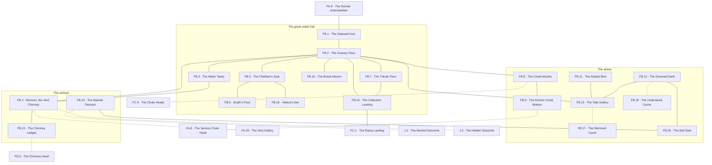

# `FB Brankel, Peak 1 Under Level Granaries`

**Classification:** WILD · **Difficulty Die:** d8 · **Tags:** Kobold Warren, Leaderless, Water and Stores

*Region file. Companion to the Drakenhold Setting Outline and the Setting Relational Diagram. Tables are authored at the location-stub pass (procedure step 7); location stubs, outlines and the region relational diagram follow in the engineer phase.*

---

**Overview:** The one place inside the mountain where somebody has made things work. The kobolds hold the granaries, the water tanks and the vent chimney, and they have cleared every rival, kept the water clean and held the stores — which is why this reads WILD rather than DANGEROUS. It has dangers; it does not have the escalation of the halls above. The tribe is currently leaderless and badly run by a contender, since the chieftain walked up to HC and did not come back, and that vacancy is the lever for every faction thread in Peak 1: back the contender, restore the old chieftain, break the tribute chain, or take the Lizardmen's skim public and let the warren do the rest. The vent chimney is a genuine vertical route running up to FD and down into J for anyone small enough or desperate enough. A party that invests here has a forward base; a party that does not has a neighbour.

**Ambiance:** Warm, for the first time. Air moves up the vent chimney with a low constant note. It smells of kobold, grain dust and standing water. There is light — banked fires, and the tribe does not go quiet when the party arrives, it goes watchful.

**Layout:** One great room holding the granaries and the water tanks, with the vent chimney rising through it, and storage rooms for foodstuffs and supplies running off in ranks. The stairwell up to FA at one end. The chimney is a genuine vertical route, running up to FD and down into J for anyone small enough or desperate enough. Around forty rooms, most of them stores, most of them in use.

**Features:** The tribe, which is the region. The granaries and tanks, which are working infrastructure and the reason this reads WILD. The vent chimney and its two illicit routes. The leadership vacancy, which is the lever for every faction thread in Peak 1 — back the contender, restore the old chieftain from HC, break the tribute chain, or take the Lizardmen's skim public and let the warren do the rest.

**Dangers:** Numbers, and only if provoked. The tribe will bargain before it fights and run before it loses. The chimney is a fall.

**Creatures:** Kobolds in quantity, Kobold Warriors, and a contender running the warren badly since the chieftain walked up to HC and did not come back. Lizardmen arrive on the tribute schedule and are the only thing here anyone is afraid of.

**Secrets:** Where the tribe caches what it does not declare. What the old chieftain said before he left. That the skim is happening, which the kobolds know and cannot prove and cannot survive proving alone.

**Treasure:** Held tribute, awaiting collection. The tribe's own hidden reserve. Both are obtainable by alliance far more easily than by force, which is the point.

---

## CONNECTIONS

*Authored against the Setting Relational Diagram. Edge types: open, gated by tile, gated by rod, hidden, secret, vertical, one-way, conditional on restored mechanism, conditional on faction relation.*

- **FA Takdun** — vertical, the stairwell up.
- **FD Khorvak** — vertical, conditional on size. The vent chimney, for anyone small enough or desperate enough.
- **J Mordrak** — vertical, conditional on size. The chimney continues down; this is Peak 1's hidden descent.
- **J Mordrak** — vertical, marked. The peak's declared descent.
- **FC Mekdun** — vertical, conditional on mechanism. Chutes, governed by the dispatch floor above.
- **FC Mekdun** — vertical, open. The great ramp, which reaches this floor at FB.16 and is the Lizardmen's road down. Written at step 8 in both regions; the collectors' landing was always the ramp's foot.
- **FA Takdun** — hidden, vertical, conditional on size. The FA warren's vent gallery touches Khorven between the two levels.

## TABLES

**Encounter** — d6, rolled on each failed Difficulty roll, resolving in the next watch. Not forced; may be signs, noise or a meeting at distance. Ascending.

| d6 | Encounter |
|---|---|
| 1 | **The Collectors.** Four Lizardmen down the ramp on schedule, unhurried, expecting the floor to be cleared for them. The kobolds clear it. Anyone still standing on it is a question they will ask slowly. |
| 2 | **The Contender's Muster.** Thirty kobolds and Kobold Warriors called out to prove a point to the warren rather than to the party. Being between it and its audience is the danger; being outside it is a job interview. |
| 3 | **Something Came Up the Chimney.** Cold air gone warm and wrong, a fouled ledge, and every kobold within earshot moving away from the shaft without discussing it. Nothing seen this time. |
| 4 | **The Grain Detail.** A file of kobolds hauling declared tribute across the floor under guard, slow, laden and nervous. They will talk while they walk and they will not stop walking. |
| 5 | **A Kobold With an Offer.** One, alone, off the route, wanting something specific — food, a light, a name carried, a rival embarrassed. The cheapest faction gain on the level and the one most parties waste. |
| 6 | **The Water Answers.** Sound off the tanks and the drowned rank, the pumps taking up a note they should not have, and grain dust hanging still in air that has stopped moving. Sign only, and it means the chimney has changed. |

## LOCATION STUBS

*Procedure step 7. Code, name and three thematic tags per location. The working note under each is scaffolding for step 8. Block-level material — Khorven, the chutes, the order, the toll road and the room budget — lives in `PEAK_1_BLOCK.md`, which covers FB, FC, FD and FE together because they share the peak's machinery.*

*40 rooms budgeted; **20 are stubbed as locations** and the balance is unnamed fill inside the stated groupings — emptied bins, collapsed rank ends, sleeping holes, stores that held nothing worth taking thirty years ago and hold less now.*

**The great under hall**

### `FB.1 The Stairwell Foot` — Warm Air Rising, Light Below, Watched From the First Step
*Working note: the first warmth and the first light inside the mountain, and the party is seen coming down long before it arrives. Nothing here is an ambush. That is the level's opening statement.*

**Connections:** `FA.9` the domed antechamber above — **vertical**, the stairwell · `FB.2` the granary floor. The party is seen coming down long before it arrives.

### `FB.2 The Granary Floor` — Stone Bins in Ranks, Grain Dust in the Air, Still Being Worked
*Working note: the largest room in Peak 1 after the Trade Hall, and the only one in the hold where somebody is currently making something work. Dwarven bins on dwarven ventilation, run by kobolds who did not build any of it and have kept all of it alive.*

**Connections:** `FB.1` the stairwell foot · `FB.3` the water tanks · `FB.4` Khorven, rising through the floor · `FB.5` the chieftain's seat · `FB.7` the tribute floor · `FB.8` the chute mouths · `FB.10` the brood warren · `FB.13` the tally gallery, above the bins · `FB.16` the collectors' landing.

### `FB.3 The Water Tanks` — Clean, Cold, Guarded Better Than the Food
*Working note: cut cisterns fed off the chimney's condensate and the deep seeps, still filtering through their original stone. The tribe guards the water harder than the grain, which tells a party what matters here before anyone says it.*

**Connections:** `FB.2` the granary floor · `FB.4` Khorven, whose condensate fills them.

### `FB.4 Khorven, the Vent Chimney` — The Shaft Through Everything, Warm and Rising, Sized for Somebody Smaller
*Working note: the peak's landmark. It comes up out of J, passes through this floor, and ends at the flow gate on FD. Climbable, unpleasant, and the tribe's whole climate. Taking its draught for the forge takes their winter.*

**Connections:** `FB.2` the granary floor · `FB.3` the water tanks · `FB.15` the chimney ledges, upward · `FA.33` the vent gallery in the FA warren — **hidden, conditional on size**, the warren's own way onto the shaft · `J.3` the hidden descents, downward — **hidden, conditional on size**. It comes up out of J and ends at the flow gate on FD.

### `FB.5 The Chieftain's Seat` — Empty Thirty Days, Nobody Sitting In It, Everybody Circling It
*Working note: Vekkut walked up to HC and did not come back. The seat is untaken, not because there is no contender but because taking it settles nothing. Every faction lever in Peak 1 runs through this vacancy.*

**Connections:** `FB.2` the granary floor · `FB.6` Snath's fires · `FB.18` Vekkut's den, which nobody will enter.

### `FB.6 Snath's Fires` — The Contender, Loud, Running It Badly
*Working note: Snath holds the floor by noise and by being the only one making decisions. He is not stupid and he is not adequate, and he knows the second thing. He will deal, and he will overpay to look decisive in front of the warren.*

**Connections:** `FB.5` the chieftain's seat. He holds the floor beside it and has not taken it.

### `FB.7 The Tribute Floor` — Stacked and Counted, Awaiting Collection, Nobody Touches It
*Working note: the levy assembled and waiting for the Lizardmen. It is the most valuable stack of goods a party will see this early and every kobold on the level would rather die than be the one who is short.*

**Connections:** `FB.2` the granary floor · `FB.16` the collectors' landing, which is the only place it ever goes.

**The stores**

### `FB.8 The Chute Mouths` — Three Stone Throats, Sealed at the Far End, Sound Comes Down Them
*Working note: the chute system's lower terminus, governed from the dispatch floor above. Until that mechanism is understood these are noise; after it, they are the fastest movement in the peak.*

**Connections:** `FB.2` the granary floor · `FB.9` the kitchen chute bottom, the next throat along · `FC.4` the chute heads above — **vertical, conditional on mechanism**, governed from the dispatch floor.

### `FB.9 The Kitchen Chute Bottom` — Where the Fall Ends, Refuse Thirty Years Deep, Voices From Above
*Working note: the far end of `FA.8`, one-way and survivable. Kobolds listen at it and can be heard through it, and it is how the party's business in the Trade Hall is already known down here.*

**Connections:** `FB.8` the chute mouths · `FA.8` the service chute head in the kitchens above — **hidden, vertical, one-way**. A fall, and a listening post in both directions.

### `FB.10 The Brood Warren` — Small, Loud, The Reason They Will Not Leave
*Working note: the tribe's future in a room, badly protected. Nothing to take. Everything to lose, and a party that understands that has a lever it never has to use.*

**Connections:** `FB.2` the granary floor. Badly protected, and nothing else opens onto it.

### `FB.11 The Sealed Bins` — Dwarven Stores Never Opened, Provision Still Good, The Tribe Cannot Work Them
*Working note: rod-sealed granary bins the kobolds have failed to open for thirty years and stopped trying to. Opening one is trivial for a party with the right rod and is the single largest gift available to any faction in the module.*

**Connections:** `FB.13` the tally gallery, which says what is in them. Rod-sealed, and thirty years of failing to open them.

### `FB.12 The Drowned Rank` — Standing Water, Something Living In It, Left Alone
*Working note: a flooded stores rank the tribe has written off. An Ooze in it, fed on collapsed stores. The kobolds know exactly where it stops and will say so for a price.*

**Connections:** `FB.13` the tally gallery · `FB.20` the wet dark, further down the rank · `FB.19` the undeclared cache — **hidden**, past where the Ooze stops.

### `FB.13 The Tally Gallery` — Dwarven Cut Above Every Bin, Counts and Contents, Read By Nobody Here
*Working note: bin labels and running counts in runic script, plain, repetitive and complete — the level's own script lesson, and the only inventory of what the hold ate. It also states what the bins held, which is how a party knows which sealed ones are worth opening.*

**Connections:** `FB.2` the granary floor · `FB.11` the sealed bins · `FB.12` the drowned rank · `FB.17` the skimmed count — **hidden**, kept where the counts are kept.

### `FB.14 The Marked Descent` — The Declared Way Down, Warning Cut at the Head, Air Coming Up
*Working note: Peak 1's honest route into J, cut by dwarves and signed by them. The warning is old, specific and not about wyrms, which is the interesting part.*

**Connections:** `FB.20` the wet dark · `J.2` the marked descents — **vertical**, cut by dwarves and signed by them.

**The vertical and the schedule**

### `FB.15 The Chimney Ledges` — Cut Handholds, An Hour in the Dark, Sized Wrong for a Man in Mail
*Working note: the climb up to FD's flow gate. Gear, armour and torches are all decisions here, and the shaft carries every sound the climber makes to both ends of it.*

**Connections:** `FB.4` Khorven · `FD.9` the chimney head above — **vertical, conditional on size**. An hour in the dark, and the shaft carries every sound to both ends.

### `FB.16 The Collectors' Landing` — Where the Ramp Meets the Floor, Kept Clear, Nothing Kept Here
*Working note: the toll road's arrival point. Swept, empty and pointedly maintained by a tribe that maintains nothing else. The schedule is legible from the wear alone.*

**Connections:** `FB.2` the granary floor · `FB.7` the tribute floor · `FC.1` the ramp landing above — **vertical**, the great ramp, and it is the Lizardmen's road.

### `FB.17 The Skimmed Count` — Two Tallies That Do Not Agree, Kept Anyway, Kept By Somebody Careful
*Working note: the proof of rumour 11. A kobold has been keeping a private count against the declared one for years, cannot read what the Lizardmen sign, and cannot survive presenting it alone. Carrying it upward is a campaign-scale act with a campaign-scale price.*

**Connections:** `FB.13` the tally gallery — **hidden**. Two tallies that do not agree, kept by somebody careful.

### `FB.18 Vekkut's Den` — The Old Chieftain's Room, Undisturbed, What He Said Before He Left
*Working note: nobody has taken it and nobody will enter it. What he said is remembered exactly and repeated unwillingly — he went up to the chapel because something up there had started answering him, and he went to ask it to stop.*

**Connections:** `FB.5` the chieftain's seat. Nobody has taken it and nobody will go in.

### `FB.19 The Undeclared Cache` — What the Tribe Does Not Count, Hidden From the Lizardmen, Hidden From Snath
*Working note: the reserve, held by the old guard rather than the contender. Reachable by alliance far more easily than by force, which is the point of this whole region.*

**Connections:** `FB.12` the drowned rank — **hidden**. Held by the old guard, not by the contender.

### `FB.20 The Wet Dark` — Below the Rank, Where the Tribe Stops, Something Uses the Route Both Ways
*Working note: the boundary of kobold control and the level's honest edge. They do not go past it, they will not be argued into going past it, and they are right.*

**Connections:** `FB.12` the drowned rank · `FB.14` the marked descent. This is where the tribe stops, and they are right to.

## REGION RELATIONAL DIAGRAM

*Procedure step 8. Drawn from the stubs, before the location outlines. Reconciled against the finished outlines before the region closes. The diagram is authoritative: the **Connections:** field under each stub is checked against it, never the reverse. Worked as one block with the other three levels of Peak 1 against `blocks/PEAK_1_BLOCK.md`, because the four are stitched together by shared machinery.*

**Reading the diagram.** Solid edges are open floor — this is the one region inside the mountain where a party can walk almost everywhere without solving anything, because somebody lives here and keeps it working. Dotted edges are hidden, size-conditional or mechanism-conditional: the chimney at both ends, the chutes, the kitchen fall, and the two caches.

**What the drawing found.**

- **`FB.2` is the region and everything else hangs off it.** Nine edges. The granary floor is the stair's arrival, the chimney's crossing, the stores' mouth, the tribute's yard and the ramp's approach at once, which means **every faction thread on this level runs across a floor full of kobolds who can see the whole thing.** Nothing here can be done privately, and that is why the region reads WILD rather than DANGEROUS.
- **The level has seven ways in and out, and the tribe controls two of them.** The stair from `FA.9`, the ramp from `FC.1`, the chutes to `FC.4`, the kitchen fall from `FA.8`, the chimney to `FD.9`, the chimney down to `J.3`, and the marked descent to `J.2`. The kobolds hold the stair-foot and the collectors' landing and watch both. Everything else arrives somewhere they are not looking, which is exactly how a party gets a reputation here before it has met anyone.
- **The two things worth having are behind the two things nobody goes near.** `FB.19`, the undeclared reserve, is hidden past `FB.12` — the drowned rank the tribe has written off, with the Ooze in it that they know the exact limits of. `FB.17`, the skimmed count, is hidden off `FB.13`, the tally gallery, which is written in a script nobody on this level can read. The old guard hid their reserve where the contender will not go and their proof where the Lizardmen cannot read. **Neither hiding place is a trap and both are characterisation.**
- **The honest way down into `J` is past the place the tribe stops.** `FB.14` hangs off `FB.20`, the wet dark. The dwarves' own signed descent is on the far side of the boundary of kobold control, which is why nobody has used it in thirty years and why the tribe cannot simply be asked to guide anyone to it. The price of the marked route is paid before the marked route starts.
- **`FB.5`, `FB.6` and `FB.18` are a three-node chain and the middle node is the problem.** The seat, the contender beside it, and the dead man's room nobody will enter. Snath holds the floor by standing next to a chair he has not taken, and Vekkut's den is one edge past him. A party asking about the vacancy is standing in the answer.
- **`FB.10` is a leaf, deliberately.** One edge, off the busiest floor in the region, badly protected and holding nothing worth taking. It is the lever a party never has to use, and drawing it as a dead end is what keeps it from becoming a route.
- **`FB.11` does not touch the granary floor.** The sealed bins are reached through `FB.13`, the tally gallery — so the room that says *what is in them* is on the only way to them. A party cannot decide which sealed bin is worth a rod without first standing under the script that says so.

**Route ends recorded.** Eight edges leave region `FB`. `FA.9`–`FB.1` and `FA.8`⇢`FB.9` were drawn at the first-level block's pass and are reciprocated here unchanged. `FA.33`–`FB.4` is **new at this pass** and reconciles a standing block fact — `PEAK_1_BLOCK.md` has always said the FA vent gallery touches Khorven, and it was never an edge. `FB.16`–`FC.1` is the great ramp, which reaches this floor and was not previously written in either region's connections. `FB.8`–`FC.4` is the chute system, `FB.15`–`FD.9` the chimney climb, and `FB.14`–`J.2` and `FB.4`–`J.3` the two descents.
