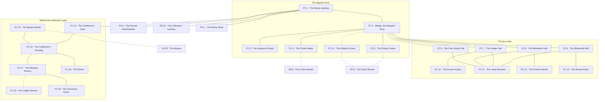

# `FC Mekdun, Peak 1 Level 2 Workshop`

**Classification:** DANGEROUS · **Difficulty Die:** d10 · **Tags:** Tiles and Rods, Dead Machines, Craftsmen's Secrets

*Region file. Companion to the Drakenhold Setting Outline and the Setting Relational Diagram. Tables are authored at the location-stub pass (procedure step 7); location stubs, outlines and the region relational diagram follow in the engineer phase.*

---

**Overview:** Where the module teaches the tiles and the rods. Four great work halls — stonecraft, metalwork, fine goods, and the ledgering that governed all of them — cold now and lit by dead glow-rune lamps, ledger-shelves collapsed and scales frozen mid-weighing. A stone-tile dispatch mechanism redirects chute traffic between FB and FD, rewarding correct sequencing with a hidden access and stranding a party between levels for getting it wrong; rod-woken machinery still turns for anyone who works out which rod does what. The whole level runs on the double register of dwarven engineering as simple delight and as quiet treachery, and both readings are correct. Behind the work halls sit gated areas turned inward on the craftsmen themselves — housing, meeting rooms, a shrine, private grievances — and it is there rather than in the halls that the ledger-stones name a Guild contact who fled with stolen rods.

**Ambiance:** Cold and dry. Dead glow-rune lamps in every bracket, dark for thirty years, and enough residual charge in a few that they flicker if disturbed. Ledger-shelves collapsed into drifts of tally-stones. Scales frozen mid-weighing with the goods still in the pan.

**Layout:** Four great work halls — stonecraft, metalwork, fine goods, and the ledgering that governed all of them — arranged around a central dispatch floor, with the great ramp arriving from FA and continuing to FD. Chutes run down to FB and up to FD. Behind the halls sit gated areas turned inward on the craftsmen themselves: housing, meeting rooms, a shrine, and the rooms where their private grievances were kept. Around forty rooms.

**Features:** The stone-tile dispatch mechanism, which redirects chute traffic between FB and FD, rewards correct sequencing with a hidden access and strands a party between levels for getting it wrong. Rod-woken machinery throughout, which turns for anyone who works out which rod does what. This is where the module teaches the tiles and the rods, and it teaches both by consequence. The whole level runs on the double register of dwarven engineering as simple delight and as quiet treachery, and both readings are correct.

**Dangers:** Mechanical rather than living. Chutes, presses, lift platforms, and a dispatch floor that will move under a party mid-crossing if the sequence is wrong. Nothing here is malicious. All of it is indifferent.

**Creatures:** Sparse. An Automaton or two that wandered down from FD and is executing its order in the wrong room. Whatever has come up the chutes from FB.

**Secrets:** The ledger-stones behind the halls name a Guild contact who fled with stolen rods, and where he was going. The craftsmen's shrine is not to any god the hold acknowledged. The correct dispatch sequence opens a hidden access that is on no plan of the level.

**Treasure:** Fine goods in progress, materials in stock, and the personal holdings of the craftsmen in the gated areas — which is where the real wealth on this level is, and it is behind their locks rather than the guild's.

---

## CONNECTIONS

*Authored against the Setting Relational Diagram. Edge types: open, gated by tile, gated by rod, hidden, secret, vertical, one-way, conditional on restored mechanism, conditional on faction relation.*

- **FA Takdun** — vertical, the great ramp down.
- **FD Khorvak** — vertical, the great ramp up.
- **FB Brankel** — vertical, conditional on mechanism. Chutes, sequenced from the dispatch floor.
- **FB Brankel** — vertical, open. The great ramp continuing down to the collectors' landing at FB.16. Written at step 8 in both regions.
- **FD Khorvak** — vertical, conditional on mechanism. Chutes upward, same sequence.
- **Servants' passages** — secret. The bypass arrives here.
*The correct dispatch sequence opens a hidden access on no plan of the level. It surfaces at `FD.8`, the stock rooms, behind the Automatons' line of work.*

## TABLES

**Danger** — d6, presented at 6 on entry, counting down one face with each failed Difficulty roll. Resets to 6 on leaving the region.

| d6 | Danger |
|---|---|
| 6 | **A lamp remembers.** One dead glow-rune flickers as the party passes, throws a room's worth of light, and dies. Nothing else. The level is not dead; it is asleep. |
| 5 | **The floor answers.** Something the party did on the dispatch tiles takes effect two rooms later — a chute opening, a hatch dropping, a bench turning. Consequence arriving late, which is how this level teaches. |
| 4 | **Weight in the wrong hall.** A press, a lift bed or a stacked pallet finishes a motion begun thirty years ago. Gear caught, a route closed, somebody pinned and none of it aimed at anyone. |
| 3 | **Delivered.** The chutes take what the party did not intend to send — a pack, a rope, a person — and put it on another level. Recoverable. Expensive. Loud at the far end. |
| 2 | **The wrong room.** An Automaton down from FD, executing its order in a hall that has not held its materials in three decades, and the party is standing in the space the order requires. |
| 1 | **Stranded between levels.** The sequence is wrong, the chutes are shut, the ramp behind them is blocked by working machinery, and the party is on a floor with no open exit until it solves the mechanism it has been avoiding. |

## LOCATION STUBS

*Procedure step 7. Code, name and three thematic tags per location. The working note under each is scaffolding for step 8. Block-level material — Khorven, the chutes, the order, the toll road and the room budget — lives in `PEAK_1_BLOCK.md`.*

*40 rooms budgeted; **21 are stubbed as locations** and the balance is unnamed fill inside the stated groupings — cleared benches, emptied stock, drifts of tally-stone, side rooms that held one trade's tools and now hold the racks they hung on.*

**The dispatch floor**

### `FC.1 The Ramp Landing` — Wide, Open, Everything Crosses Here
*Working note: the honest arrival, and the last place on the level that requires nothing of anyone. From here every route is a mechanism.*

**Connections:** `FA.9` the domed antechamber below — **vertical**, the great ramp down · `FB.16` the collectors' landing below — **vertical**, the great ramp continuing down · `FD.1` the ramp head above — **vertical**, the great ramp up · `FC.2` the dispatch floor · `FC.14` the craftsmen's gate, shut.

### `FC.2 Mekgir, the Dispatch Floor` — Tiles Set Into Stone, The Floor Turns, Nothing Here Is Malicious
*Working note: the peak's landmark and the module's teaching bench for tiles and rods both. It redirects chute traffic between FB, FC and FD, it is entirely reversible, and no sequence on it is fatal. Wrong sequencing does not kill — it delivers.*

**Connections:** `FC.1` the ramp landing · `FC.3` the sequence board · `FC.4` the chute heads · `FC.5` the rising chutes · `FC.6` the stonecraft hall · `FC.7` the ledger hall · `FC.8` the metalwork hall · `FC.9` the fine goods hall · `FC.21` the hidden access — **conditional on mechanism**, and only the correct sequence opens it.

### `FC.3 The Sequence Board` — Cut Instructions, Complete, Assumes You Already Know
*Working note: the manual, in runic script, written for people who ran this floor daily. Everything needed is stated and nothing is explained. This is the level rewarding the party's reading of the waystones with a genuinely hard problem.*

**Connections:** `FC.2` the dispatch floor, cut into the wall beside it.

### `FC.4 The Chute Heads` — Down to the Kobolds, Sound Both Ways, Faster Than the Stair
*Working note: the FB link, and a listening post onto a floor full of people who can be talked to.*

**Connections:** `FC.2` the dispatch floor · `FB.8` the chute mouths below — **vertical, conditional on mechanism**. Sound comes up them whether the mechanism is understood or not.

### `FC.5 The Rising Chutes` — Up to the Forge, Loaded Not Ridden, Same Sequence
*Working note: the FD link. Built to lift stock, not people, and using it as a route is a decision with a weight limit.*

**Connections:** `FC.2` the dispatch floor · `FD.8` the stock rooms above — **vertical, conditional on mechanism**. Built to lift stock and not people.

**The four halls**

### `FC.6 The Stonecraft Hall` — Blocks Half Cut, Rod-Woken Saws, Work Stopped Mid-Stroke
*Working note: the largest hall and the loudest one when woken. A half-finished commission on the bed says who it was for.*

**Connections:** `FC.2` the dispatch floor · `FC.11` the lamp brackets · `FC.13` the wrong room.

### `FC.7 The Ledger Hall` — Shelves Collapsed Into Drifts, Every Delivery Recorded, Including the Last
*Working note: the level's records, and the first of three places the Automatons' standing order can be recovered from. The dispatch copy is the incomplete one and a party that stops here thinks it has the answer.*

**Connections:** `FC.2` the dispatch floor · `FC.10` the frozen scales · `FC.11` the lamp brackets.

### `FC.8 The Metalwork Hall` — Benches in Ranks, Tools Where Hands Left Them, Nothing Rusted
*Working note: dwarven steel in dwarven air, thirty years untouched and still bright. Portable value, and the first real weight decision of the peak.*

**Connections:** `FC.2` the dispatch floor · `FC.11` the lamp brackets · `FC.12` the practice bench.

### `FC.9 The Fine Goods Hall` — Small Work, Delicate, Interrupted
*Working note: inlay, settings, glasswork and instrument parts. Wealth by volume rather than by mass, and the only room in Peak 1 that is beautiful.*

**Connections:** `FC.2` the dispatch floor · `FC.11` the lamp brackets.

### `FC.10 The Frozen Scales` — Goods Still in the Pan, A Weighing Never Finished, A Name on the Slip
*Working note: the level's clock, matching the tally post at `FA.14`. The slip names the buyer and the date, and the date is the season of the Breaking.*

**Connections:** `FC.7` the ledger hall.

### `FC.11 The Lamp Brackets` — Dead Glow-Runes, Residual Charge, One Still Answers
*Working note: distributed through all four halls rather than sitting in one room. Waking them is a small, cheap, level-wide change and the first restoration a party is likely to manage unaided.*

**Connections:** `FC.6` the stonecraft hall · `FC.7` the ledger hall · `FC.8` the metalwork hall · `FC.9` the fine goods hall. A condition of all four rather than a room in any of them.

### `FC.12 The Practice Bench` — Rods on a Rack, Locks With Nothing Behind Them, Built to Be Got Wrong
*Working note: an apprentices' teaching bench — a rack of blunt training rods and a row of demonstration locks. The module handing the party the rod grammar explicitly, in a room where failure costs nothing.*

**Connections:** `FC.8` the metalwork hall.

### `FC.13 The Wrong Room` — An Automaton Down From the Forge, Working Empty Air, Will Not Be Moved
*Working note: one machine executing its order in a hall that stopped holding its materials thirty years ago. It is a preview of FD's puzzle at a survivable scale, and it can be satisfied here with a single correct object.*

**Connections:** `FC.6` the stonecraft hall, standing in a room that stopped holding its materials thirty years ago.

**Behind the craftsmen's gate**

### `FC.14 The Craftsmen's Gate` — Their Lock, Not the Guild's, Held Against Their Own Masters
*Working note: the gated ground begins here, and the important fact is who it was locked against. This is the level's real wealth and the guild never had a key to it.*

**Connections:** `FC.1` the ramp landing · `FC.16` the craftsmen's housing, behind it. Their lock, and the guild never had a key to it.

### `FC.15 The Bypass Mouth` — A Capillary That Should Not Reach, Comes Up Inside, Nothing Was Guarding This Side
*Working note: **the payoff from `FA.30`.** A party that worked the warren properly arrives inside the richest ground on Level 2 from behind, having touched neither the gate nor the dispatch floor. The whole of the level's lock problem, answered by having gone the long way in the dark.*

**Connections:** `FC.16` the craftsmen's housing · `FA.30` the bypass in the FA warren below — **secret**. It comes up inside, and nothing was guarding this side.

### `FC.16 The Craftsmen's Housing` — Close Quarters, Personal, Left Standing
*Working note: the makers at home. Their own holdings, their own savings, their own small quarrels written on the walls in a hand nobody was meant to read.*

**Connections:** `FC.14` the craftsmen's gate · `FC.15` the bypass mouth · `FC.17` the meeting rooms · `FC.18` the shrine.

### `FC.17 The Meeting Rooms` — Chairs in a Ring, No Head of Table, Minutes Nobody Filed
*Working note: where the craft houses talked without their guild seats present. The minutes are the level's political document and they are unflattering to FE.*

**Connections:** `FC.16` the craftsmen's housing · `FC.20` the grievance room · `FC.19` the ledger-stones — **hidden**, behind their own lock rather than the guild's.

### `FC.18 The Shrine` — Not a God the Hold Acknowledged, Old, Still Tended in the Last Year
*Working note: older cutting, plainer hand — the same hand as `FA.11` and `FA.34`. Whatever the craftsmen kept faith with here predates every clan in Drakenhold, and the offerings are dated to the war years.*

**Connections:** `FC.16` the craftsmen's housing. Older cutting, plainer hand, and still tended in the last year.

### `FC.19 The Ledger-Stones` — Private Accounts, A Name That Fled, Where He Was Going
*Working note: kept behind the craftsmen's own lock rather than in the ledger hall. They name the Guild contact who left with stolen rods, the night he went, and the road he took. `FE.9` is the other half of him.*

**Connections:** `FC.17` the meeting rooms — **hidden**.

### `FC.20 The Grievance Room` — Complaints Never Heard, Sealed and Kept, Against Their Own Seats
*Working note: thirty years of formal grievance the guild never answered, filed and preserved because the craftsmen expected to need it. It is evidence, and upstairs there are two wraiths who each want it to say a different thing.*

**Connections:** `FC.17` the meeting rooms. Sealed and kept, because they expected to need it.

### `FC.21 The Hidden Access` — Opened Only By the Correct Sequence, On No Plan of the Level, Comes Out Above
*Working note: the dispatch floor's standing reward, and a real one. It surfaces in the stock rooms at `FD.8`, behind the Automatons' line of work — the peak's answer to the forge floor for a party that would rather solve than cross. It does not skip FD. It skips the galleries.*

**Connections:** `FC.2` the dispatch floor — **conditional on mechanism** · `FD.8` the stock rooms above — **hidden, vertical**. It does not skip FD. It skips the galleries.

## REGION RELATIONAL DIAGRAM

*Procedure step 8. Drawn from the stubs, before the location outlines. Reconciled against the finished outlines before the region closes. The diagram is authoritative: the **Connections:** field under each stub is checked against it, never the reverse. Worked as one block with the other three levels of Peak 1 against `blocks/PEAK_1_BLOCK.md`, because the four are stitched together by shared machinery.*

**Reading the diagram.** Solid edges are open floor. Dotted edges are hidden, secret or mechanism-conditional — the chutes at both ends, the hidden access, the bypass and the ledger-stones. `FC.11` is drawn as edges to all four halls because it is a condition of the halls rather than a room in one of them.

**What the drawing found.**

- **The level is two graphs joined at one node, and that node is the ramp landing.** `FC.1` carries the ramp in both directions, the dispatch floor, and the craftsmen's gate. Everything a party can walk to hangs off `FC.2`; everything worth taking hangs off `FC.14`, which is locked. **The first room on the level shows a party both halves of it and lets them into only one.** That is the level's whole argument in one node and it was already implicit in the stubs.
- **The gate's answer is not the gate and it is a region away.** `FC.15`–`FA.30`. A party that worked the FA warren properly comes up inside the craftsmen's housing having touched neither the gate nor the dispatch floor. Priced exactly as the rule requires — longer, darker, and paid for two regions ago in a bunk warren with nothing in it. The module never says which route is the mistake.
- **`FC.2` has nine edges and is the only way to seven of them.** The dispatch floor is not a puzzle beside the level; it *is* the level's topology. The four halls, both chute systems, the sequence board and the hidden access all attach there and nowhere else. A party that refuses to engage with the mechanism can still walk to all four halls — the floor is crossable — but it cannot move anything, reach `FD.8` from below, or find `FC.21`.
- **Three of the level's four exits upward land on the same room.** `FC.5` the rising chutes and `FC.21` the hidden access both arrive at `FD.8`, the stock rooms, and the ramp arrives at `FD.1`. The stock rooms are Peak 1's freight hub, which is why the hidden access surfaces there and why it skips the galleries rather than skipping the level.
- **The gated ground is a chain, not a cluster, and the private things are at the far end.** `FC.14`→`FC.16`→`FC.17`→`FC.20`, with `FC.19` hidden off the meeting rooms and `FC.18` off the housing. The craftsmen's political documents sit two rooms deeper than their savings. A party that breaks the gate for treasure finds the treasure first and stops; a party that keeps walking finds the argument.
- **`FC.13` is on the stonecraft hall and not on the dispatch floor.** The Automaton executing its order in the wrong room stands one edge off the main crossing — visible, avoidable, and satisfiable with a single correct object. It is `FD`'s central puzzle offered at a survivable scale, and the drawing keeps it off the route so that meeting it is a choice.
- **`FC.10` and `FC.12` are leaves and should stay leaves.** The frozen scales date the Breaking; the practice bench hands the party the rod grammar in a room where failure costs nothing. Neither is on the way to anything, which is what makes stopping at them a decision rather than a toll.

**Route ends recorded.** Six edges leave region `FC`. `FA.9`–`FC.1` and `FA.30`–`FC.15` were drawn at the first-level block's pass and are reciprocated here. `FB.16`–`FC.1` is the great ramp continuing down to the under level — **new at this pass in both regions' connections**, and owed: `FB.16`'s own stub is named *where the ramp meets the floor*, and the toll road in `PEAK_1_BLOCK.md` runs down it. `FC.4`–`FB.8` is the chute system, `FC.1`–`FD.1` the ramp up, and `FC.5`–`FD.8` and `FC.21`–`FD.8` the two mechanism routes into the stock rooms.
