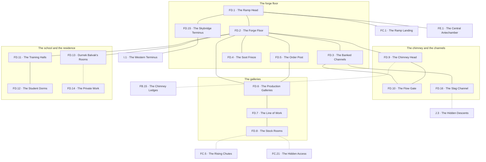

# `FD Khorvak, Peak 1 Level 3 Forge`

**Classification:** DANGEROUS · **Difficulty Die:** d10 · **Tags:** Automatons at Work, Banked Heat, Skybridge Terminus

*Region file. Companion to the Drakenhold Setting Outline and the Setting Relational Diagram. Tables are authored at the location-stub pass (procedure step 7); location stubs, outlines and the region relational diagram follow in the engineer phase.*

---

**Overview:** The forge, and the largest restorable prize in Peak 1. Residual heat still comes off banked magma channels, soot reliefs of the first automaton's forging cover the walls, and rhythmic clanking carries from the deeper galleries where Automatons have never stopped executing the last production order they were given. They cannot be reasoned with and they do not need to be fought — they can be satisfied by the letter of that order, and working out what it was is the level's central puzzle. Relighting the forge requires restoring flow from the vent chimney below, which is a faction-scale prize that changes what every craft in the hold is capable of. Training halls and dorms preserve apprentice life interrupted mid-lesson. FD is one of the three horizontal termini of the Skybridge.

**Ambiance:** Heat, still, coming off banked magma channels thirty years cold at the surface and not cold beneath. Soot reliefs of the first automaton's forging cover the walls in a continuous frieze. From the deeper galleries, rhythmic clanking, unhurried, on a cycle. It does not stop and it does not come closer.

**Layout:** The forge floor and its channels at the centre, deeper production galleries behind it, the Forge Master's residence above, and the training halls and student dorms to one side. The great ramp arrives from FC. The vent chimney from FB comes up here. FD is one of the three horizontal termini of the Skybridge. Around thirty rooms.

**Features:** The Automatons and their standing order, which is the level's central puzzle — they cannot be reasoned with and do not need to be fought, only satisfied by the letter of what they were last told. Relighting the forge by restoring flow from the chimney below, which is a faction-scale prize that changes what every craft in the hold is capable of. The training halls and dorms, which preserve apprentice life interrupted mid-lesson and are the most human thing in Peak 1.

**Dangers:** Automatons executing their order across ground a party wants to cross. Heat, gas and channel breaches once flow is restored. The forge is more dangerous working than dead.

**Creatures:** Automatons, several, on cycle. Nothing else lives here and nothing else wants to.

**Secrets:** What the last order actually was, recoverable from the dispatch records on FC or from the Forge Master's own rooms. The Forge Master's residence holds his private work, which was not guild business. One channel runs down to J.

**Treasure:** The Forge Master's residence. Finished work never collected. Materials of real value in the stock rooms, heavy and awkward, which is its own decision.

---

## CONNECTIONS

*Authored against the Setting Relational Diagram. Edge types: open, gated by tile, gated by rod, hidden, secret, vertical, one-way, conditional on restored mechanism, conditional on faction relation.*

- **FC Mekdun** — vertical, the great ramp down.
- **FE Aztak** — vertical, the great ramp up.
- **FB Brankel** — vertical, conditional on size. The vent chimney arrives here.
- **I Brynaz** — gated by tile. The Skybridge's western terminus.
- **J Mordrak** — secret, vertical. One magma channel runs down.
- **FC Mekdun** — hidden, conditional on mechanism. The dispatch floor's hidden access surfaces at `FD.8`, behind the Automatons' line of work.

*Restoring flow from the chimney relights the forge and is the peak's faction-scale prize. It also takes Khorven's draught off FB, which is a faction consequence rather than a trap.*

## TABLES

**Danger** — d6, presented at 6 on entry, counting down one face with each failed Difficulty roll. Resets to 6 on leaving the region.

| d6 | Danger |
|---|---|
| 6 | **The cycle.** Clanking from the deeper galleries, unhurried, on its measure. It does not stop and it does not come closer. Heat off the floor through boot leather. |
| 5 | **The cycle changes.** The measure alters — a step added, a pause removed. Something the party has done has entered the order, and there is no way yet to know what. |
| 4 | **Stock in motion.** An Automaton crossing with material, on the shortest line between two points, through whatever is standing on that line. It is not attacking. It will not step around. |
| 3 | **The channels shift.** Ticking in the stone, a plate warm enough to burn through a hand, gas off a seam. The magma is nearer the surface than the last thirty years suggested. |
| 2 | **Two on the same order.** A pair working the same task from opposite sides, and the ground between them is where the work happens. Crossing it is the danger; being seen carrying iron is worse. |
| 1 | **The order enforced.** An Automaton has classed the party as an obstruction to its standing instruction and will clear it, methodically, without malice and without stopping. Only the order can call it off. |

## LOCATION STUBS

*Procedure step 7. Code, name and three thematic tags per location. The working note under each is scaffolding for step 8. Block-level material — Khorven, the chutes, the order, the toll road and the room budget — lives in `PEAK_1_BLOCK.md`.*

*30 rooms budgeted; **16 are stubbed as locations** and the balance is unnamed fill inside the stated groupings — cooled channel runs, slag bays, empty stock, dormitory rows, the ordinary rooms of a working forge with the work taken out of them.*

**The forge floor**

### `FD.1 The Ramp Head` — Heat First, Sound Second, Nothing In Sight
*Working note: the party arrives into warmth and a rhythm from rooms it cannot see. FD announces itself before it shows itself, and that is the level's entire opening.*

**Connections:** `FC.1` the ramp landing below — **vertical**, the great ramp down · `FE.1` the central antechamber above — **vertical**, the great ramp up · `FD.2` the forge floor · `FD.15` the Skybridge terminus.

### `FD.2 The Forge Floor` — Great Hearths Cold at the Face, Anvils in Rank, Warm Through the Boots
*Working note: the room the peak was built around, banked rather than dead. Everything a smith could want and no fire to do it with.*

**Connections:** `FD.1` the ramp head · `FD.3` the banked channels · `FD.4` the soot frieze · `FD.5` the order post · `FD.6` the production galleries · `FD.9` the chimney head · `FD.11` the training halls · `FD.13` Durnek Balvak's rooms, above.

### `FD.3 The Banked Channels` — Magma Under Stone Plate, Thirty Years Cold on Top, Not Cold Beneath
*Working note: the heat source, dormant and intact. Also the level's standing hazard once anything changes — the channels were built to be tended and nobody has tended them.*

**Connections:** `FD.2` the forge floor · `FD.10` the flow gate, which governs them · `FD.16` the slag channel, cut off the far end of them.

### `FD.4 The Soot Frieze` — The First Automaton's Forging, Continuous, Read It Backwards
*Working note: a full-wall relief under thirty years of soot, and the only complete account anywhere of how the machines were made and what they were made to obey. It is instruction disguised as decoration.*

**Connections:** `FD.2` the forge floor, a full wall of it.

### `FD.5 The Order Post` — Where the Last Instruction Was Hung, Slate Still In Place, Half Legible
*Working note: the second of three sources for the standing order. What survives here is the *scope* of it and not the object — enough for a party to guess wrongly with real confidence.*

**Connections:** `FD.2` the forge floor · `FD.6` the production galleries, whose work it was hung to instruct.

**The galleries**

### `FD.6 The Production Galleries` — Where the Clanking Is, Never Stopped, Nothing Being Made
*Working note: the Automatons at work on an order whose materials ran out decades ago, moving nothing between stations that hold nothing. The horror is in how correctly it is being done.*

**Connections:** `FD.2` the forge floor · `FD.5` the order post · `FD.7` the line of work.

### `FD.7 The Line of Work` — The Ground They Cross, Worn Smooth, Timed
*Working note: thirty years of the same route has polished a path into the floor. The route is legible, the cycle is timeable, and a patient party crosses the galleries without a fight or a puzzle — the third answer, and the cheapest.*

**Connections:** `FD.6` the production galleries · `FD.8` the stock rooms. The route is legible, the cycle is timeable, and crossing it patiently is the cheapest of the three answers.

### `FD.8 The Stock Rooms` — Ingot and Ore in Rank, Heavy, Worth More Than the Party Can Lift
*Working note: real material value with a real weight problem attached, which is its own decision. `FC.21`'s hidden access surfaces here, behind the line of work — a party that solved the dispatch floor arrives past the galleries without ever standing on the ground the order is being executed across.*

**Connections:** `FD.7` the line of work · `FC.5` the rising chutes below — **vertical, conditional on mechanism** · `FC.21` the hidden access below — **hidden, vertical**, surfacing behind the line of work.

### `FD.9 The Chimney Head` — Khorven Arrives, Draught Constant, The Kobolds' Weather
*Working note: the top of the climb from `FB.15`. A route in, a route out, and the reason the tribe below is warm.*

**Connections:** `FD.2` the forge floor · `FD.10` the flow gate, at the head of the shaft · `FB.15` the chimney ledges below — **vertical, conditional on size**.

### `FD.10 The Flow Gate` — Rod-Locked, Sound Mechanism, One Turn From a Working Forge
*Working note: the peak's faction-scale prize. Opening it takes the draught off FB and gives it to the channels — relighting the largest forge in the north and costing the kobolds their winter in the same motion. **The module never states this trade and the kobolds work it out the moment the air changes.***

**Connections:** `FD.3` the banked channels · `FD.9` the chimney head — **gated by rod**. One turn from a working forge, and one turn from taking the draught off FB.

**The school**

### `FD.11 The Training Halls` — Half-Finished Pieces at Every Bench, Marked and Graded, Names on Them
*Working note: apprentice work interrupted mid-lesson, each piece signed. The most human room in Peak 1, and a name-index for a setting where names are keys.*

**Connections:** `FD.2` the forge floor · `FD.12` the student dorms.

### `FD.12 The Student Dorms` — Bunks, Small Property, Nobody Came Back For Any of It
*Working note: the cost of the Breaking at the scale of one person's belongings, thirty times over.*

**Connections:** `FD.11` the training halls.

**The residence**

### `FD.13 Durnek Balvak's Rooms` — The Forge Master, Kin to a Seat Upstairs, His Own Hand
*Working note: the third and only complete source for the standing order, in his private record. He is also a Balvak — kin to Dovrek at `FE.3`, who does not raise the subject and answers when asked.*

**Connections:** `FD.2` the forge floor, above it · `FD.14` the private work — **hidden, gated by rod**, and the rod is a Balvak House rod.

### `FD.14 The Private Work` — Not Guild Business, Rod-Locked, Begun After the Ban
*Working note: what he was making on his own account, after the King forbade the artifact's use and while his own house voted against the ban. The concealment answers to a Balvak House rod — the same rod Ashen's Crew have been carrying unidentified since before the campaign began — and **an artifact piece is inside**, the third of seven and the first a party is likely to find in the mountain. He did not steal it and he was not one of the thieves. Somebody put it into the hands of the most careful smith in Drakenhold, and the question of who is not answered on this level.*

**Connections:** `FD.13` Durnek Balvak's rooms — **hidden, gated by rod**. Begun after the ban, and not guild business.

### `FD.15 The Skybridge Terminus` — Tile-Gated, Maintained, Somebody Uses This
*Working note: the western terminus of `I`. Wear on the sill, and it is recent. This is the toll road's door and the schedule can be read off the threshold.*

**Connections:** `FD.1` the ramp head · `I.1` the western terminus — **gated by tile**. The toll road's door, and the wear on the sill is recent.

### `FD.16 The Slag Channel` — Cut for Waste, Runs Down and Keeps Running, Nobody Built the Far End
*Working note: the peak's secret descent into J. It was cut to carry slag out and it goes further than slag ever needed to go, which is a question the level does not answer.*

**Connections:** `FD.3` the banked channels · `J.3` the hidden descents — **secret, vertical**. Cut to carry slag out, and it goes further than slag ever needed to go.

## REGION RELATIONAL DIAGRAM

*Procedure step 8. Drawn from the stubs, before the location outlines. Reconciled against the finished outlines before the region closes. The diagram is authoritative: the **Connections:** field under each stub is checked against it, never the reverse. Worked as one block with the other three levels of Peak 1 against `blocks/PEAK_1_BLOCK.md`, because the four are stitched together by shared machinery.*

**Reading the diagram.** Solid edges are open floor — the forge level is walkable, and that is deliberate. Dotted edges are hidden, secret, rod-gated or size-conditional: the private work, the chimney, the chutes, the hidden access and the slag channel.

**What the drawing found.**

- **The stock rooms have three ways in and only one of them crosses the order.** `FD.7` the timed crossing, `FC.5` the chutes, `FC.21` the hidden access. The block document already called the patient crossing *the third answer, and the cheapest*; the drawing shows why it is an answer at all — `FD.8` is a cul-de-sac off the galleries, so without the two routes from below it would sit behind the only thing in Peak 1 that will actually kill a party. **Every gate has an answer that is not the gate, and here there are two, both bought on the level below.**
- **`FD.2` is the hub and it is also the room the level's four subjects meet in.** Eight edges: the ramp, the channels, the frieze, the order post, the galleries, the chimney head, the school and the Forge Master's stair. The instruction manual for the machines, the machines' materials, the machines themselves and the man who last told them anything are all one edge apart. A party standing on the forge floor is standing inside the whole puzzle and does not yet know it is a puzzle.
- **The three sources for the order are not equidistant.** `FC.7` is a region below, `FD.5` is on the forge floor, and `FD.13` is up a stair off it. The incomplete ones are the easy ones and the complete one is in a dead man's rooms with a rod-locked concealment behind it. That gradient is the level and the drawing does not soften it.
- **`FD.14` is a leaf behind a leaf.** `FD.2`→`FD.13`→`FD.14`, and nothing else touches either. The first artifact piece a party is likely to find in the mountain sits at the end of the only two-node private chain on the level, behind a rod that Ashen's Crew have been carrying around the Outer City for a month. Nothing on the route hints at what is at the end of it, which is why the hint has to come from `FE.3` and from the crew.
- **The flow gate touches the chimney and the channels and nothing else.** `FD.9`–`FD.10`–`FD.3`. It is not on the way anywhere; a party only reaches it by climbing Khorven or by walking the channels deliberately. **The peak's largest prize is off every route through the level**, which means relighting the forge is always a decision and never an accident — and the kobolds' winter is never taken by a party that did not go looking.
- **`FD.15` hangs off the ramp head and not off the forge floor.** The Lizardmen arrive at the terminus, take the ramp, and never enter the level proper. The toll road is drawn as two edges at the very edge of the region, which is why a party can hold the whole forge for days and still meet the collectors head-on the moment it uses the ramp.
- **`FD.16` is reached through the channels, so the secret descent into `J` is behind the hazard.** The slag channel was cut for waste and goes further than waste needed to go; the only way to it runs over magma under stone plate that nobody has tended in thirty years.

**Route ends recorded.** Seven edges leave region `FD`. `FC.1`–`FD.1` is the ramp and `FD.1`–`FE.1` is the ramp up. `FC.5`–`FD.8` and `FC.21`–`FD.8` are the chutes and the hidden access. `FB.15`–`FD.9` is the chimney climb. `FD.15`–`I.1` is the Skybridge's western terminus, tile-gated. `FD.16`–`J.3` is the slag channel. The flow relation between `FD.10` and the vent system in `J` is a consequence rather than a passage and is deliberately **not** drawn as an edge.
