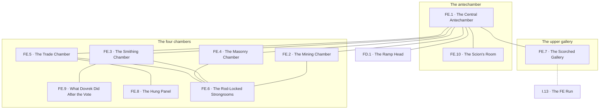

# `FE Aztak, Peak 1 Level 4 Guildmaster Manse`

**Classification:** DANGEROUS · **Difficulty Die:** d8 · **Tags:** Four Guild Chambers, Two Arguing Wraiths, Rod-Locked Reserves

*Region file. Companion to the Drakenhold Setting Outline and the Setting Relational Diagram. Tables are authored at the location-stub pass (procedure step 7); location stubs, outlines and the region relational diagram follow in the engineer phase.*

---

**Overview:** Small, rich, and mostly a conversation. Four grand chambers for Mining, Smithing, Masonry and Trade, each ringed by close-branching studies and quarters, with faded guild-sigil tapestries, cracked fine joinery and cold ash from a dragon-scorched upper gallery. Rod-locked strongboxes in each study hold the guild reserve and are trapped against forced entry. A scavenging kobold party works the central antechamber and flees if outnumbered. Two Dwarven Wraiths hold this level — Dovrek Balvak and Ismelda Kelmor, who held the Guild seats and voted against the King's ban — and they do not agree with each other. One wants the record corrected and the other wants the vote justified, so a party can play them against one another or satisfy both. Between them they hold the full council-vote account, the King's reasoning, and the name of a Guild scion who may still be alive.

**Ambiance:** Fine joinery, cracked. Faded guild-sigil tapestries in four colours. Cold ash drifted through from a gallery above that the dragon scorched in passing, the only mark he left on this peak. Quiet, and the quiet has an attention in it.

**Layout:** Four grand chambers — Mining, Smithing, Masonry and Trade — each ringed by close-branching studies, strongrooms and quarters, arranged around a central antechamber. Ten to twenty rooms. Small, and every room matters.

**Features:** The two wraiths, who are the level. Rod-locked strongboxes in each study, holding the guild reserve and trapped against forced entry. Four chambers of guild record, each partial, and complete only when read against one another.

**Dangers:** The strongboxes, which are trapped and were trapped by people who were good at it. The wraiths, if handled as obstacles rather than as people.

**Creatures:** Dovrek Balvak and Ismelda Kelmor, Dwarven Wraiths, who held the Guild seats and voted against the King's ban — and who do not agree with each other. One wants the record corrected; the other wants the vote justified. A party can play them against one another or satisfy both. Between them they hold the full council-vote account, the King's reasoning, and the name of a Guild scion who may still be alive. A scavenging kobold party works the central antechamber and flees if outnumbered.

**Secrets:** Why the vote went the way it did, which neither wraith will state plainly and both will circle. The name of the scion, and where he was sent. What Dovrek did after the vote that Ismelda does not know about.

**Treasure:** The guild reserves, four of them, behind rods — concentrated, portable, and the richest easy haul in Peak 1.

---

## CONNECTIONS

*Authored against the Setting Relational Diagram. Edge types: open, gated by tile, gated by rod, hidden, secret, vertical, one-way, conditional on restored mechanism, conditional on faction relation.*

- **FD Khorvak** — vertical, the great ramp down. The only way in or out of this level.
- **I Brynaz** — conditional on mechanism, vertical. An intact Skybridge run reaches this level and has lost its approach entirely; restoring it is the only way into FE that is not the FD ramp.

*A dragon-scorched upper gallery admits ash and nothing else.*

## TABLES

**Danger** — d6, presented at 6 on entry, counting down one face with each failed Difficulty roll. Resets to 6 on leaving the region.

| d6 | Danger |
|---|---|
| 6 | **Attention.** The quiet acquires a direction. Nothing is seen, nothing moves, and every person in the party would say afterwards that they were being listened to. |
| 5 | **The argument resumes.** Two voices in old dwarven from a chamber the party is not in, overlapping, thirty years into the same disagreement. It stops when approached. |
| 4 | **Ash disturbed.** Cold ash lifts off the gallery floor in a room with no draught, and settles wrong — around a shape that is not there. The dragon's only mark on this peak, remembering itself. |
| 3 | **A kobold, cornered.** The scavenging party surprised in the wrong room, outnumbered and between the party and its exit. It will fight because it cannot flee, which is the only reason a kobold ever fights. |
| 2 | **The box objects.** A strongbox handled without its rod does what it was built to do by people who were good at it. The trap is not lethal by design and the design assumed a thief who could be caught. |
| 1 | **Named as a looter.** A wraith has decided which of the two arguments the party is evidence for, and acts on it. This is the only combat on the level and it is always avoidable, right up until it is not. |

## LOCATION STUBS

*Procedure step 7. Code, name and three thematic tags per location. The working note under each is scaffolding for step 8. Block-level material — Khorven, the chutes, the order, the toll road and the room budget — lives in `PEAK_1_BLOCK.md`.*

*16 rooms budgeted; **10 are stubbed as locations** and the balance is unnamed fill — studies stripped in the evacuation, quarters, a service stair, two rooms of nothing but furniture. Small, and every room matters.*

**The antechamber**

### `FE.1 The Central Antechamber` — Four Doors, Guild Sigils in Four Colours, Somebody Else Is Already Here
*Working note: the level's junction and the only room on it with living occupants. A scavenging kobold party works it, flees if outnumbered, and can be followed, bought or warned — they have been up here longer than the party and they have learned which rooms to stay out of.*

**Connections:** `FD.1` the ramp head below — **vertical**, the great ramp down, and the only way in or out of this level · `FE.2` the Mining chamber · `FE.3` the Smithing chamber · `FE.4` the Masonry chamber · `FE.5` the Trade chamber · `FE.7` the scorched gallery above · `FE.10` the scion's room.

**The four chambers**

### `FE.2 The Mining Chamber` — Ore Charts Floor to Ceiling, The Veins the Artifact Named, Marked Out and Abandoned
*Working note: the seats' account of the boom. Forty years of expansion mapped, and the last decade of it in a hand that is plainly excited. Nobody wrote anything after the ban.*

**Connections:** `FE.1` the central antechamber · `FE.6` its strongroom.

### `FE.3 The Smithing Chamber` — Dovrek Balvak, Wants the Vote Justified, Will Not Be Told He Was Wrong
*Working note: a Dwarven Wraith who held the Smithing seat and voted against the King's ban. He argues the case as though the room were still full. He is kin to the Forge Master at `FD.13` and does not raise it; asked directly, he answers, and what he answers is the level's best secret.*

**Connections:** `FE.1` the central antechamber · `FE.6` its strongroom · `FE.9` a study off it, which Ismelda does not know about.

### `FE.4 The Masonry Chamber` — The Empty Seat's Neighbour, Plans for Work Never Begun, Stone That Never Came Up
*Working note: the quietest of the four and the one that dates everything. Its commissions stop cleanly in the year of the ban, which is a record of the hold's economy written entirely in what was not built.*

**Connections:** `FE.1` the central antechamber · `FE.6` its strongroom.

### `FE.5 The Trade Chamber` — Ismelda Kelmor, Wants the Record Corrected, Has Been Waiting to Be Asked
*Working note: a Dwarven Wraith who held the Trade seat and voted the same way for entirely different reasons. She wants the account set straight rather than justified, which makes her the easier of the two to satisfy and the harder to lie to. She and Dovrek do not agree and each will tell the party what the other omits.*

**Connections:** `FE.1` the central antechamber · `FE.6` its strongroom · `FE.8` the hung panel, in a private room off it.

### `FE.6 The Rod-Locked Strongrooms` — Four Reserves, Four Rods, Trapped By Professionals
*Working note: the richest easy haul in Peak 1 — concentrated, portable, and behind locks that were built assuming the thief would be a dwarf who could be identified afterwards. Either wraith can be talked into naming a rod. Neither will do it for nothing.*

**Connections:** `FE.2` Mining · `FE.3` Smithing · `FE.4` Masonry · `FE.5` Trade. Four reserves, one to each chamber, four rods — **gated by rod** at every one of them.

**The upper gallery**

### `FE.7 The Scorched Gallery` — Cold Ash, Open Sky Through the Ruin, A Bridge Run That Reaches Nothing
*Working note: the dragon's only mark on this peak, made in passing. The intact Skybridge run arrives here and has lost its approach entirely; restoring it is the only way into FE that is not the FD ramp, and it is a way *out* of Peak 1 with a full load without descending through any of it.*

**Connections:** `FE.1` the central antechamber · `I.13` the FE run — **conditional on mechanism, vertical**. Intact, and its approach is gone.

### `FE.8 The Hung Panel` — A Tapestry Cut Down Not Burned, Hung in a Private Room, Nothing to Do With the Hold
*Working note: **the second panel from `FA.12`.** A guild seat had it carried up here and hung, and the reason is about the guild rather than about the hold — it records something the guild wanted kept and the hold wanted forgotten. Read against the panel the survivors keep in the warren, the pair states the argument the module has been circling since the Trade Hall.*

**Connections:** `FE.5` the Trade chamber.

### `FE.9 What Dovrek Did After the Vote` — A Study Off the Smithing Chamber, Correspondence, Ismelda Does Not Know
*Working note: the other half of `FC.19`. The Guild contact who fled with stolen rods was sent, and Dovrek sent him. What he was carrying and where he was told to take it is the thread that leaves the mountain, and it is the one thing Dovrek will not argue about.*

**Connections:** `FE.3` the Smithing chamber.

### `FE.10 The Scion's Room` — A Young Man's Quarters, Packed and Left, A Name Both Wraiths Say Carefully
*Working note: the Guild scion who may still be alive, where he was sent and why. Both wraiths raise him unprompted, from opposite directions, and neither says plainly what he was sent away from.*

**Connections:** `FE.1` the central antechamber.

## REGION RELATIONAL DIAGRAM

*Procedure step 8. Drawn from the stubs, before the location outlines. Reconciled against the finished outlines before the region closes. The diagram is authoritative: the **Connections:** field under each stub is checked against it, never the reverse. Worked as one block with the other three levels of Peak 1 against `blocks/PEAK_1_BLOCK.md`, because the four are stitched together by shared machinery.*

**Reading the diagram.** Every edge on this level is open except one. `FE.6` is drawn as a single node with four edges because it is four strongrooms, one to each chamber, and the lock is the same problem four times — **gated by rod** at every one of them. The dotted edge is the orphaned Skybridge run.

**What the drawing found.**

- **The level is a star, and that is the design rather than a shortcut.** `FE.1` carries seven edges and every chamber is one step from it. `FE` is small, rich and mostly a conversation, and a star graph is what a conversation looks like: the party can go back and forth between Dovrek and Ismelda as many times as it likes, at no movement cost, which is exactly the shape playing two wraiths against each other needs. **No route on this level is a decision. Every decision on this level is a sentence.**
- **The two wraiths are symmetrical and their secrets are not.** `FE.3` and `FE.5` both hang off the antechamber and both hold a strongroom. But `FE.9` sits behind Dovrek and `FE.8` behind Ismelda, and they are different kinds of object: one is what he did and will not argue about, the other is what her house wanted kept. Each is reachable only through its own wraith's chamber, so **neither can be found by a party that only talked to one of them.**
- **The scion's room is off the antechamber and off neither wraith.** `FE.10`. Both raise him unprompted, from opposite directions, and his quarters belong to neither of them — a party can walk into the room before either conversation and read it as an empty bedroom. The thread that leaves the mountain is the one thing on this level that is not in anybody's custody.
- **`FE.7` is the only way out that is not the ramp, and it is the only dotted edge in the region.** One node, two edges, and one of them needs a mechanism restored on a bridge the party has to reach first. `FE` is a single-entrance cul-de-sac at the top of a peak and the module says so plainly; the orphaned run is the answer that is not the gate, and its price is that it must be solved from outside before it is worth anything from inside. **This is a legitimate single throat** — it is stated in the region's own Connections, it is the reason the level pays what it pays, and the answer exists at `I.13`.

**Route ends recorded.** Two edges leave region `FE`. `FD.1`–`FE.1` is the great ramp. `FE.7`–`I.13` is the intact Skybridge run with no approach left, drawn from this side and reciprocated at `I`'s own pass.
