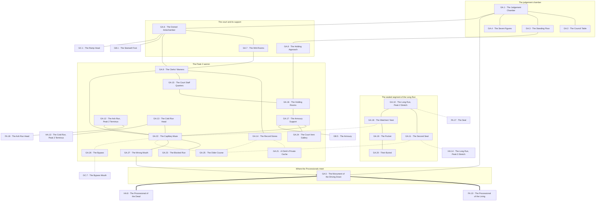

# `GA Grathdun, Peak 2 Main Level Judgement Hall`

**Classification:** DANGEROUS · **Difficulty Die:** d10 · **Tags:** Seven Stone Heroes, The Council Table, Puzzle of Figures

*Region file. Companion to the Drakenhold Setting Outline and the Setting Relational Diagram. Tables are authored at the location-stub pass (procedure step 7); location stubs, outlines and the region relational diagram follow in the engineer phase.*

---

**Overview:** A puzzle of seven figures rather than an obstacle. The chamber is 100 feet across and circular, and seven stone chairs once stood on one side of a great carved stone table where citizens pled their cases and the convicted received judgement. The Living Statues set about the room are not guards — they are heroes of antiquity rendered in stone, each carrying its own trigger: a name spoken, a case properly pled, a debt acknowledged, an oath given. Each holds a reward for a party that meets its need and absolute silence for everyone else. The hall opens to its own domed antechamber with the stairwell down to GB, the great ramp up to GC and the mouths of the Peak 2 servants' passages, which here run to armoury support, clerks and the housing of those who served the court. The Processional of the Living connects west to FA, the Processional of the Dead east to HA.

**Ambiance:** A circular chamber 100 feet across under a shallow dome, acoustically alive — a word spoken at the table returns from the walls a beat later. Seven stone chairs stood on the near side of a great carved circular table; five remain upright. Stone figures stand about the perimeter at intervals, unmoving, facing inward.

**Layout:** The judgement chamber with the table and chairs at its centre, a public standing floor around it, and the statues at the perimeter. The hall opens rearward to a domed antechamber with the stairwell down to GB, the great ramp up to GC and the mouths of the Peak 2 servants' passages, which here run to armoury support, clerks' warrens, court staff quarters, the writ-rooms where judgements were recorded, and the holding rooms where the accused waited. Two main runs connect those zones; the rest is capillary and was meant to be memorised. The Processional of the Living connects west to FA, the Processional of the Dead east to HA. A large region, and the passages are most of it.

**Features:** Seven figures, seven triggers. The Living Statues here are not guards — they are heroes of antiquity rendered in stone, each carrying its own condition: a name spoken, a case properly pled, a debt acknowledged, an oath given. Each holds a reward for a party that meets its need and absolute silence for everyone else. The region is a puzzle of seven rather than an obstacle. The table itself carries the seats of the council cut into its rim, which is where a party first learns the shape of the government that failed.

**Dangers:** The statues do not attack unprovoked and answer damage without limit. The passages hold the same risk as Peak 1's — depth, and losing the way back.

**Creatures:** Living Statues, seven of them, each distinct in bearing and era. Dwarven Survivors in the passages. Nothing patrols here.

**Secrets:** What each statue wants, which is discoverable from the writ-rooms and from HA's obelisk rather than from the statues themselves. Which of the seven chairs was removed and by whom. The clerks' warrens hold the last writs issued before the Breaking, unfiled.

**Treasure:** What the statues give, which is the honest route. The writ-rooms hold no coin and a great deal of value.

---

## CONNECTIONS

*Authored against the Setting Relational Diagram. Edge types: open, gated by tile, gated by rod, hidden, secret, vertical, one-way, conditional on restored mechanism, conditional on faction relation.*

- **FA Takdun** — open. The Processional of the Living, west.
- **HA Thaldun** — open. The Processional of the Dead, east.
- **Servants' passages** — open. Mouths at the domed antechamber, running to Peaks 1 and 3.
- **GB Karmor** — vertical, the stairwell down.
- **GC Azdun** — vertical, the great ramp up.
- **FA Takdun** — gated by tile. The Long Run, at the seal's western face.
- **FA Takdun** — open. The Ash Run, the way around, arriving in this warren.
- **HA Thaldun** — gated by tile. The Long Run, at the second seal's eastern face.
- **HA Thaldun** — open. The Cold Run, east to the dead, and the one artery still in use.
- **GB Karmor** — vertical. The armoury support ways down, arriving inside the arms and behind the formation. Drawn from this side at step 8; the landing is confirmed at GB's own pass.
- **GC Azdun** — secret. The bypass, coming up inside the administrative chambers past the ramp.

## TABLES

**Danger** — d6, presented at 6 on entry, counting down one face with each failed Difficulty roll. Resets to 6 on leaving the region.

| d6 | Danger |
|---|---|
| 6 | **The room answers.** Every word spoken comes back a beat later from a wall nobody is facing. The party is being listened to and the architecture is doing it. |
| 5 | **A statue has moved.** Not much. Not while anyone was watching. The party cannot prove it and cannot unsee it. |
| 4 | **Watched from the warren.** A mouth that was dark is darker. Nothing comes out. Whoever is in there has now decided something about the party. |
| 3 | **The run is occupied.** Voices ahead in the passages, in old dwarven, stopping when the party stops. They are frightened and they are armed and they have been hunted for thirty years. |
| 2 | **Something answered the noise.** The acoustics carried a party's business further than intended — down the stair toward the formation, or up the ramp toward what patrols. |
| 1 | **Provoked.** A statue's condition has been violated, or the pocket has decided the party is the next in a long line. Whichever it is, it is now happening and it does not stop because the party leaves the room. |

## LOCATION STUBS

*Procedure step 7. Code, name and three thematic tags per location. The working note under each is scaffolding for step 8. Block-level material — the arteries, the seal, the survivor pockets and the room budget — lives in `FIRST_LEVEL_BLOCK.md`, which covers FA, GA and HA together because they share a warren.*

*52 rooms budgeted — 12 hall and support, 40 warren. **27 are stubbed**; the balance is unnamed fill inside the stated groupings, at the same proportion ratified for FA.*

**The hall**

### `GA.1 The Judgement Chamber` — 100 Feet Circular, A Word Comes Back, Five Chairs of Seven
*Working note: acoustically alive — a word spoken at the table returns from the walls a beat later, which is engineering and was meant to make lying difficult. Seven stone chairs stood on the near side; five remain upright.*

**Connections:** `GA.2` the council table, at the centre · `GA.3` the standing floor, around it · `GA.4` the seven figures, at the perimeter · `GA.5` the monument, outside and facing in · `GA.6` the domed antechamber, rearward.

### `GA.2 The Council Table` — Seats Cut Into the Rim, The Government That Failed, Two Gone
*Working note: where a party first learns the shape of the seven. Which chair was removed, and by whom, is the hall's quietest question.*

**Connections:** `GA.1` the judgement chamber, at its centre.

### `GA.3 The Standing Floor` — Where Citizens Pled, Worn Stone, Facing the Wrong Way Now
*Working note: the public ground, and the acoustics work from here too. Anything said aloud in this region is heard by the statues.*

**Connections:** `GA.1` the judgement chamber · `GA.8` the holding approach, off the floor.

### `GA.4 The Seven Figures` — Heroes of Antiquity, Each Wants One Thing, Silence Otherwise
*Working note: not guards. Each carries its own trigger — a name spoken, a case properly pled, a debt acknowledged, an oath given — and each holds a reward for a party that meets its need. They do not attack unprovoked and they answer damage without limit. The region is a puzzle of seven rather than an obstacle, and what each wants is discoverable from the writ-rooms and from HA's obelisk, never from the statues.*

**Connections:** `GA.1` the judgement chamber, standing at its perimeter.

### `GA.5 The Monument of the Driving Down` — Mostly Untouched, Bilingual and Complete, The Rosetta Stone
*Working note: where both Processionals meet, outside the chamber and facing it. The longest continuous bilingual surface in Drakenhold, in the hand the waystones taught. The few defacings are late, specific, and each is information about who could not stand to leave that particular thing standing.*

**Connections:** `GA.1` the judgement chamber, which it faces · `FA.10` the Processional of the Living, west · `HA.8` the Processional of the Dead, east. Both roads end here and the monument stands in the join.

### `GA.6 The Domed Antechamber` — The Junction, Stair and Ramp, The Court's Own Mouths
*Working note: as FA.9, and busier in its day. The passage mouths here are narrower and better finished, because clerks used them rather than porters.*

**Connections:** `GA.1` the judgement chamber, forward · `GB.1` the stairwell foot — **vertical**, down · `GC.1` the ramp head — **vertical**, the great ramp up · `GA.7` the writ-rooms · `GA.9` the clerks' warrens. The mouths here are narrower and better finished than Peak 1's.

### `GA.7 The Writ-Rooms` — Judgements Recorded, The Last Writs Unfiled, No Coin and Great Value
*Working note: the hall's real treasure. The last writs issued before the Breaking were never filed, and among them is what the statues want.*

**Connections:** `GA.6` the antechamber · `GA.9` the clerks' warrens.

### `GA.8 The Holding Approach` — Where the Accused Waited, Marked Walls, Down to GB
*Working note: names, dates and grievances scratched by people with time. The unofficial record of the last years, written by the losing side.*

**Connections:** `GA.3` the standing floor, above · `GA.16` the holding rooms, below.

**The warren**

### `GA.9 The Clerks' Warrens` — Fine Cutting, Close Quarters, Paper Everywhere Once
*Working note: the best-finished ground in any of the three warrens, because the people who used it could read.*

**Connections:** `GA.6` the antechamber · `GA.7` the writ-rooms · `GA.14` the record stores · `GA.15` the court staff quarters · `GA.22` the capillary maze.

### `GA.10 The Long Run — Peak 2 Stretch` — Behind the Seal, Occupied, Do Not Announce Yourself
*Working note: the sealed segment. People live in here and have for thirty years, and they hear everything that comes down the run from either end.*

**Connections:** `FA.17` the seal, west — **gated by tile** · `GA.11` the second seal, east — **gated by tile** · `GA.18` the watchers' nest. A corridor with a locked door at each end and nothing else opening onto it.

### `GA.11 The Second Seal` — The Eastern Face, A Copy Exists, Held By Someone Frightened
*Working note: the far end of the sealed segment, toward Peak 3. The pocket's tile opens both faces and they use it as little as they can bear to.*

**Connections:** `GA.10` the sealed segment, west — **gated by tile** · `HA.14` the Long Run's Peak 3 stretch, east — **gated by tile** · `GA.25` the older course — **hidden**, running under the seal's own threshold.

### `GA.12 The Ash Run — Peak 2 Terminus` — Hot, Foul, The Way Around Arrives Here
*Working note: where a party without the tile comes out. Longer, worse, and it works.*

**Connections:** `FA.18` the Ash Run head in the Peak 1 warren, west · `GA.22` the capillary maze. Where a party without the tile comes out, and it comes out in the wrong peak for anywhere it was going.

### `GA.13 The Cold Run Head` — Cut for Stretchers, One Direction of Travel, East to the Dead
*Working note: the G→H artery. Wider than it needs to be and sloped, and everything that ever went along it went the same way.*

**Connections:** `GA.22` the capillary maze · `HA.13` the Cold Run's Peak 3 terminus, east. Sloped, and everything that ever went along it went the same way.

### `GA.14 The Record Stores` — Rank on Rank, Mostly Ruined, Mostly
*Working note: procedural ground with pockets. What survives is administrative and damning.*

**Connections:** `GA.9` the clerks' warrens · `GA.21` a clerk's private cache — **hidden** · `GA.25` the older course — **hidden**.

### `GA.15 The Court Staff Quarters` — Better Rooms Than Peak 1, Still Not Citizens, Left Tidy
*Working note: they had more and were counted no more than the porters were. They left in order, which tells its own story.*

**Connections:** `GA.9` the clerks' warrens · `GA.16` the holding rooms.

### `GA.16 The Holding Rooms` — Below the Court, Scratched Walls, Doors That Still Work
*Working note: the doors still shut and still lock, which makes this the one place in the warren a party can be trapped by something with hands.*

**Connections:** `GA.8` the holding approach, above · `GA.15` the court staff quarters · `GA.17` the armoury support.

### `GA.17 The Armoury Support` — Ways Down to GB, Racks Stripped, Drag Marks
*Working note: how the loyalists were supplied during the last stand, and how what was left came back up. The drag marks go one way.*

**Connections:** `GA.16` the holding rooms · `GA.22` the capillary maze · `GA.24` the court vent gallery · `GB.5` the armoury — **vertical**, the ways down, and the drag marks go one way.

### `GA.18 The Watchers' Nest` — Sightlines Onto the Run, Recently Used, Cold Fire
*Working note: the Peak 2 pocket's listening post. They are the most hunted of the three groups and it shows in how well this is sited.*

**Connections:** `GA.10` the sealed segment · `GA.19` the pocket · `GA.22` the capillary maze — **hidden**, the one run they kept and the reason they can watch it.

### `GA.19 The Pocket` — Nine of Them, Armed Badly, Will Not Open the Seal
*Working note: the largest thing living in the warren and the most hostile. They will not treat with anyone until they have watched them at length, they will not open the seal for visitors, and the tile is on one person who does not sleep near the others. They know the true layout of Drakenhold better than anyone alive.*

***The tile works for whoever holds it.** A party that takes it by force opens the Long Run permanently and buys the block's single greatest movement advantage in one afternoon, and that is a legitimate line of play. It is priced. Nine people lose the only thing keeping them alive. Word goes east down the Cold Run, because it is the one artery that still gets used, and the Peak 3 pocket — the largest of the three, and the one with something the party will badly want later — hears about it before the party arrives. Earning it is slower and cheaper. The module never says which is correct.*

**Connections:** `GA.18` the watchers' nest · `GA.20` their buried.

### `GA.20 Their Buried` — Thirty Years of Them, Cut Niches, Names in a Poor Hand
*Working note: more than Peak 1's, fewer than Peak 3's. The hand that cut the names got better over the years, which is the saddest object on the level.*

**Connections:** `GA.19` the pocket. Their ground, and nothing else opens onto it.

### `GA.21 A Clerk's Private Cache` — Copies Nobody Authorised, Sealed Against Damp, Still Legible
*Working note: somebody in the writ-rooms was keeping their own copies of things, unauthorised, over years. The warren's documentary prize.*

*It bears on the ban. The Crown's administrative record in GC and the guild account in FE disagree on one specific point, and each side's version is self-serving in a way that is obvious once both are read. **This is the third account, written by nobody with anything to gain, and it settles it.** The clerk who kept it was not important and did not survive. Cross-referenced into GC and FE at their location passes.*

**Connections:** `GA.14` the record stores — **hidden**. Sealed against damp, in a wall nobody had reason to open.

### `GA.22 The Capillary Maze` — Dense, Featureless, Built to Be Memorised
*Working note: the largest grouping and the emptiest. Depth and disorientation.*

**Connections:** `GA.9` the clerks' warrens · `GA.12` the Ash Run terminus · `GA.13` the Cold Run head · `GA.17` the armoury support · `GA.23` the blocked run · `GA.27` the wrong mouth · `GA.18` the watchers' nest — **hidden** · `GA.25` the older course — **hidden** · `GA.26` the bypass — **hidden**.

### `GA.23 The Blocked Run` — Deliberate, From the Far Side, Somebody Wanted This Shut
*Working note: not a collapse. Filled and faced from the inside by the pocket itself, years ago, in a hurry — one more capillary they decided they could not watch. There is nothing behind it but more warren. The information is that they did it: nine frightened people have spent thirty years making their ground smaller on purpose, and a party can read the whole shape of their retreat off the blockings if it thinks to look for more of them.*

**Connections:** `GA.22` the capillary maze. Filled and faced from the far side, and there is nothing behind it but more warren.

### `GA.24 The Court Vent Gallery` — Air From Below, Warm and Wrong, Down Toward GB
*Working note: contact with the shafts serving the prison half of GB, and a way to hear things from very far down at irregular intervals.*

**Connections:** `GA.17` the armoury support. Contact with the shafts, not a way onto them.

### `GA.25 The Older Course` — Plainer Stone Under a Doorway, No Clan Mark, Again
*Working note: as FA.34. The condition surfaces here too, in perhaps eight places, and one of them is under the second seal.*

**Connections:** `GA.11` the second seal · `GA.14` the record stores · `GA.22` the capillary maze — **hidden** at all three, and in perhaps five places more.

### `GA.26 The Bypass` — A Capillary That Reaches, Comes Up Inside GC's Administration, The Warren's Standing Reward
*Working note: the warren's standing reward on this peak. It arrives in the administrative chambers around the throne room, past the ramp and past whatever is on it.*

**Connections:** `GA.22` the capillary maze — **hidden** · `GC.7` the bypass mouth in the administration — **secret**, past the ramp and past whatever is on it.

### `GA.27 The Wrong Mouth` — Opens Onto the Processional, Unmarked From That Side, One-Way in Practice
*Working note: a warren mouth that comes out on the exposed road. Useful, and useful to be aware of before something uses it in the other direction.*

**Connections:** `GA.22` the capillary maze · `GA.5` the monument, out onto the Processional — **one-way in practice**, because nothing marks it from that side.

## REGION RELATIONAL DIAGRAM

*Procedure step 8. Drawn from the stubs, before the location outlines. Reconciled against the finished outlines before the region closes. The diagram is authoritative: the **Connections:** field under each stub is checked against it, never the reverse. Worked as one block with the other two main levels against `blocks/FIRST_LEVEL_BLOCK.md`, because the three share a warren.*

**Reading the diagram.** Solid edges are open passage. The two heavy edges are the Processionals, and they meet at `GA.5` — the monument stands in the join and faces the chamber. Dotted edges are hidden, secret or tile-gated; `GA.10`–`FA.17` and `GA.11`–`HA.14` are the two faces of the seal. The single arrow is `GA.27`, which comes out onto the Processional and cannot be found from it.

**What the drawing found.**

- **The sealed segment touches the Peak 2 warren once, and the pocket is sitting on that one edge.** `GA.10` and `GA.11` are a corridor with a tile lock at each end. The only other way in is `GA.22`–`GA.18` — hidden, and the watchers' nest is on it. This is the answer to the question `GA.19` posed at step 7 and never resolved: a party can reach the nine and take the tile by force without holding a tile first, and every approach to them crosses the ground they watch. **They see the party coming, every time, and that is not a Referee ruling — it is the shape of the graph.**
- **The Long Run is transit and nothing else.** Tile in hand, a party walks `FA.17`→`GA.10`→`GA.11`→`HA.14` and passes under the whole hold without entering a single warren, meeting nothing but the nine, and being seen by no one else. That is the movement advantage the block document promises, and the drawing shows it is not a shortcut through Peak 2 — it is a road that never enters Peak 2 at all.
- **The Ash Run and the Cold Run do not touch each other.** `GA.12` and `GA.13` both hang off `GA.22`, the capillary maze — the largest and emptiest grouping in the warren. A party crossing from Peak 1 to Peak 3 without the tile must come out of the Ash Run, cross the maze, and find the Cold Run head, and the maze is the part with no landmarks in it. The seal's answer is priced in the middle of the route rather than at either end.
- **`GA.22` is the region's real hub and it is the region's emptiest ground.** Nine edges — more than the antechamber, more than the chamber. Every artery, the bypass, the older course, the blocked run and the way to the pocket all hang off featureless capillary warren built to be memorised. The party's map problem and the party's opportunity are the same room.
- **`GA.17` is a second way into `GB`, and it lands behind the formation.** The stub said *ways down to GB* and the drawing makes it an edge onto `GB.5`, the armoury — which is the door `GB.3`'s ranks are dressed and facing. The stairwell at `GB.1` is watched from the first step; the armoury support ways are how the loyalists were supplied during the last stand and how what was left came back up. Priced: it arrives inside the arms, with the formation between the party and the stair. **Flagged for `GB`'s own pass** — the edge is written from `GA`'s side and `GB` should confirm the landing.
- **The court has three ways down into the warren and one of them is a hole in the wall.** `GA.6` the antechamber, `GA.8` the holding approach, and `GA.27` the wrong mouth, which opens onto the exposed Processional and is unmarked from that side. A party being followed along the Processional can vanish into the warren; a party in the warren cannot use it to get onto the Processional unseen, because it does not know it is there until it comes out of it.
- **`GA.21` is hidden off the record stores and not off the writ-rooms.** The clerk who kept unauthorised copies kept them where the ruined bulk was, not where the important papers were, which is why nobody looking for records ever found them and why they are still legible.

**Route ends recorded.** Nine edges leave region `GA`. `FA.10`–`GA.5` and `GA.5`–`HA.8` are the Processionals. `GA.6`–`GB.1` and `GA.6`–`GC.1` are the stair and the ramp. `GA.17`–`GB.5` is new at this pass and flagged above. `GA.26`–`GC.7` is the bypass. `GA.10`–`FA.17`, `GA.11`–`HA.14` and `GA.12`–`FA.18` are the arteries, drawn from both ends at this pass.
