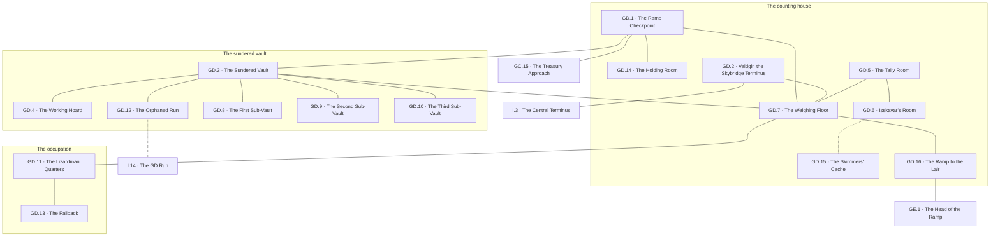

# `GD Valdmor, Peak 2 Level 3 Treasure Vaults`

**Classification:** DANGEROUS · **Difficulty Die:** d8 · **Tags:** The Working Hoard, Royal Locks, Skybridge Terminus

*Region file. Companion to the Drakenhold Setting Outline and the Setting Relational Diagram. Tables are authored at the location-stub pass (procedure step 7); location stubs, outlines and the region relational diagram follow in the engineer phase.*

---

**Overview:** The hoard, and the toll gate on the only horizontal crossing in the hold. The main vault has been sundered and holds the working hoard — the moving river of tribute rather than the settled wealth. Three sub-vaults remain intact behind Royal locks, each demanding a different combination of rods, one still lethally warded and one holding something that is not treasure at all. Lizardmen hold the level, running the tribute in and the skim out, and they will assess a party for tribute value before reaching for anything. GD is one of the three horizontal termini of the Skybridge, which means the direct route between peaks runs through the dragon's counting house. That is the design.

**Ambiance:** Lamplight, because the Lizardmen keep it lit. The sundered main vault is a hole in the architecture with a slope of coin and plate running out of it. Everything smells of reptile and hot metal. There is traffic here — this is the only region inside the hold that is busy.

**Layout:** The sundered main vault holding the working hoard, three intact sub-vaults behind Royal locks off it, checkpoint chambers at the ramp and at the Skybridge terminus, and Lizardman quarters. Around thirty rooms. GD is one of the three horizontal termini of the Skybridge, which means the direct route between peaks runs through the dragon's counting house. That is the design.

**Features:** The working hoard, which is the moving river of tribute rather than settled wealth, and which is counted. Three sub-vaults, each demanding a different combination of rods, one still lethally warded, one holding something that is not treasure at all. The checkpoint and the toll, and the fact that the Lizardmen will assess before they reach for anything.

**Dangers:** The ward on the second sub-vault, which is Runemaster work and has killed. Theft at scale, which is one of the three things that wakes Vermakith. The Lizardmen, who are competent and organised and have somewhere to fall back to.

**Creatures:** Lizardmen in force, running the tribute in and the skim out. A commander among them who is doing the skimming and has more to lose from exposure than from a fight.

**Secrets:** The skim, and the account of it the commander keeps because he does not trust his own people. Which rods each sub-vault wants, recoverable from GC and FE. What is in the third sub-vault, which is not treasure and which the Lizardmen have never opened.

**Treasure:** The working hoard, which is enormous and counted and cannot be quietly reduced. The sub-vaults, which are the settled wealth of the royal house and are not counted by anyone still alive.

---

## CONNECTIONS

*Authored against the Setting Relational Diagram. Edge types: open, gated by tile, gated by rod, hidden, secret, vertical, one-way, conditional on restored mechanism, conditional on faction relation.*

- **GC Azdun** — vertical, the great ramp down.
- **GE Azith** — vertical, the great ramp up.
- **I Brynaz** — gated by tile, conditional on faction. The Skybridge's central terminus, checkpointed. The direct route between peaks runs through the dragon's counting house.
- **I Brynaz** — conditional on mechanism, vertical. A second, intact Skybridge run arrives inside the vaults without passing the checkpoint. Its approach is gone and restoring it is a mechanism problem.
- **The three sub-vaults** — gated by rod, Royal tier, each a different combination. Within-region.

## TABLES

**Danger** — d6, presented at 6 on entry, counting down one face with each failed Difficulty roll. Resets to 6 on leaving the region.

| d6 | Danger |
|---|---|
| 6 | **Traffic.** Lizardmen moving loads across the floor on business, lamplight, and the ordinary noise of a place that works. The party is assessed on sight and not stopped. |
| 5 | **Assessed.** A checkpoint question about what the party is carrying and what it is worth. It is a transaction, it is answerable, and the answer is recorded. |
| 4 | **The count is taken.** The hoard is tallied against the ledger while the party is standing on it. Anything already lifted is now a discrepancy with a witness and a date. |
| 3 | **The commander takes an interest.** Isskavar, personally, wanting to know who the party has spoken to below. He is not investigating them. He is finding out whether the skim is exposed. |
| 2 | **The ward answers.** Runemaster work on the second sub-vault, provoked by proximity rather than by touch. It has killed and it was built to. |
| 1 | **Theft at scale, and it has been noticed.** The discrepancy is reported upward, and reporting it upward means the crater. Everything after this is measured against how long it takes something enormous to wake and come down one ramp. |

## LOCATION STUBS

*Procedure step 7. Code, name and three thematic tags per location. The working note under each is scaffolding for step 8. Block-level material lives in `PEAK_2_BLOCK.md`.*

*30 rooms budgeted; **16 are stubbed as locations** and the balance is unnamed fill — emptied strongrooms, barrack rooms, load bays, the plundered ordinary of a treasury that has been robbed once already.*

**The counting house**

### `GD.1 The Ramp Checkpoint` — Lit, Manned, Somebody Asks
*Working note: the first place in Drakenhold where a party is dealt with as a supplier rather than as an intruder. It is a transaction. Being unable to answer it is the danger, not being refused.*

**Connections:** `GC.15` the treasury approach below — **vertical**, the great ramp down · `GD.3` the sundered vault · `GD.7` the weighing floor · `GD.14` the holding room. It is a transaction, and being unable to answer it is the danger.

### `GD.2 Valdgir, the Skybridge Terminus` — Tile-Gated, Checkpointed, The Only Crossing There Is
*Working note: the hoard-gate. The Skybridge's central terminus and the only horizontal route between peaks in the hold, which means the direct road runs through the dragon's counting house. **That is the design.** The far end of `FD.15`, on the same schedule.*

**Connections:** `GD.7` the weighing floor · `I.3` the central terminus — **gated by tile, conditional on faction**. The only horizontal crossing there is, and the far end of Peak 1's terminus on the same schedule.

### `GD.3 The Sundered Vault` — A Hole in the Architecture, Torn Not Opened, Thirty Years Ago
*Working note: the main vault, opened by something that did not need a key. A slope of coin and plate running out of the breach, and the breach itself is the clearest single record of what arrived here in the year of the Descent.*

**Connections:** `GD.1` the ramp checkpoint · `GD.4` the working hoard, running out of the breach · `GD.7` the weighing floor · `GD.12` the orphaned run, landing inside · `GD.8` the first sub-vault — **gated by rod** · `GD.9` the second sub-vault — **gated by rod** · `GD.10` the third sub-vault — **gated by rod**.

### `GD.4 The Working Hoard` — Enormous, Moving, Counted
*Working note: the river rather than the reservoir. It is *counted*, which is the fact that matters — it cannot be quietly reduced, and the difference between lifting from here and lifting from a sub-vault is the difference between a haul and a war.*

**Connections:** `GD.3` the sundered vault. It is counted, which is the fact that matters.

### `GD.5 The Tally Room` — Two Ledgers, One Official, Both in the Same Claw
*Working note: the other half of `FB.17`. The declared count and the real one, kept side by side by a commander who does not trust his own people to lie consistently. This is the proof, and it is worth more as a lever than as a revelation.*

**Connections:** `GD.7` the weighing floor · `GD.6` Isskavar's room. Two ledgers side by side, in the same claw.

### `GD.6 Isskavar's Room` — The Commander, Skimming, More to Lose Than a Fight Costs
*Working note: competent, unhurried, and holding a position he cannot afford to have examined. He will deal, and what he wants is silence. A party that understands this owns the only checkpoint in the hold without drawing a weapon.*

**Connections:** `GD.5` the tally room · `GD.15` the skimmers' cache — **hidden**, where he can reach it and his people cannot.

### `GD.7 The Weighing Floor` — Tribute In, Assessed, Nobody Is Ever Short Twice
*Working note: where the chain terminates before its last climb. Kobold grain, lizardman plunder and whatever the party brought, all measured on the same stones.*

**Connections:** `GD.1` the ramp checkpoint · `GD.2` Valdgir · `GD.3` the sundered vault · `GD.5` the tally room · `GD.11` the Lizardman quarters · `GD.16` the ramp to the lair. Everything on this level is weighed here before it goes anywhere.

**The sub-vaults**

### `GD.8 The First Sub-Vault` — Royal Lock, Three Rods, Settled Wealth
*Working note: the achievable one. Its combination is named on `GC.12`, two of its rods are at `FE.6`, and it holds the royal house's settled wealth — not counted by anyone still alive, which is the whole point.*

**Connections:** `GD.3` the sundered vault — **gated by rod**, Royal tier, three rods. Its combination is named on the Crown's own key-list, two levels down.

### `GD.9 The Second Sub-Vault` — Warded, Runemaster Work, It Has Killed
*Working note: the lethal one, and the ward is provoked by proximity rather than by the lock. It can be read by anyone who learned the script on the road, and what it says is a warning rather than a riddle. The module gives fair notice and then means it.*

**Connections:** `GD.3` the sundered vault — **gated by rod**, Royal tier. The ward is provoked by proximity rather than by the lock, and it has killed.

### `GD.10 The Third Sub-Vault` — Never Opened by Anyone Here, Not Treasure, The Lizardmen Do Not Care
*Working note: the reason the Lizardmen have left one Royal lock alone for thirty years is that they got it open once, looked in, and found nothing they could sell. **Artifact piece four is here**, put in by somebody with Royal authority in the season of the Breaking, which is a fact about who was hiding the pieces and a fact the Lizardmen are structurally incapable of noticing. They got the lock open once, looked in, found nothing they could sell, and have not been back.*

**Connections:** `GD.3` the sundered vault — **gated by rod**, Royal tier. They got it open once, found nothing they could sell, and have not been back.

**The occupation**

### `GD.11 The Lizardman Quarters` — In Use, Ordinary, Domestic
*Working note: they live here. Bedding, food, small property, arguments. The module's one chance to show the occupying faction as people who are also somebody's employees.*

**Connections:** `GD.7` the weighing floor · `GD.13` the fallback. They live here.

### `GD.12 The Orphaned Run` — An Intact Bridge Arriving Inside, Approach Gone, Nobody Watches It
*Working note: the second Skybridge run, landing within the vaults past the checkpoint. Restoring the approach is a mechanism problem and the reward is the toll gate rendered irrelevant — a way in, and far more importantly a way *out* with a load.*

**Connections:** `GD.3` the sundered vault · `I.14` the GD run — **conditional on mechanism, vertical**. It lands past the checkpoint and nobody watches it.

### `GD.13 The Fallback` — Prepared, Defensible, Where They Go If It Goes Wrong
*Working note: they are organised and they have thought about losing. Taking GD by force means taking it twice.*

**Connections:** `GD.11` the Lizardman quarters. Prepared, defensible, and taking GD by force means taking it twice.

### `GD.14 The Holding Room` — Where Assessed Parties Wait, Not a Cell, The Door Is Not Locked
*Working note: they assess before they act, and this is where a party sits while somebody upstairs decides. The unlocked door is the point and most parties will not believe it.*

**Connections:** `GD.1` the ramp checkpoint. Not a cell, and the door is not locked.

### `GD.15 The Skimmers' Cache` — Off the Ledger, Off the Route, Off the Books Twice
*Working note: what has come off the top over thirty years, held where the commander can reach it and his people cannot. Portable, uncounted, and its loss cannot be reported by anyone.*

**Connections:** `GD.6` Isskavar's room — **hidden**. Off the ledger, off the route, and its loss cannot be reported by anyone.

### `GD.16 The Ramp to the Lair` — Up, Checkpointed, Carried Not Walked
*Working note: the tribute's last climb, and the only approach to `GE` that is not a hole or a servants' passage. Nobody goes up it empty-handed and nothing comes back down it.*

**Connections:** `GD.7` the weighing floor · `GE.1` the head of the ramp above — **vertical**, checkpointed. Nobody goes up it empty-handed and nothing comes back down it.

## REGION RELATIONAL DIAGRAM

*Procedure step 8. Drawn from the stubs, before the location outlines. Reconciled against the finished outlines before the region closes. The diagram is authoritative: the **Connections:** field under each stub is checked against it, never the reverse. Worked as one block with the other three levels of Peak 2 against `blocks/PEAK_2_BLOCK.md`, because one thing moves through all four.*

**Reading the diagram.** Solid edges are open floor, and there is a great deal of it — this is the only busy region in the hold and its locks are on rooms rather than on routes. The rod-gated edges are the three sub-vaults, all hanging off `GD.3`. The two dotted edges are the skimmers' cache and the orphaned Skybridge run.

**What the drawing found.**

- **`GD.7` is the hub, not `GD.3`, and that is the whole character of the level.** Six edges: the checkpoint, Valdgir, the sundered vault, the tally room, the quarters and the ramp to the lair. **The weighing floor and not the treasure is the centre of the graph**, because on this level a party is a supplier rather than an intruder and everything that moves is measured before it goes anywhere. A region whose busiest node is a set of scales is a region that has told the party how to behave without saying anything.
- **The only horizontal crossing in the hold is two edges from the dragon's ramp.** `I.3`–`GD.2`–`GD.7`–`GD.16`–`GE.1`. A party crossing between peaks walks the counting house floor and passes the foot of the last climb on its way through. That is the design and the drawing makes the distance exactly as short as the block document claims.
- **`GD.3` carries all three Royal locks and the orphaned run, and the orphaned run is the answer to all three.** `I.14`–`GD.12`–`GD.3` lands inside the vaults past the checkpoint and nobody watches it. It does not open a sub-vault — it means that what comes out of one never has to cross `GD.7` to leave. **The gate here is not the lock, it is the count**, and the answer that is not the gate is a way *out* rather than a way in.
- **The skim is a chain of three and the party can enter it at either end.** `GD.7`→`GD.5`→`GD.6`→`GD.15`, with the cache hidden behind the commander. `FB.17` is the kobolds' half of the same proof, four levels down and unreadable to the people holding it. A party that has both is standing at both ends of the only lever in Drakenhold that moves an entire faction without a fight.
- **`GD.14` hangs off the checkpoint and off nothing else, and its door is not locked.** The holding room is a leaf attached to the first thing a party meets — which means being assessed costs a party its position and nothing else, and walking out of an unlocked room is available from the first minute. Most parties will not believe it, and the graph is the module quietly promising it is true.
- **The fallback is behind the quarters, not behind the vault.** `GD.7`→`GD.11`→`GD.13`. They fall back through where they live rather than through what they are guarding, which is what an occupying garrison actually does and is why taking `GD` by force means taking it twice.
- **`GD.10` is drawn identically to `GD.8` and `GD.9`, and that is deliberate.** Three rod-gated edges off the same room, indistinguishable from the outside. The one holding an artifact piece is the one the Lizardmen already opened, looked into, and lost interest in. **Nothing in the topology marks it**, and nothing should.

**Route ends recorded.** Four edges leave region `GD`. `GC.15`–`GD.1` is the great ramp and `GD.16`–`GE.1` the last climb. `GD.2`–`I.3` is Valdgir, tile-gated and checkpointed; `GD.12`–`I.14` is the orphaned run. `I` reciprocates both at its own pass.
