# `HA Thaldun, Peak 3 Main Level Celebration Hall`

**Classification:** DANGEROUS · **Difficulty Die:** d8 · **Tags:** The Black Obelisk, Name-Index of the Dead, Signs of the Breaking

*Region file. Companion to the Drakenhold Setting Outline and the Setting Relational Diagram. Tables are authored at the location-stub pass (procedure step 7); location stubs, outlines and the region relational diagram follow in the engineer phase.*

---

**Overview:** A name-index for a setting where names open doors. The 200-foot oval Celebration Hall echoes the Judgement Hall in construction and carries small signs of the Breaking rather than of the dragon. Just outside it, a gathering area surrounds an obelisk of glossy black stone that carries the honoured dead of Drakenhold cut in full — defaced in places during the Breaking, and worth returning to again and again as the party learns which names they need. From the gathering area the path runs west along the Processional of the Dead toward GA, and to the antechamber holding the stairwell down to HB and the great ramp up to HC, with the Peak 3 servants' passages running into funerary support, vestries and the quarters of those who tended both the dead and the Runemasters. The d8 across a large main level is deliberate pressure: Peak 3 is harder ground, worse damaged, and a party that arrives here has usually come a long way to do it.

**Ambiance:** A 200-foot oval under a higher dome than the Judgement Hall, built for song. The stone is darker here. Signs of the Breaking rather than of the dragon — weapon-marks, hasty barricades pulled down long ago, a floor scrubbed by somebody after the fact. Outside the hall, the obelisk of glossy black stone takes what light there is and gives none back.

**Layout:** The Celebration Hall, with a gathering area outside it surrounding the obelisk. From the gathering area the path runs west along the Processional of the Dead toward GA, and to the antechamber holding the stairwell down to HB and the great ramp up to HC. The Peak 3 servants' passages run from the antechamber into themed zones — funerary preparation and its cold rooms, the vestries, the vestment and vessel stores, the Runemasters' own service warren, and the quarters of those who tended both the dead and the living scholars. Two main runs, everything else capillary. A large region, and the passages are most of it. The d8 across that scale is deliberate pressure.

**Features:** The obelisk, which carries the honoured dead of Drakenhold cut in full — a complete name-index for a setting where names open doors, defaced in places during the Breaking, and worth returning to again and again as the party learns which names it needs. The hall itself, which was where the hold gathered and where something happened during the Breaking that the scrubbed floor is evidence of.

**Dangers:** The passages, and the fact that Peak 3 is worse damaged than the other two — collapse, blocked runs, and routes that end where the plan says they continue.

**Creatures:** Dwarven Survivors in the passages, more of them here than in the other peaks, because this is where their dead are. Little else standing.

**Secrets:** Which names on the obelisk were struck and which were never cut. That Torvin Ganthur is not on it. What was scrubbed off the hall floor. The passages hold the survivors' own burials, given no crypt anywhere else.

**Treasure:** Vestments, vessels and funerary goods in the service zones. Nothing in the hall.

---

## CONNECTIONS

*Authored against the Setting Relational Diagram. Edge types: open, gated by tile, gated by rod, hidden, secret, vertical, one-way, conditional on restored mechanism, conditional on faction relation.*

- **GA Grathdun** — open. The Processional of the Dead, west.
- **Servants' passages** — open. Mouths at the antechamber, running to Peaks 1 and 2.
- **HB Nurmor** — vertical, the stairwell down.
- **HC Sigdun** — vertical, the great ramp up.
- **The obelisk and gathering area** — open, outside the hall. Within-region.
- **GA Grathdun** — gated by tile. The Long Run, at the second seal.
- **GA Grathdun** — open. The Cold Run, west, sloped and cut for stretchers.
- **HC Sigdun** — open, vertical. The scholars' stair, a servants' route upward that is not the great ramp. Its landing above is fixed at HC's own pass.
- **HC Sigdun** — secret. The bypass, coming up in the chapel's side cells.
- **HB Nurmor** — hidden, vertical. The crypt access, warded from this side.
- **HB Nurmor** — hidden. The survivors' burials, which are one continuous cutting through both regions.

## TABLES

**Danger** — d6, presented at 6 on entry, counting down one face with each failed Difficulty roll. Resets to 6 on leaving the region.

| d6 | Danger |
|---|---|
| 6 | **Darker than it should be.** The stone here takes light and does not give it back. Torches read as half their range and nobody can say whether that is the rock or not. |
| 5 | **Tended.** Something in this region has been cleaned, straightened or cared for recently. It was not the party and it was not thirty years ago. |
| 4 | **The plan is wrong.** A run ends where it should continue. The damage is old, the detour is long, and the party's map is now a liability. |
| 3 | **Watched, and counted.** The pocket has been following since the antechamber. They do not approach. They are deciding, and what they decide rests entirely on how the party has treated the dead so far. |
| 2 | **Sound from far above.** Down the Runemasters' service runs, from a great height, something that is nearly words. Nobody has to make a Test yet. Nobody feels better. |
| 1 | **Cut off in bad ground.** A collapse behind, a rerouted way that goes nowhere, and the worst-mapped warren in the hold. Movement is now the problem and it will stay the problem. |

## LOCATION STUBS

*Procedure step 7. Code, name and three thematic tags per location. The working note under each is scaffolding for step 8. Block-level material — the arteries, the seal, the survivor pockets and the room budget — lives in `FIRST_LEVEL_BLOCK.md`, which covers FA, GA and HA together because they share a warren.*

*63 rooms budgeted — 18 hall and support, 45 warren. **33 are stubbed**; the balance is unnamed fill inside the stated groupings. Peak 3 is worse damaged than the other two and the fill here includes runs that end where the plan says they continue.*

**The hall**

### `HA.1 The Celebration Hall` — 200-Foot Oval, Built for Song, Darker Stone
*Working note: a higher dome than the Judgement Hall and tuned for voices rather than for testimony. The stone is darker here and the hall is the first place a party feels Peak 3 as a different country.*

**Connections:** `HA.2` the scrubbed floor, at the edge of it · `HA.3` the singers' gallery, above · `HA.4` the gathering area, outside.

### `HA.2 The Scrubbed Floor` — Blood Taken Up Properly, A Voice Left Behind, Somebody Came Back
*Working note: signs of the Breaking rather than of the dragon — weapon-marks, barricades pulled down long ago, and a stretch of floor scrubbed by somebody who returned afterward and did it properly. What came up was blood, a great deal of it, and the scrubbing is respectful rather than concealing.*

*What did not come up is the more important thing. Low on the wall at the edge of the scrubbed ground, in charcoal and a poor hand, someone wrote against what happened here — not a lament and not a warning, but an argument, addressed to people who were in the room and disagreed. It is unsigned, it is in plain dwarven rather than formal script, and it is the only dissenting voice from the Breaking recorded anywhere in Drakenhold. The survivors know it is there. They have never cleaned it off and they did not write it.*

***The writer is never identified and no thread in the module leads to them.** That is the content. Everything else about the Breaking is recoverable from more than one side because the people who made it were important enough to leave records; this is the one account from somebody who was simply in the room, and the hold was in enough chaos that nobody noticed who. A party that goes looking will find the search itself instructive and will not find a name.*

**Connections:** `HA.1` the celebration hall, on its floor.

### `HA.3 The Singers' Gallery` — Above the Floor, Instruments Left, Acoustically Placed
*Working note: the hall's purpose made concrete. Whatever happened here happened while this was occupied, and the gallery has the best sightline in the region onto HA.2.*

**Connections:** `HA.1` the celebration hall, above the floor and looking down on it.

### `HA.4 The Gathering Area` — Outside the Hall, Open Ground, Where the Hold Assembled
*Working note: the junction of the hall, the obelisk, the Processional and the antechamber. Everything on this level begins here.*

**Connections:** `HA.1` the celebration hall · `HA.5` the black obelisk · `HA.10` the domed antechamber · `HA.8` the Processional of the Dead, west. Everything on this level begins here.

### `HA.5 The Black Obelisk` — Every Honoured Dead, Cut in Full, Struck in Places
*Working note: the name-index for a setting where names open doors. Glossy black stone that takes what light there is and gives none back. Worth returning to again and again as the party learns which names it needs — including Brannek Kelmor, cut small and easily missed, and a party that buried him at Thornhaven will recognise him here. **Torvin Ganthur is not on it.**

**Connections:** `HA.4` the gathering area · `HA.6` the struck names, on its faces · `HA.7` the uncut spaces, on its blank courses.

### `HA.6 The Struck Names` — Chiselled Out, Not All in One Hand, Not All at Once
*Working note: some were struck during the Breaking and some later, by different people with different grievances. Which names, and which hand, is the obelisk's second reading.*

**Connections:** `HA.5` the obelisk, cut into it.

### `HA.7 The Uncut Spaces` — Prepared Surface, Never Inscribed, Room Left for More
*Working note: the hold expected to keep going. The blank courses are the quietest statement of the loss in the module.*

**Connections:** `HA.5` the obelisk, prepared and never inscribed.

### `HA.8 The Processional of the Dead` — Reveres the Ancestors, Carves the Wedge Plainly, Read or Be Caught
*Working note: six rooms' length running west to the monument. It honours the foreknowledge and wisdom of those who came before while carving, without comment, the literal wedge that was driven between them and that came down. Exposed the whole way, dangerous to anyone who crosses it wrongly, and secrets are cut into its walls for anyone who walks it as a reader.*

**Connections:** `HA.4` the gathering area, east · `HA.9` the wedge, within the run · `HA.33` the wrong mouth, unmarked from this side · `GA.5` the Monument of the Driving Down, west, where the two Processionals meet.

### `HA.9 The Wedge` — The Carving Itself, Literal, Nobody Ever Explained It
*Working note: within the Processional. A wedge, driven, shown coming apart — carved centuries before there was anything to warn about, which is either foreknowledge or coincidence and the hold believed the first.*

**Connections:** `HA.8` the Processional, within it.

### `HA.10 The Domed Antechamber` — The Junction, Stair and Ramp, Mouths Into Service
*Working note: as FA.9 and GA.6. The mouths here served both the dead and the scholars, which is why there are more of them.*

**Connections:** `HA.4` the gathering area, forward · `HB.1` the stairwell foot — **vertical**, down · `HC.1` the ramp head — **vertical**, the great ramp up · `HA.11` the vestry approaches · `HA.15` the funerary preparation rooms · `HA.18` the Runemasters' service warren. More mouths than either other antechamber, because these served both the dead and the scholars.

### `HA.11 The Vestry Approaches` — Robing, Preparation, Order of Procession
*Working note: how the hold's ceremonies were staged, and the written order of who walked where — which is a ranking of the whole society, in one document.*

**Connections:** `HA.10` the antechamber · `HA.12` the vessel stores · `HA.17` the vestries.

### `HA.12 The Vessel Stores` — Funerary Goods, Fine Work, Nobody Took Them
*Working note: real treasure, unlooted because nobody has been up here. Valuable, awkward, and taking it has a cost that this region will be the one to charge.*

**Connections:** `HA.11` the vestry approaches.

**The warren**

### `HA.13 The Cold Run — Peak 3 Terminus` — Sloped, Wide, Everything Came This Way
*Working note: where the G→H artery arrives. Word travels along it, and it is the one artery the survivors still use.*

**Connections:** `HA.15` the funerary preparation rooms · `HA.14` the Long Run's Peak 3 stretch · `GA.13` the Cold Run head in the Peak 2 warren, west. The one artery the survivors still use, and word travels along it.

### `HA.14 The Long Run — Peak 3 Stretch` — East of the Second Seal, Quiet, Watched
*Working note: the far side of the sealed segment. The Peak 3 pocket knows the Peak 2 pocket exists and the two have not spoken in years.*

**Connections:** `HA.13` the Cold Run terminus · `GA.11` the second seal, west — **gated by tile** · `HA.28` the older course — **hidden**.

### `HA.15 The Funerary Preparation Rooms` — Tables, Drains, Cold From the Rock
*Working note: where the hold's dead were made ready. Practical, unsentimental, and it explains what the underclass actually did for a living up here.*

**Connections:** `HA.10` the antechamber · `HA.13` the Cold Run terminus · `HA.16` the cold rooms · `HA.20` the tenders' quarters · `HA.25` the collapsed quarter.

### `HA.16 The Cold Rooms` — Still Cold, Still Sealed, Still Doing the Job
*Working note: the rooms did their job for thirty years without anyone asking them to, and one of them is still occupied — not by anything that will rise, and not by anything hidden. A body, prepared, laid out correctly, waiting for rites that never came because everyone who would have spoken them was dead by the following week. Thirty years cold and perfectly preserved.*

*The trope arrives and then goes somewhere else: this is not a threat, it is an unfinished obligation, and it is nameable. The party can learn who it is from the vestry order at HA.11 — a nobody, a hall servant of no rank, whose name is on no obelisk and in no official record and survives only because somebody wrote down the order of a procession thirty-two years ago. Finishing the rites is a service to the Peak 3 pocket worth more than anything they own, and it is worth that precisely because nobody was ever going to do it.*

**Connections:** `HA.15` the funerary preparation rooms · `HA.32` the vent gallery.

### `HA.17 The Vestries` — Vestments, Ranks of Them, Moth and Damp
*Working note: procedural ground with a pocket. What survives here is disguise as much as it is treasure.*

**Connections:** `HA.11` the vestry approaches · `HA.20` the tenders' quarters · `HA.27` the sealed vestry, which does not open from this side.

### `HA.18 The Runemasters' Service Warren` — Cut Finer, Gated in Places, Not for the Dead
*Working note: the servants who tended the living scholars, and the only stretch of warren anywhere with locks on the inside of it. What went up from here went to HC and HD.*

**Connections:** `HA.10` the antechamber · `HA.19` the scholars' stair · `HA.20` the tenders' quarters · `HA.31` the listening place · `HA.30` the bypass — **hidden**.

### `HA.19 The Scholars' Stair` — Service Access Upward, Steep, Narrow
*Working note: a servants' route toward HC that does not use the great ramp. It is not hidden. It is simply nobody's idea of a road.*

**Connections:** `HA.18` the Runemasters' service warren · `HC.15` the instruction rooms above, by a stair that is nobody's idea of a road. *The landing was fixed at `HC`'s step 8 pass, as this stub asked; `HA` is amended here to carry the edge.*

### `HA.20 The Tenders' Quarters` — Two Trades One Corridor, The Dead and the Living, Poor Rooms
*Working note: the people who prepared bodies and carried the Runemasters' meals lived in the same run and did not mix.*

**Connections:** `HA.15` the funerary preparation rooms · `HA.17` the vestries · `HA.18` the Runemasters' service warren · `HA.23` the long watch · `HA.33` the wrong mouth.

### `HA.21 The Survivors' Burials` — No Crypt Was Given, So They Cut Their Own, Tended
*Working note: thirty years of the underclass's dead, cut into a wall by people who were never going to be allowed into HB. The most cared-for ground in Drakenhold and the module's whole argument in one room.*

**Connections:** `HA.26` the rerouted way · `HA.29` the crypt access · `HB.17` the survivors' burials below — **hidden**, and it is one continuous cutting through two regions rather than two.

### `HA.22 The Pocket` — The Largest, Fourteen or More, They Bury Their Own
*Working note: the biggest survivor group in the hold, and the only one with a standing goal beyond survival — to see the hold's dead laid properly, theirs included. They are watchful rather than hostile and they will move to Neutral or better for anyone who shows the dead real respect. They know where Torvin Ganthur was laid.*

**Connections:** `HA.23` the long watch · `HA.24` what they took down · `HA.26` the rerouted way.

### `HA.23 The Long Watch` — Sightlines Onto Three Runs, Always Manned, They Saw You Arrive
*Working note: better sited than either other pocket's post, because they have more people to spend on it.*

**Connections:** `HA.20` the tenders' quarters · `HA.22` the pocket. They saw the party arrive and the party will not see them until they are decided.

### `HA.24 What They Took Down` — Records and Vessels, Saved From Above, Kept Not Sold
*Working note: they have been quietly removing things from the hall and the vestries for thirty years and keeping them intact. A party that wants Peak 3's funerary wealth will find the best of it already gathered, in the hands of people who will not sell it and might give it.*

**Connections:** `HA.22` the pocket. Kept, not sold, and behind them rather than in front.

### `HA.25 The Collapsed Quarter` — The Plan Says It Continues, It Does Not, A Long Way Back
*Working note: Peak 3 is worse damaged and this is where it shows. Several runs end where they should not.*

**Connections:** `HA.15` the funerary preparation rooms · `HA.26` the rerouted way · `HA.28` the older course — **hidden**.

### `HA.26 The Rerouted Way` — Cut By Hand, Recently, Badly
*Working note: the pocket has dug their own connections around the collapses. Crude, low, and not on anything.*

**Connections:** `HA.25` the collapsed quarter · `HA.21` the survivors' burials · `HA.22` the pocket. Cut by hand, recently, badly, and on no plan of anything.

### `HA.27 The Sealed Vestry` — Locked From Inside, Never Opened, Sorrier Than Angry
*Working note: somebody shut themselves in during the Breaking and the door has not moved since. What is in there is a spirit rather than a body — one of the hall's own, who barred the door while people outside were still calling, and has spent thirty years on the wrong side of a decision.*

*It is not a hazard first. It is grieving, it will talk, and it wants the door opened by somebody else because it cannot bring itself to. It knows what happened on the hall floor, it can name the voice that wrote on the wall at HA.2, and it will turn dangerous only if a party treats it as loot or as vermin. Stated inline at the location pass.*

**Connections:** `HA.17` the vestries. Barred from within, and the bar has not moved in thirty years.

### `HA.28 The Older Course` — Plainer Stone, No Clan Mark, Again
*Working note: as FA.34 and GA.25. It surfaces here in perhaps ten places, and here more than anywhere it runs downward.*

**Connections:** `HA.14` the Long Run · `HA.25` the collapsed quarter · `HA.32` the vent gallery — **hidden** at all three, and in perhaps seven places more. Here more than anywhere it runs downward.

### `HA.29 The Crypt Access` — Service Way Into HB, Hidden, Cuts Both Ways
*Working note: how the pocket reaches the crypts without using the stair. It is also how anything in HB could reach them, which they know and do not discuss.*

***A loaded trigger, fired by the party's action or inaction.** It is currently shut and warded in a poor, homemade, entirely adequate way. Disturbing the galleries below, leaving the access open behind them, or simply taking long enough that the pocket's own trips draw notice, brings something up it. So does doing nothing, on a longer clock, because the ward is degrading and the people maintaining it are old. The module does not decide which. The Referee has a Faction Turn's worth of warning either way and the party has the whole region to notice.*

**Connections:** `HA.21` the survivors' burials · `HB.3` the crypt access below — **hidden**, warded from this side in a poor, homemade, entirely adequate way.

### `HA.30 The Bypass` — A Capillary That Reaches, Comes Up Inside HC, The Warren's Standing Reward
*Working note: the warren's standing reward on this peak. It arrives in the chapel's side cells, past the ramp and past the excavation noise.*

**Connections:** `HA.18` the Runemasters' service warren — **hidden** · `HC.7` the bypass mouth in the chapel's side cells — **secret**, past the ramp and past the noise.

### `HA.31 The Listening Place` — Where the Whispers Carry, Nobody Sleeps Here, They Avoid It
*Working note: a stretch of the Runemasters' service warren where sound comes down from very far above. The pocket will not go there and cannot explain why past the obvious. It is the first hint in the module that HE is not finished.*

**Connections:** `HA.18` the Runemasters' service warren. The sound comes down from very far above and nothing comes down with it.

### `HA.32 The Vent Gallery` — Air From Below, Cold Not Warm, Down Toward HB and Further
*Working note: Peak 3's contact with the shafts, and the marked descent's neighbour.*

**Connections:** `HA.16` the cold rooms · `HA.28` the older course — **hidden**. Cold air, not warm, and it goes down past HB.

### `HA.33 The Wrong Mouth` — Opens Onto the Processional, Unmarked From That Side, Useful in Both Directions
*Working note: as GA.27. Useful, and useful to know about before something uses it in the other direction.*

**Connections:** `HA.8` the Processional of the Dead · `HA.20` the tenders' quarters. Useful in both directions, which is the warning.

## REGION RELATIONAL DIAGRAM

*Procedure step 8. Drawn from the stubs, before the location outlines. Reconciled against the finished outlines before the region closes. The diagram is authoritative: the **Connections:** field under each stub is checked against it, never the reverse. Worked as one block with the other two main levels against `blocks/FIRST_LEVEL_BLOCK.md`, because the three share a warren.*

```mermaid
graph TD
  GA5["GA.5 · The Monument of the Driving Down"]
  GA11["GA.11 · The Second Seal"]
  GA13["GA.13 · The Cold Run Head"]
  HB1["HB.1 · The Stairwell Foot"]
  HB3["HB.3 · The Crypt Access"]
  HB17["HB.17 · The Survivors' Burials"]
  HC1["HC.1 · The Ramp Head"]
  HC7["HC.7 · The Bypass Mouth"]

  subgraph HALLG["The hall and the gathering area"]
    HA1["HA.1 · The Celebration Hall"]
    HA2["HA.2 · The Scrubbed Floor"]
    HA3["HA.3 · The Singers' Gallery"]
    HA4["HA.4 · The Gathering Area"]
    HA5["HA.5 · The Black Obelisk"]
    HA6["HA.6 · The Struck Names"]
    HA7["HA.7 · The Uncut Spaces"]
    HA10["HA.10 · The Domed Antechamber"]
  end

  subgraph PROC["The Processional of the Dead"]
    HA8["HA.8 · The Processional of the Dead"]
    HA9["HA.9 · The Wedge"]
  end

  subgraph SUPPORT["Hall support"]
    HA11["HA.11 · The Vestry Approaches"]
    HA12["HA.12 · The Vessel Stores"]
    HA17["HA.17 · The Vestries"]
    HA27["HA.27 · The Sealed Vestry"]
  end

  subgraph ART["The arteries"]
    HA13["HA.13 · The Cold Run, Peak 3 Terminus"]
    HA14["HA.14 · The Long Run, Peak 3 Stretch"]
  end

  subgraph WARREN["The Peak 3 warren"]
    HA15["HA.15 · The Funerary Preparation Rooms"]
    HA16["HA.16 · The Cold Rooms"]
    HA32["HA.32 · The Vent Gallery"]
    HA18["HA.18 · The Runemasters' Service Warren"]
    HA19["HA.19 · The Scholars' Stair"]
  HC15["HC.15 · The Instruction Rooms"]
    HA31["HA.31 · The Listening Place"]
    HA20["HA.20 · The Tenders' Quarters"]
    HA33["HA.33 · The Wrong Mouth"]
    HA25["HA.25 · The Collapsed Quarter"]
    HA26["HA.26 · The Rerouted Way"]
    HA28["HA.28 · The Older Course"]
    HA30["HA.30 · The Bypass"]
  end

  subgraph POCKET["The Peak 3 pocket"]
    HA21["HA.21 · The Survivors' Burials"]
    HA22["HA.22 · The Pocket"]
    HA23["HA.23 · The Long Watch"]
    HA24["HA.24 · What They Took Down"]
    HA29["HA.29 · The Crypt Access"]
  end

  HA1 --- HA2
  HA1 --- HA3
  HA1 --- HA4
  HA4 --- HA5
  HA4 --- HA10
  HA4 === HA8
  HA5 --- HA6
  HA5 --- HA7
  HA8 --- HA9
  HA8 --- HA33
  HA8 === GA5
  HA10 --- HB1
  HA10 --- HC1
  HA10 --- HA11
  HA10 --- HA15
  HA10 --- HA18
  HA11 --- HA12
  HA11 --- HA17
  HA13 --- HA14
  HA13 --- HA15
  HA13 --- GA13
  HA14 -.- GA11
  HA14 -.- HA28
  HA15 --- HA16
  HA15 --- HA20
  HA15 --- HA25
  HA16 --- HA32
  HA17 --- HA20
  HA17 --- HA27
  HA18 --- HA19
  HA19 --- HC15
  HA18 --- HA20
  HA18 --- HA31
  HA18 -.- HA30
  HA20 --- HA23
  HA20 --- HA33
  HA21 --- HA26
  HA21 --- HA29
  HA21 -.- HB17
  HA22 --- HA23
  HA22 --- HA24
  HA22 --- HA26
  HA25 --- HA26
  HA25 -.- HA28
  HA28 -.- HA32
  HA29 -.- HB3
  HA30 -.- HC7
```

**Reading the diagram.** Solid edges are open passage. The heavy edge is the Processional of the Dead running west to the monument. Dotted edges are hidden, secret or tile-gated. `HA.19` runs upward into `HC.15`, the instruction rooms. *Drawn as a stub end at this region's own pass; the landing was fixed at `HC`'s step 8 pass and the edge is amended in here — a reconciliation rather than new content.*

**What the drawing found.**

- **The pocket is behind the damage, and the damage is why they are still there.** `HA.22` is reached only through `HA.23` or `HA.26` — the long watch, and the crude ways they cut themselves around `HA.25`, the collapsed quarter. Peak 3 is worse damaged than the other two peaks, and the largest surviving group in the hold lives on the far side of that damage by their own hand. The plan is wrong here because they made it wrong, and the module never says so where a player can read it.
- **The obelisk and the pocket are the region's two ends and the region is built to be walked between them.** `HA.5` is the module's name-index and it is three nodes from the doors of the hall. `HA.22` holds fourteen people who will move to Neutral or better for anyone who shows the dead real respect, and every route to them passes `HA.21`, their burials, or `HA.20`, where the two trades shared a corridor. **A party arrives at the pocket having already been shown exactly what the pocket cares about**, and it arrives having had every chance to walk past it.
- **`HA.21` is one cutting through two regions, not two.** The survivors' burials in `HA` and `HB.17` are the same ground, and the edge is drawn hidden. `HB` already promised it — *the survivors' own burials connect through* — and this is the promise made structural. It also means the pocket has two independent ways into the crypts: the burials, and `HA.29`, the warded service access.
- **`HA.29` is a loaded trigger and it now has exactly one neighbour above.** `HA.21`. Nothing else in the region touches it. Whatever comes up it comes up into the survivors' own burial ground first, and the people maintaining the ward are the people buried beside it. The trigger fires by action or by inaction and the drawing does not decide which; it decides who is standing where when it does.
- **The hall opens into the warren twice, and the second is on the exposed road.** `HA.10` the antechamber, and `HA.33` the wrong mouth off the Processional itself — *useful in both directions*, which is the warning `GA.27` does not carry, because this one is findable from the road. Peak 3's warren is the only one of the three that something on a Processional can walk into without being shown the way.
- **`HA.31` sits on the Runemasters' service run and nothing else does.** Two edges from `HA.18`, one to the stair going up, one to the listening place the pocket will not enter. The module's first evidence that `HE` is unfinished is on the only stretch of warren anywhere with locks on the inside of it, and the people who know most about this level cannot explain it past the obvious.
- **`HA.27` is a leaf, deliberately.** One edge, from the vestries, and it does not open from the party's side. What is behind it wants the door opened by somebody else and has wanted that for thirty years. A leaf is the right shape for a room whose whole content is that it will not be entered until it is chosen.

**Route ends recorded.** Nine edges leave region `HA`. `GA.5`–`HA.8` is the Processional. `HA.10`–`HB.1` and `HA.10`–`HC.1` are the stair and the ramp. `HA.13`–`GA.13` is the Cold Run and `HA.14`–`GA.11` is the second seal, both drawn from both ends at this pass. `HA.29`–`HB.3` and `HA.21`–`HB.17` are the two ways down into the crypts that are not the stair. `HA.30`–`HC.7` is the bypass. `HA.19`–`HC.15` is the scholars' stair, fixed at `HC`'s pass and amended in here.
