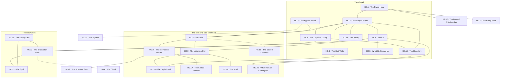

# `HC Sigdun, Peak 3 Level 2 Chapel of the Runemasters`

**Classification:** DANGEROUS · **Difficulty Die:** d8 · **Tags:** Mad Kobold Chieftain, Whispers From Above, Steady Excavation

*Region file. Companion to the Drakenhold Setting Outline and the Setting Relational Diagram. Tables are authored at the location-stub pass (procedure step 7); location stubs, outlines and the region relational diagram follow in the engineer phase.*

---

**Overview:** A parley worth more than any treasure on the level. The kobold chieftain has abandoned his tribe and taken up residence here, drawn by whispers out of the Sanctuary above, half-mad and taking instruction he does not understand. He is excavating steadily toward the trial circuit on the level above and will get there eventually. He will parley eagerly and at length, and what he says is worth considerably more than anything he has. Restoring him to FB, or removing him, or leaving him to dig, are three different campaigns.

**Ambiance:** A chapel gone to squat. Kobold fires under Runemaster vaulting, sigils on the walls smeared with handprints where somebody has been copying them badly. Constant digging noise from one end. The chieftain talks whether or not anyone is there.

**Layout:** The chapel proper, its side chambers and cells, and an excavation running upward from one end toward the trial circuit on HD. The great ramp arrives from HA. Around forty rooms, most of them small and most of them empty.

**Features:** The parley, which is worth more than any treasure on the level. The kobold chieftain has abandoned his tribe and taken up residence here, drawn by whispers out of the Sanctuary above, half-mad and taking instruction he does not understand. He will parley eagerly and at length. The excavation, which will reach HD eventually and which a party can accelerate, redirect or collapse. Restoring him to FB, removing him, or leaving him to dig are three different campaigns.

**Dangers:** Low, materially. The chieftain's loyalists will fight but not well. The real hazard is what he has been listening to, and whether the party starts listening as well.

**Creatures:** The Kobold Chieftain, and a small body of Kobold Warriors who followed him and are frightened of this place.

**Secrets:** What the whispers actually say, and that they are not addressed to him. What he saw on the way up that his tribe would want to know. That the excavation is following a line somebody surveyed a long time ago.

**Treasure:** Whatever the chieftain carried up here, including a stolen trophy weapon. The chapel's own furnishings, which are Runemaster work and valuable to the right buyer.

---

## CONNECTIONS

*Authored against the Setting Relational Diagram. Edge types: open, gated by tile, gated by rod, hidden, secret, vertical, one-way, conditional on restored mechanism, conditional on faction relation.*

- **HA Thaldun** — vertical, the great ramp down.
- **HA Thaldun** — hidden. The warren's bypass at `HA.30`, arriving at `HC.7` in the side cells, behind the squat.
- **HA Thaldun** — vertical. The scholars' stair at `HA.19`, landing at `HC.15`, the instruction rooms. *Its landing was left to `HC` at `HA`'s pass and is fixed here.*
- **HD Zarkel** — vertical, the great ramp up.
- **HD Zarkel** — conditional on mechanism, vertical, one-way. The chieftain's excavation, unfinished, running toward the trial circuit. It completes on a clock whether or not the party touches it.

## TABLES

**Danger** — d6, presented at 6 on entry, counting down one face with each failed Difficulty roll. Resets to 6 on leaving the region.

| d6 | Danger |
|---|---|
| 6 | **Digging.** Steady, unhurried, from one end of the level, and it does not stop when anything else does. Kobold fires and smoke under Runemaster vaulting. |
| 5 | **He is talking again.** The chieftain, at volume, to nobody, in a mix of his own tongue and words he has no business knowing. It carries the length of the chapel. |
| 4 | **The spoil shifts.** The excavation gives — a fall of rock, a flooded cut, a shored section that was never shored properly. It buries whoever is in it and it does not care whose tribe they are. |
| 3 | **Loyalists.** Kobold Warriors who followed him up here, frightened of this place, and looking for a reason to be told what to do. They fight badly and they fight anyway. |
| 2 | **The whispers find a listener.** Someone in the party begins to make out words. It is not addressed to them and that is worse. The Referee needs no mechanic for this; the player will supply one. |
| 1 | **The excavation breaks through.** Into the circuit above, on its own clock, whether or not the party touched it — and whatever the trials were containing now has a hole in the floor to be contained through. |

## LOCATION STUBS

*Procedure step 7. Block-level material lives in `PEAK_3_BLOCK.md`.*

*40 rooms budgeted; **20 are stubbed as locations** and the balance is unnamed fill — small cells, most of them empty, in the repetitive way of a place built for an order that lived plainly.*

**The chapel**

### `HC.1 The Ramp Head` — Smoke, Firelight, Somebody Is Home
*Working note: the first inhabited ground on Peak 3 and it announces itself with cooking smoke. This level is not a horror; it is a squat with something wrong above it.*

**Connections:** `HA.10` the domed antechamber below — **vertical**, the great ramp down · `HD.1` the ramp head above — **vertical**, the great ramp up · `HC.2` the chapel proper. The ramp arrives and the ramp continues, and nothing on this level stops either.

### `HC.2 The Chapel Proper` — Runemaster Vaulting, Kobold Fires Beneath It, Handprints on the Sigils
*Working note: the image the region is built on. Somebody has been copying the wall-sigils badly, in soot and grease, over and over, and the copies are getting closer.*

**Connections:** `HC.1` the ramp head · `HC.3` the sigil walls · `HC.4` Vekkut · `HC.6` the loyalists' camp · `HC.8` the cells · `HC.14` the vestry · `HC.16` the refectory. Runemaster vaulting with kobold fires under it, and every door on the level opens off this floor or off the cells.

### `HC.3 The Sigil Walls` — The Order's Own Work, Smeared, Still Readable Underneath
*Working note: genuine Runemaster script at length, and the level's script lesson. What has been smeared over it is the more interesting text, because it is somebody's attempt to write down something heard rather than seen.*

**Connections:** `HC.2` the chapel proper · `HC.10` the copied wall. The order's own work at length, smeared and still readable underneath.

### `HC.4 Vekkut` — The Chieftain, Half-Mad, Will Talk for Hours
*Working note: **the parley, and it is worth more than any treasure on the level.** He abandoned a tribe of three hundred thirty days ago because something up there started answering him. He is eager, expansive, entirely sincere and taking instruction he does not understand. Restoring him to `FB`, removing him, or leaving him to dig are three different campaigns and the module prefers none of them.*

**Connections:** `HC.2` the chapel proper · `HC.5` what he carried up · `HC.9` the listening cell, where he sleeps · `HC.12` the excavation face · `HC.20` what he saw coming up. He talks whether or not anyone is there.

### `HC.5 What He Carried Up` — A Stolen Trophy Weapon, Tribute Skimmed, A Chieftain's Portable Authority
*Working note: everything he took when he walked out, including the trophy weapon, which has a history and an owner and neither is a kobold.*

**Connections:** `HC.4` Vekkut, and never out of his reach.

### `HC.6 The Loyalists' Camp` — Twenty of Them, Frightened, Following a Man They No Longer Recognise
*Working note: they came with him and they want to go home and none of them will say so first. The cheapest faction lever on the peak.*

**Connections:** `HC.2` the chapel proper · `HC.12` the excavation face · `HC.16` the refectory. Twenty of them, frightened, and none of them will say so first.

### `HC.7 The Bypass Mouth` — Comes Up in the Side Cells, Past the Ramp, Past the Noise
*Working note: **the payoff from `HA.30`.** It arrives behind the squat rather than in front of it, which means a party can watch the chieftain for as long as it likes before deciding what he is.*

**Connections:** `HA.30` the bypass — **hidden**, the warren's standing reward · `HC.8` the cells. It arrives behind the squat rather than in front of it.

**The cells and side chambers**

### `HC.8 The Cells` — Small, Plain, Almost All Empty
*Working note: the level's negative space and the reason its room count is high and its content is not. The Runemasters lived without property.*

**Connections:** `HC.2` the chapel proper · `HC.7` the bypass mouth · `HC.9` the listening cell · `HC.15` the instruction rooms · `HC.18` the sealed chamber. Small, plain, almost all empty, and the second hub of the level.

### `HC.9 The Listening Cell` — Where It Comes Down Clearest, He Sleeps Here, It Is Not Addressed to Him
*Working note: **the second evidence that `HE` is unfinished**, after `HA.31`. The whispers come down a shaft from the Sanctuary and they are one side of a conversation with somebody else. Vekkut has assumed for thirty days that he is being spoken to. He is not.*

**Connections:** `HC.8` the cells · `HC.10` the copied wall · `HC.19` the shaft, which is where it comes down. It is not addressed to him.

### `HC.10 The Copied Wall` — His Transcriptions, Getting Closer, In a Hand That Cannot Read
*Working note: thirty days of a man who cannot read runic script writing down what he hears in it. Fragmentary, wrong in ways that are informative, and legible to anyone who learned the script on the road in.*

**Connections:** `HC.3` the sigil walls · `HC.9` the listening cell. Thirty days of a man who cannot read the script writing down what he hears in it.

### `HC.11 The Survey Line` — The Excavation Follows It, Cut Long Ago, Not by Kobolds
*Working note: he is not digging at random. He is following a Runemaster survey that predates the schism — a back way from the chapel up into the circuit that was planned and never cut. **Somebody in the order wanted a route that bypassed the trials.***

*Ratified at the close of step 8: **the line was surveyed to arrive at `HD.11`, the observation rooms** — leadership's own stair from the chapel to their own floor, bypassing the receiving room, the terms and the circuit entirely. It was never cut. The order that scored `HD.9` when it told its initiates it did not score anything had also drawn itself a private door to the room it scored them from, and then declined to open it. **Vekkut is following that line badly and will arrive at `HD.4` instead** — the near miss is the point, and redirecting his dig onto the true line is now the single highest-stakes action available on this level.*

**Connections:** `HC.12` the excavation face · `HC.13` the spoil. Cut long ago, not by kobolds, and it predates the schism.

### `HC.12 The Excavation Face` — Steady, Shored Badly, On a Clock
*Working note: it completes whether or not the party touches it. Accelerating it, redirecting it or collapsing it are all available and all consequential, and the clock runs in the Referee's Faction Turns rather than in secret.*

**Connections:** `HC.4` Vekkut · `HC.6` the loyalists' camp · `HC.11` the survey line · `HC.13` the spoil · `HD.4` the circuit above — **conditional on mechanism**, and it completes on a clock whether or not the party touches it.

### `HC.13 The Spoil` — What Came Out of the Cut, Sorted, Something in the Sorting
*Working note: kobolds sort spoil for anything shiny. What has come out of the survey line is older than the chapel.*

**Connections:** `HC.11` the survey line · `HC.12` the excavation face. What has come out of the cut is older than the chapel.

### `HC.14 The Vestry` — The Order's Furnishings, Runemaster Work, Valuable to the Right Buyer
*Working note: the level's honest treasure — plain, portable, and worth a great deal to exactly two kinds of buyer, both of whom are complicated.*

**Connections:** `HC.2` the chapel proper. Plain, portable, and worth a great deal to exactly two kinds of buyer, both of whom are complicated.

### `HC.15 The Instruction Rooms` — Where Initiates Were Prepared, Chalked Walls, The Circuit Explained
*Working note: the trials at `HD`, described in advance by the people who set them. **This is the level rewarding patience with a straightforward advantage upstairs**, and it is the single most useful room on Peak 3 for a party that intends to run the circuit honestly.*

**Connections:** `HA.19` the scholars' stair below — **vertical**, steep and narrow and nobody's idea of a road · `HC.8` the cells · `HC.17` the chapel records. The trials on the level above, described in advance by the people who set them.

### `HC.16 The Refectory` — Long Tables, Kobolds Using Them Wrong, Still Sound
*Working note: the squat at its most domestic and the region's best chance to make the kobolds people rather than a monster entry.*

**Connections:** `HC.2` the chapel proper · `HC.6` the loyalists' camp · `HC.20` what he saw coming up. Long tables, kobolds using them wrong, still sound.

### `HC.17 The Chapel Records` — Who Was Admitted, Who Was Not, One Refusal Explained at Length
*Working note: admissions to the order over four centuries, and one rejection minuted in detail because somebody felt strongly. That name recurs at `HE`.*

**Connections:** `HC.15` the instruction rooms. Four centuries of admissions, and one refusal minuted at length.

### `HC.18 The Sealed Chamber` — Rod-Gated, Untouched, The Kobolds Never Got In
*Working note: the one thing on the level the squat could not open, which is why it is still worth opening.*

**Connections:** `HC.8` the cells — **gated by rod**, Runemaster tier, and nothing on this level opens it. The one thing the squat could not get into.

### `HC.19 The Shaft` — Straight Up, Too Narrow, The Sound Comes Down It
*Working note: where `HC.9`'s whispers travel. It reaches `HE` and nothing bigger than an arm goes up it, which makes it the only route in the module that carries information and nothing else.*

**Connections:** `HC.9` the listening cell. Straight up, too narrow for anything but sound, and what is at the top of it is not drawn as an edge because nothing can travel it.

### `HC.20 What He Saw Coming Up` — Between FB and Here, Unprompted, His Tribe Would Want to Know
*Working note: he walked a route from the Peak 1 under level to Peak 3 level two, alone, thirty days ago, and he will describe every step of it to anyone who sits still. It is a free map of ground the party has not seen, given away by a madman who wants company.*

**Connections:** `HC.4` Vekkut · `HC.16` the refectory. A free map of ground the party has not seen, given away by a madman who wants company.

## REGION RELATIONAL DIAGRAM

*Procedure step 8. Drawn from the stubs, before the location outlines. Reconciled against the finished outlines before the region closes. The diagram is authoritative: the **Connections:** field under each stub is checked against it, never the reverse. Worked as one block with the other three levels of Peak 3 against `blocks/PEAK_3_BLOCK.md`.*

**Reading the diagram.** Solid edges are open floor; this level locks almost nothing. The three dotted edges are the bypass down to `HA`, the rod-gated chamber the squat could not open, and the excavation, which is drawn dotted because it is not through yet. **It is drawn undirected rather than one-way**, because once it is through it is a hole in a floor and a hole in a floor is a hole in a floor. `HC`'s region-level `## CONNECTIONS` bullet still calls it one-way; *that phrasing is left as it stands and flagged rather than changed.*

**What the drawing found.**

- **Peak 3 has an express route and this level is the middle of it.** `HA.10`→`HC.1`→`HD.1`→`HE.1`. A party that stops for nothing crosses the entire peak in four rooms, meets nobody, learns nothing, and arrives at the Sanctuary with none of the three things that make it survivable. **The ramp head is one node and it carries both directions of the ramp**, so the chapel is something a party walks *past* by default. That is the same shape `D` and `E` have on the approach, and the module performs no subtraction here either.
- **The level has two hubs, not one, and the second one is where everything true is.** `HC.2` carries the squat — fires, Vekkut, loyalists, vestry, refectory. `HC.8`, the almost-empty cells, carries the bypass mouth, the listening cell, the instruction rooms and the sealed chamber. **Every piece of information on this floor that is worth more than a conversation hangs off the empty half.** The cheapest room on the level, stated at step 7 as the region's negative space, turns out to be its junction.
- **`HA.30` lands one edge from the listening cell, and that is the bypass paying out twice.** A party arriving from the warren is behind the squat, can observe Vekkut for as long as it likes before deciding what he is, and is already standing next to the room that proves he is wrong about being spoken to. The front door gives you a man who talks. The back door gives you the reason not to believe him.
- **`HA.19`'s landing is fixed here, at `HC.15`, the instruction rooms.** *Directed by `HA.19`'s own stub, which states the landing is `HC`'s to fix.* The scholars' stair is a servants' route and it comes up where the initiates were prepared rather than where they were received — which makes it the route the order's own novices used, and it puts the single most useful room on Peak 3 for anyone intending to run the circuit honestly two nodes from the main level without touching the ramp or the squat. `HA` is amended to carry the edge; see the note under `HA`'s own diagram.
- **`HC.18` is gated by rod and there is no rod on this level.** Its answer is `HD.10` or `HD.15`, one floor up, which means **not one gate on Peak 3 is answered on its own floor** — the same structural signature Peak 2 has, arrived at independently.
- **The shaft is drawn as a leaf and stays one.** `HC.19` carries sound and nothing else, so it is not an edge in a route graph; the far end is left undrawn. `HC.9`→`HC.10`→`HC.3` is the level's whole argument as a three-node line: he hears it, he writes it down wrong, and the wall he is copying is still readable underneath his copying. **A party that learned the script on the road can read both hands and knows which is which.**
- **The excavation is three nodes and the party can enter it from either end of the squat.** `HC.4` and `HC.6` both touch `HC.12`, which means accelerating, redirecting or collapsing the dig is available through the chieftain or through the frightened men doing the digging, and those are different conversations with different prices.

**The discrepancy the drawing found, since ratified.** `HC.11` says the survey line is a Runemaster route that *bypassed the trials*; the excavation as actually cut breaks into `HD.4`, the circuit itself, which bypasses nothing. Both are true and the discrepancy is in character — Vekkut cannot read the survey he is following and is off it. **Batched at this pass and answered: the line was surveyed to reach `HD.11`, the observation rooms.** It is leadership's own stair from the chapel to their own floor, planned and never cut, and it is not drawn as an edge because it does not exist. What it changes is `HC.12`: *redirect* was already one of the three things a party can do to the dig, and it is now the one that opens the most heavily gated room on the peak.

**Route ends recorded.** Five edges leave region `HC`. `HA.10`–`HC.1` and `HC.1`–`HD.1` are the great ramp, drawn at both ends. `HA.30`–`HC.7` is the bypass, confirmed exactly as `HA` drew it. `HA.19`–`HC.15` is the scholars' stair, **fixed at this pass as `HA` asked.** `HC.12`–`HD.4` is the excavation, drawn at both ends.
