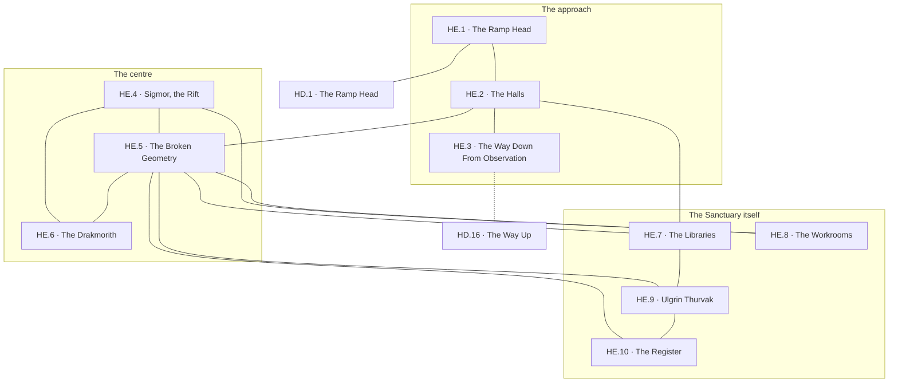

# `HE Sigaz, Peak 3 Level 4 Runemaster Sanctuary`

**Classification:** DANGEROUS · **Difficulty Die:** d4 · **Tags:** The Rift, Broken Geometry, Everything Still In It

*Region file. Companion to the Drakenhold Setting Outline and the Setting Relational Diagram. Tables are authored at the location-stub pass (procedure step 7); location stubs, outlines and the region relational diagram follow in the engineer phase.*

---

**Overview:** The level's entire proposition is that it will pay a patient, careful, methodical party extraordinarily well and destroy an impatient one. At its centre is the rift left where the artifact was broken and the yoke on the wyrm spirits came off, and from that centre the level stops obeying physical reality — doors locked from sides that do not exist, corridors arriving where they cannot, rooms larger inside than the floor allows. The Drakmorith are here and they are not interested in negotiation. The dragon never came. Everything the Sanctuary held is still in it, information and treasure both, and nothing has been carried out in thirty-two years.

**Ambiance:** The level does not sit still to be described. Distances do not agree with themselves between one crossing and the next. There is light with no source and it is the wrong colour. At the centre, the rift — a break in the floor and in more than the floor, where the artifact came apart.

**Layout:** Nominally a sanctuary of halls, libraries, workrooms and the primarch's own chambers, arranged around the central rift. In practice: doors locked from sides that do not exist, corridors that arrive where they cannot, rooms larger inside than the floor allows. Ten to twenty rooms, and the count is the only stable thing about it. The dragon never came here.

**Features:** The rift, and what can be learned at it. Everything the Sanctuary held is still in it, information and treasure both, because nothing has been carried out in thirty-two years. The level's entire proposition is that it will pay a patient, careful, methodical party extraordinarily well and destroy an impatient one, and the mechanism of that is navigation rather than combat.

**Dangers:** The Drakmorith, who are not interested in negotiation. The geometry, which will separate a party and strand individuals. Time, which does not pass here at the rate it passes below.

**Creatures:** Drakmorith. Whatever remains of Ulgrin Thurvak.

**Secrets:** What the artifact was, stated plainly somewhere in here by someone who knew before the end. Where the pieces went, or at least who carried them. That the rift is not closed and was never going to be.

**Treasure:** The richest concentration in the module, untouched — Runemaster work, tomes, rods of the highest tier, and the sanctuary's own reserve. All of it inside the thing that kills people.

---

## CONNECTIONS

*Authored against the Setting Relational Diagram. Edge types: open, gated by tile, gated by rod, hidden, secret, vertical, one-way, conditional on restored mechanism, conditional on faction relation.*

- **HD Zarkel** — vertical, the great ramp down.
- **HD observation rooms** — secret. The route that does not use the ramp.
*Nothing else. The dragon never came, nothing has been carried out in thirty-two years, and the two ways in are why the level pays what it pays. The rift is not closed, and what that connects to is not a corridor.*

## TABLES

**Danger** — d6, presented at 6 on entry, counting down one face with each failed Difficulty roll. Resets to 6 on leaving the region.

| d6 | Danger |
|---|---|
| 6 | **Distances disagree.** A corridor crossed twice is not the same length both times. Light with no source and the wrong colour. Nothing has moved and nothing needs to. |
| 5 | **A door on a wall that has no other side.** Locked, from that side, and audible through it: the ordinary sounds of a room being used. |
| 4 | **Separated.** The party is not where it thought and not all in one place. One person is somewhere else and the way back is not the way they came. |
| 3 | **Time is wrong.** More has passed below than above, or less. Lamps, rations, watches and the survivors' patience are all measured against a clock that has stopped agreeing with itself. |
| 2 | **Wrongness in the architecture.** A corridor that has gained a turn. A room larger inside than the floor allows. **This is a Drakmorith arriving**, and it arrives as geometry before it arrives as a thing. |
| 1 | **It is here and it does not negotiate.** A Drakmorith in the same space as the party, which is a space it is defining. Withdrawal is the only line of play that has ever worked and withdrawal requires knowing where the way out is. |

## LOCATION STUBS

*Procedure step 7. Block-level material — the clue chain and the two routes in — lives in `PEAK_3_BLOCK.md`.*

*16 rooms budgeted; **10 are stubbed as locations**, and the count is the only stable thing about the level. The balance is unnamed fill, and on this floor "unnamed fill" is doing different work than elsewhere: rooms that are counted differently on different crossings.*

**The approach**

### `HE.1 The Ramp Head` — The Last Room That Behaves, Threshold Visible, Nothing Stopping Anyone
*Working note: the level does not gate its entrance. It never needed to. A party can walk in and the walking in was never the difficult part.*

**Connections:** `HD.1` the ramp head below — **vertical**, the great ramp down · `HE.2` the halls. The level does not gate its entrance; it never needed to.

### `HE.2 The Halls` — Formal, Empty, Larger Than the Floor Allows
*Working note: the first crossing where the geometry misbehaves measurably, and it is measurable — a party that paces and counts will catch it. **Navigation is the mechanism of this level, not combat**, and this is where that is taught.*

**Connections:** `HE.1` the ramp head · `HE.3` the way down from observation · `HE.5` the broken geometry · `HE.7` the libraries. The first crossing where the geometry misbehaves measurably, and it is measurable.

### `HE.3 The Way Down From Observation` — Arrives Wrong, Arrives Anyway, Reliable Both Ways
*Working note: the far end of `HD.16`, and the crucial property is that it is *stable*. It is the one route on this floor that goes where it went last time, which makes it the party's anchor and their line of retreat.*

**Connections:** `HD.16` the way up from the observation rooms — **secret**, not using the ramp · `HE.2` the halls. It goes where it went last time, which makes it the anchor and the line of retreat.

**The centre**

### `HE.4 Sigmor, the Rift` — Where It Came Apart, Not Closed, Never Going to Be
*Working note: the break left when the artifact was broken and the yoke came off the wyrm spirits. The survivors' name for it is gallows humour. Standing at it is how the level's largest secrets are learned and it is not survivable for long.*

**Connections:** `HE.5` the broken geometry · `HE.6` the Drakmorith · `HE.8` the workrooms. Not closed, and never going to be.

### `HE.5 The Broken Geometry` — Doors From Sides That Do Not Exist, Corridors Arriving Where They Cannot, Consistent
*Working note: a condition rather than a room, and the important word is *consistent*. It is wrong the same way every time. A methodical party maps it. An impatient one is destroyed by it, and that is the level's entire proposition stated once.*

**Connections:** `HE.2` the halls · `HE.4` Sigmor, the rift · `HE.6` the Drakmorith · `HE.7` the libraries · `HE.8` the workrooms · `HE.9` Ulgrin Thurvak · `HE.10` the register. It is wrong the same way every time, and that consistency is the only concession the level makes.

### `HE.6 The Drakmorith` — Wyrm Spirits Thirty Years Free, No Longer Shaped Like Anything, No Interest in Terms
*Working note: they do not negotiate, do not appear to want, and arrive as wrongness in the architecture before they arrive as things. **The name is dwarven and it is a confession.** The survivors know exactly what these were, and `GB.19` is the other end of it.*

***One exception, and only one.*** *A single Drakmorith still carries part of the collar. It is the only thing on this floor that can be dealt with rather than fled, because part of it is still shaped — it retains enough of what was done to it to have something it wants. It is not friendly and it is not safe. It is **addressable**, which on this level is an enormous difference. No second bestiary template: same statline, same arrival, one singular creature. `GB.19` is what it was before the collar and the pair are the same story from two ends.*

**Connections:** `HE.4` Sigmor, the rift · `HE.5` the broken geometry. It arrives as geometry before it arrives as a thing.

**The Sanctuary itself**

### `HE.7 The Libraries` — Everything Still In Them, Nothing Carried Out in Thirty-Two Years, The Dragon Never Came
*Working note: the richest concentration in the module, entirely untouched, and every page of it inside the thing that kills people.*

**Connections:** `HE.2` the halls · `HE.5` the broken geometry · `HE.9` Ulgrin Thurvak. Everything still in them, and every page of it inside the thing that kills people.

### `HE.8 The Workrooms` — Rods of the Highest Tier, The Order's Reserve, Where the Artifact Was Kept
*Working note: the material prize, and the room the whole civil war was ultimately about.*

**Connections:** `HE.4` Sigmor, the rift · `HE.5` the broken geometry. The room the whole civil war was ultimately about, one edge from where it came apart.

### `HE.9 Ulgrin Thurvak` — Whatever Remains of Him, Stated It Plainly, Knew Before the End
*Working note: **the fourth rung of the clue chain and the module's answer to its central question.** What the artifact was, written down plainly by the primarch, who understood it before anyone and is the reason `GB.18` was imprisoned before the schism for saying the same thing out loud. What remains of him is not a conversation, but it is not nothing.*

**Connections:** `HE.5` the broken geometry · `HE.7` the libraries · `HE.10` the register. What remains of him is not a conversation, but it is not nothing.

### `HE.10 The Register` — Who Carried the Pieces, Where Each Was Sent, Honest About What It Does Not Know
*Working note: **the itinerary.** Seven pieces, named carriers, stated destinations, and three entries that trail off because the person writing did not survive to complete them. Two reached the outside — `E.5` and `D.3`. One never left the mountain and the register says who took it down rather than out, which is `J`'s inheritance. **The module never performs the subtraction and this document is what makes it worth performing.***

**Connections:** `HE.5` the broken geometry · `HE.9` Ulgrin Thurvak. Seven pieces, named carriers, stated destinations, and three entries that trail off.

## REGION RELATIONAL DIAGRAM

*Procedure step 8. Drawn from the stubs, before the location outlines. Reconciled against the finished outlines before the region closes. The diagram is authoritative: the **Connections:** field under each stub is checked against it, never the reverse. Worked as one block with the other three levels of Peak 3 against `blocks/PEAK_3_BLOCK.md`.*

**Reading the diagram.** Only two edges on this floor are dependable and they are both drawn on the left: `HD.1`–`HE.1`–`HE.2` and `HE.3`. Everything else passes through `HE.5`, which is not a room. The single dotted edge is the observation-room route, and it is dotted because it is secret, not because it is unreliable — it is the most reliable thing here.

**What the drawing found.**

- **`HE.5` is the hub, and the hub is a condition rather than a place.** Six edges, more than anything else on the floor. Every crossing beyond the halls goes through the broken geometry, which means **the level's central mechanism is not a hazard a party meets, it is the corridor a party walks.** Navigation is the whole game and this is the drawing saying so.
- **The level is wrong the same way every time and that is the only concession it makes.** `HE.5`'s consistency is what turns a hub with no fixed distances into something mappable. A methodical party maps it and reaches everything. An impatient one is destroyed by it. The proposition stated at step 7 is now topology: there is exactly one thing to be good at here, and the drawing has it carrying six of the level's sixteen edges.
- **`HE.3` is the anchor and it is the reason the observation rooms matter three levels up.** It is the one edge on this floor that goes where it went last time, and it lands in `HE.2`, one step from the geometry and two from anything else. **A party holding `HD.11` holds a fixed point in a level that has none**, which retroactively prices `HD`'s circuit correctly: the rod does not buy treasure, it buys a way back out.
- **The rift is one edge from the workrooms and one edge from the Drakmorith, and those are the same fact.** `HE.8`–`HE.4`–`HE.6`. Where the artifact was kept, where it came apart, and what came off it when it did, in three nodes in a line. The room the entire civil war was about is adjacent to the consequence of winning it, and no player-facing text ever has to say so.
- **The clue chain's last two rungs are a closed triangle with the libraries.** `HE.7`–`HE.9`–`HE.10`. The primarch, his plain statement of what the artifact was, and the register of who carried the pieces where, all reachable from each other without re-crossing the centre. **A party that reaches `HE.9` has the itinerary within one edge**, and both are on the far side of the geometry from the way out. That is the level paying extraordinarily well and charging for it in the same breath.
- **Nothing on this floor is locked.** Not one gate, not one rod, not one tile — the same finding `GE` produced, arrived at from the opposite direction. `HE.1` says the level never needed to gate its entrance and the diagram confirms there is no gate anywhere behind it either. **The lock is the map.**
- **Two ways in, and only two, exactly as the setting diagram has claimed since step 6.** The ramp and `HD.16`. The dragon never came, nothing has been carried out in thirty-two years, and there is no third edge to draw.

**Route ends recorded.** Two edges leave region `HE`. `HD.1`–`HE.1` is the great ramp and `HD.16`–`HE.3` the observation-room route. Both are drawn at both ends at this pass. `HC.19`, the shaft that carries the whispers down to `HC.9`, reaches this level and is deliberately **not** drawn as an edge in either region: nothing can travel it. **Who is being spoken to remains open and was not answered here.**
