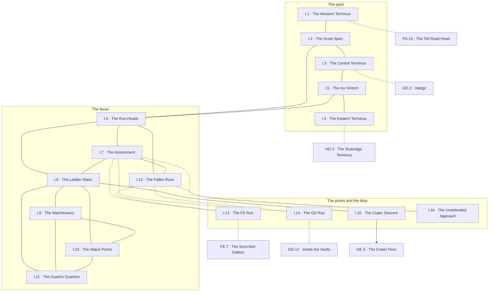

# `I Brynaz, the Skybridge`

**Classification:** WILD · **Difficulty Die:** d6 · **Tags:** Open Air, Varied Ruin, Where the Guard Looked Outward

*Region file. Companion to the Drakenhold Setting Outline and the Setting Relational Diagram. Tables are authored at the location-stub pass (procedure step 7); location stubs, outlines and the region relational diagram follow in the engineer phase.*

---

**Overview:** The outside of the mountain, and the only way across it. A single great span crosses horizontally between the peaks at FD, GD and HD, and from it a network of vertical runs, ladder-stairs, observation posts and attack points threads up and down the outer faces of all three peaks. States vary wildly — some sound, some partial, some fallen outright, and several perfectly intact with no remaining approach by any normal means, which makes the region a map problem as much as a movement one. This is where the hold's guard lived and looked outward; the nobility never came here. Lizardmen patrol the horizontal span but travel mainly through the halls, so the open air is exposure and weather more than it is ambush.

**Ambiance:** Wind, and the whole valley laid out below. The first genuinely beautiful thing in the module. Dwarven engineering at its most confident — a span with no visible support crossing between peaks — and thirty years of neglect on it. Ice in season. Everything sounds different out here after days of enclosed stone.

**Layout:** A single great span crossing horizontally between the peaks at FD, GD and HD. From it, a network of vertical runs, ladder-stairs, observation posts and attack points threads up and down the outer faces of all three peaks. States vary wildly — some sound, some partial, some fallen outright, and several perfectly intact with no remaining approach by any normal means, which makes this a map problem as much as a movement one.

**Features:** The routes themselves, which bypass gates and levels for anyone who can reach them. The watchtowers and observation posts, which were the hold's eyes and hold its outward-facing records. Assessing which runs will bear weight, which is the region's standing skill test.

**Dangers:** Falling. Weather, which the Design Notes' table already governs and which matters more here than anywhere. Exposure. Lizardman patrols on the horizontal span, though they travel mainly through the halls, so open air is exposure and weather more than it is ambush.

**Creatures:** Lizardman patrols on the span. Birds, and things that nest in what birds nest in.

**Secrets:** Which intact runs have no approach left, and what would restore one. The watchtowers' logs, which record the descent from outside. At least one run that reaches a level from a direction that level has no defence against.

**Treasure:** Thin. Guard equipment, watchtower stores. The value here is access.

---

## CONNECTIONS

*Authored against the Setting Relational Diagram. Edge types: open, gated by tile, gated by rod, hidden, secret, vertical, one-way, conditional on restored mechanism, conditional on faction relation.*

- **FD Khorvak** — gated by tile. Western terminus.
- **GD Valdmor** — gated by tile, conditional on faction. Central terminus, checkpointed.
- **HD Zarkel** — gated by tile. Eastern terminus.
- **GE Azith** — one-way, vertical. Down through the crater.
- **FE Aztak** — conditional on mechanism, vertical. An intact run with no approach left, reaching the one level otherwise served by a single ramp.
- **GD Valdmor** — conditional on mechanism, vertical. An intact run with no approach left, arriving inside the vaults past the checkpoint.

*These two are the region's prizes. Other runs, posts and ladder-stairs thread all three outer faces in every state from sound to fallen; which serve which levels resolves at the location pass.*

## TABLES

**Encounter** — d6, rolled on each failed Difficulty roll, resolving in the next watch. Not forced; may be signs, weather or a meeting at distance. Ascending.

| d6 | Encounter |
|---|---|
| 1 | **The valley.** Cloud below the span, or the whole kingdom laid out clear to the south, and after days of enclosed stone it stops people where they stand. Nothing else happens. Let it. |
| 2 | **Weather turning.** Wind rising, ice forming, rain going sideways. The Design Notes' table governs and it matters more here than anywhere in the module. |
| 3 | **A run that will not bear it.** Stone or iron that looked sound and is not, discovered underfoot rather than beforehand. The assessment was available and somebody hurried. |
| 4 | **Nesting.** Something large that lives in a ruined post and considers the party to be in it. More territorial than hungry, and it has the better position. |
| 5 | **Seen.** A Lizardman patrol on the span, or lamplight moving at the central terminus, and the party is in the open on a structure with no cover for four hundred feet. |
| 6 | **The mountain moves.** A partial run finishing its collapse somewhere along the face, audible for a long time, and afterwards the map is wrong. |

## LOCATION STUBS

*Procedure step 7. Block-level material — the span, the network, the two prizes and the light rule — lives in `I_AND_J_BLOCK.md`, which covers `I` and `J` together.*

*30 "rooms" budgeted, which here means posts, towers, run-heads and landings rather than chambers. **16 are stubbed**; the balance is unnamed fill — ladder-stairs, sound runs that go where they say, empty posts stripped by weather.*

**The span**

### `I.1 The Western Terminus` — Tile-Gated, Sill Worn Recently, FD Behind It
*Working note: the far side of `FD.15`. The wear is current and the schedule is legible from the threshold.*

**Connections:** `FD.15` the toll road head behind it — **gated by tile**, and the sill wear is current · `I.2` the great span. The schedule is legible from the threshold before anyone steps out onto the open air.

### `I.2 The Great Span` — No Visible Support, Four Hundred Feet of Open Air, The First Beautiful Thing
*Working note: dwarven engineering at its most confident, with thirty years of neglect on it. Play the beauty. A party that has been underground for a week should feel this room.*

**Connections:** `I.1` the western terminus · `I.3` the central terminus · `I.6` the run-heads, where the network leaves the span. Four hundred feet of open air with no visible support and no cover anywhere on it.

### `I.3 The Central Terminus` — Checkpointed, Lit, Somebody Asks
*Working note: Valdgir from the outside. The middle of the only horizontal route in the hold is the dragon's counting house, and that is the design.*

**Connections:** `I.2` the great span, west · `I.5` the ice stretch, east · `GD.2` Valdgir behind it — **gated by tile**, **conditional on faction**, and somebody asks. The middle of the only horizontal route in the hold is the dragon's counting house, and that is the design.

### `I.4 The Eastern Terminus` — Tile-Gated, Unused Thirty Years, HD Behind It
*Working note: neither checkpointed nor ruined, and nobody has come through it since the Descent. Peak 3 is directly reachable for anyone holding a tile.*

**Connections:** `I.5` the ice stretch · `HD.3` the Skybridge terminus behind it — **gated by tile**, unused thirty years. Nobody has come through it since the Descent and nobody is watching it from either side.

### `I.5 The Ice Stretch` — Where the Span Runs Wettest, Seasonal, Nobody Cut Drainage
*Working note: the one place the engineering was imperfect, and thirty winters have worked on it.*

**Connections:** `I.3` the central terminus, west · `I.4` the eastern terminus, east · `I.6` the run-heads. The one place the engineering was imperfect, seasonal, and the reason the eastern half of the span is the quiet half.

**The faces**

### `I.6 The Run-Heads` — Where the Network Leaves the Span, Marked, In Every Condition
*Working note: the branching point, and the region's central problem in one place. Cut marks name where each run goes, and the marks are honest — the runs are not.*

**Connections:** `I.2` the great span · `I.5` the ice stretch · `I.7` the assessment · `I.8` the ladder-stairs · `I.12` the fallen runs. Cut marks name where each run goes, and the marks are honest — the runs are not.

### `I.7 The Assessment` — Which Will Bear Weight, Judgement Not Luck, The Evidence Is Visible
*Working note: a condition rather than a room. Corrosion, spalling, missing pins and the way a run rings when struck are all readable. **This is a judgement, not a die roll**, and the module gives the Referee enough to rule and the party enough to be right.*

**Connections:** `I.6` the run-heads · `I.8` the ladder-stairs · `I.12` the fallen runs · `I.13` the FE run · `I.14` the GD run · `I.16` the undefended approach. A judgement rather than a die roll, and the evidence is visible to anyone who looks before stepping.

### `I.8 The Ladder-Stairs` — Cut Into the Face, Long, Exposed the Whole Way
*Working note: the honest vertical routes, threading all three outer faces. Slow, safe, and visible for miles.*

**Connections:** `I.6` the run-heads · `I.7` the assessment · `I.9` the watchtowers · `I.10` the attack points · `I.11` the guard's quarters · `I.15` the crater descent. Slow, safe, and visible for miles the whole way.

### `I.9 The Watchtowers` — The Hold's Eyes, Outward-Facing, The Logs Are Still In Them
*Working note: **the only account of the Descent written from outside by people watching it happen.** Everything else in the module is a survivor's memory or a ruin's inference. The last entries are a working guard post doing its job accurately while something ends.*

**Connections:** `I.8` the ladder-stairs · `I.10` the attack points · `I.11` the guard's quarters. The only account of the Descent written from outside by people watching it happen.

### `I.10 The Attack Points` — Cut for Shooting Down, Sheltered, Nobody Ever Used Them
*Working note: the hold prepared to be besieged from the valley and was destroyed from the sky. The posts are pristine and that is the joke.*

**Connections:** `I.8` the ladder-stairs · `I.9` the watchtowers · `I.11` the guard's quarters. The hold prepared to be besieged from the valley and was destroyed from the sky.

### `I.11 The Guard's Quarters` — Where They Actually Lived, Small, Outward Looking
*Working note: the guard lived out here and the nobility never came. Ordinary property, ordinary lives, and a strong contrast with everything at `FE` and `GC`.*

**Connections:** `I.8` the ladder-stairs · `I.9` the watchtowers · `I.10` the attack points. The guard lived out here and the nobility never came.

### `I.12 The Fallen Runs` — Gone Outright, Anchors Still In the Rock, Legible
*Working note: the negative space of the region. What is not there tells a party what used to reach where, which is how the two orphaned runs become findable at all.*

**Connections:** `I.6` the run-heads · `I.7` the assessment · `I.13` the FE run · `I.14` the GD run · `I.16` the undefended approach. What is not there is what tells a party where the runs used to reach, which is how everything intact but orphaned becomes findable at all.

**The prizes and the drop**

### `I.13 The FE Run` — Intact, No Approach Left, Reaches the One Level With a Single Ramp
*Working note: **the first prize.** It arrives at `FE.7`, the scorched gallery. Restoring the approach is a mechanism problem and the reward is a way *out* of Peak 1 with a full load, without descending through any of it.*

**Connections:** `I.7` the assessment · `I.12` the fallen runs · `FE.7` the scorched gallery — **conditional on mechanism**, intact with no approach left. A way *out* of Peak 1 with a full load without descending through any of it.

### `I.14 The GD Run` — Intact, No Approach Left, Arrives Inside the Vaults
*Working note: **the second prize.** It lands at `GD.12`, past the checkpoint. Restoring it renders the only toll gate in the hold irrelevant, which is worth more than most of what is behind the toll gate.*

**Connections:** `I.7` the assessment · `I.12` the fallen runs · `GD.12` inside the vaults — **conditional on mechanism**, intact with no approach left, arriving past the checkpoint. Restoring it renders the only toll gate in the hold irrelevant.

### `I.15 The Crater Descent` — Down the Outer Face, One-Way, Onto Him
*Working note: it works, it is not difficult, and it arrives at `GE.3` on top of a sleeping dragon. The module offers it plainly and does not warn anyone twice.*

**Connections:** `I.8` the ladder-stairs · `GE.3` the crater floor — **one-way**, **vertical**, down the outer face. It works, it is not difficult, and it arrives on top of a sleeping dragon.

### `I.16 The Undefended Approach` — A Run That Reaches a Level From a Direction It Has No Answer To, Nobody Imagined the Approach, Defences Facing the Wrong Way
*Working note: at least one run arrives somewhere nobody ever fortified, because nobody imagined the approach. Which level, and from where, resolves at the location pass — and whichever it is, the level's own defences face the wrong way.*

**Connections:** `I.7` the assessment · `I.12` the fallen runs. Intact, approachable, and arriving somewhere nobody ever fortified. **Which level, and from which direction, is not decided here** — the far end is deliberately undrawn and batched.

## REGION RELATIONAL DIAGRAM

*Procedure step 8. Drawn from the stubs, before the location outlines. Reconciled against the finished outlines before the region closes. The diagram is authoritative: the **Connections:** field under each stub is checked against it, never the reverse. Worked as one block with `J` against `blocks/I_AND_J_BLOCK.md`, because the two regions are the same idea inverted.*

**Reading the diagram.** Solid edges are span and sound run — passable now, by anyone, at the cost of exposure. Dotted edges are tile-gated or conditional on a mechanism: the three termini, and the four runs that are intact and have no approach left. The one arrowhead in the region is `I.15`, and it points at a sleeping dragon.

**What the drawing found.**

- **The span is a chain with the checkpoint in the middle of it, and there is no way along it that misses Valdgir.** `I.1`–`I.2`–`I.3`–`I.5`–`I.4`. Peak 1 to Peak 3 by the only horizontal route in the hold runs through the dragon's counting house, both ways, every time. The block document has always called that the design; it is now the topology, and it means **the span is not a bypass — it is a toll road with better scenery.** The bypasses are the runs.
- **The ice stretch is placed east of the checkpoint**, between `I.3` and `I.4`. *A decision this pass made rather than inherited, additive and within the region.* It gives the unused eastern terminus a reason that is not simply neglect: Valdgir's patrols stop at the wet, so the quiet half of the span is the half beyond the ice, and Peak 3's terminus is unwatched from both sides because getting to it is seasonal work nobody is paid for.
- **`I.7` is the hub and it is not a place.** Six edges, more than anything else in the region, and every conditional route in `I` passes through it. The assessment is a judgement rather than a die roll, which means **the region's central mechanism is the corridor a party walks rather than an obstacle it meets** — precisely the shape `HE.5` has underneath. The two counterweights of the module share a structural signature and neither knew about the other.
- **The two prizes hang off the fallen runs, and that is owed rather than invented.** `I.12` states plainly that what is *not* there is how a party works out what used to reach where. Both orphaned runs and the undefended approach are therefore reachable only through the region's negative space: **the index to `I`'s three most valuable routes is a list of things that have collapsed.**
- **Nothing in `I` is a bypass until somebody does work.** `I.13` and `I.14` are both conditional on mechanism, and between them they would make `FE`'s single ramp and Valdgir's toll irrelevant. Until they are restored the region offers exposure, a view, and a checkpoint. **`I` is a region that has to be earned before it pays**, which is why it sits alongside `J`, which pays immediately and charges afterwards.
- **The guard's world is a closed triangle at the end of the honest routes.** `I.9`–`I.10`–`I.11`, reached only through `I.8`, the long exposed ladder-stairs. The module's only outside account of the Descent costs hours in the open and no shortcut reaches it — and the attack points that were never used sit one edge from the logs of the night nobody could have used them.
- **`I.15` is the only directed edge in the region.** Down the outer face, not difficult, no gate, no assessment needed — the easiest route in `I` and the one the module refuses to warn anybody about twice.

**One thing recorded and deliberately not decided.** `I.16`, the undefended approach, is drawn with its far end absent. The stub defers *which level and from which direction* to the location pass and the standing rule is that open items are never answered by assumption. It hangs off `I.7` and `I.12` — findable, assessable, real — and where it lands is **batched**. Naming it would settle, by side effect, which of three closed regions has a hole in it.

**Route ends recorded.** Six edges leave region `I`. `FD.15`–`I.1`, `GD.2`–`I.3` and `HD.3`–`I.4` are the three termini; `FE.7`–`I.13` and `GD.12`–`I.14` the two orphaned runs; `I.15`–`GE.3` the crater descent. **All six were drawn from the peak side at earlier passes and all six are reciprocated here unchanged, with no decision required to do it.**
